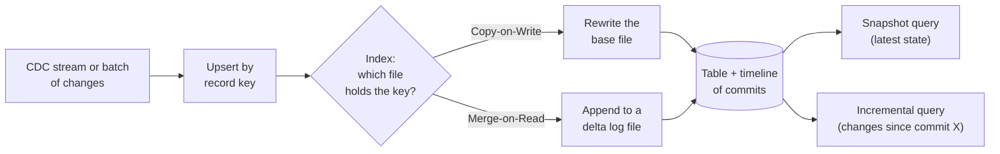

# Apache Hudi
> An open table format built for record-level upserts and incremental processing on a data lake.

**Prerequisites:** [Cloud Storage](cloud-storage.md) · [PySpark](../02-processing/pyspark-reference.md) · [Delta Lake](delta-lake.md)

**Related:** [Apache Iceberg](apache-iceberg.md) · [Ingestion & CDC](../02-processing/ingestion-cdc.md) · [Glossary](../99-reference/glossary.md)

---

## Overview

**Challenge:** Databases change constantly: rows are updated and deleted, and a lake fed from them has to reflect that within minutes. Rewriting whole partitions for every batch of changes is slow and expensive, and downstream jobs have no cheap way to ask "what changed since I last looked?".

**Solution:** Apache Hudi (Hadoop Upserts, Deletes and Incrementals) is a table format and set of services designed around **record-level indexes and a timeline of commits**. Each record has a key, an index locates the file that holds it, and updates are written either by rewriting that file (Copy-on-Write) or by appending to a log next to it (Merge-on-Read). The timeline lets readers pull only the changes since a given commit.



**Positioning:** Hudi is the strongest of the three open table formats when the workload is heavy on upserts, near-real-time ingestion from databases and incremental downstream pipelines. Delta and Iceberg cover the same ground with broader tooling. See the [comparison](#hudi-vs-delta-vs-iceberg) below.

---

**On this page**

**Basic**
- [Core Concepts](#core-concepts)
- [Writing a Table with Spark](#writing-a-table-with-spark)
- [Reading: Query Types](#reading-query-types)

**Intermediate**
- [Copy-on-Write vs Merge-on-Read](#copy-on-write-vs-merge-on-read)
- [Upserts, Deletes and Ordering](#upserts-deletes-and-ordering)
- [Incremental Processing](#incremental-processing)

**Advanced**
- [Table Services: Compaction, Clustering, Cleaning](#table-services-compaction-clustering-and-cleaning)
- [Indexing](#indexing)
- [Hudi vs Delta vs Iceberg](#hudi-vs-delta-vs-iceberg)

**Reference**
- [Common Pitfalls](#common-pitfalls)
- [Cheat Sheet](#cheat-sheet)
- [Interview Questions](#interview-questions)
- [Further Reading](#further-reading)

---

## Core Concepts

| Concept | Meaning |
|---------|---------|
| **Record key** | The unique identifier of a row (like a primary key). Hudi uses it to find and update the row |
| **Ordering (precombine) field** | When two versions of a key arrive together, the one with the larger value wins (for example `updated_at`) |
| **Partition path** | Folder layout of the table, usually by date |
| **Base file** | Columnar Parquet file holding a file group's rows |
| **Log file** | Row-based file with updates appended to a base file (Merge-on-Read only) |
| **File group** | A base file plus its log files. Records are routed to file groups by key |
| **Timeline** | The ordered set of actions on the table (`commit`, `deltacommit`, `compaction`, `clean`, ...), stored in `.hoodie/` |
| **Table type** | `COPY_ON_WRITE` or `MERGE_ON_READ` |

---

## Writing a Table with Spark

Hudi runs as a Spark package. Use the bundle that matches your Spark and Scala version; the [quick start](https://hudi.apache.org/docs/quick-start-guide) lists the exact coordinates.

```python
from pyspark.sql import SparkSession

spark = (
    SparkSession.builder.appName("hudi-demo")
    .config("spark.serializer", "org.apache.spark.serializer.KryoSerializer")
    .config("spark.sql.extensions", "org.apache.spark.sql.hudi.HoodieSparkSessionExtension")
    .config("spark.sql.catalog.spark_catalog", "org.apache.spark.sql.hudi.catalog.HoodieCatalog")
    .getOrCreate()
)

orders = spark.createDataFrame(
    [(1, "alice", "new", "2024-03-15 10:00:00", "2024-03-15"),
     (2, "bob", "new", "2024-03-15 10:05:00", "2024-03-15")],
    "order_id INT, customer STRING, status STRING, updated_at STRING, order_date STRING",
)

hudi_options = {
    "hoodie.table.name": "orders",
    "hoodie.datasource.write.recordkey.field": "order_id",
    "hoodie.datasource.write.precombine.field": "updated_at",
    "hoodie.datasource.write.partitionpath.field": "order_date",
    "hoodie.datasource.write.table.type": "MERGE_ON_READ",
    "hoodie.datasource.write.operation": "upsert",
}

orders.write.format("hudi").options(**hudi_options).mode("append").save("s3a://lake/hudi/orders")
```

`mode("append")` does not mean "only inserts" here: with `operation=upsert`, rows whose key already exists are updated. Use `mode("overwrite")` only to create the table for the first time.

| `hoodie.datasource.write.operation` | Use for |
|-------------------------------------|---------|
| `upsert` (default) | Insert new keys, update existing ones |
| `insert` | Append without an index lookup: faster, but allows duplicate keys |
| `bulk_insert` | The initial load of a large dataset, with sorting and file sizing |
| `delete` | Remove the given keys |
| `insert_overwrite` | Replace the partitions that appear in the input |

---

## Reading: Query Types

```python
base = "s3a://lake/hudi/orders"

# Snapshot: the latest state of every record (default)
spark.read.format("hudi").load(base).show()

# Read-optimized (Merge-on-Read only): base files only. Fast but may miss recent log updates
spark.read.format("hudi").option("hoodie.datasource.query.type", "read_optimized").load(base).show()

# Time travel: the table as of an instant on the timeline
spark.read.format("hudi").option("as.of.instant", "2024-03-15 10:30:00").load(base).show()
```

| Query type | What you get | Typical use |
|------------|--------------|-------------|
| **Snapshot** | Latest data, merging log files at read time on MoR | Dashboards, ad-hoc SQL |
| **Read-optimized** | Data as of the last compaction | Cheap, fast scans that tolerate some staleness |
| **Incremental** | Only records changed after a commit | Downstream pipelines (below) |
| **Time travel** | Table at an earlier instant | Debugging, reproducing a report |

---

## Copy-on-Write vs Merge-on-Read

| | Copy-on-Write (CoW) | Merge-on-Read (MoR) |
|--|---------------------|---------------------|
| **Write cost** | Higher: rewrites the whole base file for any updated row | Lower: appends changes to a log file |
| **Read cost** | Lowest: plain Parquet | Higher: merges base and log files, until compaction |
| **Data freshness** | Commit latency | Near real time, and read-optimized queries lag until compaction |
| **Best for** | Read-heavy tables with few updates | Update-heavy tables and streaming ingestion |
| **Extra work** | Little | Compaction must be scheduled |

Start with CoW because it is simpler. Move to MoR when write amplification or ingestion latency becomes the problem.

---

## Upserts, Deletes and Ordering

The **ordering field** decides which version of a key survives when a batch contains several, and when a late-arriving older record meets a newer stored one. Choose a value that only increases: an update timestamp or a CDC log sequence number, never a wall-clock time you assign at load.

```python
# Delete by key
deletes = spark.createDataFrame([(2,)], "order_id INT")
(
    deletes.write.format("hudi")
    .options(**{**hudi_options, "hoodie.datasource.write.operation": "delete"})
    .mode("append")
    .save("s3a://lake/hudi/orders")
)
```

In SQL, Hudi tables support `MERGE INTO`, `UPDATE` and `DELETE` when created with `CREATE TABLE ... USING hudi` and a `primaryKey` and `preCombineField` in `TBLPROPERTIES`.

---

## Incremental Processing

Incremental queries are the reason to pick Hudi. A downstream job remembers the last commit time it processed and pulls only what changed after it:

```python
last_processed = "20240315100000000"      # from your job's state store

changes = (
    spark.read.format("hudi")
    .option("hoodie.datasource.query.type", "incremental")
    .option("hoodie.datasource.read.begin.instanttime", last_processed)
    .load("s3a://lake/hudi/orders")
)

# Process only the changed rows, then store the max _hoodie_commit_time as the new checkpoint
new_checkpoint = changes.agg({"_hoodie_commit_time": "max"}).first()[0]
```

Every Hudi row carries metadata columns (`_hoodie_commit_time`, `_hoodie_record_key`, `_hoodie_partition_path`, `_hoodie_file_name`) that make this possible. For a production ingestion service, Hudi's **streamer** (`HoodieStreamer`) reads from Kafka, files or another Hudi table, applies transformations and upserts, with checkpointing built in.

---

## Table Services: Compaction, Clustering, and Cleaning

Hudi treats table maintenance as first-class services that can run inline, or asynchronously in a separate job:

| Service | Purpose | Notes |
|---------|---------|-------|
| **Compaction** | Merge MoR log files into new base files | Required for MoR to keep reads fast. Controlled by `hoodie.compact.inline.max.delta.commits` |
| **Clustering** | Rewrite and sort small files into larger ones, optionally by query columns | Layout optimization, like Delta's `OPTIMIZE` with Z-order |
| **Cleaning** | Delete file versions no longer needed | `hoodie.cleaner.commits.retained` sets how much history stays, and bounds time travel and incremental lookback |
| **Archival** | Move old timeline entries out of the active timeline | Keeps `.hoodie/` small |

Running compaction inline makes writes slower but keeps the setup simple. For heavy ingestion, run it as a separate scheduled Spark job so it does not block writers.

---

## Indexing

To update a record, Hudi first has to find which file group holds its key. That lookup is the **index**.

| Index | Behaviour | Use when |
|-------|-----------|----------|
| **Bloom filter** (default for Spark) | Per-file Bloom filters prune candidate files | General purpose, keys with some ordering (such as time-prefixed IDs) |
| **Simple** | Joins incoming keys against keys read from files | Small tables, or highly random keys with many updates across the table |
| **Bucket** | Hash of the key picks the file group | Large tables with a fixed, known size, since it needs no lookup |
| **Record-level / metadata table index** | Keys stored in Hudi's internal metadata table | Very large tables where lookups dominate the write time |

The metadata table (enabled by default in current versions) also speeds up file listing on object storage, which is often the largest hidden cost in a big lake.

---

## Hudi vs Delta vs Iceberg

| | Hudi | Delta Lake | Iceberg |
|--|------|------------|---------|
| **Design focus** | Record-level upserts, incremental pulls | Transactional tables on Spark and Databricks | Engine-neutral tables at very large scale |
| **Upsert model** | Index + CoW or MoR | `MERGE` rewriting files (deletion vectors help) | `MERGE` with copy-on-write or merge-on-read delete files |
| **Incremental reads** | Native (incremental query) | Change Data Feed | Incremental scans between snapshots |
| **Table services** | Built in, can run async | `OPTIMIZE`, `VACUUM` | Maintenance procedures |
| **Ecosystem** | Spark, Flink, Trino, Presto, Athena, Hive | Spark, Databricks, Trino, Flink, delta-rs | Spark, Flink, Trino, Snowflake, BigQuery, Athena, DuckDB |
| **Choose when** | Streaming CDC into a lake, incremental ETL | You are on Databricks or Spark-first | Many engines share the tables |

See [Delta Lake](delta-lake.md) and [Apache Iceberg](apache-iceberg.md) for the other two formats.

---

## Common Pitfalls

| Pitfall | Symptom | Fix |
|---------|---------|-----|
| Ordering field that is not monotonic | Older data overwrites newer data | Use a real update timestamp or CDC sequence number |
| No compaction on a Merge-on-Read table | Snapshot queries get slower every hour | Schedule compaction, and track the delta-commit count |
| `insert` operation on data that has duplicates | Duplicate record keys in the table | Use `upsert`, or deduplicate before an `insert` |
| Cleaner retains too little history | Incremental queries fail because a commit was cleaned | Retain more commits than the longest a consumer can fall behind |
| Random record keys with the Bloom index | Slow upserts that touch many files | Use time-ordered keys, or the bucket or record-level index |
| Reading a MoR table with a read-optimized query and expecting the latest data | Recent updates are missing | Use snapshot queries, or compact more often |
| Mismatched Hudi bundle and Spark version | `NoSuchMethodError` or `ClassNotFoundException` at start | Use the bundle built for your Spark and Scala versions |

---

## Cheat Sheet

| Task | Option / Syntax |
|------|-----------------|
| Table type | `hoodie.datasource.write.table.type` = `COPY_ON_WRITE` / `MERGE_ON_READ` |
| Key and ordering | `hoodie.datasource.write.recordkey.field`, `hoodie.datasource.write.precombine.field` |
| Operation | `hoodie.datasource.write.operation` = `upsert` / `insert` / `bulk_insert` / `delete` |
| Snapshot read | `spark.read.format("hudi").load(path)` |
| Incremental read | `hoodie.datasource.query.type=incremental` + `hoodie.datasource.read.begin.instanttime` |
| Time travel | `.option("as.of.instant", "2024-03-15 10:30:00")` |
| Inline compaction | `hoodie.compact.inline=true`, `hoodie.compact.inline.max.delta.commits=5` |
| Retain history | `hoodie.cleaner.commits.retained` |
| Row metadata columns | `_hoodie_commit_time`, `_hoodie_record_key`, `_hoodie_partition_path` |

---

## Interview Questions

**Q: What problem is Hudi designed for?**
A: Keeping a lake in sync with fast-changing sources. It gives record-level upserts and deletes through a key index, and incremental queries that return only what changed since a commit. That suits CDC ingestion and incremental pipelines better than rewriting whole partitions.

**Q: Copy-on-Write or Merge-on-Read?**
A: CoW rewrites the base Parquet file on each update, so reads are as fast as plain Parquet but writes are heavier. MoR appends updates to log files and merges them at read time, so writes are cheap and fresh, but reads cost more until compaction runs. I choose CoW for read-heavy tables with few updates, and MoR for update-heavy or streaming tables where I can run compaction.

**Q: What is the ordering (precombine) field for?**
A: It resolves conflicts when the same key appears more than once, in one batch or between the batch and the stored row. The record with the higher value wins. A wrong choice, such as a load-time timestamp, lets stale updates overwrite newer data, so it should be an update time or sequence number from the source.

**Q: How does Hudi support incremental pipelines?**
A: Every commit is on a timeline, and every row carries `_hoodie_commit_time`. A consumer stores the last commit it processed, and an incremental query returns records committed after it. Cleaning must retain enough commits that a slow consumer can still catch up.

---

## Further Reading

- [Apache Hudi documentation](https://hudi.apache.org/docs/overview)
- [Hudi quick start (Spark)](https://hudi.apache.org/docs/quick-start-guide)
- [Table types and query types](https://hudi.apache.org/docs/table_types)
- [Hudi timeline and design](https://hudi.apache.org/docs/timeline)
- [HoodieStreamer ingestion](https://hudi.apache.org/docs/hoodie_streaming_ingestion)

---

**Previous:** [Delta Lake](delta-lake.md) · **Next:** [dbt](../02-processing/dbt-reference.md) · **Back to:** [Index](../README.md)
