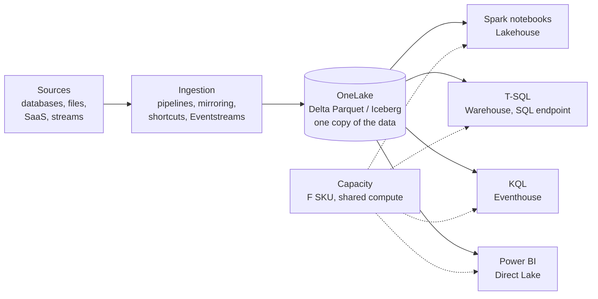

# Azure Data Platform and Microsoft Fabric
> The Azure data services and Microsoft Fabric, its SaaS analytics platform built on a single lake (OneLake): how they fit together, how to load and query data, how to secure it, and how to ship changes with CI/CD.

**Prerequisites:** [Cloud Storage](cloud-storage.md) · [SQL](../00-foundations/sql-reference.md) · [Data Modeling](data-modeling.md)

**Related:** [Delta Lake](delta-lake.md) · [Apache Iceberg](apache-iceberg.md) · [Databricks](../02-processing/databricks-reference.md) · [Kafka](../04-streaming/kafka-reference.md) · [Redshift](redshift-reference.md) · [Terraform](../06-infrastructure/terraform-for-de.md) · [Glossary](../99-reference/glossary.md)

---

## Overview

**Challenge:** A data platform on Azure has historically meant assembling separate services: a storage account, a warehouse, a Spark service, an integration service, a streaming service and a BI tool. Each has its own capacity model, security model and copy of the data. Teams spend much of their effort moving data between these services and keeping permissions consistent.

**Solution:** Microsoft Fabric packages those capabilities as one software-as-a-service (SaaS) platform. Every workload (Data Engineering with Spark, Data Factory, Data Warehouse, Real-Time Intelligence, Databases and Power BI) stores its data in **OneLake**, a single logical lake per tenant that is built on Azure Data Lake Storage (ADLS) Gen2. Tables are stored in open formats (Delta Parquet, or Iceberg), so several engines can read one copy of the data. All workloads draw on shared **capacity**, which is a pool of compute you buy once. The individual Azure services, such as ADLS Gen2, Event Hubs and Azure Databricks, remain available and connect to Fabric.



**Relevance to data engineering:** Fabric is a common target for teams already on Microsoft 365 and Power BI, and it appears in job descriptions alongside Databricks and Snowflake. The transferable ideas are the same as elsewhere: a lakehouse on open table formats, separation of storage from compute, a governed catalog, and CI/CD for data assets. This guide focuses on what is specific to Azure and Fabric.

---

**On this page**

**Basic**
- [The Azure and Fabric Map](#the-azure-and-fabric-map)
- [Fabric Building Blocks](#fabric-building-blocks)
- [OneLake and How to Address It](#onelake-and-how-to-address-it)
- [Capacity and Licensing](#capacity-and-licensing)

**Intermediate**
- [Lakehouse or Warehouse](#lakehouse-or-warehouse)
- [Loading Data](#loading-data)
- [Shortcuts and Mirroring](#shortcuts-and-mirroring)
- [Accessing OneLake from Python](#accessing-onelake-from-python)
- [Streaming with Event Hubs and Real-Time Intelligence](#streaming-with-event-hubs-and-real-time-intelligence)

**Advanced**
- [Security and Governance](#security-and-governance)
- [CI/CD](#cicd)
- [Open Formats and Interoperability](#open-formats-and-interoperability)
- [Migrating from Azure Synapse](#migrating-from-azure-synapse)

**Reference**
- [Common Pitfalls](#common-pitfalls)
- [Cheat Sheet](#cheat-sheet)
- [Interview Questions](#interview-questions)
- [Further Reading](#further-reading)

---

## The Azure and Fabric Map

The table maps common platform roles to Azure services and to their rough equivalents elsewhere. The equivalents are approximate; behaviour, limits and pricing differ.

| Role | Azure / Fabric | Rough equivalent |
|------|----------------|------------------|
| Object storage | ADLS Gen2 (a storage account with a hierarchical namespace); OneLake in Fabric | S3, GCS |
| Lakehouse and Spark | Fabric Lakehouse and notebooks; Azure Databricks | Databricks, EMR |
| Warehouse | Fabric Data Warehouse; Azure Synapse dedicated SQL pools | Redshift, BigQuery, Snowflake |
| Batch integration and orchestration | Data Factory (Azure Data Factory; Data Factory in Fabric) | Glue and Airflow, Cloud Composer |
| Streaming ingestion | Event Hubs (with a Kafka endpoint) | Kafka, Kinesis, Pub/Sub |
| Real-time analytics | Fabric Real-Time Intelligence (Eventhouse, KQL) | ClickHouse, Druid |
| BI and semantic models | Power BI (Direct Lake over OneLake) | Looker, Tableau |
| Governance and catalog | Microsoft Purview, OneLake catalog | Glue Data Catalog, Dataplex |
| Identity | Microsoft Entra ID (formerly Azure Active Directory) | IAM |

Two facts shape how you choose between them:

- **Fabric is SaaS.** You do not provision storage accounts or clusters for it. You buy capacity and create items in workspaces.
- **The Azure services are PaaS.** Azure Databricks, Event Hubs and ADLS Gen2 are resources in an Azure subscription, managed with the usual Azure tooling. They are not replaced by Fabric, and they can read and write OneLake because OneLake supports the ADLS Gen2 APIs.

---

## Fabric Building Blocks

Fabric organises everything in a hierarchy.

| Level | What it is |
|-------|-----------|
| **Tenant** | Your Microsoft Entra tenant. Tenant-level policies protect data that lands in OneLake |
| **Capacity** | The pool of compute that workspaces draw on. Each capacity has a size (SKU) and a region |
| **Workspace** | A container for items and the unit of access control. Each workspace belongs to one capacity |
| **Item** | A lakehouse, warehouse, notebook, pipeline, eventhouse, KQL database, semantic model, report and so on |

The workloads you will meet as a data engineer:

| Workload | Main items | Used for |
|----------|-----------|----------|
| **Data Engineering** | Lakehouse, notebooks, Spark job definitions, environments | Spark processing over lake files and Delta tables |
| **Data Factory** | Pipelines, Dataflow Gen2 | Ingesting and transforming from more than 200 connectors, and orchestrating notebooks and jobs |
| **Data Warehouse** | Warehouse, SQL analytics endpoint | T-SQL analytics with transactions |
| **Real-Time Intelligence** | Eventstream, Eventhouse, KQL database, Real-Time hub | Data in motion: IoT, logs, clickstreams |
| **Databases** | SQL database, mirrored databases | Operational data and replication into OneLake |
| **Power BI** | Semantic models, reports | Reporting over the same lake |

---

## OneLake and How to Address It

OneLake is the single lake every tenant gets automatically. It cannot be deleted, you cannot create a second one, and there is no infrastructure to provision. It is organised as workspace → item → folder, and because it is built on ADLS Gen2 it can be reached with ADLS Gen2 APIs, SDKs and drivers by changing the endpoint.

| Mapping to ADLS Gen2 | In OneLake |
|----------------------|-----------|
| Account name | Always `onelake` |
| Container | The workspace |
| Path | Starts at the item, for example `mylakehouse.lakehouse/Files/` |
| Endpoint | `onelake.dfs.fabric.microsoft.com` (ADLS uses `dfs.core.windows.net`) |

```text
# HTTPS form, by name (the item type is required because names can repeat across types)
https://onelake.dfs.fabric.microsoft.com/<workspace>/<item>.<itemtype>/<path>/<file>

# HTTPS form, by GUID (stable if the workspace or item is renamed; no item type needed)
https://onelake.dfs.fabric.microsoft.com/<workspaceGUID>/<itemGUID>/<path>/<file>

# ABFS driver form, used by Spark and many libraries
abfss://<workspace>@onelake.dfs.fabric.microsoft.com/<item>.<itemtype>/<path>/<file>

# Regional endpoint, to keep endpoint resolution inside a region
https://<region>-onelake.dfs.fabric.microsoft.com
```

Each lakehouse has two top-level folders. **Tables** holds managed Delta tables. **Files** holds anything else: raw CSV, JSON and Parquet, images and so on.

Points to remember:

- Authentication is Microsoft Entra ID. OneLake accepts tokens for the **Storage** audience, and it does not need an Azure subscription, only a user or service principal token.
- The ABFS driver does not accept special characters such as spaces in a workspace name. Use the GUID form in that case.
- Tools that validate the storage endpoint may reject `dfs.fabric.microsoft.com`. This is the most common cause of an ADLS-compatible tool failing against OneLake, and the fix is usually to allow the OneLake endpoint.
- Some operations, such as managing permissions and updating items, go through Fabric, not the ADLS APIs.

---

## Capacity and Licensing

Compute in Fabric is bought as a **capacity**, measured in capacity units (CUs). Every workload in the workspaces attached to a capacity draws from the same pool.

| SKU | CUs | | SKU | CUs |
|-----|----:|-|-----|----:|
| F2 | 2 | | F64 | 64 |
| F4 | 4 | | F128 | 128 |
| F8 | 8 | | F256 | 256 |
| F16 | 16 | | F512 | 512 |
| F32 | 32 | | F1024 and larger | 1024 and up |

- **F SKUs** are bought through Azure and billed per second with a one-minute minimum and no commitment, with an optional yearly reservation to lower the cost. They are the recommended option.
- **P SKUs** (Power BI Premium per capacity) also support Fabric, but Microsoft is consolidating purchase options and retiring them. New purchases should use F SKUs.
- A **trial** capacity lasts 60 days and is equivalent to F64.
- A user needs a per-user license as well as a capacity. Viewers with only a free license can view Power BI content when the capacity is **F64 or larger**. Below F64, each viewer needs a Pro or Premium Per User license.
- A Premium Per User license alone does **not** provide a Fabric capacity, so it cannot create lakehouses, warehouses or notebooks.

Check the [licensing documentation](https://learn.microsoft.com/en-us/fabric/enterprise/licenses) for current SKUs and prices. This guide does not record prices because they are regional and change.

---

## Lakehouse or Warehouse

Both store data as Delta tables in OneLake and both use the same T-SQL engine, so the choice is about how you build, not where the data lives.

| | Lakehouse | Warehouse |
|-|-----------|-----------|
| Primary tool | Spark (notebooks, jobs) | T-SQL |
| Data | Structured, semi-structured and unstructured files, plus Delta tables | Structured and semi-structured tables |
| Writes through T-SQL | **No.** The SQL analytics endpoint is read-only for data | **Yes.** Full DDL and DML, with multi-table ACID transactions |
| SQL access | Auto-generated **SQL analytics endpoint**: query tables, create views, functions and procedures, apply SQL security | The warehouse itself |
| Best for | Data engineering, data science, raw and unstructured data | Star or snowflake schemas, curated marts, governed semantic models |

A common pattern is medallion layers in a lakehouse (bronze and silver written by Spark, see [Delta Lake](delta-lake.md)), with the gold layer served through the SQL analytics endpoint or copied into a warehouse for T-SQL teams. You can add either one later, and a warehouse can query a lakehouse through cross-database queries without copying data.

---

## Loading Data

Choose the loading method by where the data comes from and who owns the pipeline.

| Method | Use when |
|--------|----------|
| **Data Factory pipeline** (copy activity) | Scheduled ingestion from one of 200+ sources, no code |
| **Dataflow Gen2** | Power Query transformations, self-service and small to medium volumes |
| **Spark notebook** | Code-first transformation, complex logic, large volumes |
| **`COPY INTO`** | Bulk-loading files from storage into a warehouse table with T-SQL |
| **Mirroring** | Continuous replication of an operational database into OneLake, no pipeline to maintain |
| **Shortcut** | The data already sits in ADLS, S3 or another OneLake location and should not be copied |

### Spark notebooks

In a notebook, relative paths refer to the notebook's **default lakehouse**. To reach another lakehouse, use the absolute ABFS path.

```python
# Read raw files from the default lakehouse and write a managed Delta table
raw = spark.read.option("header", True).csv("Files/raw/orders/")

clean = raw.dropDuplicates(["order_id"])

clean.write.mode("overwrite").format("delta").saveAsTable("orders_clean")

# Append to an existing table
clean.write.mode("append").format("delta").saveAsTable("orders_clean")
```

For pandas, the default lakehouse is mounted at `/lakehouse/default/` inside notebooks:

```python
import pandas as pd

df = pd.read_parquet("/lakehouse/default/Files/sample.parquet")
```

The mount point exists only in notebooks. A **Spark job definition** must use ABFS paths, and so must code that reads a different lakehouse.

### COPY INTO for warehouses

```sql
-- Load Parquet files from Azure storage into a warehouse table
COPY INTO dbo.orders
FROM 'https://myaccount.blob.core.windows.net/mycontainer/orders/*.parquet'
WITH (FILE_TYPE = 'PARQUET');
```

With Microsoft Entra authentication no `CREDENTIAL` clause is needed, but the signed-in identity must hold the **Storage Blob Data Contributor** or **Storage Blob Data Owner** role on the storage. Public accounts also need no credential. For other authentication (a SAS token, storage key or service principal) add a `CREDENTIAL` clause. Wildcards expand recursively, so prefer explicit file lists to very broad wildcards.

Other ways to populate a warehouse are pipelines, dataflows, and cross-database `CREATE TABLE AS SELECT`, `INSERT ... SELECT` and `SELECT INTO`:

```sql
-- Materialise a curated table from a lakehouse's SQL analytics endpoint in the same workspace
CREATE TABLE dbo.daily_revenue AS
SELECT order_date, SUM(amount) AS revenue
FROM sales_lakehouse.dbo.orders_clean
GROUP BY order_date;
```

Cross-database queries work between items in the **same workspace**. Add the lakehouse (its SQL analytics endpoint) or the other warehouse to the query editor's Explorer with **+ Warehouses**, and then refer to its tables by three-part name (`database.schema.table`).

---

## Shortcuts and Mirroring

Both put external data in front of Fabric engines without you writing a pipeline. They solve different problems.

| | Shortcut | Database mirroring |
|-|----------|--------------------|
| What it does | A reference to data in another location. Nothing is copied | Continuously replicates an operational database into OneLake as Delta tables |
| Source | Another OneLake location, ADLS Gen2, Blob storage, Amazon S3 and S3-compatible storage, Iceberg-compatible sources, Dataverse, on-premises sources | Sources such as Azure SQL Database, Azure Cosmos DB, Azure Databricks, Snowflake and Fabric SQL database |
| Freshness | Reflects the source immediately, because it points at it | Near-continuous replication |
| Use for | Sharing data across teams and clouds without duplication | Analytics on operational data without building CDC pipelines |

A shortcut does not move ownership: the source data stays where it is, and access to it is checked against the source. A **shortcut transformation** can apply automatic changes such as format conversion or removing personally identifiable information. Compare with hand-built change data capture in [Ingestion & CDC](../02-processing/ingestion-cdc.md); mirroring replaces that pipeline for the sources it supports.

---

## Accessing OneLake from Python

Because OneLake speaks the ADLS Gen2 API, the Azure Storage SDK works with a different endpoint. Authentication uses `DefaultAzureCredential`, which finds credentials from the environment, so `az login` is enough on a laptop and a service principal or managed identity works in automation.

```bash
pip install azure-storage-file-datalake azure-identity
az login
```

```python
from azure.identity import DefaultAzureCredential
from azure.storage.filedatalake import DataLakeServiceClient

ACCOUNT_NAME = "onelake"
WORKSPACE_NAME = "<myWorkspace>"
DATA_PATH = "<myLakehouse>.Lakehouse/Files/<path>"

service_client = DataLakeServiceClient(
    f"https://{ACCOUNT_NAME}.dfs.fabric.microsoft.com",
    credential=DefaultAzureCredential(),
)

# The workspace is the file system (container)
file_system = service_client.get_file_system_client(WORKSPACE_NAME)

for path in file_system.get_paths(path=DATA_PATH):
    print(path.name)
```

Upload a file to a lakehouse with the directory and file clients:

```python
directory = file_system.get_directory_client("<myLakehouse>.Lakehouse/Files/raw")
file_client = directory.get_file_client("orders.csv")

with open("orders.csv", "rb") as data:
    file_client.upload_data(data, overwrite=True)
```

For anything beyond file operations, such as running notebooks, managing items and triggering jobs, use the Fabric REST APIs, which every automation in the platform is built on.

---

## Streaming with Event Hubs and Real-Time Intelligence

**Azure Event Hubs** is a managed, partitioned log. It exposes an **Apache Kafka endpoint**, so many Kafka applications need only configuration changes. The Kafka endpoint is available in the standard, premium and dedicated tiers.

| Kafka | Event Hubs |
|-------|-----------|
| Cluster | Namespace |
| Topic | Event hub |
| Partition | Partition |
| Consumer group | Consumer group |
| Offset | Offset |

```python
import os

from confluent_kafka import Producer

producer = Producer({
    "bootstrap.servers": "<namespace>.servicebus.windows.net:9093",
    "security.protocol": "SASL_SSL",           # TLS is required
    "sasl.mechanism": "PLAIN",
    "sasl.username": "$ConnectionString",     # literal string, not a placeholder
    "sasl.password": os.environ["EVENTHUBS_CONNECTION_STRING"],
})

producer.produce("orders", key="o-1001", value='{"order_id": "o-1001", "amount": 42.5}')
producer.flush()
```

The shared-access-signature form above is the simplest. Microsoft Entra authentication (`OAUTHBEARER`) is preferred because permissions can be granted with Azure role-based access control and no secret is stored in configuration. See the [Kafka guide](../04-streaming/kafka-reference.md) for producer and consumer design, which is unchanged.

Event Hubs delivers **at least once**, so consumers must be idempotent. Event Hubs **Capture** archives a stream to Blob Storage or ADLS Gen2 cheaply, which gives you a replayable raw layer.

In Fabric, **Real-Time Intelligence** handles data in motion. **Eventstreams** ingest and route events, an **Eventhouse** with a **KQL database** stores and queries them, and the **Real-Time hub** lists every stream in the tenant in one place. Sources include Event Hubs, IoT Hub and change data capture from databases such as Azure SQL Database and PostgreSQL.

---

## Security and Governance

| Layer | Mechanism |
|-------|-----------|
| Identity | Microsoft Entra ID for users, groups and service principals. Prefer managed identities and service principals over shared keys |
| Workspace access | Workspace roles decide who can create and edit items |
| Data access | **OneLake security roles** grant access to specific folders and tables, and down to rows and columns. Roles are stored once in OneLake and enforced by every engine, whether the user queries with SQL, Spark or Power BI |
| Classification | **Sensitivity labels** on items, enforced even when data is exported. Data loss prevention policies flag sensitive uploads and downloads |
| Discovery and governance | The **OneLake catalog** lists items with owners, schema, lineage and usage, and shows recommended actions. Fabric governance is powered by Microsoft Purview |
| Protection | Zone-redundant storage where the region supports availability zones and locally redundant storage elsewhere, optional geo-replication (business continuity and disaster recovery) to a paired region, and **soft delete** that keeps deleted files for seven days |
| Auditing | **OneLake diagnostics** stream data access events, including access through shortcuts, into a lakehouse |

Design for least privilege in two steps. Use workspaces to group items that share an audience, and use OneLake security roles to restrict sensitive folders, tables, rows and columns, instead of copying a redacted dataset. For the wider design, see [Governance & Lineage](../05-quality-governance/governance-lineage.md) and [Data Security & Privacy](../05-quality-governance/data-security-privacy.md).

---

## CI/CD

Every Fabric CI/CD capability is built on the **Fabric REST APIs**, so anything you can do in the portal you can automate.

| Capability | What it does |
|------------|--------------|
| **Git integration** | Syncs a workspace with a Git repository in Azure DevOps or GitHub, so item definitions are versioned and reviewed |
| **Deployment pipelines** | Promotes content across Dev, Test and Prod stages, with configuration rules and content comparison |
| **Variable library** | Configuration as code, with a value set per stage (for example a different lakehouse ID in each) |
| **Fabric CLI** (`fab`) | An open-source, scriptable command line that suits GitHub Actions and Azure DevOps |
| **Terraform provider for Fabric** | Provisions environments such as workspaces and capacities |
| **`fabric-cicd`** | A Python library that deploys item definitions from a repository to a workspace |

Some items are in preview for Git integration and deployment pipelines, so check the supported-items lists before relying on a specific item type. For the wider pipeline design, see [Testing and CI/CD for data pipelines](../06-infrastructure/testing-cicd.md).

A deployment script with `fabric-cicd`:

```python
# deploy.py — publish items from the repository to one workspace
import os
import sys

from azure.identity import DefaultAzureCredential
from fabric_cicd import FabricWorkspace, publish_all_items, unpublish_all_orphan_items

environment = sys.argv[1]  # e.g. DEV, TEST, PROD; selects values in parameter.yml

workspace = FabricWorkspace(
    workspace_id=os.environ["FABRIC_WORKSPACE_ID"],
    environment=environment,
    repository_directory="workspace",
    item_type_in_scope=["Notebook", "DataPipeline", "Environment"],
    token_credential=DefaultAzureCredential(),
)

publish_all_items(workspace)
unpublish_all_orphan_items(workspace)   # remove items deleted from the repository
```

Run it from a workflow, authenticating as a service principal through environment variables that `DefaultAzureCredential` reads:

```yaml
name: Deploy to Fabric
on:
  push:
    branches: [main]

jobs:
  deploy-test:
    runs-on: ubuntu-24.04
    environment: test
    env:
      AZURE_TENANT_ID: ${{ secrets.AZURE_TENANT_ID }}
      AZURE_CLIENT_ID: ${{ secrets.AZURE_CLIENT_ID }}
      AZURE_CLIENT_SECRET: ${{ secrets.AZURE_CLIENT_SECRET }}
      FABRIC_WORKSPACE_ID: ${{ vars.FABRIC_WORKSPACE_ID }}
    steps:
      - uses: actions/checkout@v7
      - uses: actions/setup-python@v7
        with:
          python-version: "3.12"
      - run: pip install fabric-cicd azure-identity
      - run: python deploy.py TEST
```

The service principal needs access to the target workspace, and a tenant administrator must allow service principals to use the Fabric APIs. Store the secret in the CI system, and prefer workload identity federation to a long-lived client secret where your setup allows it.

---

## Open Formats and Interoperability

- **Delta Parquet is the native format** for tables across Fabric engines, so a table written by Spark can be queried with T-SQL, and by Power BI in **Direct Lake** mode, which loads data from OneLake without making a copy of it.
- **Iceberg** is supported through metadata virtualization. Iceberg tables can be read as Delta tables inside Fabric, and Delta tables can be read by external Iceberg readers such as Snowflake. You can write Iceberg tables to OneLake directly or create shortcuts to Iceberg tables stored elsewhere. See [Apache Iceberg](apache-iceberg.md).
- **Other engines read OneLake** through the ADLS Gen2 API, including Azure Databricks and Azure Synapse Analytics. That means a Databricks-centred team can adopt Fabric for BI without moving its lake. See [Databricks](../02-processing/databricks-reference.md) for the format trade-offs.

---

## Migrating from Azure Synapse

Microsoft documents migration paths from Azure Synapse Analytics to Fabric and treats them as *copy and adapt* rather than an in-place move.

| Synapse component | Path |
|-------------------|------|
| Dedicated SQL pools | The **Fabric Migration Assistant for Data Warehouse** (which also handles SQL Server and other SQL Database Engine platforms), then validate |
| Spark pools and notebooks | Move items, change data access to OneLake, refactor code, and validate results |
| Pipelines | Upgrade to Data Factory in Fabric |

Two strategies: **lift and shift**, which keeps the data model with minor changes and lowest risk and effort, or **phased modernisation**, which migrates by priority and re-architects as it goes, for example consolidating Spark pools and adopting lakehouse practices. Migrate the highest-value or lowest-risk workloads first, and run old and new side by side until results match.

---

## Common Pitfalls

| Pitfall | Symptom | Fix |
|---------|---------|-----|
| Assuming a lakehouse's SQL analytics endpoint can write | `INSERT` or `UPDATE` fails | Write with Spark, or use a warehouse for T-SQL DML |
| Using a relative path in a Spark job definition or another lakehouse | File not found | Use the full ABFS path. Relative paths and `/lakehouse/default/` only work for a notebook's default lakehouse |
| A workspace name with spaces in an ABFS path | Path rejected | Use the workspace and item GUIDs |
| An ADLS tool rejecting the OneLake endpoint | URL validation error | Allow `dfs.fabric.microsoft.com`, or use a custom-endpoint setting |
| Buying a small F SKU for broad Power BI reading | Viewers are blocked or asked for Pro licenses | F64 or larger lets free-license viewers read; below that, plan per-user licenses |
| Relying on a Premium Per User license for Fabric items | Cannot create lakehouses or notebooks | Attach the workspace to an F or trial capacity |
| One shared capacity for everything | A heavy notebook slows dashboards | Separate capacities (or workspaces on separate ones) for development, production and reporting |
| Copying data that a shortcut could reference | Duplicate storage and stale copies | Use a shortcut, or mirroring for operational databases |
| Sharing files by exporting a redacted copy | Sprawl and drift | OneLake security roles for folder, table, row and column access |
| Kafka client with `PLAIN` and a root SAS key in code | A leaked key gives full access | Entra `OAUTHBEARER`, or a least-privilege key from a secret store |
| Assuming exactly-once from Event Hubs | Duplicates after a retry | Idempotent consumers and keyed upserts |
| Hardcoding workspace and lakehouse IDs in items | Broken promotion between stages | Variable libraries and per-environment parameters |

---

## Cheat Sheet

| Task | How |
|------|-----|
| ADLS-style endpoint | `https://onelake.dfs.fabric.microsoft.com` (account name `onelake`, container = workspace) |
| ABFS path | `abfss://<workspace>@onelake.dfs.fabric.microsoft.com/<item>.<itemtype>/<path>` |
| Stable path | Use workspace and item GUIDs instead of names |
| Auth token audience | `Storage` |
| Python auth | `DefaultAzureCredential()` · `az login` locally |
| Write a Delta table (Spark) | `df.write.mode("overwrite").format("delta").saveAsTable("t")` |
| Pandas in a notebook | `pd.read_parquet("/lakehouse/default/Files/x.parquet")` |
| Bulk load into a warehouse | `COPY INTO dbo.t FROM 'https://…/*.parquet' WITH (FILE_TYPE = 'PARQUET')` |
| Reference external data | A shortcut (ADLS, S3, another OneLake location) |
| Replicate a database | Mirroring |
| Kafka against Event Hubs | `<ns>.servicebus.windows.net:9093`, `SASL_SSL`, user `$ConnectionString` |
| Deploy items | Git integration, deployment pipelines, `fabric-cicd`, or `fab` |
| Capacity units | F2 = 2 CU, doubling up to F2048; F64 = 64 CU |

**Choosing where to build:** Spark-first team or raw and unstructured data → lakehouse · T-SQL team, star schemas, transactions → warehouse · data in motion → Real-Time Intelligence · operational database into analytics → mirroring · data already in ADLS or S3 → shortcut

---

## Interview Questions

**Q: What is OneLake, and how is it different from an ADLS Gen2 account?**
A: OneLake is the single logical lake that every Fabric tenant receives automatically, built on ADLS Gen2. Unlike a storage account, you do not provision it, you cannot create several, and it is organised as workspace, item and folder with security enforced by Fabric across every engine. It supports the ADLS Gen2 APIs, so existing SDKs and tools work by changing the endpoint to `onelake.dfs.fabric.microsoft.com`. Tables use open formats, Delta Parquet or Iceberg, so several engines read one copy of the data.

**Q: When would you choose a Fabric warehouse over a lakehouse?**
A: A warehouse is for T-SQL teams that need full DDL and DML with multi-table transactions and curated star schemas. A lakehouse is Spark-first and takes raw, semi-structured and unstructured data. Both store Delta tables in OneLake and use the same SQL engine, and a lakehouse exposes a read-only SQL analytics endpoint, so the choice is about how your team builds and writes, not about where the data sits. Many platforms use both, with Spark for bronze and silver and a warehouse for gold.

**Q: What is the difference between a shortcut and mirroring?**
A: A shortcut is a pointer to data in another location, such as ADLS, S3 or another workspace, so nothing is copied and changes at the source show up immediately. Mirroring replicates an operational database continuously into OneLake as Delta tables, so analytics does not load the source system and you do not build a CDC pipeline. Use a shortcut when the data is already in a lake, and mirroring when it lives in a supported database.

**Q: How does Fabric capacity work, and what goes wrong with sizing?**
A: Compute is bought as a capacity of capacity units, and every workload in the attached workspaces draws on that one pool. F SKUs are billed per second through Azure and are the recommended option. Two sizing issues are common: F64 is the threshold at which free-license users can view Power BI content, and a single shared capacity lets heavy notebook jobs affect dashboards. Separating environments and workloads across capacities, and watching consumption, avoids both.

**Q: How would you set up CI/CD for Fabric?**
A: Connect the development workspace to Git (GitHub or Azure DevOps) so item definitions are versioned and reviewed through pull requests. Promote through Dev, Test and Prod with deployment pipelines or a script using `fabric-cicd` in GitHub Actions, authenticating as a service principal. Use a variable library so IDs and connections differ per stage without editing items. Provision workspaces and capacities with Terraform, and check which items are still in preview before depending on them.

**Q: How do you connect a Kafka application to Azure?**
A: Event Hubs exposes a Kafka endpoint on the standard, premium and dedicated tiers. Point `bootstrap.servers` at `<namespace>.servicebus.windows.net:9093`, use `SASL_SSL`, and authenticate with either Entra `OAUTHBEARER` (preferred) or `PLAIN` with the username `$ConnectionString` and a connection string as the password. Topics map to event hubs and clusters map to namespaces. Delivery is at least once, so consumers must be idempotent.

---

## Further Reading

- [Microsoft Fabric documentation](https://learn.microsoft.com/en-us/fabric/)
- [What is Microsoft Fabric?](https://learn.microsoft.com/en-us/fabric/fundamentals/microsoft-fabric-overview)
- [OneLake overview](https://learn.microsoft.com/en-us/fabric/onelake/onelake-overview) and [how to connect to OneLake](https://learn.microsoft.com/en-us/fabric/onelake/onelake-access-api)
- [Fabric licenses and capacity](https://learn.microsoft.com/en-us/fabric/enterprise/licenses)
- [Fabric Data Warehouse](https://learn.microsoft.com/en-us/fabric/data-warehouse/data-warehousing)
- [CI/CD in Microsoft Fabric](https://learn.microsoft.com/en-us/fabric/cicd/cicd-overview) and [`fabric-cicd`](https://microsoft.github.io/fabric-cicd/)
- [Apache Kafka support in Azure Event Hubs](https://learn.microsoft.com/en-us/azure/event-hubs/azure-event-hubs-apache-kafka-overview)
- [Migrating from Azure Synapse to Fabric](https://learn.microsoft.com/en-us/fabric/fundamentals/migration)

---

**Previous:** [Amazon Redshift](redshift-reference.md) · **Next:** [Delta Lake](delta-lake.md) · **Back to:** [Index](../README.md)
