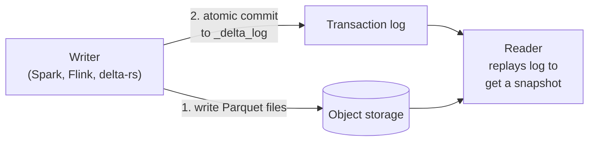

# Delta Lake
> An open table format that adds ACID transactions, `MERGE`, time travel and schema control to Parquet files, and works with or without Databricks.

**Prerequisites:** [Cloud Storage](cloud-storage.md) · [PySpark](../02-processing/pyspark-reference.md)

**Related:** [Apache Iceberg](apache-iceberg.md) · [Apache Hudi](apache-hudi.md) · [Databricks](../02-processing/databricks-reference.md) · [Glossary](../99-reference/glossary.md)

**Practice:** [Lab 03 — Spark Lakehouse](https://github.com/sarangambekar1997/data-engineering-handbook/tree/main/labs/03-spark-lakehouse)

---

## Overview

**Challenge:** A folder of Parquet files is not a table. Two writers can corrupt each other's output, a failed job leaves half-written files behind, there is no way to update or delete a row without rewriting a partition, and no way to see what the data looked like yesterday.

**Solution:** Delta Lake stores a **transaction log** (`_delta_log/`) next to the Parquet files. Every write appends one JSON commit to the log that says which files were added and removed. Readers build the table by replaying the log, so they always see a consistent snapshot, and old snapshots stay readable until you clean them up.

```
orders/
├── _delta_log/
│   ├── 00000000000000000000.json      # commit 0: add file-a, file-b
│   ├── 00000000000000000001.json      # commit 1: remove file-a, add file-c  (an UPDATE)
│   └── 00000000000000000010.checkpoint.parquet   # summary so readers skip old commits
├── part-0000-file-b.parquet
└── part-0001-file-c.parquet
```

**Relevance to data engineering:** Delta is the storage layer of the medallion (bronze → silver → gold) pattern. It makes pipelines idempotent (`MERGE`), lets you recover from bad loads (`RESTORE`), and feeds downstream jobs with only the changed rows (Change Data Feed).



---

**On this page**

**Basic**
- [Setup](#setup)
- [Creating and Reading Tables](#creating-and-reading-tables)
- [Time Travel](#time-travel)

**Intermediate**
- [Updates, Deletes and MERGE](#updates-deletes-and-merge)
- [Schema Enforcement and Evolution](#schema-enforcement-and-evolution)
- [Change Data Feed](#change-data-feed)

**Advanced**
- [Table Maintenance](#table-maintenance)
- [Layout: Partitioning, Z-Order and Liquid Clustering](#layout-partitioning-z-order-and-liquid-clustering)
- [Concurrency and Transactions](#concurrency-and-transactions)
- [Delta Without Spark](#delta-without-spark)

**Reference**
- [Common Pitfalls](#common-pitfalls)
- [Cheat Sheet](#cheat-sheet)
- [Interview Questions](#interview-questions)
- [Further Reading](#further-reading)

---

## Setup

Delta Lake is a library, not a service. With PySpark, install `delta-spark` and enable the SQL extension and catalog:

```python
from delta import configure_spark_with_delta_pip
from pyspark.sql import SparkSession

builder = (
    SparkSession.builder.appName("delta-demo")
    .master("local[2]")
    .config("spark.sql.extensions", "io.delta.sql.DeltaSparkSessionExtension")
    .config("spark.sql.catalog.spark_catalog", "org.apache.spark.sql.delta.catalog.DeltaCatalog")
)
spark = configure_spark_with_delta_pip(builder).getOrCreate()   # downloads the Delta JARs on first run
```

`pip install pyspark delta-spark` — keep the two versions on the [compatibility matrix](https://docs.delta.io/latest/releases.html), because a mismatch fails at startup with a `ClassNotFoundException` or `NoSuchMethodError`. On Databricks nothing needs installing: Delta is the default table format.

---

## Creating and Reading Tables

```python
df = spark.createDataFrame(
    [(1, "alice", "new"), (2, "bob", "new"), (3, "carol", "shipped")],
    "order_id INT, customer STRING, status STRING",
)

# Write: a path-based table (or use saveAsTable for a catalog table)
df.write.format("delta").mode("overwrite").save("/tmp/lake/orders")

# Read
orders = spark.read.format("delta").load("/tmp/lake/orders")
orders.show()

# SQL works on paths too
spark.sql("SELECT status, count(*) AS n FROM delta.`/tmp/lake/orders` GROUP BY status").show()
```

| Write mode | Behaviour |
|------------|-----------|
| `append` | Adds new files in a new commit |
| `overwrite` | Replaces the table's contents in one atomic commit; old files stay for time travel |
| `overwrite` + `replaceWhere` | Replaces only the rows matching a predicate (see below) |
| `error` (default) / `ignore` | Fail, or do nothing, if the table exists |

Overwrite one partition safely, so a rerun of a daily job is idempotent:

```python
(
    new_day_df.write.format("delta")
    .mode("overwrite")
    .option("replaceWhere", "order_date = '2024-03-15'")   # rows outside the predicate are rejected
    .save("/tmp/lake/orders_by_day")
)
```

---

## Time Travel

Every commit is a **version**. You can read any retained version or timestamp:

```python
from delta.tables import DeltaTable

dt = DeltaTable.forPath(spark, "/tmp/lake/orders")
dt.history().select("version", "timestamp", "operation", "operationMetrics").show(truncate=False)

v0 = spark.read.format("delta").option("versionAsOf", 0).load("/tmp/lake/orders")
old = spark.read.format("delta").option("timestampAsOf", "2024-03-15 06:00:00").load("/tmp/lake/orders")

# Roll the live table back after a bad load. This is itself a new commit.
dt.restoreToVersion(0)
```

SQL equivalents: `SELECT * FROM orders VERSION AS OF 3`, `RESTORE TABLE orders TO VERSION AS OF 3`, `DESCRIBE HISTORY orders`.

Time travel only reaches versions whose files still exist. `VACUUM` deletes old files, so retention is a decision: see [Table Maintenance](#table-maintenance).

---

## Updates, Deletes and MERGE

```python
from delta.tables import DeltaTable
from pyspark.sql import functions as F

dt = DeltaTable.forPath(spark, "/tmp/lake/orders")

dt.update(condition="status = 'new'", set={"status": F.lit("pending")})
dt.delete("status = 'cancelled'")
```

`MERGE` is the workhorse: an upsert that also handles deletes, in one transaction.

```python
updates = spark.createDataFrame(
    [(2, "bob", "shipped"), (4, "dave", "new")],
    "order_id INT, customer STRING, status STRING",
)

(
    dt.alias("t")
    .merge(updates.alias("s"), "t.order_id = s.order_id")
    .whenMatchedUpdate(set={"status": "s.status"})
    .whenNotMatchedInsertAll()
    .execute()
)
```

Equivalent SQL, with a source that also carries a delete flag (the pattern for applying CDC):

```sql
MERGE INTO orders AS t
USING order_changes AS s
  ON t.order_id = s.order_id
WHEN MATCHED AND s.op = 'D' THEN DELETE
WHEN MATCHED THEN UPDATE SET *
WHEN NOT MATCHED AND s.op != 'D' THEN INSERT *
```

Two rules keep `MERGE` correct:
- **The source must have at most one row per key.** If two source rows match one target row Delta raises an error rather than guess. Deduplicate first (latest change per key with `row_number()`).
- **Put a partition or clustering column in the `ON` clause when you can.** Without it Delta scans every file in the table to find matches.

---

## Schema Enforcement and Evolution

By default Delta **rejects** writes whose schema does not match the table. That is a feature: bad upstream changes fail loudly instead of silently corrupting the table.

```python
extra = spark.createDataFrame([(5, "erin", "new", "web")], "order_id INT, customer STRING, status STRING, channel STRING")

# Fails: AnalysisException, the table has no column "channel"
# extra.write.format("delta").mode("append").save("/tmp/lake/orders")

# Opt in to adding the column on this write
extra.write.format("delta").mode("append").option("mergeSchema", "true").save("/tmp/lake/orders")
```

For `MERGE`, enable evolution for the session with `spark.databricks.delta.schema.autoMerge.enabled=true` (the setting name keeps the `databricks` prefix in open-source Delta). Explicit DDL is safer for production:

```sql
ALTER TABLE orders ADD COLUMNS (channel STRING);
ALTER TABLE orders ALTER COLUMN channel COMMENT 'Sales channel: web, app, store';
ALTER TABLE orders SET TBLPROPERTIES (   -- required once before you can rename or drop columns
  'delta.columnMapping.mode' = 'name', 'delta.minReaderVersion' = '2', 'delta.minWriterVersion' = '5'
);
ALTER TABLE orders RENAME COLUMN channel TO sales_channel;
```

**Constraints** protect data quality at write time:

```sql
ALTER TABLE orders ADD CONSTRAINT valid_status CHECK (status IN ('new', 'pending', 'shipped', 'cancelled'));
ALTER TABLE orders ALTER COLUMN customer SET NOT NULL;
```

A write that violates a `CHECK` constraint fails the whole transaction. See [Data Quality](../05-quality-governance/data-quality.md) for the checks that belong in the pipeline instead.

---

## Change Data Feed

Change Data Feed (CDF) records row-level changes so downstream jobs process only what changed, instead of rescanning the table.

```sql
ALTER TABLE orders SET TBLPROPERTIES (delta.enableChangeDataFeed = true);
```

```python
changes = (
    spark.read.format("delta")
    .option("readChangeFeed", "true")
    .option("startingVersion", 5)
    .load("/tmp/lake/orders")
)
# Adds _change_type (insert | update_preimage | update_postimage | delete),
# _commit_version and _commit_timestamp
changes.filter("_change_type != 'update_preimage'").show()
```

CDF only records changes made **after** it is enabled, and it is retained only as long as the table's files are. Use it to feed silver → gold, or to push changes to a search index or another system.

---

## Table Maintenance

Small files and stale files build up. Three commands keep a table healthy:

```python
dt = DeltaTable.forPath(spark, "/tmp/lake/orders")

dt.optimize().executeCompaction()                # merge small files into ~1 GB ones
dt.optimize().executeZOrderBy("customer")        # also co-locate rows by column (see next section)
dt.vacuum(168)                                   # delete files no longer referenced, older than 168 h (7 days)
```

```sql
OPTIMIZE orders;
VACUUM orders RETAIN 168 HOURS;
VACUUM orders DRY RUN;          -- list what would be deleted
```

| Table property | Effect |
|----------------|--------|
| `delta.logRetentionDuration` (default 30 days) | How long commit history is kept, which bounds `versionAsOf` |
| `delta.deletedFileRetentionDuration` (default 7 days) | How long removed files survive before `VACUUM` may delete them |
| `delta.autoOptimize.optimizeWrite` / `autoCompact` | Databricks: compact automatically on write |
| `delta.enableDeletionVectors` | Mark rows deleted in a small side file instead of rewriting the Parquet file; the next `OPTIMIZE` applies them |

**`VACUUM` breaks time travel and long-running readers.** Never set retention below the longest query or stream that reads the table, or the longest time you want to be able to roll back.

---

## Layout: Partitioning, Z-Order and Liquid Clustering

Layout decides how much data a query has to read.

| Technique | Use when | Watch out for |
|-----------|----------|---------------|
| **Partitioning** (`partitionBy("order_date")`) | Very large tables, always filtered by a low-cardinality column such as date | Over-partitioning creates thousands of tiny files. Aim for partitions of at least ~1 GB |
| **Z-Order** (`OPTIMIZE ... ZORDER BY`) | Filters on 1–4 high-cardinality columns | Must be re-run as data arrives; it rewrites files |
| **Liquid Clustering** (`CLUSTER BY`) | New tables where filter columns may change | Replaces partitioning and Z-order; requires a recent Delta version, and cannot be combined with `PARTITIONED BY` |

```sql
CREATE TABLE events (event_id BIGINT, user_id BIGINT, event_time TIMESTAMP, event_type STRING)
USING delta
CLUSTER BY (user_id, event_time);

ALTER TABLE events CLUSTER BY (event_type, event_time);   -- change keys later, no rewrite of old data required
```

Delta also records per-file min/max statistics for the first 32 columns, so put filter columns early in the schema (or set `delta.dataSkippingNumIndexedCols`).

---

## Concurrency and Transactions

Delta uses **optimistic concurrency control**. A writer records which version it read, does its work, then tries to commit version N+1. If someone else committed N+1 first, Delta checks whether the two changes conflict:

| Situation | Result |
|-----------|--------|
| Two appends | Both succeed |
| Append and an `UPDATE` on different partitions | Both succeed |
| Two `MERGE`/`UPDATE`/`DELETE` touching the same files | The second fails with `ConcurrentModificationException` subclasses such as `ConcurrentAppendException` |

The fix is to make concurrent jobs touch disjoint data (add a partition predicate to the `ON` clause or to `replaceWhere`) or to retry the failed commit. On S3 the log needs an atomic "create only if absent" write. Depending on your Delta version that comes from S3 conditional writes or from a DynamoDB-backed log store, so read the storage section of the Delta documentation before running multiple writers against S3.

`isolationLevel` defaults to `WriteSerializable`, which allows some concurrent writes that a strict serial order would not; set it to `Serializable` when you need the stricter guarantee.

---

## Delta Without Spark

The [`deltalake`](https://delta-io.github.io/delta-rs/) package (delta-rs, Rust core) reads and writes Delta tables from plain Python, so a small job does not need a cluster:

```python
import pandas as pd
from deltalake import DeltaTable, write_deltalake

write_deltalake("/tmp/lake/small_orders", pd.DataFrame({"order_id": [1, 2], "status": ["new", "new"]}), mode="append")

dt = DeltaTable("/tmp/lake/small_orders")
print(dt.version(), dt.files())
print(dt.to_pandas())
```

DuckDB reads Delta through its `delta` extension (`SELECT * FROM delta_scan('/tmp/lake/small_orders')`), and Polars through `pl.read_delta`. This is the normal way to give analysts read access without Spark. See [DuckDB & Polars](../02-processing/duckdb-polars.md).

---

## Common Pitfalls

| Pitfall | Symptom | Fix |
|---------|---------|-----|
| Duplicate keys in the `MERGE` source | `Multiple source rows matched` error, or wrong rows updated | Deduplicate the source to one row per key before merging |
| `VACUUM` with a short retention | Time travel and long-running queries fail with `FileNotFoundException` | Keep the default 7 days or more; never disable the retention check in production |
| Partitioning by a high-cardinality column | Millions of tiny files, slow listing and queries | Partition by date only, or use Liquid Clustering |
| Never running `OPTIMIZE` on a streaming or frequently appended table | Query time grows steadily as small files pile up | Schedule `OPTIMIZE`, or enable auto compaction |
| Assuming a schema change on write is harmless | A new upstream column silently widens the table (`mergeSchema`) or the load fails | Decide per table: strict by default, `mergeSchema` only on trusted sources |
| Two jobs merging into the same files | `ConcurrentAppendException` | Add partition predicates to `ON`, or serialize the jobs |
| Mixing Delta and Spark versions | Startup errors such as `NoSuchMethodError` | Pin both packages to a compatible pair from the release matrix |
| Editing files in the table folder by hand | Table corruption or missing data | Only change the table through Delta operations |

---

## Cheat Sheet

| Task | Command / Syntax |
|------|------------------|
| Write | `df.write.format("delta").mode("append").save(path)` |
| Read | `spark.read.format("delta").load(path)` |
| Time travel | `.option("versionAsOf", 3)` · `VERSION AS OF 3` · `TIMESTAMP AS OF '...'` |
| History | `DESCRIBE HISTORY t` · `dt.history()` |
| Roll back | `RESTORE TABLE t TO VERSION AS OF 3` |
| Upsert | `dt.alias("t").merge(src.alias("s"), cond).whenMatchedUpdateAll().whenNotMatchedInsertAll().execute()` |
| Replace one slice | `.mode("overwrite").option("replaceWhere", "d = '2024-03-15'")` |
| Add a column on write | `.option("mergeSchema", "true")` |
| Enable CDF | `ALTER TABLE t SET TBLPROPERTIES (delta.enableChangeDataFeed = true)` |
| Read CDF | `.option("readChangeFeed", "true").option("startingVersion", n)` |
| Compact | `OPTIMIZE t` |
| Clean up | `VACUUM t RETAIN 168 HOURS` |
| Inspect | `DESCRIBE DETAIL t` |

---

## Interview Questions

**Q: How does Delta Lake provide ACID transactions on object storage?**
A: Data files are immutable Parquet. A transaction writes new files, then commits by atomically adding one numbered JSON entry to `_delta_log` that lists the added and removed files. Readers replay the log, so they see either the whole commit or none of it. Atomicity comes from the log store's atomic "create if absent" for that version file. That is why concurrent writers need a storage layer that supports it.

**Q: What happens when two jobs write to the same table at once?**
A: Delta uses optimistic concurrency. Each writer commits the next version if nothing conflicting landed since it read. Pure appends never conflict, but two operations that rewrite the same files do, and the loser fails and must retry. You reduce conflicts by making jobs touch disjoint partitions and by putting the partition column in the `MERGE` condition.

**Q: Why can't you time travel forever?**
A: Time travel needs the old Parquet files, and `VACUUM` removes files older than the retention threshold. Log retention bounds how many versions are listed. If you need long-term history, keep retention longer (at a storage cost), or store history explicitly with an SCD Type 2 table or snapshots.

**Q: Delta, Iceberg or Hudi?**
A: All three solve the same problem. Delta is the default and best integrated on Databricks. Iceberg has the broadest multi-engine support and hidden partitioning. Hudi is strongest for record-level upserts and incremental pulls. For a mixed-engine platform I'd lean to Iceberg. For a Databricks-centred one, Delta, with UniForm exposing Iceberg metadata when other engines need to read.

**Q: How do you make a pipeline load into Delta idempotent?**
A: Use `MERGE` on the business key, or `replaceWhere` for a partition, so re-running the same batch gives the same table. Deduplicate the source first. For streaming, use a checkpoint plus `foreachBatch` with a `MERGE`, or Delta's idempotent writes (`txnAppId`/`txnVersion`).

---

## Further Reading

- [Delta Lake documentation](https://docs.delta.io/latest/index.html)
- [Delta transaction log protocol](https://github.com/delta-io/delta/blob/master/PROTOCOL.md): the exact format of the log
- [delta-rs (Python `deltalake`)](https://delta-io.github.io/delta-rs/)
- [Delta Lake release compatibility](https://docs.delta.io/latest/releases.html)
- *Delta Lake: The Definitive Guide* — Denny Lee, Tristen Wentling, Scott Haines & Prashanth Babu (O'Reilly)

---

**Previous:** [NoSQL and Operational Stores](nosql-operational-stores.md) · **Next:** [Apache Hudi](apache-hudi.md) · **Back to:** [Index](../README.md)
