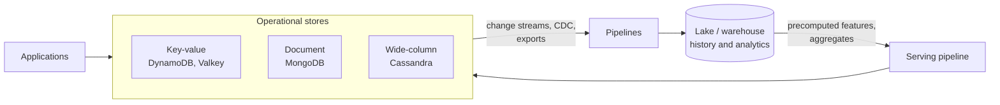

# NoSQL and Operational Data Stores for Data Engineers
> Key-value, document and wide-column databases: how to model for them, how to load data out of them into a lake or warehouse, and how to serve data back into them for applications.

**Prerequisites:** [SQL](../00-foundations/sql-reference.md) · [Data Modeling](data-modeling.md) · [Cloud Storage](cloud-storage.md)

**Related:** [Ingestion & CDC](../02-processing/ingestion-cdc.md) · [Kafka](../04-streaming/kafka-reference.md) · [Real-Time Analytics Databases](realtime-olap.md) · [Testing and CI/CD](../06-infrastructure/testing-cicd.md) · [Azure and Fabric](azure-fabric.md) · [Glossary](../99-reference/glossary.md)

---

## Overview

**Challenge:** The systems that create data are often not relational warehouses. A shopping cart lives in a key-value store, a product catalogue in a document database, a device event history in a wide-column store, and a session cache in memory. These stores are built for very low latency at very large scale, and they achieve it by giving up joins, ad hoc queries and, sometimes, strict consistency. A data engineer has to model for them, get their data out reliably into analytics, and sometimes push results back in to serve applications.

**Solution:** Learn the families and what each optimises for, model from the **access patterns** you must serve instead of from normalised entities, understand what consistency each read gives you, and use the store's own change capture or export mechanism to move data, instead of scanning production tables. This guide covers the four stores you will meet most often: Amazon DynamoDB, MongoDB, Apache Cassandra and Redis-compatible in-memory stores (using Valkey in the examples).



**Relevance to data engineering:** Most CDC and ingestion work starts at an operational store. Choosing the wrong extraction method (a full scan of a production table) can degrade an application, and a model that ignores how the source is keyed leads to duplicates, ordering bugs and lost updates downstream. Serving features and aggregates back into a low-latency store is also a core platform job. See [Ingestion & CDC](../02-processing/ingestion-cdc.md).

---

**On this page**

**Basic**
- [The NoSQL Families](#the-nosql-families)
- [Model from Access Patterns](#model-from-access-patterns)
- [Consistency in Practice](#consistency-in-practice)

**Intermediate**
- [Amazon DynamoDB](#amazon-dynamodb)
- [MongoDB](#mongodb)
- [Redis-Compatible Stores](#redis-compatible-stores)
- [Apache Cassandra](#apache-cassandra)

**Advanced**
- [Getting Data Out: CDC and Exports](#getting-data-out-cdc-and-exports)
- [Landing NoSQL Data in the Lake](#landing-nosql-data-in-the-lake)
- [Serving Data Back into an Operational Store](#serving-data-back-into-an-operational-store)
- [Testing and Operating](#testing-and-operating)
- [Choosing a Store](#choosing-a-store)

**Reference**
- [Common Pitfalls](#common-pitfalls)
- [Cheat Sheet](#cheat-sheet)
- [Interview Questions](#interview-questions)
- [Further Reading](#further-reading)

---

## The NoSQL Families

"NoSQL" describes several different designs. What they share is that they trade some of the relational model (joins, a fixed schema, ad hoc queries) for scale, latency or flexibility.

| Family | Data model | Examples | Strong at | Weak at |
|--------|-----------|----------|-----------|---------|
| **Key-value** | A value looked up by a key | DynamoDB, Valkey and Redis | Single-digit millisecond lookups, sessions, counters, caches | Queries on anything but the key |
| **Document** | JSON-like documents in collections, with secondary indexes | MongoDB | Flexible, nested data, product catalogues, content, rich queries on one collection | Joins across collections, cross-document transactions at scale |
| **Wide-column** | Rows grouped by a partition key, with columns per row | Apache Cassandra, and DynamoDB in part | Very high write throughput, time series, multi-region availability | Ad hoc queries, updates and deletes, anything not designed into the table |
| **Graph** | Nodes and relationships | Neo4j and others | Traversals over connections | Bulk analytics |

Many products blur these lines. DynamoDB is a key-value and document store with a partition key and a sort key, which is also the shape of a wide-column table. The useful question is not "which family" but "what are my access patterns, and what latency, scale and consistency do they need?"

---

## Model from Access Patterns

In a relational database you model the **data** (normalised entities) and then write any query you like. In these stores you first list the **queries** your application must answer, and then design the tables or collections so each is a lookup by key. Joins are absent or expensive, so related data is **denormalised**: stored together, or duplicated, so that one read returns what the query needs.

| Relational | Access-pattern-first |
|------------|---------------------|
| Model entities, then query flexibly | List the queries, then model to serve them |
| Normalise to avoid duplication | Denormalise to avoid joins |
| Add an index when a query is slow | Design keys and indexes up front. A missing index can mean a full scan |
| The schema is enforced | The schema is a convention (or an optional validation) |

A worked example: an application needs "the orders of a customer in a month" and "all paid orders, newest first". In DynamoDB that becomes a table keyed by customer and order time, plus a secondary index on status, exactly as in the examples below. A query nobody designed for, such as "orders over 100 in Germany", has no efficient answer. It is a scan, and it belongs in the warehouse. This is why analytics on these stores happens after the data is moved out, not on the operational store itself.

---

## Consistency in Practice

Distributed stores replicate data, and a read may reach a replica that has not received the latest write. The practical questions are whether you can ask for the latest value, and what it costs.

- **Eventual consistency** means replicas converge, but a read soon after a write may return the old value.
- **Strong consistency** returns the most recent write, at higher latency or cost, and sometimes with lower availability during failures.
- **Tunable consistency** lets you choose per operation.

Two examples from the stores in this guide. DynamoDB reads are **eventually consistent by default** and you can request **strongly consistent** reads. The capacity accounting shows the price: one read unit is one strongly consistent read per second, or two eventually consistent reads per second, for an item up to 4 KB. Cassandra lets each request choose a consistency level, so the same table can serve a fast, weakly consistent read and a slower, stronger one.

For a data engineer, consistency shows up as duplicates, missing rows and out-of-order events in the data you extract. Design for **at-least-once** delivery, keep a version or sequence number on records, and make loads idempotent by key. See [Testing and CI/CD](../06-infrastructure/testing-cicd.md#testing-idempotency-and-backfills).

---

## Amazon DynamoDB

DynamoDB is a fully managed key-value and document database. A table has a **primary key**, which is either a partition key alone or a partition key plus a **sort key**. Items with the same partition key are stored together, ordered by sort key, so a query for a range of sort keys within one partition is efficient. The examples below run against DynamoDB Local, the downloadable emulator, with dummy credentials. Omit `endpoint_url` to use the real service.

### Keys, indexes and queries

```python
import boto3
from boto3.dynamodb.conditions import Key

dynamodb = boto3.resource(
    "dynamodb",
    endpoint_url="http://localhost:8000",     # DynamoDB Local; omit for the real service
    region_name="us-east-1",
    aws_access_key_id="local",
    aws_secret_access_key="local",
)

table = dynamodb.create_table(
    TableName="orders",
    KeySchema=[
        {"AttributeName": "customer_id", "KeyType": "HASH"},    # partition key
        {"AttributeName": "order_ts", "KeyType": "RANGE"},      # sort key
    ],
    AttributeDefinitions=[
        {"AttributeName": "customer_id", "AttributeType": "S"},
        {"AttributeName": "order_ts", "AttributeType": "S"},
        {"AttributeName": "status", "AttributeType": "S"},
    ],
    GlobalSecondaryIndexes=[{
        "IndexName": "by_status",
        "KeySchema": [
            {"AttributeName": "status", "KeyType": "HASH"},
            {"AttributeName": "order_ts", "KeyType": "RANGE"},
        ],
        "Projection": {"ProjectionType": "ALL"},
    }],
    BillingMode="PAY_PER_REQUEST",
)
table.wait_until_exists()

# Orders of one customer in September: a range query inside one partition
response = table.query(
    KeyConditionExpression=Key("customer_id").eq("c1") & Key("order_ts").begins_with("2026-09")
)

# A second access pattern through the secondary index: paid orders across all customers
paid = table.query(IndexName="by_status", KeyConditionExpression=Key("status").eq("paid"))["Items"]
```

A **global secondary index** (GSI) is a second copy of the data keyed differently, which serves another access pattern. Each index costs extra writes and storage, and it is updated asynchronously, so an index read can lag the table. `BillingMode="PAY_PER_REQUEST"` is the on-demand mode. The alternative is provisioned capacity, which suits steady, predictable traffic.

**Throughput is per partition.** Each partition is designed for a maximum of 3,000 read units and 1,000 write units per second, so a design must spread activity evenly across partition keys, in the table and in its indexes. A partition key with very few values, such as a status or a date, concentrates traffic on one partition (a **hot partition**), and no amount of table-level capacity fixes that. Choose high-cardinality keys, and use write sharding (adding a suffix to spread one logical key) when a single key is unavoidably hot.

### Numbers, idempotent writes and counters

DynamoDB stores numbers exactly, so `boto3` rejects Python floats and requires `Decimal`. Pass a string to `Decimal` to avoid binary rounding:

```python
from decimal import Decimal

table.put_item(Item={
    "customer_id": "c1",
    "order_ts": "2026-09-01T10:00:00",
    "status": "paid",
    "amount": Decimal("10.5"),          # a float raises: "Float types are not supported"
})
```

A **conditional write** makes an insert idempotent. The write succeeds only if the condition holds, and otherwise raises `ConditionalCheckFailedException`, which you treat as "already done":

```python
from botocore.exceptions import ClientError

item = {"customer_id": "c1", "order_ts": "2026-09-01T10:00:00", "status": "paid", "amount": Decimal("10.5")}

try:
    table.put_item(Item=item, ConditionExpression="attribute_not_exists(customer_id)")
except ClientError as error:
    if error.response["Error"]["Code"] != "ConditionalCheckFailedException":
        raise                                     # a real error; a duplicate is fine
```

An **update expression** changes an attribute atomically on the server, with no read-modify-write race:

```python
table.update_item(
    Key={"customer_id": "c1", "order_ts": "2026-09-01T10:00:00"},
    UpdateExpression="ADD retries :one",
    ExpressionAttributeValues={":one": 1},
)
```

### Reading everything

A `scan` reads the whole table and returns at most 1 MB per call, so it must be paginated with `LastEvaluatedKey`. A scan consumes read capacity for every item it touches, so it is the wrong way to extract a production table (see [Getting Data Out](#getting-data-out-cdc-and-exports)).

```python
items, kwargs = [], {"Limit": 10}                 # small pages here to show the loop
while True:
    page = table.scan(**kwargs)
    items += page["Items"]
    if "LastEvaluatedKey" not in page:
        break
    kwargs["ExclusiveStartKey"] = page["LastEvaluatedKey"]
```

---

## MongoDB

MongoDB stores JSON-like **documents** in **collections**. A document can hold nested objects and arrays, so data that would need several joined tables in a relational model often lives in one document. It has a rich query language, secondary indexes and an **aggregation pipeline** of stages. The examples below use `pymongo` against a single-node replica set.

```python
from pymongo import ASCENDING, MongoClient
from pymongo.errors import DuplicateKeyError

client = MongoClient("mongodb://127.0.0.1:27018/?directConnection=true")
db = client["shop"]

db.orders.insert_many([
    {"country": "DE", "status": "paid", "amount": 10.0},
    {"country": "DE", "status": "paid", "amount": 5.0},
    {"country": "US", "status": "paid", "amount": 40.0},
    {"country": "US", "status": "cancelled", "amount": 99.0},
])

result = list(db.orders.aggregate([
    {"$match": {"status": "paid"}},
    {"$group": {"_id": "$country", "revenue": {"$sum": "$amount"}, "orders": {"$sum": 1}}},
    {"$sort": {"revenue": -1}},
]))
# [{'_id': 'US', 'revenue': 40.0, 'orders': 1}, {'_id': 'DE', 'revenue': 15.0, 'orders': 2}]
```

The pipeline reads like a query plan: filter, group, sort. It is convenient for operational reports, but it runs on the production database, so heavy analytics still belong in the warehouse.

**Idempotent upserts, unique indexes and validation:**

```python
# An upsert by _id is naturally idempotent: three calls, one document
for _ in range(3):
    db.orders.update_one({"_id": "o-1"}, {"$set": {"status": "paid", "amount": 10}}, upsert=True)

# A unique index rejects duplicates
db.customers.create_index([("email", ASCENDING)], unique=True)
db.customers.insert_one({"email": "ana@example.com"})
try:
    db.customers.insert_one({"email": "ana@example.com"})
except DuplicateKeyError:
    pass                                            # already exists

# A TTL index removes documents after an interval (on a date field)
db.events.create_index("created_at", expireAfterSeconds=3600)

# Schema validation makes the flexible schema a checked one
db.create_collection("payments", validator={
    "$jsonSchema": {
        "bsonType": "object",
        "required": ["amount"],
        "properties": {"amount": {"bsonType": "double"}},
    }
})
```

MongoDB's flexible schema means fields can differ between documents. That is convenient for the application and hard for analytics, so use **schema validation** on collections you feed to pipelines, and document the shape. A background process removes expired TTL documents, so an expired document may remain for a short while after its time.

---

## Redis-Compatible Stores

Redis and its fork **Valkey** are in-memory data structure stores that speak the same protocol, so the same client libraries work with both. The examples use Valkey (BSD-licensed) with the `redis` Python client. Check the licence of the version and distribution you deploy, since Redis's licence has changed between releases. They are the standard place for caches, counters, rate limits, session state and online feature values.

```python
import redis

r = redis.Redis(host="localhost", port=6390, decode_responses=True)

# A value with a time-to-live
r.set("session:42", "active", ex=3600)

# An idempotency key: True only for the first caller
def claim(event_id):
    return bool(r.set(f"processed:{event_id}", "1", nx=True, ex=3600))

claim("evt-1")      # True: process the event
claim("evt-1")      # False: a duplicate delivery, skip it

# A hash as an online feature row, expiring after a day
r.hset("features:user:42", mapping={"orders_30d": 7, "avg_basket": "31.5", "country": "DE"})
r.expire("features:user:42", 86400)

# A sorted set as a leaderboard, updated atomically
r.zadd("revenue:by_country", {"DE": 120.5, "US": 300.0, "IN": 80.0})
r.zincrby("revenue:by_country", 50, "IN")
r.zrevrange("revenue:by_country", 0, 1, withscores=True)     # [('US', 300.0), ('IN', 130.0)]
```

`SET key value NX EX seconds` is a single atomic command that sets the key only if it does not exist, which makes it a compact **idempotency guard**: the first worker to claim an event ID processes it, and duplicates from at-least-once delivery are skipped. Set a TTL that outlasts the redelivery window.

**Streams** are an append-only log with **consumer groups**, similar in spirit to Kafka topics but far smaller in scale. Each entry in a stream is delivered to one consumer of the group, and stays in a pending list until it is acknowledged, so the messages of a crashed worker can be claimed by another:

```python
r.xgroup_create("orders", "billing", id="0", mkstream=True)
for i in range(3):
    r.xadd("orders", {"order_id": i, "amount": 10 * i})

(stream, entries), = r.xreadgroup("billing", "worker-1", {"orders": ">"}, count=10)
# 3 entries are now pending for this group
for entry_id, fields in entries:
    ...                                             # process the entry, then acknowledge it
    r.xack("orders", "billing", entry_id)
```

Streams suit modest event volumes and low-latency fan-out inside a service. For durable, high-volume, replayable pipelines use [Kafka](../04-streaming/kafka-reference.md).

Memory is the constraint. Because everything is held in memory, decide what happens when it fills: on the build used here the default eviction policy is `noeviction`, so writes fail with an out-of-memory error instead of evicting keys. A cache should set a `maxmemory` limit and an eviction policy such as least-recently-used, and a store holding data you cannot lose needs persistence configured and tested. Use a pipeline to batch many commands into one round trip.

---

## Apache Cassandra

Cassandra is a wide-column store designed for high write throughput and availability across nodes and data centres, with no single point of failure. Its query language, CQL, looks like SQL, but the model is different: you design one table per query.

A table has a **partition key**, which decides which nodes store a row, and optional **clustering columns**, which sort the rows within a partition. A query must supply the whole partition key, and can then filter and range over the clustering columns:

```sql
-- One table designed for one query: "the events of a device, newest first"
CREATE TABLE device_events (
    device_id  text,
    event_time timestamp,
    payload    text,
    PRIMARY KEY ((device_id), event_time)
) WITH CLUSTERING ORDER BY (event_time DESC);

SELECT * FROM device_events WHERE device_id = 'd-42' LIMIT 100;
```

- **Model by query.** There are no joins, so the same data is written into several tables, one for each access pattern. Storage is cheap and joins are impossible, so duplication is the design.
- **Partition size matters.** The documentation's general guidance is to keep the number of values per partition below 100,000 and the disk space per partition below 100 MB. A partition that grows without bound (for example one key that accumulates events forever) becomes slow and hard to operate. Add a time bucket to the partition key, such as `((device_id, day), event_time)`, to cap it.
- **Tunable consistency.** Each request sets a consistency level: `ONE` (one replica responds), `QUORUM` (a majority, n/2 + 1), `LOCAL_QUORUM` (a majority in the local data centre), `ALL` and others. With replication factor RF, a read sees the latest write when `W + R > RF`, because the read and write quorums overlap. For example, with RF = 3, writing and reading at `QUORUM` (2 + 2 > 3) is consistent, while `ONE` for both is not.
- **Deletes are writes.** A delete, and the expiry of a TTL, writes a **tombstone**, a marker that Cassandra keeps through compaction until the table's `gc_grace_seconds` has passed, which is ten days (864,000 seconds) by default. That gives the delete time to reach every replica. Many tombstones in a partition slow reads, so avoid patterns that delete or overwrite the same rows heavily.
- **Analytics do not belong here.** Scanning across partitions is expensive and unpredictable. Move the data to the lake or warehouse and analyse it there. See [Getting Data Out](#getting-data-out-cdc-and-exports).

---

## Getting Data Out: CDC and Exports

The safe way to extract from an operational store is the mechanism it provides for that purpose, not a scan of live data.

| Store | Change capture | Bulk export |
|-------|---------------|-------------|
| **DynamoDB** | **DynamoDB Streams**: an ordered log of item-level changes, kept for up to 24 hours. Stream records show the item before and after a change, if configured. Each record appears exactly once in the stream, and changes to the same item appear in order | **Export to S3**: full or incremental, from a point in the point-in-time recovery window. Needs PITR enabled. Runs asynchronously and does not consume read capacity |
| **MongoDB** | **Change streams**: events for inserts, updates, deletes and more, with resume tokens. Need a replica set or sharded cluster | A snapshot with a dump tool, or a change-stream connector doing an initial snapshot first |
| **Cassandra** | Change data capture features and connectors such as Debezium's | Bulk export tools, run against a replica or off-peak |
| **Valkey / Redis** | Not designed as a source of truth. Rebuild from the system of record | Snapshot files, if you must |

**DynamoDB details.** The stream's view type decides what each record carries: `KEYS_ONLY`, `NEW_IMAGE`, `OLD_IMAGE` or `NEW_AND_OLD_IMAGES`, and it cannot be changed once set. Ordering is guaranteed **per item**, not across a partition or the whole table. The retention is 24 hours, so a consumer that is down for longer loses events. Stream shards are ephemeral, split over time and have parent-child lineage, which is why managed consumers (Lambda, the Kinesis adapter) are usually used. A stream is not written for an update that changes nothing. Export to S3 has no completion-time guarantee, so do not build a workflow that depends on it finishing within a fixed time. A common design is an **initial export** for history, then the **stream** for changes from that point, applied idempotently by key.

**MongoDB details.** A change event carries the `operationType`, the `documentKey`, a resume token in `_id`, and optionally the full document. By default an update event holds only the changed fields. `fullDocument="updateLookup"` returns the current version of the document, but it is fetched at read time and may be missing if the document was since deleted. From MongoDB 6.0, pre- and post-images can be enabled per collection, at a storage and processing cost. To resume after a restart, store the resume token and pass it back with the **same pipeline and options**, and the oplog must still hold the history back to that token, so a consumer that stays down longer than the oplog window cannot resume and needs a fresh snapshot.

```python
import threading
import time

events = []

def listen(collection):
    with collection.watch(full_document="updateLookup", max_await_time_ms=300) as stream:
        deadline = time.time() + 15
        while len(events) < 3 and time.time() < deadline:
            change = stream.try_next()
            if change is not None:
                events.append((change["operationType"], change["documentKey"]["_id"]))

thread = threading.Thread(target=listen, args=(db.orders,))
thread.start()
time.sleep(1.5)                                    # let the stream open before writing

db.orders.insert_one({"_id": "o-100", "status": "new"})
db.orders.update_one({"_id": "o-100"}, {"$set": {"status": "paid"}})
db.orders.delete_one({"_id": "o-100"})
thread.join(timeout=20)
# events == [("insert", "o-100"), ("update", "o-100"), ("delete", "o-100")]
```

For MongoDB and Cassandra, as for relational databases, **Debezium** provides connectors that read the change log into Kafka, so downstream consumers see a uniform stream. DynamoDB has its own stream, usually consumed with Lambda, the Kinesis adapter or Flink. See [Ingestion & CDC](../02-processing/ingestion-cdc.md).

---

## Landing NoSQL Data in the Lake

Data arrives as nested, sometimes inconsistent documents or items. Land it faithfully first and reshape afterwards.

1. **Land raw.** Store each change or exported item as it came, with metadata: the source, the operation type, the event time and the sequence number or resume token. This is the bronze layer of the medallion design. See [DE Concepts](../00-foundations/de-concepts.md).
2. **Keep the key and a version.** Every record needs the source key and something that orders versions of it (a timestamp, a sequence number or a version attribute). Without them you cannot resolve out-of-order or duplicate events.
3. **Apply changes with an idempotent merge by key,** keeping the latest version, and treating a delete event as a delete or a soft-delete flag. See the `MERGE` pattern in [Delta Lake](delta-lake.md) and [Apache Iceberg](apache-iceberg.md).
4. **Flatten deliberately.** Nested objects and arrays become structs or child tables, and you decide how to handle fields that appear in some documents and not others (treat them as nullable, and record the schema you expect).
5. **Watch for schema drift.** Because the source schema is a convention, new or renamed fields appear without warning. Detect them, alert, and keep unknown fields in a raw column instead of dropping them.
6. **Convert types carefully.** DynamoDB numbers are exact decimals, MongoDB has its own date and identifier types, and Cassandra timestamps have millisecond precision. Map them explicitly.
7. **Reconcile.** Compare counts and sums between the source and the lake on a schedule, to catch a stream that silently fell behind or dropped events. See [Testing and CI/CD](../06-infrastructure/testing-cicd.md#comparing-outputs-with-a-data-diff).

---

## Serving Data Back into an Operational Store

The reverse flow is also common: precomputed results are written from the lake or warehouse into a store that applications can read in milliseconds.

| Use | Typical store | Pattern |
|-----|---------------|---------|
| **Online features** for a model | Valkey or Redis, DynamoDB | A batch or streaming job writes one row per entity, keyed by entity ID, with a TTL |
| **Precomputed aggregates** for a product screen | DynamoDB, Redis | Compute in the warehouse, publish by key, and read by key |
| **A cache** in front of a slower source | Valkey or Redis | Cache-aside: read the cache, on a miss read the source and fill it, with a TTL |
| **Search or recommendation results** | Document or key-value store | A nightly job writes the top-N per user |

Points that keep this reliable:

- **Idempotent writes by key.** Publishing the same result twice must leave one correct row. Use an upsert or a conditional write with a version.
- **Atomic swap or versioned keys** for a full refresh, so readers never see half-updated data. Write a new version, then switch the pointer.
- **A TTL on everything you can rebuild,** so stale rows expire if the pipeline stops.
- **Bound the write rate.** A large publish to DynamoDB can exceed capacity or hit a hot partition. Use a batch writer, back off on throttling, and spread keys evenly.
- **Monitor freshness.** Track the age of the newest published data, and alert when it exceeds the promise to the application. See [Pipeline Observability](../05-quality-governance/pipeline-observability.md).

---

## Testing and Operating

**Test against a real emulator.** Local versions of these stores exist, so tests can exercise real behaviour (conditional writes, the `Decimal` rule, change streams) instead of mocks that only prove your assumptions. DynamoDB Local runs from a JAR and needs Java. MongoDB runs as a single-node replica set for change streams. Valkey builds from source and starts in a moment, and containers work where Docker is available. Start them in CI with fixtures that create and drop their own tables, collections and keys, and never point tests at a shared or production instance. See [Testing and CI/CD](../06-infrastructure/testing-cicd.md).

```python
import boto3
import pytest


@pytest.fixture
def orders():
    dynamodb = boto3.resource(
        "dynamodb", endpoint_url="http://localhost:8000", region_name="us-east-1",
        aws_access_key_id="local", aws_secret_access_key="local",
    )
    table = dynamodb.create_table(
        TableName="orders_test",
        KeySchema=[{"AttributeName": "customer_id", "KeyType": "HASH"}],
        AttributeDefinitions=[{"AttributeName": "customer_id", "AttributeType": "S"}],
        BillingMode="PAY_PER_REQUEST",
    )
    table.wait_until_exists()
    yield table
    table.delete()                                  # every test gets a clean table
```

**Operate deliberately.**

- **Capacity and cost.** DynamoDB's on-demand mode suits unpredictable traffic and provisioned mode suits steady traffic. Watch throttling and hot keys. In memory stores, memory is the cost driver, so set limits and expiry.
- **Backups and recovery.** Enable point-in-time recovery for DynamoDB (it is also what enables export). Test restores for every store.
- **Expiry.** Use TTL for data that should age out, and remember that expiry is background work, not instantaneous.
- **Security.** Enforce authentication and network isolation. An open in-memory store or document database on a public address is a common cause of data exposure. Give pipelines least-privilege access, read-only where possible, and keep credentials out of code. See [Data Security & Privacy](../05-quality-governance/data-security-privacy.md).
- **Multi-region.** Decide the consistency you need across regions before you replicate, since replication adds conflict and lag.

---

## Choosing a Store

| If you need | Consider |
|-------------|----------|
| Managed, predictable single-digit millisecond key lookups at any scale, on AWS | DynamoDB |
| Flexible nested documents, rich queries and aggregations on one collection | MongoDB |
| Very high write throughput and availability across regions, with a query-per-table design | Cassandra |
| Sub-millisecond reads, counters, caches, rate limits, small streams | A Redis-compatible store such as Valkey |
| Relational integrity, joins and ad hoc queries at moderate scale | A relational database. PostgreSQL with JSON columns covers many "document" needs |
| Analytics over the same data | Not these stores. Move it to a warehouse or lakehouse, or a [real-time analytics database](realtime-olap.md) |

Before choosing NoSQL, check whether a relational database would do. These stores are chosen for a specific scale, latency or availability requirement, and they cost you flexibility in return. If you do not have that requirement, the relational model's joins and ad hoc queries are worth keeping.

---

## Common Pitfalls

| Pitfall | Symptom | Fix |
|---------|---------|-----|
| Extracting by scanning a production table | Throttling and slow application requests | Streams, change streams, or the managed export |
| A low-cardinality partition key | A hot partition and throttling despite spare capacity | High-cardinality keys, or write sharding |
| Modelling the data before the queries | A query with no efficient answer | List access patterns first, then design keys and indexes |
| Python floats in DynamoDB | `TypeError: Float types are not supported` | `Decimal` built from strings |
| Non-idempotent inserts under at-least-once delivery | Duplicates | Conditional writes, upserts by key, idempotency keys with a TTL |
| Reading a global secondary index right after a write | The new item is missing | Read the table for read-your-writes, or tolerate the lag |
| Relying on a DynamoDB stream after a long outage | Events lost past 24 hours | Alert on consumer lag, and re-snapshot with an export |
| Resuming a MongoDB change stream with different options | Resume fails | Reuse the same pipeline and options with the token |
| A change-stream consumer down longer than the oplog window | Cannot resume | Size the oplog, monitor lag, and keep a snapshot path |
| `updateLookup` on documents that are deleted quickly | Missing full documents | Enable pre- and post-images, or accept and handle nulls |
| Unbounded Cassandra partitions | Slow reads and compaction trouble | Time-bucket the partition key |
| Heavy deletes or short TTLs in Cassandra | Slow reads from tombstones | Model to avoid overwrite and delete churn |
| An in-memory store with no memory limit or eviction policy | Out-of-memory errors or a crash | Set `maxmemory` and an eviction policy, or use it only for data you can rebuild |
| Treating a cache as the system of record | Data loss on restart or eviction | Keep the source of truth elsewhere |
| An open database or cache on the network | Exposed data | Authentication, network isolation and least privilege |
| No version or sequence on landed records | Out-of-order events overwrite newer data | Keep and compare a version per key |
| Schema drift ignored | Pipeline breaks or silently drops fields | Validate, alert and keep a raw column |
| Testing against mocks | Bugs that appear only in production | Local emulators or containers with real behaviour |

---

## Cheat Sheet

| Task | DynamoDB | MongoDB | Valkey / Redis | Cassandra |
|------|----------|---------|----------------|-----------|
| Model unit | Item with partition (and sort) key | Document in a collection | Key and a value type | Row in a partition |
| Look up | `query` on the key, `get_item` | `find`, `aggregate` | `GET`, `HGETALL`, `ZRANGE` | `SELECT ... WHERE partition_key = ...` |
| Idempotent write | `ConditionExpression="attribute_not_exists(pk)"` | `update_one(..., upsert=True)` | `SET k v NX EX ttl` | Lightweight transaction, or key-based upsert |
| Atomic counter | `UpdateExpression="ADD n :one"` | `$inc` | `INCR`, `HINCRBY`, `ZINCRBY` | Counter tables |
| Expire data | TTL attribute | TTL index on a date field | `EX` or `EXPIRE` | `USING TTL` |
| Change capture | DynamoDB Streams (24 h) | Change streams (replica set) | Not a source of record | CDC and connectors |
| Bulk export | Export to S3 (needs PITR) | Dump, or snapshot plus stream | Snapshot | Bulk tools |
| Numbers | `Decimal`, not float | BSON types | Strings and numbers | CQL types |
| Consistency | Eventually consistent by default, strongly consistent on request | Read and write concerns | Single node, or replication settings | Per-request consistency level |
| Hot key limit | 3,000 read and 1,000 write units per partition per second | Shard key design | A single key on a single shard | Partition size |
| Test locally | DynamoDB Local | `mongod` replica set | `valkey-server` | A container |

**Design order:** access patterns → keys and indexes → consistency needed → how data gets out (CDC or export) → how results get back in → how it is tested and secured

---

## Interview Questions

**Q: How does modelling in a NoSQL store differ from relational modelling?**
A: In a relational database you normalise the entities and write any query later. In DynamoDB, Cassandra or a document store you start from the access patterns and design keys, indexes and documents so each query is a lookup, denormalising and duplicating data to avoid joins. A query you did not design for is a full scan, which is why analytics move to a warehouse. The trade is flexibility for predictable latency at scale.

**Q: What is a hot partition and how do you avoid it?**
A: A hot partition is one that receives a disproportionate share of traffic, so it hits its limits while the rest of the table is idle. In DynamoDB each partition is designed for at most 3,000 read units and 1,000 write units per second, so a low-cardinality key such as a status or a date concentrates load. Choose a high-cardinality partition key, distribute writes evenly, and use write sharding with a suffix when one logical key is unavoidably hot.

**Q: How would you load a DynamoDB table into a lake, and keep it current?**
A: Do not scan the live table. Enable point-in-time recovery and use export to S3 for the initial full load, which runs asynchronously without consuming read capacity. Enable DynamoDB Streams with new and old images to capture changes from that point, and apply them idempotently by key with a version, remembering the stream retains events for 24 hours and guarantees order per item, not across the table. Reconcile counts against the source on a schedule.

**Q: How do MongoDB change streams work, and what can go wrong?**
A: They need a replica set or sharded cluster and return events such as insert, update and delete, each with a resume token. Updates carry only the changed fields unless you request the full document or enable pre- and post-images. To resume after a restart you store the token and reopen the stream with the same pipeline and options, and the oplog must still contain that point, so a consumer that is down longer than the oplog window needs a new snapshot. Debezium or a connector usually runs this for you.

**Q: How do you make writes idempotent in these stores?**
A: Use the store's atomic primitives. In DynamoDB, a conditional put with `attribute_not_exists` that treats `ConditionalCheckFailedException` as already done, or a versioned update. In MongoDB, an upsert by `_id` or a unique index. In Redis or Valkey, `SET NX EX` as an idempotency key with a TTL longer than the redelivery window. In every case, keep a version or sequence number so a late, older event cannot overwrite a newer one.

**Q: When would you use Redis or Valkey, and what are the risks?**
A: For sub-millisecond lookups where the data can be rebuilt: caches, counters, rate limits, sessions, online feature values and small streams. The risks are memory and durability. Everything lives in memory, so set a memory limit and eviction policy, since the default may refuse writes when full. It is not a system of record unless persistence is configured and tested. Also check the licence of the Redis version you use, and compare Valkey.

---

## Further Reading

- [DynamoDB: partition key design](https://docs.aws.amazon.com/amazondynamodb/latest/developerguide/bp-partition-key-design.html)
- [DynamoDB Streams](https://docs.aws.amazon.com/amazondynamodb/latest/developerguide/Streams.html) and [export to Amazon S3](https://docs.aws.amazon.com/amazondynamodb/latest/developerguide/S3DataExport.HowItWorks.html)
- [MongoDB change streams](https://www.mongodb.com/docs/manual/changeStreams/)
- [Apache Cassandra documentation](https://cassandra.apache.org/doc/latest/)
- [Valkey documentation](https://valkey.io/) and the [redis-py client](https://redis.readthedocs.io/)
- [Debezium](https://debezium.io/) for CDC connectors

---

**Previous:** [Azure and Fabric](azure-fabric.md) · **Next:** [Delta Lake](delta-lake.md) · **Back to:** [Index](../README.md)
