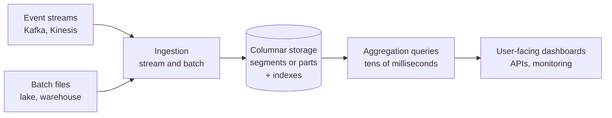
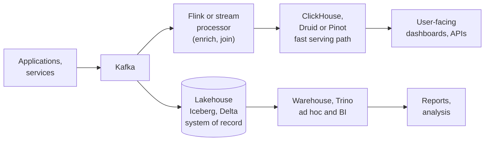

# Real-Time Analytics Databases: ClickHouse, Druid and Pinot
> Column-oriented databases built for sub-second aggregations over fresh, high-volume event data, and how to choose between ClickHouse, Apache Druid and Apache Pinot.

**Prerequisites:** [Data Modeling](data-modeling.md) · [Kafka](../04-streaming/kafka-reference.md) · [SQL](../00-foundations/sql-reference.md)

**Related:** [Apache Flink](../04-streaming/flink-reference.md) · [Snowflake](snowflake-reference.md) · [BigQuery](bigquery-reference.md) · [Apache Iceberg](apache-iceberg.md) · [Trino](../02-processing/trino-federation.md) · [Azure and Fabric](azure-fabric.md) · [Glossary](../99-reference/glossary.md)

---

## Overview

**Challenge:** A warehouse answers analytical questions well, but it is tuned for a small number of analysts running large queries, with data that is minutes to hours old. Some workloads look different: a product dashboard shown to every customer, an operational monitor, or a fraud view. They need answers in tens or hundreds of milliseconds, for thousands of concurrent users, over data that arrived seconds ago.

**Solution:** A class of column-oriented databases is built for this pattern: ClickHouse, Apache Druid and Apache Pinot. They ingest from streams and batch files, store data in compressed columnar segments with indexes, and answer aggregation queries over very large event tables quickly. They generally trade flexibility for speed. Data is best denormalised into wide tables, updates and deletes are limited or expensive, and the data model is designed around the queries you expect.



**Relevance to data engineering:** These systems sit beside the warehouse, not in place of it. The warehouse or lakehouse remains the system of record for modelling, history and ad hoc analysis. A real-time analytics database serves a specific fast path, fed from the same streams. Choosing one, and modelling for it, is a common system design topic. See [System Design](../08-architecture/system-design.md).

---

**On this page**

**Basic**
- [When to Use a Real-Time Analytics Database](#when-to-use-a-real-time-analytics-database)
- [The Three Systems at a Glance](#the-three-systems-at-a-glance)

**Intermediate**
- [ClickHouse](#clickhouse)
- [Apache Druid](#apache-druid)
- [Apache Pinot](#apache-pinot)

**Advanced**
- [Modelling for Fast Aggregations](#modelling-for-fast-aggregations)
- [Where They Fit in the Platform](#where-they-fit-in-the-platform)
- [Choosing Between Them](#choosing-between-them)

**Reference**
- [Common Pitfalls](#common-pitfalls)
- [Cheat Sheet](#cheat-sheet)
- [Interview Questions](#interview-questions)
- [Further Reading](#further-reading)

---

## When to Use a Real-Time Analytics Database

| Signal | Points to a real-time OLAP database | Points to a warehouse or lakehouse |
|--------|-------------------------------------|-----------------------------------|
| Latency target | Tens to hundreds of milliseconds | Seconds to minutes are acceptable |
| Concurrency | Many concurrent queries, often from an application | A limited number of analysts and BI users |
| Freshness | Seconds after the event | Minutes to hours, or batch |
| Query shape | Filters, group-bys and aggregations over one large events table, in a known pattern | Complex joins across many tables, ad hoc exploration |
| Data shape | Append-mostly events, metrics, logs, clicks | Slowly changing business entities, heavy updates |
| Consumers | Product features, monitoring, operational dashboards | Reports and analysis |

If a warehouse meets the latency and concurrency needs, use it; adding a second system means another thing to run, model and keep consistent. Reach for a real-time analytics database when the workload really is fast, concurrent and event-shaped.

---

## The Three Systems at a Glance

| | ClickHouse | Apache Druid | Apache Pinot |
|-|-----------|--------------|--------------|
| **Storage unit** | Data parts in a MergeTree table, merged in the background | Segments, partitioned by time | Segments, replicated across servers |
| **Ordering and indexes** | A sparse primary index over the `ORDER BY` key, in blocks of 8192 rows (granules) | Dictionary and bitmap (inverted) index on every dimension | Multiple index types per column, plus the star-tree pre-aggregation index |
| **Ingestion** | Inserts (batched, or asynchronous), plus a Kafka table engine and connectors | Streaming and batch tasks, and SQL-based ingestion with `INSERT` and `REPLACE` | Offline (batch) tables, real-time (stream) tables, or hybrid |
| **Time** | Any column; commonly partition by month | First-class: every table has a `__time` column, and ingestion is partitioned by time | A time column, used to split segments |
| **Architecture** | A single binary in one server or a cluster | Separate process types: Coordinator, Overlord, Broker, Router, Historical and MiddleManager or Indexer | Controller, Broker, Server and Minion, coordinated with Apache Helix and ZooKeeper |
| **External dependencies** | Replication uses ClickHouse Keeper or ZooKeeper | Deep storage, a metadata store and ZooKeeper are required | ZooKeeper (through Helix), plus deep storage for segments |
| **Signature feature** | Very fast scans and flexible SQL, incremental materialized views | Time-based partitioning and ingestion-time rollup | Star-tree index for bounded-latency aggregations |

Operational weight differs noticeably. ClickHouse can run as one process, while Druid and Pinot are multi-service clusters. That is a large factor in the decision if you will operate it yourself, and less of one if you buy a managed service.

---

## ClickHouse

ClickHouse's core table engine is **MergeTree**. Every insert creates an immutable **part** on disk, and background merges combine parts. The primary index is **sparse**: it stores one entry per block of 8192 rows (a granule) rather than per row, so it is small enough to stay in memory and lets a query skip blocks that cannot match.

### Creating a table

```sql
CREATE TABLE events
(
    event_time DateTime,
    user_id    UInt64,
    country    LowCardinality(String),
    event_type LowCardinality(String),
    amount     Decimal(12, 2)
)
ENGINE = MergeTree
PARTITION BY toYYYYMM(event_time)
ORDER BY (event_type, country, event_time)
TTL event_time + INTERVAL 90 DAY;
```

- **`ORDER BY`** defines the sort order on disk and implicitly the primary key. Put the columns you filter on most, and with the lowest cardinality first. If you need a different primary key, it must be a prefix of the `ORDER BY`.
- **`PARTITION BY`** is optional. Most tables do not need it, and one no finer than a month is generally enough. Too many partitions hurts performance. Partitions are mainly for lifecycle operations such as dropping old data, not for query speed.
- **`LowCardinality(String)`** dictionary-encodes columns with few distinct values, which saves space and speeds up filters and grouping.
- **`TTL`** deletes (or moves) rows automatically once they expire.

### Why the sort key matters

This is the most important modelling decision. `EXPLAIN indexes = 1` shows how many granules a query must read. The example below uses `events_big`, a table with the same definition as `events` loaded with two million rows:

```sql
EXPLAIN indexes = 1
SELECT count() FROM events_big WHERE event_type = 'purchase' AND country = 'DE';
```

```text
PrimaryKey
  Keys: event_type, country
  Condition: and((country in ['DE', 'DE']), (event_type in ['purchase', 'purchase']))
  Granules: 23/245
```

Filtering on the leading `ORDER BY` columns read 23 of 245 granules. A filter on a column that is not in the sort key, such as `WHERE user_id = 42`, read `245/245`: a full scan. Design the sort key from your most common `WHERE` clauses.

### Inserting data

Each insert creates a part, so many small inserts create many parts, which hurts query performance and can trigger "too many parts" errors. The recommendations are:

- Insert in **batches of at least 1,000 rows, ideally 10,000 to 100,000**, and roughly one insert per second, not many per second.
- Where you cannot batch on the client, enable **asynchronous inserts** so the server buffers and batches them. Use `wait_for_async_insert = 1` (the default), which confirms data is durably written before the client is acknowledged. Setting it to `0` is fire-and-forget and can lose errors silently.

```sql
INSERT INTO events
SETTINGS async_insert = 1, wait_for_async_insert = 1
VALUES ('2026-09-01 10:00:00', 1, 'DE', 'click', 0.00);
```

```sql
-- Parts per partition: many small parts means the insert pattern needs batching
SELECT partition, count() AS parts, sum(rows) AS rows
FROM system.parts
WHERE table = 'events' AND active
GROUP BY partition
ORDER BY partition;
```

### Pre-aggregating with materialized views

An **incremental materialized view** runs its query on each block of data as it is inserted into the source table, and writes the result to a target table. Queries then read a small pre-aggregated table. The target uses `AggregatingMergeTree` and stores partial aggregate states, written with `-State` functions and read with `-Merge` functions.

```sql
CREATE TABLE events_by_hour
(
    hour    DateTime,
    country LowCardinality(String),
    events  AggregateFunction(count),
    revenue AggregateFunction(sum, Decimal(12, 2))
)
ENGINE = AggregatingMergeTree
ORDER BY (country, hour);

CREATE MATERIALIZED VIEW events_by_hour_mv TO events_by_hour AS
SELECT
    toStartOfHour(event_time) AS hour,
    country,
    countState()              AS events,
    sumState(amount)          AS revenue
FROM events
GROUP BY hour, country;

SELECT hour, country, countMerge(events) AS events, sumMerge(revenue) AS revenue
FROM events_by_hour
GROUP BY hour, country
ORDER BY hour, country;
```

After loading 40,000 test rows in two separate inserts, the view's totals matched the raw table exactly (97,976 revenue and 40,000 events in both). The view stays correct across inserts because partial states merge.

A materialized view is a **trigger on inserts only**. Updates and deletes to the source table, and changes to a joined table, do not refresh it. Design it for append-only data.

### Updates and deduplication

ClickHouse favours immutable, append-only data. To keep the latest version of a row, use `ReplacingMergeTree`, which removes duplicates with the same sorting key during background merges, keeping the row with the highest version column:

```sql
CREATE TABLE users
(
    user_id    UInt64,
    email      String,
    updated_at DateTime
)
ENGINE = ReplacingMergeTree(updated_at)
ORDER BY user_id;

INSERT INTO users VALUES (1, 'old@example.com', '2026-09-01 10:00:00'), (2, 'b@example.com', '2026-09-01 10:00:00');
INSERT INTO users VALUES (1, 'new@example.com', '2026-09-02 10:00:00');

SELECT user_id, email FROM users FINAL ORDER BY user_id;    -- one row per user
```

Deduplication happens at merge time, not insert time. Until a merge runs, a plain `SELECT` still returns both versions of user 1; `FINAL` collapses them at query time, at extra cost. Do not rely on this for frequent point updates. See [Ingestion & CDC](../02-processing/ingestion-cdc.md) for feeding change data into it.

To load from Kafka, the usual patterns are the Kafka table engine with a materialized view that writes to a MergeTree table, or a managed connector. Design the sink table and its sort key as above, whichever route you take.

---

## Apache Druid

Druid is a multi-service cluster built around time-partitioned data.

**Processes:**

| Process | Role |
|---------|------|
| **Coordinator** | Assigns segments to Historicals and balances them across the cluster |
| **Overlord** | Controls ingestion workloads and assigns tasks to MiddleManagers |
| **Broker** | Receives queries, forwards them to data servers, merges the results |
| **Router** | A gateway in front of Brokers, Overlords and Coordinators, and hosts the web console |
| **Historical** | Stores and queries historical segments. Does not accept writes |
| **MiddleManager / Peon** | Runs ingestion tasks that read from sources and publish segments. An Indexer is an experimental alternative |

Three external dependencies are **required**: **deep storage** (shared storage that holds all ingested data, also used to load segments onto Historicals), a **metadata store** (an RDBMS holding segment and task information) and **ZooKeeper** (service discovery and leader election). Deep storage is what makes Druid elastic and fault tolerant, because a lost Historical reloads its segments from it.

### Segments and rollup

Data is stored in **segments**, files partitioned by time, with one segment per time interval that contains data. Segments are columnar, made of a timestamp column, dimension columns (filtered and grouped on) and metric columns (aggregated). Every dimension gets a **dictionary** mapping values to integer IDs, and a **bitmap (inverted) index** per distinct value, so filters become fast bitmap AND and OR operations. The recommended segment size is about 300 to 700 MB, and around 5 million rows per segment is a reasonable starting point.

**Rollup** is Druid's ingestion-time summarisation. Rows with identical dimension values and the same timestamp after truncation to `queryGranularity` are combined into one row. Setting `queryGranularity` to five minutes instead of one makes more rows collide, so storage shrinks, potentially by orders of magnitude. The trade-off is stated plainly in the documentation: you lose the ability to query individual events.

### SQL-based ingestion

Druid can ingest with SQL. `INSERT` adds data and `REPLACE` overwrites it, and `PARTITIONED BY` is **required** because Druid partitions all data by time:

```sql
REPLACE INTO events OVERWRITE ALL
SELECT
  TIME_PARSE("ts") AS __time,
  "user_id",
  "country",
  "amount"
FROM TABLE(
  EXTERN(
    '{"type":"http","uris":["https://example.com/events.json.gz"]}',
    '{"type":"json"}',
    '[{"name":"ts","type":"string"},{"name":"user_id","type":"long"},{"name":"country","type":"string"},{"name":"amount","type":"double"}]'
  )
)
PARTITIONED BY DAY
```

`EXTERN` takes three arguments: an input source, an input format and a row signature, all JSON. Accepted granularities include `HOUR`, `DAY`, `MONTH`, `YEAR`, ISO 8601 periods and `ALL`. An optional `CLUSTERED BY` clause orders rows within a partition. To replace only a range, use `OVERWRITE WHERE __time >= ... AND __time < ...`, which is how you correct or backfill a period. Druid has no in-place row updates; you replace time ranges.

---

## Apache Pinot

Pinot separates roles into four components, coordinated by Apache Helix with ZooKeeper as its state store.

| Component | Role |
|-----------|------|
| **Controller** | Manages cluster state with Helix and holds schemas and table configs. One controller is active at a time, chosen by leader election |
| **Broker** | Routes queries to the right servers and merges their responses. Keeps routing tables of which server holds which segment |
| **Server** | Hosts segments and processes queries. Offline servers hold batch data. Real-time servers consume streams into in-memory **consuming segments** and flush them to disk |
| **Minion** | Optional. Runs background tasks directed by the controller, such as format conversion and purges |

A **segment** is the storage unit and can be replicated across servers, with the replication factor set per table. **Offline** tables ingest batch data (CSV, Avro, Parquet), **real-time** tables consume streams (Kafka, Pulsar, Kinesis), and **hybrid** tables combine both. A query is executed as scatter-gather-merge: the broker picks the segments and servers, sends the query, and merges the results. The project's own documentation cites latencies as low as 10 ms at the 95th percentile and very high query concurrency; treat those as best-case figures for well-modelled data.

### Schema and table config

A table is defined by a **schema** (JSON) and a **table config** (JSON). The schema names each column's role:

```json
{
  "schemaName": "events",
  "dimensionFieldSpecs": [
    { "name": "uuid", "dataType": "STRING" }
  ],
  "metricFieldSpecs": [
    { "name": "count", "dataType": "INT" }
  ],
  "dateTimeFieldSpecs": [{
    "name": "ts",
    "dataType": "TIMESTAMP",
    "format": "1:MILLISECONDS:EPOCH",
    "granularity": "1:MILLISECONDS"
  }]
}
```

A real-time table config that consumes a Kafka topic:

```json
{
  "tableName": "events",
  "tableType": "REALTIME",
  "segmentsConfig": {
    "timeColumnName": "ts",
    "schemaName": "events",
    "replicasPerPartition": "1"
  },
  "tenants": {},
  "tableIndexConfig": {
    "loadMode": "MMAP",
    "streamConfigs": {
      "streamType": "kafka",
      "stream.kafka.topic.name": "events",
      "stream.kafka.decoder.class.name": "org.apache.pinot.plugin.inputformat.json.JSONMessageDecoder",
      "stream.kafka.consumer.factory.class.name": "org.apache.pinot.plugin.stream.kafka30.KafkaConsumerFactory",
      "stream.kafka.broker.list": "kafka:9092",
      "realtime.segment.flush.threshold.rows": "0",
      "realtime.segment.flush.threshold.time": "24h",
      "realtime.segment.flush.threshold.segment.size": "50M",
      "stream.kafka.consumer.prop.auto.offset.reset": "smallest"
    }
  },
  "metadata": {
    "customConfigs": {}
  }
}
```

The consumer factory class depends on the Kafka client version. The documentation lists a Kafka 3.x connector (`kafka30`, the default) and a Kafka 4.x connector (`kafka40`), and the older 2.x connector has been removed, so check the class name for your Pinot release. The flush thresholds control when a consuming segment is closed and written to disk, by row count, time or segment size.

### The star-tree index

Pinot offers several index types per column. Its distinctive one is the **star-tree index**, which pre-aggregates across a chosen set of dimensions so that matching aggregation queries have a constant upper bound on latency, trading extra storage for speed.

```json
{
  "tableIndexConfig": {
    "starTreeIndexConfigs": [{
      "dimensionsSplitOrder": ["Country", "Browser", "Locale"],
      "skipStarNodeCreationForDimensions": [],
      "functionColumnPairs": ["SUM__Impressions"],
      "maxLeafRecords": 1
    }]
  }
}
```

This is the `tableIndexConfig` section of a table config, shown on its own here.

`dimensionsSplitOrder` sets the order in which the tree splits, `functionColumnPairs` lists the aggregations to precompute (function and column joined by two underscores), and `maxLeafRecords` is the split threshold (default 10,000).

Use it when the workload is dominated by aggregations and group-bys on known dimensions with predictable patterns. Do not use it for ad hoc queries, which will not match it, or for high-cardinality dimensions, which can cause a storage explosion. It has limits: only queries matching the configuration use it, exact distinct counts, exact percentiles and regular-expression predicates are unsupported, `IS NULL` is unsupported, `OR` predicates across dimensions can double-count, and all its dimensions need dictionary encoding. Check the current documentation before designing around it.

---

## Modelling for Fast Aggregations

These databases reward the same habits, whichever you choose.

- **Design from the queries.** Write down the ten dashboard queries first. The sort key (ClickHouse), dimensions and rollup (Druid) or indexes (Pinot) come from their filters and group-bys.
- **Denormalise into a wide events table.** Join at ingestion, in the stream processor or the batch job, not at query time. Check each engine's current join support before designing around joins, since it is more limited than a warehouse.
- **Pre-aggregate what you can.** A materialised view in ClickHouse, rollup in Druid, and the star-tree in Pinot all trade detail for latency. Keep the raw events elsewhere, in the lake or warehouse, so you can rebuild.
- **Keep low-cardinality columns compact.** Dictionary-encode them, and use the engine's type for it (`LowCardinality` in ClickHouse, dictionary-encoded dimensions in Druid and Pinot).
- **Treat time as a first-class dimension.** Filter on time in almost every query, and choose partitioning and segment sizes around it.
- **Plan for late and corrected data.** Decide how a late event or a correction is applied: replacing a time range in Druid, `ReplacingMergeTree` or reload of a partition in ClickHouse, a re-run of an offline segment in Pinot.
- **Keep updates rare.** These engines are append-first. A workload of frequent row-level updates belongs in a transactional or lakehouse table format.

---

## Where They Fit in the Platform



The same stream feeds two paths. The lakehouse keeps full history for modelling and ad hoc analysis. The real-time database serves fast, narrow queries. The two must agree, so define metrics once (see [Semantic Layer & Metrics](../02-processing/semantic-layer-metrics.md)) and reconcile the serving copy against the source of record. Because the serving copy can be rebuilt from the lake, it does not have to be the only place data lives. Microsoft Fabric has its own version of this pattern, with Eventstreams feeding an Eventhouse queried with KQL. See [Azure and Fabric](azure-fabric.md).

---

## Choosing Between Them

There is no single winner. Each choice depends on your workload and your operating model.

| Consideration | Leans towards |
|---------------|---------------|
| You want the simplest operations, or a single node to start | ClickHouse |
| Flexible SQL and fast scans over wide tables, including logs and observability | ClickHouse |
| Time-series events, with rollup to control storage and predictable time-based retention | Druid |
| Very high concurrency, user-facing analytics with a known set of dimensions and bounded latency | Pinot |
| A team that can run a multi-service cluster, or that will use a managed service | Druid or Pinot |
| Frequent corrections to recent data | Druid (replace time ranges) or ClickHouse (`ReplacingMergeTree`), depending on the pattern |
| A warehouse already meets your latency and concurrency needs | None of them. Stay on the warehouse |

Whatever the shortlist, run a proof of concept with your real data volume and your real ten queries, and compare latency, concurrency and operating effort. Marketing figures are not a substitute. Consider managed offerings if you do not want to operate the cluster. Compare against a warehouse feature such as clustering or materialised views first, since they close much of the gap for less concurrency-hungry cases. See [Snowflake](snowflake-reference.md) and [BigQuery](bigquery-reference.md).

---

## Common Pitfalls

| Pitfall | Symptom | Fix |
|---------|---------|-----|
| Using one as a general warehouse | Slow, awkward multi-table joins and frequent updates | Keep modelling and ad hoc analysis in the warehouse or lakehouse |
| ClickHouse `ORDER BY` chosen without looking at queries | Full scans (`245/245` granules) | Put the most-filtered, lowest-cardinality columns first, and check with `EXPLAIN indexes = 1` |
| Many tiny ClickHouse inserts | "Too many parts" errors, slow queries | Batch at 10,000 to 100,000 rows, or use asynchronous inserts with `wait_for_async_insert = 1` |
| Partitioning ClickHouse too finely | Slow queries, many small parts | No partitioning, or monthly at most, for lifecycle operations |
| Expecting a ClickHouse view to track updates | The aggregate is wrong after an update or delete | Materialised views fire on inserts only; keep the source append-only |
| Reading a `ReplacingMergeTree` without `FINAL` | Duplicate rows until a merge runs | `FINAL`, or model so duplicates do not matter, and do not use it for frequent point updates |
| Druid rollup with more granularity than needed | Large storage, slow queries | A coarser `queryGranularity`, knowing you lose individual events |
| Wrong Druid segment sizing | Many tiny or huge segments | Aim for about 300 to 700 MB, and about 5 million rows as a start |
| Expecting to update Druid rows in place | No such operation | Replace the time range with `REPLACE ... OVERWRITE WHERE` |
| A star-tree index for ad hoc queries | The index is not used | Reserve it for known, aggregation-heavy patterns on low-cardinality dimensions |
| A Pinot Kafka class from the wrong version | Consumer fails to start | Use the factory class matching the Kafka client version (`kafka30`, `kafka40`) |
| Treating the serving store as the system of record | No way to rebuild after a bad load | Keep raw events in the lake, and rebuild the serving copy from it |
| Choosing on vendor benchmarks | Surprises in production | A proof of concept with your data and queries |

---

## Cheat Sheet

| Task | ClickHouse | Druid | Pinot |
|------|-----------|-------|-------|
| Storage unit | Part (in a MergeTree table) | Segment (by time) | Segment |
| Speed-up mechanism | Sparse primary index on `ORDER BY` | Dictionary and bitmap indexes, rollup | Indexes, star-tree |
| Load from a stream | Kafka engine plus a materialised view, or a connector | Kafka ingestion, or SQL-based ingestion | Real-time table with `streamConfigs` |
| Batch load | `INSERT` in batches of 10,000 to 100,000 rows | `INSERT` or `REPLACE ... PARTITIONED BY` | Offline table |
| Correct old data | `ReplacingMergeTree` and `FINAL`, or reload a partition | `REPLACE ... OVERWRITE WHERE __time ...` | Re-ingest the offline segment |
| Pre-aggregate | `AggregatingMergeTree` with `-State` and `-Merge` | Rollup at ingestion | Star-tree index |
| Expire data | `TTL` | Retention rules and time-based drops | Retention on the table |
| Check performance | `EXPLAIN indexes = 1` · `system.parts` | The web console and query metrics | The query console and broker stats |

**Quick rule:** simplest to run and flexible SQL → ClickHouse · time-series with rollup → Druid · very high concurrency with known dimensions → Pinot · warehouse is fast enough → do not add one

---

## Interview Questions

**Q: When would you use a real-time analytics database instead of a warehouse?**
A: When the workload needs tens to hundreds of milliseconds, many concurrent queries (often from an application), and data that is seconds old, over append-mostly events, with a known set of filters and aggregations. Warehouses are built for fewer, larger analytical queries with more complex joins and tolerate more latency. If a warehouse meets the requirement, adding a second system is unnecessary cost, so I would prove it does not before choosing one.

**Q: How does ClickHouse make queries fast, and what is the most important design choice?**
A: Data is stored in columnar parts sorted by the `ORDER BY` key, with a sparse primary index holding one entry per 8192-row granule, so a query skips granules that cannot match. The most important choice is the sort key: filtering on its leading columns can read a small fraction of the granules, while filtering on a column outside it scans everything. `EXPLAIN indexes = 1` shows the granules read. Batched inserts, correct partitioning and pre-aggregation with materialised views complete the picture.

**Q: How do ClickHouse materialised views work, and what are their limits?**
A: An incremental materialised view runs its query on each block inserted into the source table and writes the result to a target table, usually `AggregatingMergeTree`, storing partial states with `-State` functions that queries combine with `-Merge` functions. It shifts computation from query time to insert time. It fires only on inserts, so updates, deletes and changes to a joined table do not refresh it.

**Q: What is rollup in Druid?**
A: Rollup combines, at ingestion, rows that have identical dimension values and the same timestamp after truncation to the query granularity into a single row with aggregated metrics. It can shrink data by orders of magnitude and speeds queries, but individual events can no longer be queried. So it suits metrics and time series where you need aggregates, and you keep raw events elsewhere.

**Q: Compare the architectures of Druid and Pinot.**
A: Both are distributed and split ingestion from serving. Druid has Coordinator, Overlord, Broker, Router, Historical and MiddleManager processes, and requires deep storage, a metadata store and ZooKeeper, with segments reloaded from deep storage. Pinot has Controller, Broker, Server and Minion, coordinated by Helix and ZooKeeper, and its servers host replicated segments, with real-time servers holding consuming segments in memory before flushing. Both scatter queries across segments and merge results at a broker.

**Q: How would you handle corrections and late data in a real-time analytics store?**
A: Decide up front, because these systems are append-first. In Druid, replace the affected time range with `REPLACE ... OVERWRITE WHERE`. In ClickHouse, use `ReplacingMergeTree` (remembering duplicates persist until a merge, or query with `FINAL`) or reload the affected partition. Keep raw events in the lake so the serving store can always be rebuilt, and reconcile it against the system of record.

---

## Further Reading

- [ClickHouse: MergeTree table engine](https://clickhouse.com/docs/engines/table-engines/mergetree-family/mergetree)
- [ClickHouse: selecting an insert strategy](https://clickhouse.com/docs/best-practices/selecting-an-insert-strategy)
- [ClickHouse: incremental materialized views](https://clickhouse.com/docs/materialized-view/incremental-materialized-view)
- [Apache Druid: architecture](https://druid.apache.org/docs/latest/design/architecture/), [segments](https://druid.apache.org/docs/latest/design/segments/) and [rollup](https://druid.apache.org/docs/latest/ingestion/rollup/)
- [Apache Druid: SQL-based ingestion reference](https://druid.apache.org/docs/latest/multi-stage-query/reference/)
- [Apache Pinot documentation](https://docs.pinot.apache.org/)
- [Apache Pinot: star-tree index](https://docs.pinot.apache.org/build-with-pinot/indexing/star-tree-index)

---

**Previous:** [Beam and Dataflow](../04-streaming/beam-dataflow.md) · **Next:** [Streaming SQL](../04-streaming/streaming-sql.md) · **Back to:** [Index](../README.md)
