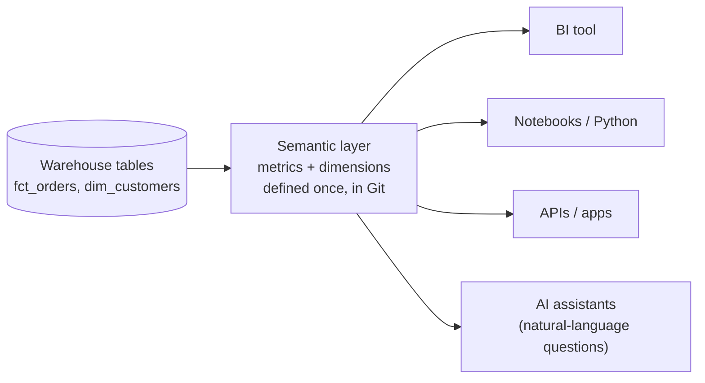
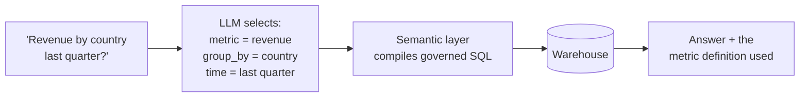

# Semantic Layer & Metrics
> Define each business metric once, in code, so every dashboard, notebook and AI assistant computes "revenue" the same way.

**Prerequisites:** [SQL](../00-foundations/sql-reference.md) · [Data Modeling](../01-storage/data-modeling.md) · [dbt](dbt-reference.md)

**Related:** [Data Quality](../05-quality-governance/data-quality.md) · [Governance & Lineage](../05-quality-governance/governance-lineage.md) · [Glossary](../99-reference/glossary.md)

---

## Overview

**Challenge:** Ask three teams for "revenue last month" and you get three numbers. Finance excludes refunds, marketing counts orders at checkout, and a dashboard author filtered out a test country years ago. The logic lives in dozens of BI tool formulas and copy-pasted SQL, and nobody can say which is right.

**Solution:** A **semantic layer** sits between the warehouse tables and everything that consumes them. It holds the definitions of **metrics** (revenue, active users, conversion rate) and **dimensions** (date, country, product category) once, as versioned code. Consumers ask for "revenue by month by country" and the layer generates the correct SQL, with the right joins, filters and aggregation.



**Relevance to data engineering:** Data engineers own the definitions that everyone else trusts. A semantic layer moves business logic out of dashboards and into the same reviewed, tested, versioned codebase as the transformations. It is also what makes AI-generated SQL safer: the model asks for named metrics instead of inventing its own `SUM(...)`.

---

## Table of Contents

**Basic**
- [The Problem in SQL](#the-problem-in-sql)
- [Core Concepts](#core-concepts)

**Intermediate**
- [Defining Metrics with dbt MetricFlow](#defining-metrics-with-dbt-metricflow)
- [Metric Types](#metric-types)
- [Querying Metrics](#querying-metrics)

**Advanced**
- [Where the Layer Lives](#where-the-layer-lives)
- [Semantic Layer for AI and Natural Language](#semantic-layer-for-ai-and-natural-language)
- [Testing and Governing Metrics](#testing-and-governing-metrics)

**Reference**
- [Common Pitfalls](#common-pitfalls)
- [Cheat Sheet](#cheat-sheet)
- [Interview Questions](#interview-questions)
- [Further Reading](#further-reading)

---

## The Problem in SQL

Both queries below are "revenue by month", written by two reasonable people:

```sql
-- Dashboard A (finance): completed orders only, net of refunds
SELECT date_trunc('month', order_date) AS month,
       SUM(amount - refunded_amount)    AS revenue
FROM fct_orders
WHERE status = 'completed'
GROUP BY 1;

-- Dashboard B (marketing): every order placed
SELECT date_trunc('month', order_date) AS month,
       SUM(amount)                      AS revenue
FROM fct_orders
GROUP BY 1;
```

Both are called "revenue", they disagree every month, and only careful reading of the SQL shows why. A semantic layer makes the definition a named, single artifact (`revenue` = completed orders, net of refunds) that both dashboards must use, and it forces a second, deliberately named metric (`gross_bookings`) for the marketing view.

The same trap appears with **non-additive metrics**. You cannot sum averages or distinct counts across groups: the "average order value by country" of three countries is not the average of the three averages. A semantic layer keeps the numerator and denominator and computes the ratio at the requested grain.

---

## Core Concepts

| Concept | Meaning | Example |
|---------|---------|---------|
| **Entity** | A key that joins tables together | `order_id`, `customer_id` |
| **Dimension** | An attribute you group or filter by | `order_date`, `country`, `status` |
| **Measure** | An aggregation over a column, the building block of a metric | `SUM(amount)`, `COUNT(DISTINCT customer_id)` |
| **Metric** | A business definition built from measures, with filters and rules | `revenue`, `conversion_rate` |
| **Grain** | What one row of a table represents | one row per order line |
| **Time dimension** | The date field a metric is aggregated over, at day, week, month... | `metric_time` |

Getting the **grain** right is the most common source of wrong numbers. A join from orders (one row per order) to order items (many rows per order) multiplies an order-level amount by the number of items unless the layer aggregates each table to its own grain first. Semantic layers exist largely to avoid this fan-out.

---

## Defining Metrics with dbt MetricFlow

The dbt Semantic Layer is powered by **MetricFlow**. You describe a **semantic model** on top of a dbt model, then define metrics that use its measures.

```yaml
# models/marts/semantic_orders.yml
semantic_models:
  - name: orders
    description: One row per order
    model: ref('fct_orders')
    defaults:
      agg_time_dimension: order_date

    entities:
      - name: order_id
        type: primary
      - name: customer
        type: foreign
        expr: customer_id

    dimensions:
      - name: order_date
        type: time
        type_params:
          time_granularity: day
      - name: status
        type: categorical
      - name: country
        type: categorical

    measures:
      - name: order_total
        description: Order value before refunds
        agg: sum
        expr: amount
      - name: order_count
        agg: count
        expr: order_id
      - name: refunds
        agg: sum
        expr: refunded_amount

metrics:
  - name: gross_bookings
    label: Gross bookings
    type: simple
    type_params:
      measure: order_total

  - name: revenue
    label: Revenue
    description: Completed orders, net of refunds
    type: simple
    type_params:
      measure: order_total
    filter: |
      {{ Dimension('order__status') }} = 'completed'
```

The metric specification is still evolving, and newer dbt versions accept a simplified format, so check the [dbt documentation](https://docs.getdbt.com/docs/build/build-metrics-intro) for the version you run. The concepts (entities, dimensions, measures, metrics) stay the same.

---

## Metric Types

| Type | What it computes | Example |
|------|------------------|---------|
| **Simple** | One measure, optionally filtered | `gross_bookings` |
| **Ratio** | Numerator metric ÷ denominator metric, computed at the queried grain | `refund_rate = refunds / gross_bookings` |
| **Derived** | An expression over other metrics | `net_revenue = gross_bookings - refunds` |
| **Cumulative** | A running total or a rolling window | `revenue_last_30_days` |
| **Conversion** | Share of entities that did B after A within a window | `signup_to_purchase` |

```yaml
metrics:
  - name: refunds_total
    label: Refunds
    type: simple
    type_params:
      measure: refunds

  - name: refund_rate
    label: Refund rate
    type: ratio
    type_params:
      numerator: refunds_total
      denominator: gross_bookings

  - name: revenue_30d
    label: Revenue, rolling 30 days
    type: cumulative
    type_params:
      measure: order_total
      window: 30 days
```

Ratio metrics are why a semantic layer is worth having: averaging pre-computed daily rates gives a wrong monthly rate, while the layer recomputes numerator and denominator at the month grain.

---

## Querying Metrics

With the `dbt-metricflow` package installed, query from the command line:

```bash
mf validate-configs                                              # check definitions and warehouse access
mf list metrics
mf query --metrics revenue --group-by metric_time__month,order__country --order metric_time__month
mf query --metrics revenue,refund_rate --group-by metric_time__month --explain   # show the SQL it generates
```

`--explain` is the best way to learn how the layer plans joins and grain. In production, consumers use the Semantic Layer APIs (JDBC and GraphQL) from dbt Cloud, so BI tools and notebooks select metrics by name instead of writing SQL by hand.

The idea works without any product. Even a plain SQL view per metric, owned and tested in Git, removes most of the inconsistency:

```sql
-- One reviewed definition, reused everywhere
CREATE VIEW metrics.revenue_daily AS
SELECT order_date,
       country,
       SUM(amount - refunded_amount) AS revenue,
       COUNT(*)                      AS orders
FROM fct_orders
WHERE status = 'completed'
GROUP BY order_date, country;
```

Store the **additive parts** (sum and count), never a pre-computed average, so any consumer can re-aggregate correctly: `SUM(revenue) / SUM(orders)` at whatever grain it needs.

---

## Where the Layer Lives

| Option | How it works | Trade-offs |
|--------|--------------|------------|
| **Transformation-layer** (dbt Semantic Layer / MetricFlow) | Metrics live next to dbt models, exposed through APIs | One definition for many tools. Needs the dbt platform for the APIs |
| **Standalone headless BI** (Cube, and similar) | A dedicated service with its own modelling language, APIs and caching | Rich caching and access control, but another system to run |
| **BI tool** (LookML in Looker, Power BI semantic models, Tableau) | Definitions live in the BI tool | Great inside that tool, but do not follow the metric into other tools |
| **Warehouse-native** (Snowflake semantic views, Databricks metric views) | The warehouse stores metric definitions that its SQL and BI connectors can query | Close to the data. Portability depends on the vendor |
| **Plain SQL views** | Reviewed view per metric | Simplest. No automatic joins or ratio handling |

Choose by how many consumers you have. With one BI tool, its native layer is the least work. With several tools, Python users and an AI assistant, a definition outside any single tool pays off.

---

## Semantic Layer for AI and Natural Language

Asking a language model to write SQL directly against raw tables produces plausible queries with wrong logic: the wrong join, the wrong status filter, an average of averages. A semantic layer narrows the model's job to **choosing metrics and dimensions** from a fixed, documented list, while the layer generates the SQL.



Good practice:
- Give every metric and dimension a clear `description` and `label`. The model reads these, so they are effectively its documentation.
- Return the **definition used** alongside the number, so users can see that "revenue" means completed orders net of refunds.
- Evaluate the assistant on a fixed set of questions with known answers before releasing it. See [Evals](../07-ai/eval-and-evals.md).

---

## Testing and Governing Metrics

Treat metric definitions as code:

- **Review** changes in pull requests, with a named owner per metric (`meta: {owner: finance-data}`).
- **Validate** in CI (`mf validate-configs` for MetricFlow) so a renamed column fails the build, not the dashboard.
- **Reconcile** against a trusted source: a test that the semantic layer's monthly revenue equals the finance system's number within a tolerance. See [Data Quality](../05-quality-governance/data-quality.md).
- **Version** breaking changes. If "revenue" is redefined, publish `revenue_v2`, migrate consumers, then retire the old one, and record the change so historical reports can be explained. See [Governance & Lineage](../05-quality-governance/governance-lineage.md).
- **Deprecate** duplicates: when a new metric replaces several dashboard formulas, delete the formulas.

---

## Common Pitfalls

| Pitfall | Symptom | Fix |
|---------|---------|-----|
| Storing pre-computed ratios or averages | Monthly numbers do not match a re-aggregation of daily numbers | Store additive parts (sums and counts) and compute the ratio at query time |
| Join fan-out from mixed grains | Revenue inflated by the number of line items | Aggregate each table to its own grain first, or use a layer that plans joins |
| Two metrics with the same name in different tools | Numbers disagree again | One source of truth, and remove or redirect the duplicates |
| No owner or description | Nobody trusts or can safely change a metric | Require `description` and an owner on every metric |
| Redefining a metric silently | Historical dashboards jump | Version the metric and communicate the change |
| Modelling everything up front | Months spent, nothing used | Start with the ten metrics leadership asks for, then extend |
| Treating the layer as a replacement for good models | Slow, confusing queries | Keep clean, tested marts underneath. The layer sits on top of them |

---

## Cheat Sheet

| Task | Command / Syntax |
|------|------------------|
| Define a metric | `metrics:` block with `name`, `type`, `type_params` |
| Semantic model | `semantic_models:` with `model: ref(...)`, `entities`, `dimensions`, `measures` |
| Filter a metric | `filter: "{{ Dimension('order__status') }} = 'completed'"` |
| Validate | `mf validate-configs` |
| List metrics | `mf list metrics` |
| Query | `mf query --metrics revenue --group-by metric_time__month` |
| See the SQL | add `--explain` |
| Additive storage rule | keep `SUM` and `COUNT`, derive `AVG` and rates at query time |

---

## Interview Questions

**Q: What problem does a semantic layer solve?**
A: Metric drift: the same word ("revenue", "active user") calculated differently in every dashboard and notebook. By defining metrics once, in version-controlled code, with the joins, filters and grain handled centrally, every consumer gets the same answer and a change is made in one reviewed place.

**Q: Why can't you just average daily conversion rates to get a monthly rate?**
A: A rate is a ratio, and an average of ratios weights every day equally regardless of volume. The correct monthly rate is total conversions divided by total visits. Semantic layers keep the numerator and denominator and compute the ratio at the requested grain.

**Q: What is fan-out and how do you avoid it?**
A: Joining a table to another at a finer grain repeats the coarser table's values, so summing them overcounts. Avoid it by aggregating each table to the target grain before joining, by measuring each metric on the table at its own grain, or by using a layer that plans the joins.

**Q: How does a semantic layer help with AI-generated analytics?**
A: It restricts the model to a governed vocabulary of metrics and dimensions. The model chooses what to ask for, and deterministic code writes the SQL, which avoids invented joins and inconsistent filters. You can also show the user the definition behind each answer.

**Q: Where should the semantic layer live?**
A: As close to the data and as tool-neutral as your consumers require. One BI tool: use its native layer. Several tools and programmatic or AI consumers: a transformation-layer or warehouse-native layer, so the definition does not depend on any single front end.

---

## Further Reading

- [dbt Semantic Layer and MetricFlow](https://docs.getdbt.com/docs/build/build-metrics-intro)
- [MetricFlow (open source)](https://github.com/dbt-labs/metricflow)
- [Cube documentation](https://cube.dev/docs)
- [Snowflake semantic views](https://docs.snowflake.com/en/user-guide/views-semantic/overview)
- [Databricks metric views](https://docs.databricks.com/aws/en/metric-views/)

---

**Previous:** [dbt](dbt-reference.md) · **Next:** [Data Quality](../05-quality-governance/data-quality.md) · **Back to:** [Index](../README.md)
