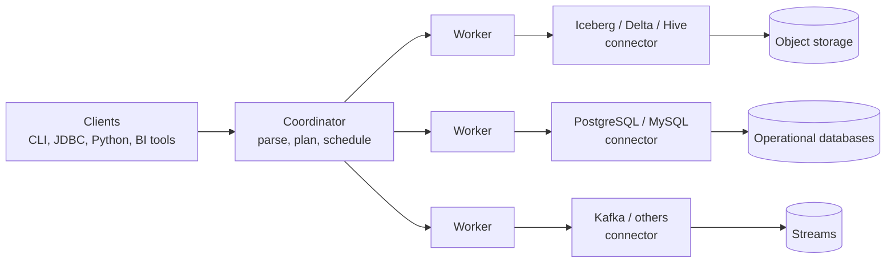

# Trino and Query Federation
> A distributed SQL engine that queries data where it lives, across data lakes, databases and streams, without copying it into one system first.

**Prerequisites:** [SQL](../00-foundations/sql-reference.md) · [Cloud Storage](../01-storage/cloud-storage.md) · [Apache Iceberg](../01-storage/apache-iceberg.md)

**Related:** [Databricks](databricks-reference.md) · [DuckDB & Polars](duckdb-polars.md) · [Delta Lake](../01-storage/delta-lake.md) · [Kafka](../04-streaming/kafka-reference.md) · [Docker](../06-infrastructure/docker-reference.md) · [Glossary](../99-reference/glossary.md)

---

## Overview

**Challenge:** Data sits in many places: object storage holding open-format tables, several operational databases, a warehouse, a stream. Answering a question that spans two of them usually means building a pipeline to copy one into the other first. That takes time, duplicates data, and leaves the copy stale. Analysts also need one SQL interface, not a different tool per system.

**Solution:** Trino is a distributed SQL query engine. It does not store data. It reads from many systems through **connectors**, plans one query across them, and runs it in parallel on a cluster of workers. A single statement can join a table in an Apache Iceberg lake with a table in PostgreSQL. Trino is designed for interactive and batch analytics (OLAP), not for transactional workloads.



**Relevance to data engineering:** Trino is common as the shared query layer over a data lake, as a way to explore data in place before deciding what to load, and to migrate between systems by querying old and new side by side. Its role overlaps with Spark, warehouses and DuckDB, so knowing what it is good at, and where it is not, matters more than the syntax. Its SQL is ANSI-based and reads like the SQL in the [SQL guide](../00-foundations/sql-reference.md).

> Trino was known as PrestoSQL until the project was renamed in 2020. It is a separate project from PrestoDB, the other lineage of Presto. Documentation for one does not always apply to the other.

---

**On this page**

**Basic**
- [What Trino Is and Is Not](#what-trino-is-and-is-not)
- [Architecture and Terms](#architecture-and-terms)
- [Running Trino Locally](#running-trino-locally)
- [Querying with Catalogs](#querying-with-catalogs)

**Intermediate**
- [Catalogs and Connectors](#catalogs-and-connectors)
- [Federated Queries and Pushdown](#federated-queries-and-pushdown)
- [Iceberg Tables in Trino](#iceberg-tables-in-trino)
- [Using Trino from Python](#using-trino-from-python)

**Advanced**
- [Understanding and Tuning Performance](#understanding-and-tuning-performance)
- [Fault-Tolerant Execution](#fault-tolerant-execution)
- [Deployment](#deployment)
- [Choosing Between Trino and Other Engines](#choosing-between-trino-and-other-engines)

**Reference**
- [Common Pitfalls](#common-pitfalls)
- [Cheat Sheet](#cheat-sheet)
- [Interview Questions](#interview-questions)
- [Further Reading](#further-reading)

---

## What Trino Is and Is Not

| Trino is | Trino is not |
|----------|--------------|
| A distributed, in-memory-oriented SQL engine that processes data in parallel across many servers | A database. It has no storage of its own |
| A federation layer: one SQL interface over lakes, databases and more | A replacement for a transactional database. It is not built for many small single-row reads and writes |
| Good for interactive analytics and large scans over open-format tables | A workflow orchestrator or a general job framework |
| Stateless: workers can be added or removed, and the data stays where it is | A cache by default. Repeated queries read the source again unless you materialise results or configure connector caching |

Data written through Trino is stored by the underlying system (for example Iceberg tables in object storage), so the durability, consistency and cost of the data are those of that system.

---

## Architecture and Terms

A **cluster** is one **coordinator** and zero or more **workers**.

| Term | Meaning |
|------|---------|
| **Coordinator** | Parses statements, plans queries, and schedules work on workers. The "brain" of the cluster |
| **Worker** | Executes tasks and processes data. Fetches data from connectors and exchanges intermediate results with other workers |
| **Connector** | An adapter that lets the engine read (and sometimes write) one kind of data source, such as Iceberg, Hive, Delta Lake, PostgreSQL or Kafka |
| **Catalog** | A configuration that points at one data source through one connector, including credentials and URL. Every table is addressed as `catalog.schema.table` |
| **Schema** | A namespace of tables inside a catalog. It maps to a schema or database in the source |
| **Table** | Rows with named, typed columns |

A submitted **statement** becomes a **query**, which is executed as a tree of **stages**. Each stage runs as **tasks** on workers, each task processes **splits** (slices of the source data), and **exchanges** move intermediate data between stages. You rarely think about these until you tune a slow query, when they show up in the plan.

Because catalogs are independent, adding a data source is configuration, not development: add a catalog, and its tables are queryable.

---

## Running Trino Locally

The quickest way to try Trino is the official container. Ports and commands are from the Trino documentation:

```bash
docker run --name trino -d -p 8080:8080 trinodb/trino      # latest release
docker run --name trino -d -p 8080:8080 trinodb/trino:483  # or pin a version tag

docker exec -it trino trino                                # open the CLI in the container
```

The web interface is at `http://localhost:8080`. To add your own catalogs, mount a directory of catalog property files at `/etc/trino/catalog` in the container:

```bash
docker run --name trino -d -p 8080:8080 \
  --volume "$PWD/etc:/etc/trino" trinodb/trino
```

The built-in `tpch` connector generates a standard benchmark dataset on the fly, which makes it ideal for learning because no data setup is required. If your image has no `tpch` catalog, create `etc/catalog/tpch.properties` with a single line:

```properties
connector.name=tpch
```

Pin a version tag for anything repeatable. `latest` changes, and the Java requirement and some behaviour change between releases. (Release 483 was the latest at the time of writing; see [Requirements](#deployment) for the runtime.)

---

## Querying with Catalogs

Everything is addressed as `catalog.schema.table`. You can set defaults in the CLI with `USE tpch.tiny`.

```sql
SHOW CATALOGS;
SHOW SCHEMAS FROM tpch;
SHOW TABLES FROM tpch.tiny;
DESCRIBE tpch.tiny.orders;

SELECT orderpriority, count(*) AS orders, round(sum(totalprice), 2) AS revenue
FROM tpch.tiny.orders
GROUP BY orderpriority
ORDER BY revenue DESC;
```

The `tpch` schemas (`tiny`, `sf1`, `sf100`, and so on) differ only in scale, so you can compare how the same query behaves as data grows. Trino supports standard SQL: joins, window functions, CTEs, `UNNEST`, and `ARRAY`, `MAP` and `ROW` types. Its function names occasionally differ from other engines, so check the function reference when porting queries. See [SQL](../00-foundations/sql-reference.md) for the fundamentals.

---

## Catalogs and Connectors

A catalog is a properties file named after the catalog. `etc/catalog/postgres.properties` creates a catalog called `postgres`.

```properties
# etc/catalog/postgres.properties
connector.name=postgresql
connection-url=jdbc:postgresql://example.net:5432/database
connection-user=root
connection-password=secret
```

```properties
# etc/catalog/lake.properties  (an Iceberg catalog backed by a Hive metastore)
connector.name=iceberg
iceberg.catalog.type=hive_metastore
hive.metastore.uri=thrift://example.net:9083
fs.x.enabled=true
```

The Iceberg connector supports several catalog types through `iceberg.catalog.type`: `hive_metastore`, `glue`, `jdbc`, `rest`, `nessie` and `snowflake`. The `fs.x.enabled` property is a placeholder for the file system support you use, such as S3, so check the connector documentation for your storage.

**Dynamic catalogs** let you manage catalogs with SQL instead of files, when the server is started with `catalog.management=dynamic`:

```sql
CREATE CATALOG example USING postgresql
WITH (
  "connection-url" = 'jdbc:postgresql://example.net:5432/database',
  "connection-user" = '${ENV:POSTGRES_USER}',
  "connection-password" = '${ENV:POSTGRES_PASSWORD}'
);

DROP CATALOG example;
```

Property names containing special characters are double-quoted, and every value is a string in single quotes, including numbers and booleans. `${ENV:NAME}` reads an environment variable, so credentials need not appear in the statement.

> **Secrets:** The complete `CREATE CATALOG` statement is logged and visible in the web interface, including any sensitive values written literally. Use `${ENV:...}` references or the secrets mechanism, and never paste a password into a statement or a properties file that is committed to Git.

Common connector families:

| Family | Connectors (examples) | Used for |
|--------|----------------------|----------|
| Lake table formats | Iceberg, Delta Lake, Hive | Data in object storage |
| Relational databases | PostgreSQL, MySQL, SQL Server, Oracle, MariaDB, Redshift | Operational and warehouse data |
| Document and other stores | MongoDB, BigQuery | Non-relational or cloud warehouse data |
| Streaming | Kafka | Reading topics as tables |
| Built in | TPC-H, TPC-DS, memory, system | Learning, testing and cluster metadata |

---

## Federated Queries and Pushdown

Because every table has a catalog prefix, one query can span systems. This joins Iceberg order history in the lake with customer records in PostgreSQL:

```sql
SELECT c.country,
       count(*)      AS orders,
       sum(o.amount) AS revenue
FROM lake.sales.orders AS o
JOIN postgres.public.customers AS c
  ON o.customer_id = c.id
WHERE o.order_date >= DATE '2024-01-01'
GROUP BY c.country
ORDER BY revenue DESC;
```

No pipeline was needed. The cost is that Trino must read both sides at query time, and the source databases carry that load.

**Pushdown** is what makes federation efficient. When the connector supports it, Trino sends work to the source instead of pulling all rows and doing the work itself. For the PostgreSQL connector, these can be pushed down:

| Pushdown | Effect |
|----------|--------|
| Predicate | Filters run in the database, so fewer rows cross the network |
| Aggregate | `count`, `sum`, `avg`, `min`, `max`, `stddev` and `variance` are computed in the source |
| Join | A join between two tables in the same database can run there. Enabled by default and decided by cost (`join-pushdown.enabled`, `join-pushdown.strategy`) |
| Limit and Top-N | Only the rows needed are fetched |

Some things are **not** pushed down by default, such as range predicates (`>`, `<`, `BETWEEN`) on character columns, because a database's collation can order strings differently from Trino. A filter on a text column can therefore scan far more data than expected. Check the plan (see below) instead of assuming.

A cross-system join always moves data. When one side is small, such as a customer dimension, Trino can broadcast it to the workers. When both sides are large, the join is expensive, and copying one side into the lake with a regular pipeline is often the right answer. Federation is best for exploration, for small dimension lookups and for migrations, not as the architecture for every dashboard.

---

## Iceberg Tables in Trino

Trino reads and writes Apache Iceberg tables, which makes it a common query layer over a lake. See [Apache Iceberg](../01-storage/apache-iceberg.md) for the format itself.

```sql
CREATE TABLE lake.sales.orders (
    order_id    BIGINT,
    customer_id BIGINT,
    order_date  DATE,
    amount      DOUBLE
)
WITH (
    format = 'PARQUET',
    partitioning = ARRAY['month(order_date)'],
    sorted_by = ARRAY['customer_id']
);
```

Formats are `PARQUET`, `ORC` and `AVRO`. Partitioning uses transforms (`year`, `month`, `day`, `hour`, `bucket(x, n)`, `truncate(s, n)`), so you partition by a derived value and queries filter on the original column with no extra column to maintain.

**Time travel** reads an earlier snapshot:

```sql
SELECT * FROM lake.sales.orders FOR VERSION AS OF 8954597067493422955;

SELECT * FROM lake.sales.orders
FOR TIMESTAMP AS OF TIMESTAMP '2024-03-23 09:59:29.803 Europe/Vienna';
```

**Metadata tables** expose the table's history. Quote the table name because of the `$`:

```sql
SELECT * FROM "orders$snapshots";
SELECT * FROM "orders$history";
SELECT * FROM "orders$files";
```

**Maintenance** is part of running Iceberg tables. Small files accumulate from frequent writes, and old snapshots and orphaned files use storage:

```sql
ALTER TABLE lake.sales.orders EXECUTE optimize;                              -- compact small files
ALTER TABLE lake.sales.orders EXECUTE optimize(file_size_threshold => '128MB');
ALTER TABLE lake.sales.orders EXECUTE expire_snapshots(retention_threshold => '7d');
ALTER TABLE lake.sales.orders EXECUTE remove_orphan_files(retention_threshold => '7d');
```

Schedule these from your orchestrator, and choose retention so it does not remove a snapshot a reader or a time-travel query still needs. Delta Lake and Hive tables have their own connectors with their own properties. See [Delta Lake](../01-storage/delta-lake.md).

---

## Using Trino from Python

The `trino` package provides a DB-API client:

```bash
pip install trino
pip install "trino[sqlalchemy]"     # only if you use SQLAlchemy
```

```python
from trino.dbapi import connect

conn = connect(
    host="localhost",
    port=8080,
    user="analyst",
    catalog="tpch",
    schema="tiny",
)
cur = conn.cursor()
cur.execute("SELECT orderpriority, count(*) FROM orders GROUP BY orderpriority")
rows = cur.fetchall()
```

For a secured cluster, use HTTPS with an authentication object. Basic, JWT and OAuth2 are supported:

```python
from trino.auth import BasicAuthentication
from trino.dbapi import connect

conn = connect(
    host="trino.example.com",
    port=443,
    user="analyst",
    http_scheme="https",
    auth=BasicAuthentication("analyst", "<password>"),   # load from a secret store, not source code
    catalog="lake",
    schema="sales",
)
```

```python
from sqlalchemy import create_engine
from sqlalchemy.sql.expression import text

engine = create_engine("trino://user@localhost:8080/tpch")
with engine.connect() as connection:
    rows = connection.execute(text("SELECT count(*) FROM tiny.orders")).fetchall()
```

Trino is designed for analytical result sets. Fetch aggregates and bounded results, not millions of rows into a client, and write large outputs back to a table with `CREATE TABLE AS SELECT` so the cluster does the work. From an orchestrator, run statements through the client or a provider package, and treat each statement as a step that should be idempotent. See [Airflow](../03-orchestration/airflow-reference.md).

---

## Understanding and Tuning Performance

Start with the plan, not with settings. `EXPLAIN` shows the distributed plan without running the query, and `EXPLAIN ANALYZE` runs it and reports the cost of each operation.

```sql
EXPLAIN
SELECT c.country, sum(o.amount)
FROM lake.sales.orders AS o
JOIN postgres.public.customers AS c ON o.customer_id = c.id
GROUP BY c.country;

EXPLAIN ANALYZE
SELECT orderpriority, count(*) FROM tpch.sf1.orders GROUP BY orderpriority;
```

`EXPLAIN ANALYZE` reports timing for planning and execution, CPU and wall time per fragment, row counts and data size at each operator, and the average and standard deviation across tasks, which reveals skew. `EXPLAIN ANALYZE VERBOSE` adds operator-level statistics.

| Symptom | Likely cause | What to do |
|---------|--------------|------------|
| A federated query is slow, with a huge table scan | The filter was not pushed to the source | Check the plan for the filter's location. Rewrite the predicate (for text ranges, filter on a numeric or date column), or copy the table into the lake |
| One task much slower than the rest | Skewed join or group key | Look at the deviation in `EXPLAIN ANALYZE`; pre-aggregate or change the key |
| A lake query reads too many files | Missing partition filter, or many small files | Filter on the partition column (with the original column for transforms), and run `optimize` |
| A bad join order or strategy | Missing or stale table statistics | Collect statistics with `ANALYZE` on the table so the optimiser can cost the plan |
| Query fails with out of memory | A large join or aggregation exceeds memory per node | Reduce data early with filters and projections, add workers or memory, or use fault-tolerant execution for batch queries |
| Cross-system join moves too much data | Two large sides in different systems | Land one side in the lake with a pipeline |

General practices that pay off: select only the columns you need, filter early on partition and date columns, keep table files reasonably large (small files slow every scan), and prefer columnar formats (Parquet, ORC).

---

## Fault-Tolerant Execution

By default a Trino query fails if a worker dies partway through, which hurts long batch jobs. **Fault-tolerant execution** lets the cluster recover by retrying, and it is **off by default**. You choose a `retry-policy` in `config.properties`:

| Policy | Behaviour | Suits |
|--------|-----------|-------|
| `NONE` | No fault tolerance (default) | Interactive queries |
| `QUERY` | Retries the whole query on a failure | Many small queries |
| `TASK` | Retries individual tasks, with intermediate data spooled to storage | Large batch queries |

```properties
# etc/config.properties
retry-policy=TASK
```

```properties
# etc/exchange-manager.properties  (required for TASK)
exchange-manager.name=filesystem
exchange.base-directories=s3://my-trino-spool/exchange
```

`TASK` needs an **exchange manager** that spools intermediate data to storage such as S3, Azure Blob Storage, Google Cloud Storage, HDFS or a local file system. The storage also needs its own settings, such as the region for S3, which the documentation lists. Results larger than 32 MB need either a bigger `exchange.deduplication-buffer-size` or an exchange manager. User errors, such as a SQL syntax error, are never retried. Only some connectors support it, including Iceberg, Delta Lake, Hive, PostgreSQL, MySQL, BigQuery, Redshift and SQL Server, so check the list for yours. Prefer it for long ETL-style queries, and leave it off for short interactive ones.

---

## Deployment

A production cluster is one coordinator and several workers, each running the same Trino distribution with different configuration.

**Requirements:** a 64-bit Java runtime. Current releases require Java 25 (minimum 25.0.1), and the documentation recommends Eclipse Temurin. The requirement has changed between releases, so check the documentation for your version before upgrading the runtime.

```properties
# etc/node.properties
node.environment=production
node.id=ffffffff-ffff-ffff-ffff-ffffffffffff
node.data-dir=/var/trino/data
```

```properties
# etc/config.properties on the coordinator
coordinator=true
node-scheduler.include-coordinator=false
http-server.http.port=8080
discovery.uri=http://example.net:8080
```

```properties
# etc/config.properties on each worker
coordinator=false
http-server.http.port=8080
discovery.uri=http://example.net:8080
```

`node.id` must be unique per node, and `node.environment` must match across the cluster. Setting `node-scheduler.include-coordinator=false` keeps query work off the coordinator so planning stays responsive. Catalogs go in `etc/catalog/`. Start with `bin/launcher start` (a daemon) or `bin/launcher run` (foreground).

In practice most teams run Trino on Kubernetes or as a managed service, sized to the workload, with workers scaled up and down. See [Docker](../06-infrastructure/docker-reference.md) for images, and configure TLS and authentication before exposing a cluster. Use **resource groups** to stop one team's heavy queries from starving the rest, and pin the version you run so upgrades are deliberate.

---

## Choosing Between Trino and Other Engines

| | Trino | Spark | Warehouse (Snowflake, BigQuery, Redshift) | DuckDB |
|-|-------|-------|-------------------------------------------|--------|
| Model | Distributed SQL over external data | Distributed processing, SQL and code | Managed storage and compute | Single-process, in-process SQL |
| Strength | Interactive SQL, federation, open table formats | Large transformations, ML, complex code | Managed, governed analytics | Local and small-to-medium analytics |
| Storage | None (queries other systems) | None (reads and writes lake) | Its own | Files and its own format |
| Operate | A cluster, or a managed service | A cluster, or a managed service | Nothing | Nothing |
| Weak at | Long, heavy ETL without fault tolerance; many tiny writes | Low-latency interactive SQL | Data outside the warehouse | Multi-user, larger-than-one-machine scale |

Pick Trino when many people need interactive SQL over data in a lake and across databases, or when you want one engine that several table formats share. Pick Spark for heavy transformation code, a warehouse when you want a managed, governed system with storage included, and DuckDB when one machine is enough. They combine well: Spark writes Iceberg tables, Trino serves them to analysts. See [Databricks](databricks-reference.md), [PySpark](pyspark-reference.md) and [DuckDB & Polars](duckdb-polars.md).

---

## Common Pitfalls

| Pitfall | Symptom | Fix |
|---------|---------|-----|
| Treating Trino as a database | Slow single-row lookups and updates; expecting durability from Trino | Use it for analytics. Data lives in, and is governed by, the source |
| Federating large-to-large joins in dashboards | Slow, unpredictable queries and load on operational databases | Land one side in the lake on a schedule |
| Text range filters against a database | Full scans on the source | Filter on a numeric or date column, or check the plan; do not assume pushdown |
| Querying operational databases at peak hours | Trino queries slow the application | Read replicas, off-peak schedules, resource limits |
| Too many small files in Iceberg or Hive tables | Slow scans, heavy metadata | Regular `optimize`, and write larger files |
| Expiring snapshots too aggressively | Time-travel queries or slow readers fail | Set a retention longer than your longest reader and recovery needs |
| A password in `CREATE CATALOG` or a committed properties file | Credentials leaked in logs and Git | `${ENV:...}` references or a secrets manager |
| Long batch query dies with a worker | The whole query fails after hours | Fault-tolerant execution with `retry-policy=TASK` and an exchange manager |
| Unpinned image tag and Java | An upgrade breaks startup | Pin the version, and check the Java requirement in the release notes |
| Missing statistics | Poor join order and strategy | Run `ANALYZE` on large tables that change |
| Confusing Trino and PrestoDB docs | Properties and functions that do not exist | Use the Trino documentation for the version you run |

---

## Cheat Sheet

| Task | Command |
|------|---------|
| Run locally | `docker run --name trino -d -p 8080:8080 trinodb/trino` |
| Open the CLI | `docker exec -it trino trino` |
| Explore | `SHOW CATALOGS` · `SHOW SCHEMAS FROM c` · `SHOW TABLES FROM c.s` · `DESCRIBE c.s.t` |
| Address a table | `catalog.schema.table` |
| Add a catalog | A properties file in `etc/catalog/`, or `CREATE CATALOG x USING <connector> WITH (...)` |
| Secrets in a catalog | `'${ENV:NAME}'` |
| Federated join | `FROM lake.s.t JOIN postgres.public.u ON ...` |
| Iceberg table | `CREATE TABLE ... WITH (format = 'PARQUET', partitioning = ARRAY['month(d)'])` |
| Time travel | `FOR VERSION AS OF <id>` · `FOR TIMESTAMP AS OF TIMESTAMP '...'` |
| Table history | `SELECT * FROM "t$snapshots"` · `"t$history"` · `"t$files"` |
| Compact / expire | `ALTER TABLE t EXECUTE optimize` · `EXECUTE expire_snapshots(retention_threshold => '7d')` |
| Show the plan | `EXPLAIN <query>` · `EXPLAIN ANALYZE <query>` |
| Collect statistics | `ANALYZE t` |
| Fault tolerance | `retry-policy=TASK` in `config.properties` plus an exchange manager |
| Python | `pip install trino` · `from trino.dbapi import connect` |

**Decision rule:** interactive SQL over a lake and several databases → Trino · heavy transformation code → Spark · managed and governed analytics → a warehouse · one machine is enough → DuckDB

---

## Interview Questions

**Q: What is Trino, and how is it different from a data warehouse?**
A: Trino is a distributed SQL query engine with no storage of its own. It uses connectors to read data where it lives, including lakes, relational databases and streams, and executes a query in parallel across workers. A warehouse stores the data and compute together and manages both. Trino gives you a common SQL interface and federation, but durability, consistency and cost of the data belong to the underlying systems.

**Q: Explain the coordinator, workers, connectors and catalogs.**
A: The coordinator parses SQL, plans the query and schedules it. Workers execute tasks, fetch data from connectors and exchange intermediate results. A connector adapts the engine to one type of source. A catalog is a configured instance of a connector, with its URL and credentials, and every table is addressed as `catalog.schema.table`. Adding a source is therefore configuration.

**Q: What is pushdown and why does it matter for federated queries?**
A: Pushdown means the connector asks the source to do work, such as filters, aggregates, joins, limits and top-N, rather than Trino fetching all rows and doing it. It reduces the data crossing the network and the work Trino does. It is connector-specific: for example, range predicates on text columns are not pushed to PostgreSQL by default. So you confirm it with `EXPLAIN` and design queries to use it.

**Q: When would you avoid a federated join?**
A: When both sides are large, when the query runs often, or when it would put load on an operational database. The join has to move data between systems at query time, which is slow and unpredictable. Federation suits exploration, small dimension lookups and migrations. For repeated large joins, land the data in the lake with a pipeline and query it there.

**Q: How would you handle long-running batch queries on Trino?**
A: Enable fault-tolerant execution with `retry-policy=TASK` and configure an exchange manager on object storage, so a failed worker causes a task retry, not a whole-query failure. It is off by default, only some connectors support it, and it adds spooling overhead, so I would use it for long ETL queries and keep short interactive ones without it.

**Q: How would you maintain Iceberg tables queried through Trino?**
A: Schedule `optimize` to compact small files, `expire_snapshots` with a retention longer than the longest reader and any time-travel need, and `remove_orphan_files` to reclaim storage from failed writes. Partition with transforms such as `month(order_date)` so queries filter on the original column, and collect statistics so the optimiser plans joins well.

---

## Further Reading

- [Trino documentation](https://trino.io/docs/current/)
- [Trino concepts](https://trino.io/docs/current/overview/concepts.html) and [deploying Trino](https://trino.io/docs/current/installation/deployment.html)
- [Trino in a container](https://trino.io/docs/current/installation/containers.html)
- [Iceberg connector](https://trino.io/docs/current/connector/iceberg.html) and [PostgreSQL connector](https://trino.io/docs/current/connector/postgresql.html)
- [`CREATE CATALOG`](https://trino.io/docs/current/sql/create-catalog.html) and [`EXPLAIN ANALYZE`](https://trino.io/docs/current/sql/explain-analyze.html)
- [Fault-tolerant execution](https://trino.io/docs/current/admin/fault-tolerant-execution.html)
- [Trino Python client](https://github.com/trinodb/trino-python-client)

---

**Previous:** [Apache Iceberg](../01-storage/apache-iceberg.md) · **Next:** [Kafka](../04-streaming/kafka-reference.md) · **Back to:** [Index](../README.md)
