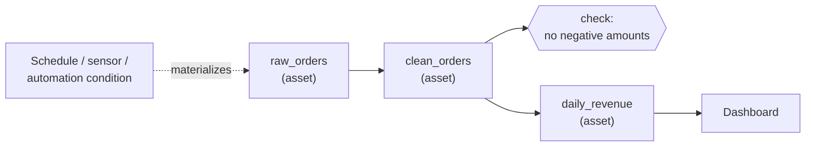

# Dagster
> An orchestrator built around data assets: you declare the tables and files you want to exist, and Dagster works out how to build, schedule and monitor them.

**Prerequisites:** [Python for DE](../00-foundations/python-reference.md) · [Apache Airflow](airflow-reference.md) (for the comparison)

**Related:** [dbt](../02-processing/dbt-reference.md) · [Data Quality](../05-quality-governance/data-quality.md) · [Prefect](prefect-reference.md) · [Glossary](../99-reference/glossary.md)

---

## Overview

**Challenge:** Task-based orchestrators describe *what to run*: "run A, then B, then C". They know little about *what the pipeline produces*. When a dashboard is wrong you have to work backwards from a failed task to the table it should have written, and to what depends on that table.

**Solution:** Dagster models the **assets** (tables, files, ML models) a pipeline produces, and the dependencies between them. A function decorated with `@asset` says how to build one asset. Dagster derives the graph from the function arguments, then adds scheduling, partitioning, data quality checks, lineage and a UI on top of that asset graph.



**Relevance to data engineering:** Analytics pipelines are naturally asset-shaped: a raw table, cleaned tables, marts, reports. Dagster's model matches that shape, and it integrates closely with dbt, where each dbt model becomes an asset in the same graph.

---

**On this page**

**Basic**
- [Installation and First Assets](#installation-and-first-assets)
- [Running and the UI](#running-and-the-ui)
- [Assets vs Tasks](#assets-vs-tasks)

**Intermediate**
- [Resources](#resources)
- [Asset Checks](#asset-checks)
- [Partitions](#partitions)
- [Schedules, Sensors and Automation](#schedules-sensors-and-automation)

**Advanced**
- [dbt Integration](#dbt-integration)
- [Project Layout and Environments](#project-layout-and-environments)
- [Testing](#testing)
- [Dagster vs Airflow vs Prefect](#dagster-vs-airflow-vs-prefect)

**Reference**
- [Common Pitfalls](#common-pitfalls)
- [Cheat Sheet](#cheat-sheet)
- [Interview Questions](#interview-questions)
- [Further Reading](#further-reading)

---

## Installation and First Assets

```bash
pip install dagster dagster-webserver
```

An asset is a Python function. Its **name** is the asset key, and its **parameters** name the upstream assets it reads:

```python
import dagster as dg
import pandas as pd


@dg.asset
def raw_orders() -> pd.DataFrame:
    return pd.DataFrame({"order_id": [1, 2, 2, 3], "amount": [10.0, 20.0, 20.0, -5.0]})


@dg.asset(description="Orders with duplicates removed")
def clean_orders(raw_orders: pd.DataFrame) -> pd.DataFrame:      # depends on raw_orders
    return raw_orders.drop_duplicates("order_id")


@dg.asset
def daily_revenue(context: dg.AssetExecutionContext, clean_orders: pd.DataFrame) -> dg.MaterializeResult:
    total = float(clean_orders["amount"].sum())
    context.log.info(f"revenue={total}")
    return dg.MaterializeResult(metadata={"revenue": total, "rows": len(clean_orders)})   # shown in the UI


defs = dg.Definitions(assets=[raw_orders, clean_orders, daily_revenue])
```

`Definitions` is the single object Dagster loads: every asset, schedule, sensor and resource is registered on it.

By default the value returned by an asset is stored by an **I/O manager** (local pickle files unless you configure another). In real pipelines assets usually write to a warehouse or lake themselves and return nothing, using `deps=[...]` to declare dependencies without passing data:

```python
@dg.asset(deps=[raw_orders])
def orders_table() -> None:
    ...   # run SQL that reads the raw table and writes the new one
```

---

## Running and the UI

```bash
dagster dev -f pipeline.py        # UI at http://localhost:3000
```

In the UI you see the asset graph, click **Materialize** to build assets, and inspect each run's logs, metadata and lineage. Programmatically:

```python
result = dg.materialize([raw_orders, clean_orders, daily_revenue])
assert result.success
```

**Materialize** is Dagster's word for "run the code that produces this asset and record the result". Each materialization is stored as an event with its metadata, so you can see when an asset last changed and what its row count was.

---

## Assets vs Tasks

| Airflow / task view | Dagster / asset view |
|---------------------|----------------------|
| A DAG is a set of tasks | A graph is a set of assets |
| "Task `load_orders` succeeded" | "Table `orders` was updated at 06:02, 12,431 rows" |
| Dependencies are between tasks | Dependencies are between data the code produces |
| Backfill = rerun a date range of the DAG | Backfill = rematerialize a range of partitions of an asset |
| Data quality lives in separate tasks | Checks are attached to the asset they validate |

If you prefer explicit tasks, Dagster also has **ops** and **jobs**, but for data pipelines assets are the recommended model.

---

## Resources

**Resources** are shared, configurable connections (a warehouse, an API client). Assets ask for one by naming it as a parameter with its type, so code stays free of credentials and easy to test.

```python
import dagster as dg
import duckdb


class Warehouse(dg.ConfigurableResource):
    path: str = ":memory:"

    def query(self, sql: str):
        return duckdb.connect(self.path).sql(sql).fetchall()


@dg.asset
def order_count(warehouse: Warehouse) -> dg.MaterializeResult:
    (n,), = warehouse.query("SELECT 42")
    return dg.MaterializeResult(metadata={"row_count": n})


defs = dg.Definitions(
    assets=[order_count],
    resources={"warehouse": Warehouse(path="shop.duckdb")},
)
```

Read secrets from the environment with `dg.EnvVar("SNOWFLAKE_PASSWORD")` as a resource field. The value is resolved at run time and is never stored in the code or the definition.

---

## Asset Checks

An **asset check** validates an asset after it is built, and records pass or fail next to the asset in the UI.

```python
@dg.asset_check(asset=clean_orders)
def no_negative_amounts(clean_orders: pd.DataFrame) -> dg.AssetCheckResult:
    bad = int((clean_orders["amount"] < 0).sum())
    return dg.AssetCheckResult(passed=bad == 0, metadata={"negative_rows": bad})


defs = dg.Definitions(
    assets=[raw_orders, clean_orders],
    asset_checks=[no_negative_amounts],
)
```

By default a failed check is reported but downstream assets still run. Add `blocking=True` (`@dg.asset_check(asset=..., blocking=True)`) to stop downstream assets when the check fails. That is the **quality gate** pattern: bad data never reaches the mart. Dagster also has built-in freshness checks (`dg.build_last_update_freshness_checks`) that alert when an asset has not been updated within an expected window. See [Data Quality](../05-quality-governance/data-quality.md) for what to check.

---

## Partitions

A **partition** is a slice of an asset, most often one day. Partitioned assets make backfills and reruns precise: rebuild only the days that were wrong.

```python
daily = dg.DailyPartitionsDefinition(start_date="2024-03-01")


@dg.asset(partitions_def=daily)
def orders_by_day(context: dg.AssetExecutionContext) -> None:
    day = context.partition_key                  # "2024-03-05"
    context.log.info(f"loading orders for {day}")
    # DELETE the day's rows, then INSERT them: rerunning gives the same result
```

In the UI, choose a range of partitions and **Materialize** to run a backfill. Programmatically: `dg.materialize([orders_by_day], partition_key="2024-03-05")`. Keep the load **idempotent** by replacing the partition's rows, so a rerun never duplicates data. Other partition types: weekly, monthly, static (a list such as regions), and multi-dimensional (`dg.MultiPartitionsDefinition`).

---

## Schedules, Sensors and Automation

Three ways to trigger materialization:

```python
job = dg.define_asset_job("nightly", selection=dg.AssetSelection.assets(raw_orders, clean_orders, daily_revenue))

# 1. Schedule: time-based
schedule = dg.ScheduleDefinition(job=job, cron_schedule="0 6 * * *")


# 2. Sensor: event-based (a file lands, an upstream system finishes)
@dg.sensor(job=job, minimum_interval_seconds=60)
def new_file_sensor(context: dg.SensorEvaluationContext):
    if new_file_exists():                        # your check, e.g. list an S3 prefix
        yield dg.RunRequest(run_key="file-2024-03-15")   # run_key prevents duplicate runs


# 3. Automation condition: declarative, per asset
@dg.asset(deps=[raw_orders], automation_condition=dg.AutomationCondition.eager())
def orders_summary() -> None:
    ...                                          # runs whenever an upstream asset updates
```

Use a **schedule** when you know when, a **sensor** when something outside Dagster tells you when, and an **automation condition** when "whenever my inputs change" is the real requirement. The default `eager()` condition reruns an asset after any upstream update. `run_failure_sensor` reports failed runs to Slack or PagerDuty.

---

## dbt Integration

`dagster-dbt` turns each dbt model into an asset, so dbt and Python assets share one graph and one lineage view.

```python
from pathlib import Path

import dagster as dg
from dagster_dbt import DbtCliResource, DbtProject, dbt_assets

project = DbtProject(project_dir=Path("shop_dbt"))
project.prepare_if_dev()                         # builds the manifest during dagster dev


@dbt_assets(manifest=project.manifest_path)
def shop_models(context: dg.AssetExecutionContext, dbt: DbtCliResource):
    yield from dbt.cli(["build"], context=context).stream()


defs = dg.Definitions(
    assets=[shop_models],
    resources={"dbt": DbtCliResource(project_dir=project)},
)
```

dbt tests appear as asset checks. Python assets that load the raw data can be upstream of the dbt sources, giving an ingest → transform → publish graph in one place. See [dbt](../02-processing/dbt-reference.md).

---

## Project Layout and Environments

As a project grows, move from one file to a package. `dg scaffold` creates the structure; a typical result looks like this:

```
my_pipeline/
├── pyproject.toml
├── src/my_pipeline/
│   ├── definitions.py          # dg.Definitions
│   └── defs/
│       ├── ingestion/          # assets, one module per area
│       ├── transform/
│       └── resources.py
└── tests/
```

| Concern | Approach |
|---------|----------|
| Dev vs prod | Same code, different resources: `resources = prod_resources if env == "prod" else dev_resources` |
| Secrets | `dg.EnvVar`, injected by your deployment platform |
| Deployment | Dagster+ (managed), or self-hosted with Docker or Kubernetes. Run the webserver, the daemon (schedules and sensors) and a code location |
| Storage | A Postgres instance for run and event history in production (the default SQLite is for local work) |

Remember that schedules and sensors only fire if the **daemon** is running. `dagster dev` starts it for you locally.

---

## Testing

Assets are plain Python functions, so test them directly, or run a small graph in memory:

```python
def test_clean_orders_deduplicates():
    raw = pd.DataFrame({"order_id": [1, 1], "amount": [5.0, 5.0]})
    assert len(clean_orders(raw)) == 1                       # call the function directly


def test_pipeline_runs():
    result = dg.materialize([raw_orders, clean_orders, daily_revenue])
    assert result.success
    assert result.asset_materializations_for_node("daily_revenue")[0].metadata["rows"].value == 3
```

Pass fake resources with `dg.materialize([...], resources={"warehouse": Warehouse(path=":memory:")})`. Run these in CI on every pull request.

---

## Dagster vs Airflow vs Prefect

| | Dagster | Airflow | Prefect |
|--|---------|---------|---------|
| **Core model** | Assets (data produced) | Tasks in DAGs | Flows and tasks (Python functions) |
| **Lineage** | Built in, at asset level | Via datasets/assets and OpenLineage | Limited natively |
| **Data quality** | Asset checks | Separate tasks or providers | Separate tasks |
| **Local dev** | Very good (`dagster dev`, in-process tests) | Heavier (scheduler, DB, webserver) | Very good |
| **Ecosystem and community** | Growing, strong dbt story | Largest by far | Growing |
| **Choose when** | Analytics platforms built on tables and dbt | You need the widest operator library, or your team already runs it | Event-driven Python workflows with little ceremony |

See [Apache Airflow](airflow-reference.md) and [Prefect](prefect-reference.md).

---

## Common Pitfalls

| Pitfall | Symptom | Fix |
|---------|---------|-----|
| Returning big DataFrames through the default I/O manager | Slow runs, huge pickle files, out-of-memory errors | Write to the warehouse or lake inside the asset, return metadata, and pass dependencies with `deps=[...]` |
| Non-idempotent partition loads | Duplicates after a backfill or rerun | Replace the partition's rows (delete then insert, or `MERGE`) |
| Checks that are not blocking | Bad data flows into the marts while the check shows red | Use `blocking=True` on checks that must stop downstream assets |
| Schedule created but nothing runs | The schedule shows as stopped, or never fires | Turn the schedule on in the UI, and run the daemon in production |
| Secrets in code | Credentials in Git history | Use `dg.EnvVar` and the deployment's secret store |
| Everything in one giant module | Slow loads, merge conflicts | Split assets into a package with one module per domain |
| Sensors that re-trigger on the same event | Duplicate runs | Set a stable `run_key` on every `RunRequest`, and keep a cursor |

---

## Cheat Sheet

| Task | Code / Command |
|------|----------------|
| Define an asset | `@dg.asset` on a function; parameters name upstream assets |
| Dependency without data | `@dg.asset(deps=[other_asset])` |
| Register everything | `dg.Definitions(assets=[...], resources={...}, schedules=[...])` |
| Run the UI | `dagster dev -f file.py` |
| Run in code | `dg.materialize([a, b])` |
| Resource | class extending `dg.ConfigurableResource`, requested by parameter |
| Check | `@dg.asset_check(asset=a, blocking=True)` returning `dg.AssetCheckResult` |
| Daily partitions | `dg.DailyPartitionsDefinition(start_date="2024-03-01")` |
| Job | `dg.define_asset_job("name", selection=...)` |
| Schedule | `dg.ScheduleDefinition(job=job, cron_schedule="0 6 * * *")` |
| Sensor | `@dg.sensor(job=job)` yielding `dg.RunRequest(run_key=...)` |
| Metadata | `dg.MaterializeResult(metadata={...})` |

---

## Interview Questions

**Q: What is a software-defined asset and why does it matter?**
A: It is a declaration that a table, file or model should exist, together with the code that builds it and its dependencies on other assets. That makes the orchestrator aware of the data itself, not just of tasks. You get lineage, a per-asset freshness and quality status, partition-level backfills and the ability to answer "what is stale, and what depends on it?".

**Q: How do you build a quality gate in Dagster?**
A: Attach a blocking asset check to the asset. If the check fails, downstream assets are not materialized in that run, so a bad load stops before it reaches a mart. Non-blocking checks are still recorded and alert, but they do not stop the graph.

**Q: How would you backfill three months of data?**
A: Partition the asset by day and select the date range in the UI, or launch a backfill from the CLI or API. Each partition is a separate run with its own `partition_key`, so failures are isolated, and the loads must be idempotent so reruns don't duplicate data.

**Q: When would you pick Dagster over Airflow?**
A: When the platform is table-centric and uses dbt, and the team values lineage, local testing and asset-level status. I would keep Airflow when the organization already runs it at scale, or when I need one of its many provider integrations. Both can coexist: Dagster can also observe assets produced by external systems.

**Q: What is the difference between a schedule, a sensor and an automation condition?**
A: A schedule fires on a cron. A sensor polls something external and yields run requests, using `run_key` to avoid duplicates. An automation condition is declared on an asset and evaluated by Dagster, for example "run when any upstream asset updates".

---

## Further Reading

- [Dagster documentation](https://docs.dagster.io/)
- [Dagster Essentials course](https://courses.dagster.io/): free, hands-on
- [Assets concept guide](https://docs.dagster.io/guides/build/assets)
- [dagster-dbt integration](https://docs.dagster.io/integrations/libraries/dbt)
- [Testing assets](https://docs.dagster.io/guides/test)

---

**Previous:** [Apache Airflow](airflow-reference.md) · **Next:** [Prefect](prefect-reference.md) · **Back to:** [Index](../README.md)
