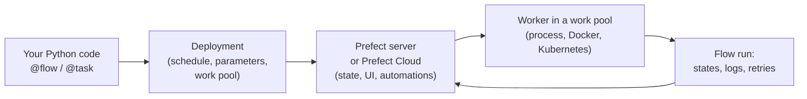

# Prefect
> A Python-first workflow orchestrator: add `@flow` and `@task` to ordinary functions and get retries, scheduling, observability and event-driven runs.

**Prerequisites:** [Python for DE](../00-foundations/python-reference.md) · [Apache Airflow](airflow-reference.md)

**Related:** [Dagster](dagster-reference.md) · [Docker](../06-infrastructure/docker-reference.md) · [Data Ingestion & CDC](../02-processing/ingestion-cdc.md) · [Glossary](../99-reference/glossary.md)

---

## Overview

**Challenge:** Most pipelines start as a Python script. As they grow you need retries when an API blips, a schedule, visibility into failures, parameters, and a way to run the same code on different machines, without rewriting the script into a framework's DAG syntax.

**Solution:** Prefect keeps your code as normal Python. A function decorated with `@flow` becomes a tracked, observable run, and `@task` marks the units inside it that need retries, caching or concurrency. Control flow is plain Python (`if`, `for`, `try`), not a graph definition, so dynamic pipelines are natural.



**Relevance to data engineering:** Prefect fits ingestion jobs, API pulls, ML and reverse-ETL workflows, and glue between systems, where the logic is Python and events matter more than a fixed nightly DAG.

---

**On this page**

**Basic**
- [Flows and Tasks](#flows-and-tasks)
- [Retries, Timeouts and Logging](#retries-timeouts-and-logging)
- [Running Locally](#running-locally)

**Intermediate**
- [Parameters and Dynamic Workflows](#parameters-and-dynamic-workflows)
- [Concurrency](#concurrency)
- [Caching and Results](#caching-and-results)
- [Deployments and Schedules](#deployments-and-schedules)

**Advanced**
- [Work Pools and Workers](#work-pools-and-workers)
- [Blocks, Variables and Secrets](#blocks-variables-and-secrets)
- [Automations and Events](#automations-and-events)
- [Testing](#testing)
- [Prefect vs Airflow vs Dagster](#prefect-vs-airflow-vs-dagster)

**Reference**
- [Common Pitfalls](#common-pitfalls)
- [Cheat Sheet](#cheat-sheet)
- [Interview Questions](#interview-questions)
- [Further Reading](#further-reading)

---

## Flows and Tasks

```bash
pip install prefect
```

```python
from prefect import flow, task, get_run_logger


@task
def extract(day: str) -> list[dict]:
    return [{"order_id": 1, "amount": 10.0}, {"order_id": 1, "amount": 10.0}, {"order_id": 2, "amount": 5.0}]


@task
def transform(rows: list[dict]) -> list[dict]:
    return list({r["order_id"]: r for r in rows}.values())          # deduplicate by key


@task
def load(rows: list[dict]) -> int:
    get_run_logger().info(f"loaded {len(rows)} rows")
    return len(rows)


@flow(name="orders-daily", log_prints=True)
def orders_daily(day: str = "2024-03-15") -> int:
    rows = extract(day)
    n = load(transform(rows))
    print(f"loaded {n} rows for {day}")
    return n


if __name__ == "__main__":
    orders_daily()
```

Run it with `python orders.py`. Prefect starts a temporary local server, records the flow and task runs and their states (`Pending`, `Running`, `Completed`, `Failed`, `Retrying`, ...), and prints them.

| Piece | Role |
|-------|------|
| **Flow** | The unit you run, schedule and observe. Entry point of a workflow |
| **Task** | A step inside a flow. Adds retries, caching, timeouts and its own state |
| **Flow run / task run** | One execution, with a state history and logs |
| **State** | Where a run is: `Completed`, `Failed`, `Cancelled`, `Crashed`... Your code can react to it |

A flow can call other flows (**subflows**), which is how you compose large pipelines from testable pieces.

---

## Retries, Timeouts and Logging

```python
@task(retries=3, retry_delay_seconds=[1, 2, 4], timeout_seconds=30)
def extract(day: str) -> list[dict]:
    ...        # a transient failure is retried after 1 s, 2 s, then 4 s
```

- Set retries on the tasks that touch **flaky things**: APIs, networks, shared databases. Do not retry non-idempotent work such as an unguarded `INSERT`.
- `retry_delay_seconds` accepts a list for backoff. `retry_jitter_factor` adds randomness so many retries do not hit a server at the same moment.
- Flows have `retries` too, for re-running the whole workflow.
- `get_run_logger()` sends logs to the run in the UI, and `log_prints=True` captures `print` output.
- **Timeouts and blocking calls:** a `timeout_seconds` on a synchronous task cannot interrupt a blocking call (a network request, `time.sleep`) in a worker thread. Use an async task, or set timeouts on the underlying client (for example `httpx.Client(timeout=10)`).

---

## Running Locally

```bash
prefect server start          # UI at http://127.0.0.1:4200
export PREFECT_API_URL=http://127.0.0.1:4200/api      # point runs at that server
python orders.py
```

Without a server running, Prefect uses a temporary one per run, which is fine for trying things. Use the local server when you want to browse flow runs in the UI. For a hosted control plane, log in to Prefect Cloud (`prefect cloud login`).

---

## Parameters and Dynamic Workflows

Flow parameters are type-validated, so a schedule or a UI run can pass `day="2024-03-16"` and Prefect checks it against your annotations.

Because the workflow is plain Python, loops and conditions need no special syntax:

```python
@flow
def load_all(days: list[str]):
    for day in days:
        if day_has_data(day):              # any Python condition
            orders_daily(day)              # call a flow like a function (a subflow)
```

Use `.map()` to fan a task out over a list, running the copies concurrently:

```python
@flow
def extract_many(days: list[str]):
    futures = extract.map(days)                       # one task run per day
    return [f.result() for f in futures]
```

---

## Concurrency

Tasks called with `.submit()` or `.map()` return **futures** and run on a task runner (a thread pool by default), so independent tasks overlap.

```python
@flow
def parallel(days: list[str]):
    futures = [extract.submit(d) for d in days]       # start all
    results = [f.result() for f in futures]           # wait for all
```

Limit pressure on a shared system with a **global concurrency limit**: create it once, then hold a slot while touching the resource.

```bash
prefect gcl create warehouse --limit 5          # at most five holders at any time, across all runs
```

```python
from prefect import task
from prefect.concurrency.sync import concurrency


@task
def load_partition(day: str) -> None:
    with concurrency("warehouse", occupy=1):     # waits here if five loads are already running
        ...                                      # write to the warehouse
```

If the limit named in `concurrency(...)` does not exist, Prefect logs a warning and skips the acquisition, so create the limit before you rely on it.

For CPU-bound work, use a process-based task runner (`prefect-dask`, `prefect-ray`) or push the work to Spark or a warehouse rather than a thread pool.

---

## Caching and Results

Caching skips a task when its inputs have not changed since a previous run.

```python
from datetime import timedelta

from prefect import task
from prefect.cache_policies import INPUTS


@task(cache_policy=INPUTS, cache_expiration=timedelta(hours=6), persist_result=True)
def fetch_reference_data(country: str) -> dict:
    ...        # an expensive call that is fine to reuse for six hours
```

`persist_result=True` stores the task result (locally or in remote storage) so a retry or a later run can reuse it. Persisted results can contain sensitive data, so set the storage location deliberately.

---

## Deployments and Schedules

A **deployment** turns a flow into something Prefect can run remotely on a schedule, or on demand from the UI or API. The simplest way, useful for a single machine or container, is `serve`:

```python
if __name__ == "__main__":
    orders_daily.serve(name="orders-daily-6am", cron="0 6 * * *", parameters={"day": "2024-03-15"})
```

This starts a long-running process that creates the deployment and runs scheduled flow runs itself. For production you usually want the code pulled from Git and run on infrastructure Prefect provisions:

```python
from prefect import flow

flow.from_source(
    source="https://github.com/your-org/your-repo.git",
    entrypoint="flows/orders.py:orders_daily",
).deploy(
    name="orders-daily",
    work_pool_name="docker-pool",
    cron="0 6 * * *",
)
```

Or declare it in a `prefect.yaml` file and run `prefect deploy`. Schedules can be cron, interval or RRule.

---

## Work Pools and Workers

A **work pool** is a queue of flow runs with a defined infrastructure type. A **worker** is a small process you run in your own environment that polls the pool and starts each run there.

| Pool type | Runs flows as |
|-----------|---------------|
| `process` | Subprocesses on the worker's machine |
| `docker` | Containers |
| `kubernetes` | Kubernetes jobs |
| Serverless (ECS, Cloud Run, Azure Container Instances) | Serverless containers |

```bash
prefect work-pool create docker-pool --type docker
prefect worker start --pool docker-pool
```

This split matters for security: **your code and data stay in your infrastructure**. The control plane only stores metadata about runs.

---

## Blocks, Variables and Secrets

| Object | Use |
|--------|-----|
| **Variable** | Non-secret configuration, such as a bucket name or a feature flag: `Variable.get("bucket")` |
| **Secret block** | An encrypted credential: `Secret.load("warehouse-password").get()` |
| **Blocks** | Saved, reusable configuration objects (a database connection, a cloud storage location) in the UI or code |
| **Environment variables** | Configuration read by the worker environment. Preferred for deployment-specific settings |

Never hard-code credentials in the flow or `prefect.yaml`. Load them from a secret block or the environment at run time.

---

## Automations and Events

Prefect emits an **event** for every state change and can receive custom ones. **Automations** trigger actions when an event pattern occurs, for example:

- If a flow run of `orders-daily` ends in `Failed`, send a Slack message.
- If an expected flow has not run within 25 hours, alert (a "missing run" trigger).
- When a webhook arrives, start a deployment.

This is what makes Prefect event-driven: pipelines can start on "a file landed" or "an upstream system finished" rather than only on a clock. Notifications on failure are usually the first automation to set up.

---

## Testing

Flows and tasks are ordinary functions, so test the logic without an orchestrator:

```python
def test_transform_deduplicates():
    rows = [{"order_id": 1}, {"order_id": 1}, {"order_id": 2}]
    assert len(transform.fn(rows)) == 2          # .fn runs the underlying function without Prefect


def test_flow_runs():
    assert orders_daily("2024-03-15") == 2       # calling the flow runs it for real
```

Use `prefect.testing.utilities.prefect_test_harness` as a fixture to run flows against a throwaway local database, so tests do not touch your real server.

---

## Prefect vs Airflow vs Dagster

| | Prefect | Airflow | Dagster |
|--|---------|---------|---------|
| **Style** | Python functions with decorators, dynamic control flow | Static DAG definitions (dynamic with mapping) | Declarative assets |
| **Best at** | Event-driven and dynamic Python workflows, quick start | Broad integrations, mature scheduling at large scale | Table and dbt centred platforms with lineage |
| **Scheduling** | Deployments with cron, interval, RRule, and events | Cron, datasets/assets, timetables | Schedules, sensors, automation conditions |
| **Runs on** | Your infrastructure via workers, control plane hosted or self-hosted | You operate scheduler, workers and metadata DB (or a managed service) | Dagster+ or self-hosted |
| **Learning curve** | Lowest | Highest | Medium |

See [Apache Airflow](airflow-reference.md) and [Dagster](dagster-reference.md).

---

## Common Pitfalls

| Pitfall | Symptom | Fix |
|---------|---------|-----|
| Retrying a non-idempotent task | Duplicate rows after a retry | Make the load idempotent (`MERGE`, delete-then-insert) before adding retries |
| `timeout_seconds` on a blocking sync task | Task runs far past its timeout | Set timeouts on the client, or use an async task |
| Passing large data between tasks | Slow runs, high memory | Write to storage and pass a path or table name |
| Forgetting `.result()` on futures | Task runs still in progress when the flow ends, or wrong values | Call `.result()` (or `wait`) on every future you depend on |
| Flow works locally, fails in the work pool | Missing packages or credentials in the run environment | Bake dependencies into the image, and read secrets from the environment or blocks |
| Not running a worker | Scheduled runs sit in `Late` | Start and monitor a worker for each pool |
| No failure notification | Failures found days later | Add an automation for failed and missing runs |
| Everything in one giant flow | Hard to retry or test | Split into subflows and tasks with a clear boundary |

---

## Cheat Sheet

| Task | Command / Syntax |
|------|------------------|
| Flow / task | `@flow`, `@task` |
| Retries | `@task(retries=3, retry_delay_seconds=[1, 2, 4])` |
| Run in parallel | `task.submit(x)`, `task.map(xs)`, `future.result()` |
| Local UI | `prefect server start` |
| Serve on a schedule | `flow.serve(name="x", cron="0 6 * * *")` |
| Deploy from Git | `flow.from_source(url, entrypoint="f.py:flow").deploy(name=..., work_pool_name=...)` |
| Create a pool | `prefect work-pool create my-pool --type docker` |
| Start a worker | `prefect worker start --pool my-pool` |
| Run a deployment | `prefect deployment run "orders-daily/orders-daily"` |
| Limit concurrency | `prefect gcl create warehouse --limit 5`, then `with concurrency("warehouse"):` |
| Unit test a task | `my_task.fn(args)` |

---

## Interview Questions

**Q: How is Prefect different from Airflow?**
A: Airflow expects a static DAG of operators that a scheduler parses. Prefect runs your Python function and observes it, so loops, conditions and dynamic fan-out are plain code. Airflow has a far bigger operator ecosystem and is entrenched at many companies. Prefect is faster to start with and better for event-driven and dynamic workflows.

**Q: What are work pools and workers?**
A: A work pool is a queue of runs bound to an infrastructure type (process, Docker, Kubernetes, serverless). A worker is a process in your environment that polls a pool and launches the runs. Code and data stay on your infrastructure; the control plane only holds metadata and schedules.

**Q: How do you make a Prefect pipeline reliable?**
A: Make each task idempotent so retries are safe, add retries with backoff on the flaky calls, keep large data out of task results, alert on failed and missing runs with automations, and cover the logic with unit tests via `.fn`. Then use deployments with a Git source so what runs in production is the reviewed code.

**Q: How would you run tasks concurrently?**
A: Use `.submit()` or `.map()` to get futures on the task runner, then collect with `.result()`. For a shared resource such as a database, add a global concurrency limit, and for CPU-heavy work use a Dask or Ray runner or push the work to an engine built for it.

---

## Further Reading

- [Prefect documentation](https://docs.prefect.io/v3/get-started)
- [Write and run workflows](https://docs.prefect.io/v3/how-to-guides/workflows/write-and-run)
- [Deploy flows](https://docs.prefect.io/v3/how-to-guides/deployments/create-deployments)
- [Work pools](https://docs.prefect.io/v3/concepts/work-pools)
- [Prefect Cloud automations](https://docs.prefect.io/v3/concepts/automations)

---

**Previous:** [Dagster](dagster-reference.md) · **Next:** [DuckDB & Polars](../02-processing/duckdb-polars.md) · **Back to:** [Index](../README.md)
