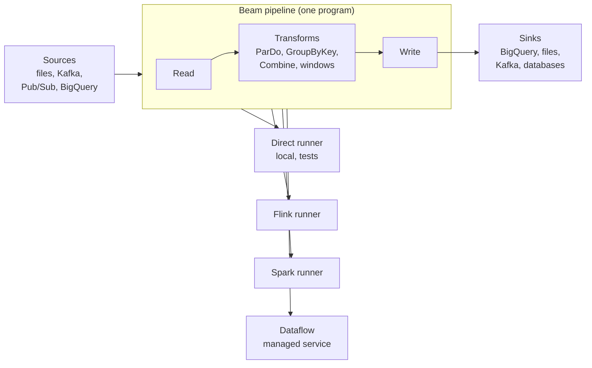

# Apache Beam and Google Cloud Dataflow
> One programming model for batch and streaming pipelines that runs on several engines, and Dataflow, Google Cloud's managed service for running it.

**Prerequisites:** [Python for DE](../00-foundations/python-reference.md) · [DE Concepts](../00-foundations/de-concepts.md) · [Kafka](kafka-reference.md)

**Related:** [Apache Flink](flink-reference.md) · [PySpark](../02-processing/pyspark-reference.md) · [BigQuery](../01-storage/bigquery-reference.md) · [Testing and CI/CD](../06-infrastructure/testing-cicd.md) · [Glossary](../99-reference/glossary.md)

---

## Overview

**Challenge:** Batch and streaming used to mean two systems and two codebases. A team wrote a batch job in one framework to process history and a streaming job in another for fresh data, and then spent effort keeping the two consistent. Code written for one engine also could not move to another without a rewrite.

**Solution:** Apache Beam is an open-source programming model with SDKs for Python, Java and Go. You describe a pipeline once, as transformations over collections of data that may be bounded (a file) or unbounded (a stream), and a **runner** executes it on an engine such as Apache Flink, Apache Spark or Google Cloud Dataflow. The model's central idea is that time is explicit: every element has an **event time**, and you say how to group elements into **windows** and when to emit results, so the same logic covers batch and streaming.



**Relevance to data engineering:** Beam is the model behind Dataflow, which is widely used on Google Cloud, and its concepts (event time, watermarks, triggers, allowed lateness) are the vocabulary of stream processing generally, and they appear in the [Flink](flink-reference.md) and Spark Structured Streaming guides. Learning them in Beam, where they are explicit, makes the other engines easier to reason about.

---

**On this page**

**Basic**
- [The Beam Model](#the-beam-model)
- [Your First Pipeline](#your-first-pipeline)
- [Transforms: ParDo, DoFn and Composites](#transforms-pardo-dofn-and-composites)
- [Running a Pipeline](#running-a-pipeline)

**Intermediate**
- [Event Time, Windows and Triggers](#event-time-windows-and-triggers)
- [Late Data and Accumulation Modes](#late-data-and-accumulation-modes)
- [Joins and Side Inputs](#joins-and-side-inputs)
- [Testing Pipelines](#testing-pipelines)

**Advanced**
- [I/O Connectors and Cross-Language Transforms](#io-connectors-and-cross-language-transforms)
- [Runners and Portability](#runners-and-portability)
- [Google Cloud Dataflow](#google-cloud-dataflow)
- [State and Timers](#state-and-timers)
- [Choosing Between Beam and Other Engines](#choosing-between-beam-and-other-engines)

**Reference**
- [Common Pitfalls](#common-pitfalls)
- [Cheat Sheet](#cheat-sheet)
- [Interview Questions](#interview-questions)
- [Further Reading](#further-reading)

---

## The Beam Model

Four abstractions make up the model.

| Term | Meaning |
|------|---------|
| **Pipeline** | The whole data processing task, from reading to writing |
| **PCollection** | A distributed dataset that the pipeline operates on. It is **bounded** if it comes from a fixed source such as a file, or **unbounded** if it comes from a continuously updating source such as a stream |
| **PTransform** | A processing step. It takes one or more PCollections, applies your function to their elements, and produces zero or more PCollections |
| **Runner** | The engine that executes the pipeline. The runner builds the execution graph from your PCollections and transforms |

A PCollection is **immutable** and **distributed**: you never modify one, you apply a transform to produce a new one, and you cannot index into it or assume an order. A pipeline is therefore a graph, and the runner decides how to split, order and parallelise it.

The core transforms:

| Transform | Purpose | Python |
|-----------|---------|--------|
| **ParDo** | Apply your code to each element in parallel | `beam.ParDo(DoFn)` (or `beam.Map`, `beam.FlatMap`) |
| **GroupByKey** | Group `(key, value)` pairs by key | `beam.GroupByKey()` |
| **CoGroupByKey** | Join several keyed collections on their keys | `beam.CoGroupByKey()` |
| **Combine** | Reduce with an associative and commutative operation | `beam.CombineGlobally(fn)`, `beam.CombinePerKey(fn)` |
| **Flatten** | Merge several collections into one | `beam.Flatten()` |
| **Partition** | Split one collection into several | `beam.Partition(fn, n)` |

Prefer `Combine` to `GroupByKey` followed by a manual reduction. Because the operation is associative, runners can pre-combine on each worker before shuffling, which moves far less data.

---

## Your First Pipeline

Install the SDK and write a test that counts words. `TestPipeline` runs the pipeline in-process, and `assert_that` checks the contents of a PCollection.

```bash
pip install apache-beam pytest
```

```python
# tests/test_batch.py
import apache_beam as beam
from apache_beam.testing.test_pipeline import TestPipeline
from apache_beam.testing.util import assert_that, equal_to


def test_word_count():
    with TestPipeline() as p:
        out = (
            p
            | beam.Create(["a b a", "b c"])
            | beam.FlatMap(str.split)
            | beam.combiners.Count.PerElement()
        )
        assert_that(out, equal_to([("a", 2), ("b", 2), ("c", 1)]))
```

The `|` operator applies a transform. The `with` block builds the graph and runs it when it exits. The assertion is itself part of the graph, so it runs when the pipeline executes. The same pipeline, with a file source and a real runner, is a production job. Nothing in the pipeline code names the engine.

---

## Transforms: ParDo, DoFn and Composites

`ParDo` applies a `DoFn`, a class whose `process` method receives one element and yields zero or more outputs. A `DoFn` can also emit to **tagged outputs**, which is the standard way to build a dead-letter path: bad records are diverted, not allowed to fail the job.

```python
# pipeline/transforms.py
import apache_beam as beam


class ParseOrder(beam.DoFn):
    """Parse 'user,amount' lines. Bad lines go to a dead-letter output instead of failing the job."""

    DEAD_LETTER = "dead_letter"

    def process(self, line):
        try:
            user, amount = line.split(",")
            yield user.strip(), float(amount)
        except ValueError:
            yield beam.pvalue.TaggedOutput(self.DEAD_LETTER, line)


class RevenuePerUser(beam.PTransform):
    """A composite transform: parse, then sum per user. Bad lines are returned separately."""

    def expand(self, lines):
        parsed = lines | beam.ParDo(ParseOrder()).with_outputs(
            ParseOrder.DEAD_LETTER, main="parsed"
        )
        totals = parsed.parsed | beam.CombinePerKey(sum)
        return {"totals": totals, "dead_letter": parsed[ParseOrder.DEAD_LETTER]}
```

`RevenuePerUser` is a **composite transform**: a `PTransform` whose `expand` method wires other transforms together. Composites give a pipeline named, reusable, testable building blocks. They also show up as single nodes in a runner's monitoring graph.

Rules for the code inside a `DoFn`:

- **It must be safe to run more than once.** Runners retry failed bundles, and a bundle may run twice, so a side effect such as an API call or a database insert has to be idempotent. See [Testing and CI/CD](../06-infrastructure/testing-cicd.md#testing-idempotency-and-backfills).
- **Do not depend on order or share mutable state between elements.** Elements are processed in parallel, on different workers.
- **Set up expensive resources once,** in `setup` (per DoFn instance) or `start_bundle`, not in `process`.

A `DoFn` is plain Python, so you can unit-test it without a pipeline:

```python
def test_parse_order_unit():
    # A DoFn can be tested as a plain Python object, with no pipeline
    fn = ParseOrder()
    assert list(fn.process("ana, 12.5")) == [("ana", 12.5)]
    (bad,) = list(fn.process("not-a-valid-line"))
    assert bad.tag == ParseOrder.DEAD_LETTER and bad.value == "not-a-valid-line"
```

---

## Running a Pipeline

A pipeline script reads its arguments, builds `PipelineOptions` from those Beam itself understands, and runs. Your own arguments are parsed first and the rest are passed to Beam, so `--runner` and other Beam flags work unchanged.

```python
# run_orders.py
import argparse

import apache_beam as beam
from apache_beam.options.pipeline_options import PipelineOptions

from pipeline.transforms import RevenuePerUser


def run(argv=None):
    parser = argparse.ArgumentParser()
    parser.add_argument("--input", required=True)
    parser.add_argument("--output", required=True)
    known_args, pipeline_args = parser.parse_known_args(argv)

    with beam.Pipeline(options=PipelineOptions(pipeline_args)) as p:
        result = (
            p
            | "Read" >> beam.io.ReadFromText(known_args.input)
            | "Revenue" >> RevenuePerUser()
        )
        (
            result["totals"]
            | "Format" >> beam.MapTuple(lambda user, total: f"{user},{total:.2f}")
            | "Write" >> beam.io.WriteToText(known_args.output, file_name_suffix=".csv")
        )
        (
            result["dead_letter"]
            | "WriteDead" >> beam.io.WriteToText(known_args.output + "-dead", file_name_suffix=".txt")
        )


if __name__ == "__main__":
    run()
```

```bash
printf 'ana,10\nbo,5\nana,2.5\ngarbage\nbo,x\n' > orders.txt
python run_orders.py --input orders.txt --output out/result
cat out/result-*.csv           # ana,12.50 and bo,5.00
cat out/result-dead-*.txt      # garbage and bo,x
```

Give each transform a label with `"Label" >> transform`. Labels must be unique in a pipeline, they name the steps in monitoring, and they are what you refer to when you update a running streaming job.

---

## Event Time, Windows and Triggers

Streaming data is unbounded, so you cannot group it "at the end". You need three decisions, and Beam makes each explicit.

| Question | Beam concept | Meaning |
|----------|--------------|---------|
| **What** is being computed? | Transforms | Sum, count, join |
| **Where** in event time? | **Windows** | Which slice of event time an element belongs to |
| **When** are results emitted? | **Triggers** and the **watermark** | When a window's result is produced, and whether it is produced again |

**Event time** is when the event happened, and **processing time** is when the pipeline sees it. They differ because of network delay, mobile devices going offline and retries. Windows are defined on event time, so results reflect when things happened, not when they arrived.

Built-in window functions:

| Window | Python | Use |
|--------|--------|-----|
| **Fixed** | `beam.window.FixedWindows(size)` | Regular intervals, such as per minute |
| **Sliding** | `beam.window.SlidingWindows(size, period)` | Overlapping windows, such as a 5-minute window every minute |
| **Session** | `beam.window.Sessions(gap)` | Bursts of activity separated by a gap of inactivity |
| **Global** | `beam.window.GlobalWindow()` | One window for everything. This is the default |

Bounded sources put every element in the global window with the same timestamp, which is why batch pipelines need no windowing. For an unbounded PCollection, you must either use non-global windowing or an aggregation trigger before a `GroupByKey`, `CoGroupByKey` or `Combine`, because otherwise a group never completes.

The **watermark** is the system's estimate that all data with an event time up to a point has arrived. When it passes the end of a window, the window is complete and its default trigger fires. Session windows merge dynamically, so events within the gap join one session and a larger gap starts a new one. Here is a test of that, using `TestStream`, which lets you script elements and watermark movement exactly:

```python
# tests/test_windowing.py
import apache_beam as beam
from apache_beam.options.pipeline_options import PipelineOptions, StandardOptions
from apache_beam.testing.test_pipeline import TestPipeline
from apache_beam.testing.test_stream import TestStream
from apache_beam.testing.util import assert_that, equal_to
from apache_beam.transforms import trigger
from apache_beam.transforms.window import FixedWindows, Sessions, TimestampedValue


def streaming_options():
    options = PipelineOptions()
    options.view_as(StandardOptions).streaming = True
    return options


def test_session_windows_merge_events_within_the_gap():
    events = (
        TestStream()
        .advance_watermark_to(0)
        .add_elements([
            TimestampedValue(("u1", 1), 0),
            TimestampedValue(("u1", 1), 20),                   # within 30 s of the first: same session
            TimestampedValue(("u1", 1), 100),                  # a gap over 30 s: a new session
        ])
        .advance_watermark_to_infinity()
    )
    with TestPipeline(options=streaming_options()) as p:
        out = p | events | beam.WindowInto(Sessions(30)) | beam.CombinePerKey(sum)
        assert_that(out, equal_to([("u1", 2), ("u1", 1)]))
```

Unbounded sources and sinks require `streaming = True` in `StandardOptions`, as above.

---

## Late Data and Accumulation Modes

Real streams contain **late data**: an event whose time falls in a window the watermark has already passed. Three settings decide what happens to it.

| Setting | Purpose |
|---------|---------|
| **Trigger** | When to emit a pane of results: `AfterWatermark()` (when the window is complete), `AfterProcessingTime(delay)`, `AfterCount(n)`, and `Repeatedly(trigger)`. `AfterWatermark(early=..., late=...)` adds early and late firings |
| **Allowed lateness** | How long after the window ends the window state is kept, and late elements are still accepted. Later than this, elements are dropped |
| **Accumulation mode** | Whether each new pane holds only what arrived since the last one (`DISCARDING`) or the running total (`ACCUMULATING`) |

The tests below use one stream: two events at times 10 and 20 in the window `[0, 60)`, then the watermark moves to 70, closing that window, and then an event with time 30 arrives, which is late.

```python
def late_data_stream():
    return (
        TestStream()
        .advance_watermark_to(0)
        .add_elements([TimestampedValue(("u1", 1), 10), TimestampedValue(("u1", 1), 20)])
        .advance_watermark_to(70)                              # the window [0, 60) is now complete
        .add_elements([TimestampedValue(("u1", 1), 30)])       # late: its event time is in [0, 60)
        .advance_watermark_to_infinity()
    )


def windowed_sums(p, mode, allowed_lateness=120):
    return (
        p
        | late_data_stream()
        | beam.WindowInto(
            FixedWindows(60),
            trigger=trigger.AfterWatermark(late=trigger.AfterCount(1)),
            accumulation_mode=mode,
            allowed_lateness=allowed_lateness,
        )
        | beam.CombinePerKey(sum)
    )


def test_discarding_late_pane_reports_only_the_late_element():
    with TestPipeline(options=streaming_options()) as p:
        out = windowed_sums(p, trigger.AccumulationMode.DISCARDING)
        assert_that(out, equal_to([("u1", 2), ("u1", 1)]))     # on-time pane, then the late pane


def test_accumulating_late_pane_reports_the_running_total():
    with TestPipeline(options=streaming_options()) as p:
        out = windowed_sums(p, trigger.AccumulationMode.ACCUMULATING)
        assert_that(out, equal_to([("u1", 2), ("u1", 3)]))     # on-time pane, then a corrected total


def test_data_later_than_allowed_lateness_is_dropped():
    with TestPipeline(options=streaming_options()) as p:
        out = windowed_sums(p, trigger.AccumulationMode.DISCARDING, allowed_lateness=0)
        assert_that(out, equal_to([("u1", 2)]))                # the late element never appears
```

These three outcomes are what to design around:

- **`DISCARDING`** emits `2`, then `1`. The consumer must **add** the late pane to what it already has. This suits sinks that accumulate, such as incrementing a counter.
- **`ACCUMULATING`** emits `2`, then `3`. The second pane **replaces** the first. This suits sinks that upsert by window, but it means the sink must handle a correction to a value it has already seen.
- **With no allowed lateness, the late element is dropped,** silently. Choose lateness from how late your data really arrives, and count drops so you know how much you lose. Longer lateness costs state memory, because the window is kept open.

If you remove the late trigger, so that only the on-time pane fires, the two late-data tests above fail, which is a good check that a test can fail.

---

## Joins and Side Inputs

`CoGroupByKey` joins keyed collections. It groups all the values for each key from each input, and you then produce the joined output:

```python
def test_cogroupbykey_join():
    with TestPipeline() as p:
        orders = p | "orders" >> beam.Create([("u1", 10.0), ("u2", 5.0), ("u1", 2.0)])
        users = p | "users" >> beam.Create([("u1", "DE"), ("u2", "US")])

        joined = (
            {"orders": orders, "user": users}
            | beam.CoGroupByKey()
            | beam.FlatMap(
                lambda kv: [
                    (country, amount)
                    for country in kv[1]["user"]
                    for amount in kv[1]["orders"]
                ]
            )
            | beam.CombinePerKey(sum)
        )
        assert_that(joined, equal_to([("DE", 12.0), ("US", 5.0)]))
```

A **side input** passes a small, extra collection to every worker, so a `ParDo` can look values up. It is the Beam counterpart of a broadcast join:

```python
def test_side_input_lookup():
    with TestPipeline() as p:
        rates = p | "rates" >> beam.Create([("EUR", 1.1), ("USD", 1.0)])
        sales = p | "sales" >> beam.Create([("EUR", 100.0), ("USD", 50.0)])

        in_usd = sales | beam.Map(
            lambda sale, table: (sale[0], round(sale[1] * table[sale[0]], 2)),
            table=beam.pvalue.AsDict(rates),
        )
        assert_that(in_usd, equal_to([("EUR", 110.0), ("USD", 50.0)]))
```

Use a side input only when the lookup collection is small enough to fit in each worker's memory. For two large collections, use `CoGroupByKey`. In streaming, joining two unbounded collections needs both to be windowed the same way, and only elements in the same window are joined.

---

## Testing Pipelines

Beam recommends testing in layers, and the examples in this guide follow it:

1. **Unit-test each `DoFn` as a plain object,** with no pipeline (`test_parse_order_unit`).
2. **Test composite transforms** with `TestPipeline` and `assert_that` (`RevenuePerUser` with its dead-letter output).
3. **Test windowing and triggers** with `TestStream`, scripting watermark movement.
4. **Run the whole pipeline end to end** on a small input with the local runner, then on the real runner in a test environment.

```python
def test_revenue_per_user_with_dead_letters():
    lines = ["ana,10", "bo,5", "ana,2.5", "garbage", "bo,x"]
    with TestPipeline() as p:
        result = p | beam.Create(lines) | RevenuePerUser()
        assert_that(result["totals"], equal_to([("ana", 12.5), ("bo", 5.0)]), label="totals")
        assert_that(result["dead_letter"], equal_to(["garbage", "bo,x"]), label="dead")
```

Give each `assert_that` its own `label` when a test has more than one. Beam requires unique step names. The tests in this guide were run against Apache Beam 2.76.0. See [Testing and CI/CD](../06-infrastructure/testing-cicd.md) for wiring them into CI.

> **Which runner runs the test?** The Python `DirectRunner` is a switching runner. Depending on what the pipeline contains, it chooses an internal engine: a fast batch engine, a bundle-based engine for streaming, or the Prism runner. In Beam 2.76 a Prism process was started for some of the tests above. This is meant to be invisible, but the documentation lists features Prism does not support, such as triggers and merging window functions. If a test behaves differently on the local runner and on your production runner, suspect a runner limitation before a bug in your logic, and check the capability matrix.

---

## I/O Connectors and Cross-Language Transforms

Beam ships connectors for files, Kafka, Pub/Sub, BigQuery, JDBC databases and more. The parameter names below come from the Python SDK (2.76). This is a sketch, not a runnable script: it needs a Kafka broker, a Google Cloud project and credentials, and a pipeline object `p`.

```python
import apache_beam as beam
from apache_beam.io.kafka import ReadFromKafka, WriteToKafka

# Kafka (a cross-language transform, see below)
events = p | ReadFromKafka(
    consumer_config={"bootstrap.servers": "broker:9092", "group.id": "beam-orders"},
    topics=["orders"],
)
# ... transforms ...
counts | WriteToKafka(
    producer_config={"bootstrap.servers": "broker:9092"},
    topic="order-counts",
)

# BigQuery
rows = p | beam.io.ReadFromBigQuery(query="SELECT * FROM `proj.ds.orders`", use_standard_sql=True)
totals | beam.io.WriteToBigQuery(
    table="proj:ds.daily_revenue",
    schema="order_date:DATE,revenue:FLOAT",
    write_disposition=beam.io.BigQueryDisposition.WRITE_APPEND,
    create_disposition=beam.io.BigQueryDisposition.CREATE_IF_NEEDED,
)

# Pub/Sub (unbounded: the pipeline must run with streaming = True)
msgs = p | beam.io.ReadFromPubSub(subscription="projects/proj/subscriptions/orders-sub")
```

Notes:

- **Kafka is a cross-language transform.** The Python `ReadFromKafka` is implemented by the Java SDK, so the Python SDK starts an **expansion service** (a Java process) to build it, which means a Java runtime must be available where the pipeline is constructed. Its `expansion_service` parameter points at one you run yourself. Keys and values arrive as **bytes** by default, so decode and parse them in a `Map`. `commit_offset_in_finalize` controls when offsets are committed back to Kafka, and `timestamp_policy` controls how event time is assigned. See [Kafka](kafka-reference.md).
- **`WriteToBigQuery`** takes `write_disposition` (`WRITE_APPEND`, `WRITE_TRUNCATE`, `WRITE_EMPTY`), `create_disposition` (`CREATE_IF_NEEDED`, `CREATE_NEVER`), and a `method` for how rows are written (batch loads or streaming). Streaming writes can also take `triggering_frequency` and `with_auto_sharding`. See [BigQuery](../01-storage/bigquery-reference.md) for the table design.
- **A sink is a side effect,** so it must tolerate retries. Prefer sinks that upsert by key, or that write files with unique names, and design the destination so a repeated write does not duplicate rows.

---

## Runners and Portability

Beam separates the SDK you write in from the runner that executes. The **portability framework** lets any SDK run on any portable runner, which is also what allows cross-language transforms.

| Runner | What it is | Use |
|--------|-----------|-----|
| **Direct** | Runs locally, checks the pipeline against the Beam model, such as element immutability and encodability | Development and tests. Optimised for correctness, not performance, and it must hold all data in memory |
| **Prism** | A Go runner in a single binary, the default for the Go SDK and selectable in Python and Java with `--runner=PrismRunner` | Local portable execution |
| **Apache Flink** | Runs on a Flink cluster | Self-managed streaming and batch. Can spill to disk |
| **Apache Spark** | Runs on a Spark cluster | Teams already on Spark |
| **Google Cloud Dataflow** | Google's managed service | Managed production pipelines on Google Cloud |

Runners differ in which features they support, and the **capability matrix** in the Beam documentation compares them across what is computed, where in event time, when, and how refinements relate. Check it before relying on an advanced feature, such as custom windows or certain triggers, on a particular runner. Portability is real for the core model, but "runs on any engine" is not a guarantee that every feature works on every engine.

---

## Google Cloud Dataflow

Dataflow is "a Google Cloud service that provides unified stream and batch data processing at scale". It is a fully managed service that runs Beam pipelines, so Google manages the resources.

| Feature | What it does |
|---------|--------------|
| **Autoscaling** | Adds worker VMs when there is more work and removes them when there is less |
| **Dynamic work rebalancing** | Redistributes work across workers so a slow one does not hold the job back |
| **Exactly-once processing** | By default, Dataflow provides exactly-once processing of every record. This applies to processing inside the pipeline, so side effects in sinks still need to be idempotent |
| **Templates and Flex Templates** | Package a pipeline so others can launch it on demand, with parameters, without the development environment. Flex Templates package custom pipelines as container images |
| **Monitoring** | A graphical view of the pipeline with progress and details for each stage |

Submitting a Python pipeline needs four options: `runner=DataflowRunner`, the `project`, the `region`, and a `temp_location` in Cloud Storage for temporary job files.

```bash
python run_orders.py \
    --input gs://my-bucket/orders/*.csv \
    --output gs://my-bucket/results/revenue \
    --runner DataflowRunner \
    --project my-project-id \
    --region us-central1 \
    --temp_location gs://my-bucket/tmp/
```

```python
from apache_beam.options.pipeline_options import PipelineOptions

options = PipelineOptions(
    runner="DataflowRunner",
    project="my-project-id",
    job_name="daily-revenue",
    temp_location="gs://my-bucket/temp",
    region="us-central1",
)
```

- **Unbounded sources need `streaming` set to true.** A pipeline that reads Pub/Sub must run as a streaming job.
- **Workers need your dependencies.** The pipeline's Python packages must be available on Dataflow workers, using a requirements file, a `setup.py` or a custom container image, so a pipeline that runs locally can fail on the service with an import error. Check the current dependency options in the Dataflow documentation for your SDK version.
- **Run with a dedicated service account** that has only the roles the job needs, and keep the temp bucket private.
- **Test before you submit.** A Dataflow job takes minutes to start, so the fast feedback comes from the unit and `TestStream` tests above, not from job runs. Run the same pipeline on a small input in a non-production project as the last check. See [Testing and CI/CD](../06-infrastructure/testing-cicd.md).

Manage cost by setting a maximum worker count, choosing an appropriate machine type, and checking the job's monitoring view for stages that are slow because of a hot key (see below). Pricing changes, so read the Dataflow pricing page instead of relying on a figure in a guide.

---

## State and Timers

Beam supports **stateful processing** for logic that a window and a combine cannot express, such as deduplicating events, detecting a missing heartbeat or joining a stream against per-key history. State is kept **per key and window**. The state types include `ValueState`, `CombiningState`, `BagState`, `SetState`, `OrderedListState` and `MultimapState`, and **timers** call back at an event-time or processing-time instant, for example to emit a result or to clear state.

Two rules matter. State is scoped to a key, so stateful `DoFn`s need keyed input (`(key, value)` pairs). And state must be cleared, usually by a timer callback, or it grows without bound in a long-running pipeline. The documentation lists some runner limits, such as `OrderedListState` and some timer features not being supported by the Prism runner, so check your runner. See [Apache Flink](flink-reference.md) for the same idea in another engine.

---

## Choosing Between Beam and Other Engines

| | Beam | Flink | Spark |
|-|------|-------|-------|
| What it is | A programming model and SDKs, with runners | An engine with its own APIs | An engine with its own APIs |
| Portability | Same code on several runners | Flink-specific (Beam can run on it) | Spark-specific (Beam can run on it) |
| Streaming model | Event time, windows and triggers as first-class concepts | Event time, windows, checkpoints and state | Structured Streaming micro-batches or continuous |
| Managed option | Dataflow | Managed Flink offerings from several vendors | Databricks and other managed Spark |
| Ecosystem | Connectors through Beam I/O | Very rich for streaming | Very rich for batch, ML and SQL |
| Best when | You want one model for batch and streaming, you are on Google Cloud, or you want runner portability | You need fine control over state and low-latency streaming | Your team and data platform are already on Spark |

Beam is a good choice on Google Cloud, where Dataflow gives a managed runtime and the model fits both batch and streaming. It is less compelling when your platform is already built on Flink or Spark and you have no need to move between engines. In that case use the engine's own API and skip an abstraction layer. See [Apache Flink](flink-reference.md), [PySpark](../02-processing/pyspark-reference.md) and [Databricks](../02-processing/databricks-reference.md).

---

## Common Pitfalls

| Pitfall | Symptom | Fix |
|---------|---------|-----|
| `GroupByKey` on an unbounded PCollection in the global window | Error that the collection is unbounded with a global window and no trigger | Apply non-global windowing, or an aggregation trigger, first |
| Late data dropped with `allowed_lateness=0` | Counts lower than the source | Set lateness to fit real arrival delays, and count dropped elements |
| Mixing up `DISCARDING` and `ACCUMULATING` | A sink that double counts, or one that loses corrections | `DISCARDING` for additive sinks, `ACCUMULATING` for upserts by window |
| Side effects in a `DoFn` that are not idempotent | Duplicate rows after a retry | Idempotent writes, upserts, unique output names |
| Using `GroupByKey` and a manual reduce | Slow shuffle of large groups | `CombinePerKey` with an associative function |
| A hot key | One worker is saturated while others idle | Pre-aggregate, add a salt to the key, or use `Combine` with hot key fanout |
| A large side input | Worker out of memory | Keep side inputs small, or use `CoGroupByKey` |
| Kafka keys and values treated as strings | Unexpected `bytes` objects | Decode explicitly after `ReadFromKafka` |
| No Java where a cross-language transform is built | Failure starting the expansion service | Install a Java runtime, or run an expansion service and pass `expansion_service` |
| Working locally but failing on workers | Import errors on Dataflow | Ship dependencies with a requirements file, `setup.py` or a custom container |
| Trusting the local runner for production performance | A job that is fast locally and slow at scale | The Direct runner is for correctness only. Test performance on the target runner |
| Relying on a runner feature it does not support | Behaviour that differs between runners | Check the capability matrix, and test on the target runner |
| Unbounded state | State memory grows for weeks | Clear state with timers, and bound windows and lateness |
| Duplicate step labels | Pipeline construction error | Give each transform a unique label, and each `assert_that` its own `label` |

---

## Cheat Sheet

| Task | Python |
|------|--------|
| Create a pipeline | `with beam.Pipeline(options=PipelineOptions(args)) as p:` |
| Apply a transform | `p \| "Label" >> beam.Map(fn)` |
| Element-wise | `beam.Map(fn)` · `beam.FlatMap(fn)` · `beam.Filter(fn)` · `beam.ParDo(DoFn())` |
| Dead-letter output | `yield beam.pvalue.TaggedOutput("dead_letter", x)` with `.with_outputs("dead_letter", main="ok")` |
| Aggregate | `beam.CombinePerKey(sum)` · `beam.combiners.Count.PerElement()` · `beam.CombineGlobally(fn)` |
| Group and join | `beam.GroupByKey()` · `{"a": pa, "b": pb} \| beam.CoGroupByKey()` |
| Side input | `beam.Map(fn, table=beam.pvalue.AsDict(pc))` |
| Windows | `FixedWindows(60)` · `SlidingWindows(300, 60)` · `Sessions(30)` |
| Trigger and lateness | `beam.WindowInto(w, trigger=AfterWatermark(late=AfterCount(1)), accumulation_mode=..., allowed_lateness=120)` |
| Streaming mode | `options.view_as(StandardOptions).streaming = True` |
| Test | `TestPipeline` · `assert_that(out, equal_to([...]))` · `TestStream()` |
| Dataflow | `--runner DataflowRunner --project P --region R --temp_location gs://...` |
| Kafka | `ReadFromKafka(consumer_config=..., topics=[...])` (needs Java for the expansion service) |
| BigQuery | `WriteToBigQuery(table, schema=..., write_disposition=WRITE_APPEND)` |

**Design order:** what to compute → which window → when to emit and how to treat late data → what the sink does with repeated or corrected results

---

## Interview Questions

**Q: What is the Beam model, and what problem does it solve?**
A: Beam is a programming model with SDKs in Python, Java and Go, and runners that execute pipelines on engines such as Flink, Spark and Dataflow. A pipeline is a graph of transforms over PCollections that can be bounded or unbounded, so one program covers batch and streaming. It makes event time, windows and triggers explicit, and it separates the code you write from the engine that runs it.

**Q: Explain windows, watermarks and triggers.**
A: Windows group elements by event time: fixed, sliding, session or global. The watermark is the system's estimate that all data up to a time has arrived, and when it passes the end of a window the window is complete. Triggers decide when a window's result is emitted: on the watermark, after a processing-time delay, after a number of elements, or repeatedly, with optional early and late firings. Together they answer where in event time and when in processing time results appear.

**Q: How do you handle late data, and what is the difference between accumulation modes?**
A: Set allowed lateness so a window's state is kept for a while after it closes, add a late trigger to emit a pane when late elements arrive, and choose an accumulation mode. With discarding, each pane holds only new elements, so a consumer adds them. With accumulating, each pane holds the running total, so a consumer replaces the previous value. Data later than the allowed lateness is dropped, so choose it from real arrival delays and count what is lost.

**Q: When would you use `Combine` instead of `GroupByKey`?**
A: Whenever the aggregation is associative and commutative, such as a sum, count, min or max. A combine lets the runner pre-aggregate on each worker before the shuffle, so far less data moves, and it avoids holding all values of a key in memory. Use `GroupByKey` when you need the full list of values.

**Q: What does Dataflow add on top of Beam?**
A: It is a managed runner: Google manages the workers, autoscales them, rebalances work, provides monitoring and templates, and by default gives exactly-once processing of each record inside the pipeline. You still write Beam code, and side effects in sinks still need to be idempotent. You submit with the Dataflow runner, a project, a region and a temp location, and streaming pipelines need the streaming option.

**Q: How would you test a Beam pipeline?**
A: In layers. Unit-test each `DoFn` as a plain Python object, test composite transforms with `TestPipeline` and `assert_that`, and test windowing and late data with `TestStream`, which scripts watermark movement and late elements. Then run the whole pipeline on small data locally, and on the target runner in a non-production project, since the local runner is for correctness and behaves differently on features such as triggers.

---

## Further Reading

- [Apache Beam documentation](https://beam.apache.org/documentation/) and the [programming guide](https://beam.apache.org/documentation/programming-guide/)
- [Testing your Beam pipeline](https://beam.apache.org/documentation/pipelines/test-your-pipeline/)
- [Beam runners](https://beam.apache.org/documentation/runners/capability-matrix/), the [Direct runner](https://beam.apache.org/documentation/runners/direct/) and the [Prism runner](https://beam.apache.org/documentation/runners/prism/)
- [Dataflow overview](https://docs.cloud.google.com/dataflow/docs/overview) and [setting pipeline options](https://docs.cloud.google.com/dataflow/docs/guides/setting-pipeline-options)
- [The Beam basics page](https://beam.apache.org/documentation/basics/) and [learning resources](https://beam.apache.org/documentation/resources/learning-resources/), including talks and articles on the model

---

**Previous:** [Apache Flink](flink-reference.md) · **Next:** [Real-Time Analytics Databases](../01-storage/realtime-olap.md) · **Back to:** [Index](../README.md)
