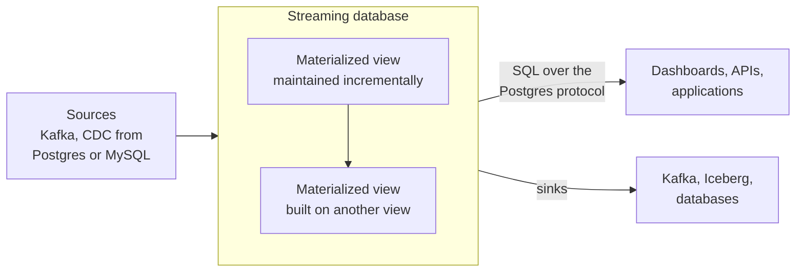

# Streaming SQL and Incremental Views: Materialize and RisingWave
> Databases that keep the results of SQL queries continuously up to date as data arrives, so fresh answers are a query away and no streaming job has to be written.

**Prerequisites:** [SQL](../00-foundations/sql-reference.md) · [Kafka](kafka-reference.md) · [DE Concepts](../00-foundations/de-concepts.md)

**Related:** [Apache Flink](flink-reference.md) · [Beam and Dataflow](beam-dataflow.md) · [Real-Time Analytics Databases](../01-storage/realtime-olap.md) · [Ingestion & CDC](../02-processing/ingestion-cdc.md) · [Testing and CI/CD](../06-infrastructure/testing-cicd.md) · [Glossary](../99-reference/glossary.md)

---

## Overview

**Challenge:** A dashboard, an alert or a feature served to an application needs an answer computed over data that arrived seconds ago. Recomputing the whole query on every request is too slow and too expensive. Running a batch job every few minutes leaves the result stale between runs. Writing a stream processor in code solves it, but it means a separate framework, state management and a deployment to operate, for what an analyst could express as one SQL query.

**Solution:** A **streaming database** lets you write that query as a materialized view. It ingests data from sources such as Kafka and change data capture, and it maintains the view **incrementally**: when a row arrives, the database updates only the part of the result that the row affects, instead of recomputing everything. Reads are then cheap lookups of an already-computed result. Materialize and RisingWave are two such systems. Both speak the PostgreSQL wire protocol, so `psql`, JDBC and Postgres drivers connect to them.



**Relevance to data engineering:** Streaming SQL sits between the warehouse and the stream processor. It is a good fit when the logic is expressible in SQL, freshness matters, and the team would rather operate a database than a streaming framework. It is not a replacement for a lakehouse or a warehouse. It overlaps with Flink SQL, with real-time analytics databases such as ClickHouse, and with incremental features of warehouses, so this guide focuses on how to choose. See [Apache Flink](flink-reference.md) and [Real-Time Analytics Databases](../01-storage/realtime-olap.md).

---

**On this page**

**Basic**
- [Incremental View Maintenance](#incremental-view-maintenance)
- [Where Streaming Databases Fit](#where-streaming-databases-fit)
- [The Objects You Work With](#the-objects-you-work-with)

**Intermediate**
- [RisingWave in Practice](#risingwave-in-practice)
- [Windows, Watermarks and Late Data in RisingWave](#windows-watermarks-and-late-data-in-risingwave)
- [Materialize in Practice](#materialize-in-practice)
- [Time Windows in Materialize: Temporal Filters](#time-windows-in-materialize-temporal-filters)
- [Querying from Python](#querying-from-python)

**Advanced**
- [Sinks and Fan-Out](#sinks-and-fan-out)
- [State, Consistency and Operations](#state-consistency-and-operations)
- [Testing Streaming Views](#testing-streaming-views)
- [Choosing an Approach](#choosing-an-approach)

**Reference**
- [Common Pitfalls](#common-pitfalls)
- [Cheat Sheet](#cheat-sheet)
- [Interview Questions](#interview-questions)
- [Further Reading](#further-reading)

---

## Incremental View Maintenance

A **view** stores a query and runs it every time it is read. A **materialized view** in a traditional database or warehouse stores the result, and refreshes it on a schedule or on demand by recomputing. **Incremental view maintenance** (IVM) does neither: it updates the stored result as each change arrives, so the view is always current, and the cost of the work moves from read time to write time.

The key is to treat every change as a signed delta. An insert is `+1` for a row, a delete is `-1`, and an update is a retraction of the old row (`-1`) plus an insertion of the new row (`+1`). An aggregate can then be adjusted by the delta without looking at the other rows. This is the idea in about 20 lines of Python, for a view equivalent to `SELECT country, SUM(amount), COUNT(*) FROM orders GROUP BY country`:

```python
# incremental.py
from collections import defaultdict


class RevenueByCountry:
    """Maintains  SELECT country, SUM(amount), COUNT(*) FROM orders GROUP BY country  incrementally.

    Every change is a signed delta: diff=+1 adds a row and diff=-1 retracts one.
    An UPDATE is a retraction of the old row followed by an insertion of the new row.
    """

    def __init__(self):
        self._state = defaultdict(lambda: [0, 0])          # country -> [sum, count]

    def apply(self, country, amount, diff):
        entry = self._state[country]
        entry[0] += diff * amount
        entry[1] += diff
        if entry[1] == 0:                                   # no rows left: the group disappears
            del self._state[country]

    def result(self):
        return {country: (total, count) for country, (total, count) in self._state.items()}


def recompute(rows):
    """The batch answer: rescan every row from scratch."""
    out = defaultdict(lambda: [0, 0])
    for country, amount in rows:
        out[country][0] += amount
        out[country][1] += 1
    return {country: (total, count) for country, (total, count) in out.items()}
```

The contract of any incremental view is that its result **always equals the recomputed answer**. That is a property, and a property-based test states it directly. This test applies random sequences of inserts and deletes and compares the two:

```python
# tests/test_incremental.py
from collections import Counter

from hypothesis import given, settings, strategies as st

from incremental import RevenueByCountry, recompute


def test_insert_update_and_delete():
    view = RevenueByCountry()
    view.apply("DE", 10, +1)
    view.apply("DE", 5, +1)
    view.apply("US", 7, +1)
    assert view.result() == {"DE": (15, 2), "US": (7, 1)}

    # UPDATE the DE order of 5 to 8: retract the old row, insert the new one
    view.apply("DE", 5, -1)
    view.apply("DE", 8, +1)
    assert view.result() == {"DE": (18, 2), "US": (7, 1)}

    # DELETE the only US order: the group disappears
    view.apply("US", 7, -1)
    assert view.result() == {"DE": (18, 2)}


@settings(max_examples=200)
@given(st.lists(
    st.tuples(st.sampled_from(["DE", "US", "IN"]), st.integers(0, 100), st.booleans()),
    max_size=60,
))
def test_incremental_result_always_equals_full_recompute(operations):
    view = RevenueByCountry()
    table = Counter()                                       # the "base table" as a multiset of rows

    for country, amount, is_delete in operations:
        row = (country, amount)
        if is_delete and table[row] > 0:                    # only delete a row that exists
            table[row] -= 1
            view.apply(country, amount, -1)
        else:
            table[row] += 1
            view.apply(country, amount, +1)

    rows = [row for row, n in table.items() for _ in range(n)]
    assert view.result() == recompute(rows)
```

```bash
pip install pytest hypothesis
pytest -q
```

Real systems generalise this to joins, windows and arbitrary SQL, and keep the state (here, the sum and count per key) in durable storage. That state is the price of incrementality: an aggregate keeps a small entry per group, but a join must keep the rows of both sides that could still match. That is why the size of state, and how to bound it, is the main design concern later in this guide.

---

## Where Streaming Databases Fit

| | Streaming database | Stream processor (Flink, Beam) | Real-time OLAP database | Warehouse |
|-|--------------------|-------------------------------|-------------------------|-----------|
| Programming model | SQL views, defined once | Code or SQL job | SQL queries over stored data | SQL queries |
| Work happens | At write time, incrementally | At write time, in a job | At query time, over indexed data | At query time, or on a schedule |
| Freshness | Continuous | Continuous | As fast as ingestion | Minutes to hours, depending on refresh |
| Ad hoc questions | Limited to what is materialized, plus queries over stored data | Not a query engine | Strong | Strong |
| State | Managed by the database | Managed by you and the framework | Stored data and indexes | Stored data |
| Operating | A database | A framework and its jobs | A database | A managed service |
| Best for | Always-fresh derived tables, alerts, feature serving | Complex event processing, custom logic, very large or low-latency pipelines | Exploratory analytics on fresh data with many filters | Reporting and analysis |

Streaming databases and real-time OLAP databases are both used for fresh data. The difference is when the work is done. An OLAP database stores the events and scans them fast at query time, so it handles unpredictable queries well. A streaming database computes the specific results in advance, so it answers the questions you defined instantly and cheaply, but it does not help with a question you did not materialize. Many platforms use both.

---

## The Objects You Work With

The vocabulary is similar in both systems, with differences in detail.

| Concept | RisingWave | Materialize |
|---------|-----------|-------------|
| **Source** | Defines how to connect to an external system and stores no data | An external system Materialize reads from: Kafka, PostgreSQL, MySQL or a load generator |
| **Table** | A persistent object that stores rows. Supports updates and deletes, and is used for CDC | A table you can create from a source (`CREATE TABLE ... FROM SOURCE`) |
| **View** | A stored query, computed when read | A saved query, computed on demand each time it is referenced |
| **Materialized view** | Defined by a SQL query, and the result is maintained automatically in real time | Persisted in durable storage and updated incrementally as new data arrives |
| **Index** | Supported for serving queries. See the SQL reference for the syntax and limits | Query results kept **in memory** in one cluster, updated incrementally, for fast repeated reads |
| **Sink** | The egress point: writes to an external system | Sends results to Kafka, S3 or Snowflake, for example |
| **Compute** | Serving, streaming, meta and compactor nodes | **Clusters**: isolated pools of CPU, memory and scratch disk |
| **Licence** | Apache 2.0 | A custom licence (GitHub lists it as "Other"), so read its terms before adopting |

The two most important choices in either system are how the data gets in (a source, and its format) and which views you materialize, since those define the state you pay for.

---

## RisingWave in Practice

RisingWave describes itself as a PostgreSQL-compatible streaming database. It connects over the PostgreSQL wire protocol, so a standard client works. The default local port is 4566, with database `dev` and user `root`:

```bash
psql -h localhost -p 4566 -d dev -U root
```

A **source** for a Kafka topic carrying JSON events. For Kafka, Kinesis and Pulsar you state the format and encoding explicitly:

```sql
CREATE SOURCE orders_src (
    order_id   BIGINT,
    country    VARCHAR,
    amount     DOUBLE PRECISION,
    order_time TIMESTAMP,
    WATERMARK FOR order_time AS order_time - INTERVAL '5' SECOND
) WITH (
    connector = 'kafka',
    topic = 'orders',
    properties.bootstrap.server = 'broker:9092',
    scan.startup.mode = 'earliest'
) FORMAT PLAIN ENCODE JSON;
```

`CREATE SOURCE` creates a connection and stores no data in RisingWave, and you can query it directly for some connectors such as Kafka. `CREATE TABLE` with the same `WITH` clause connects and also stores the ingested data, which you need if you want updates and deletes or to keep the data. With Kafka, a table uses `FORMAT UPSERT` when messages carry a key that identifies the row.

A **materialized view** is defined by an ordinary query. From then on RisingWave maintains it as data arrives, and you read it with a normal `SELECT`:

```sql
CREATE MATERIALIZED VIEW revenue_by_country AS
SELECT country,
       COUNT(*)    AS orders,
       SUM(amount) AS revenue
FROM orders_src
GROUP BY country;

SELECT * FROM revenue_by_country ORDER BY revenue DESC;
```

Materialized views can be built on other materialized views, so a chain of transformations is a set of views, each maintained from the one before. This is the streaming version of a layered dbt project. See [dbt](../02-processing/dbt-reference.md) for that layering idea.

---

## Windows, Watermarks and Late Data in RisingWave

Time-based aggregation uses window functions that add `window_start` and `window_end` columns to each row.

```sql
-- Tumbling windows: fixed, non-overlapping one-minute intervals
SELECT window_start, window_end, COUNT(*) AS orders
FROM TUMBLE(orders_src, order_time, INTERVAL '1' MINUTE)
GROUP BY window_start, window_end;

-- Hopping windows: five-minute windows that start every minute
SELECT window_start, window_end, COUNT(*) AS orders
FROM HOP(orders_src, order_time, INTERVAL '1' MINUTE, INTERVAL '5' MINUTE)
GROUP BY window_start, window_end;
```

`TUMBLE` takes the source, the time column and the window size. `HOP` takes the source, the time column, the **hop size** and then the **window size**. Session windows use a session frame in a window function, with a gap of inactivity:

```sql
SELECT user_id,
       viewed_at,
       first_value(viewed_at) OVER (
           PARTITION BY user_id
           ORDER BY viewed_at
           SESSION WITH GAP INTERVAL '5 MINUTES'
       ) AS session_start
FROM page_views;
```

Session frames are currently supported only in batch queries and in the emit-on-window-close streaming mode, so check the documentation for your version.

**Watermarks and emit-on-window-close.** By default a materialized view uses *emit on update*: it emits partial results as data arrives, on each barrier (by default every second), so a window's row changes several times before it is final. To emit each window once, when it is complete, define a **watermark** on the source (as `orders_src` does above, tolerating five seconds of lateness) and add `EMIT ON WINDOW CLOSE`:

```sql
CREATE MATERIALIZED VIEW revenue_per_minute AS
SELECT window_start, window_end, country, SUM(amount) AS revenue
FROM TUMBLE(orders_src, order_time, INTERVAL '1' MINUTE)
GROUP BY window_start, window_end, country
EMIT ON WINDOW CLOSE;
```

When the watermark passes a window's end, the final, immutable result is emitted. This removes intermediate states and prevents a late event from changing a result that has already been emitted downstream. The trade-off is latency (a window is emitted only after the watermark passes it) and lateness (an event later than the watermark allows is not counted). Use emit-on-update for a live dashboard that can tolerate changing numbers, and emit-on-window-close for a sink that must receive each window once, such as a Kafka topic or an Iceberg table. The same event-time ideas appear in [Beam](beam-dataflow.md#late-data-and-accumulation-modes) and [Flink](flink-reference.md).

---

## Materialize in Practice

Materialize is described as a streaming SQL database that gives always-fresh results with strong consistency, by doing incremental updates on writes. Ingestion has two steps: a **connection** to the external system, and a **source** that reads from it. This is the SASL form of a Kafka connection:

```sql
CREATE SECRET kafka_password AS '<password>';

CREATE CONNECTION kafka_connection TO KAFKA (
    BROKER 'broker-host:9092',
    SASL MECHANISMS = 'SCRAM-SHA-256',
    SASL USERNAME = 'username',
    SASL PASSWORD = SECRET kafka_password
);

CREATE SOURCE orders_source
  FROM KAFKA CONNECTION kafka_connection (TOPIC 'orders');

CREATE TABLE orders FROM SOURCE orders_source FORMAT JSON;
```

Current syntax creates a **source** for the topic and then a **table** that decodes it. Each table pins its own reader schema, so you can pick up an upstream schema change without downtime. The older syntax decoded the topic in the source itself (`CREATE SOURCE ... FORMAT JSON`), and it still works, but a schema change then needs the source to be dropped and recreated, with downtime. For a topic of Debezium change events, tables support `ENVELOPE DEBEZIUM`.

JSON messages arrive as a single `jsonb` column named `data`, so create a view that parses it into typed columns, and build the materialized view on that:

```sql
CREATE VIEW orders_parsed AS
SELECT (data->>'order_id')::bigint     AS order_id,
       data->>'country'                AS country,
       (data->>'amount')::numeric      AS amount,
       (data->>'order_time')::timestamp AS order_time
FROM orders;

CREATE MATERIALIZED VIEW revenue_by_country AS
SELECT country, COUNT(*) AS orders, SUM(amount) AS revenue
FROM orders_parsed
GROUP BY country;
```

**Materialized view or index?** A materialized view is stored durably and can be read from any cluster. An index keeps results in memory within one cluster, so reads on that cluster are fastest, and it exists only in that cluster's memory. A common pattern is a materialized view for the result and an index on it in the cluster that serves queries:

```sql
CREATE INDEX revenue_by_country_idx ON revenue_by_country (country);
```

**Clusters** are isolated pools of compute (CPU, memory and scratch disk). Workloads on different clusters are strictly isolated, and workloads on one cluster compete for that cluster's resources, so put a heavy transformation and a latency-sensitive serving workload on different clusters. A cluster's **replication factor** sets how many replicas do exactly the same work on the same data: with more than one, the cluster can tolerate the loss of a replica and keep serving.

---

## Time Windows in Materialize: Temporal Filters

Materialize does not use watermarks. To restrict a result to a window of time, you use a **temporal filter**, a condition on the function `mz_now()`, which returns Materialize's current virtual timestamp. As time advances, rows that no longer satisfy the condition are retracted from the result, so records expire automatically.

```sql
-- Orders from the last hour, always current
CREATE MATERIALIZED VIEW orders_last_hour AS
SELECT *
FROM orders_parsed
WHERE mz_now() <= order_time + INTERVAL '1 hour';
```

The condition must have `mz_now()` on one side and an expression of the event time on the other. Writing it as `order_time >= mz_now() - INTERVAL '1 hour'` is not accepted, because there is no subtraction operator for that type. When used in a materialized view, an indexed view or a `SUBSCRIBE`, all top-level `WHERE` and `HAVING` conditions must be combined with `AND`, and several `mz_now()` clauses can only be combined with `AND`.

The same mechanism gives a time-to-live pattern, `WHERE mz_now() < created_ts + ttl`, in which each record disappears when its expiry passes. This is also how you bound state: a join over a temporal filter keeps only recent rows, so its state stops growing.

---

## Querying from Python

Both systems speak the PostgreSQL protocol, so a Postgres driver works. This reads the RisingWave view above with `psycopg` and the local defaults:

```python
import psycopg

with psycopg.connect("host=localhost port=4566 dbname=dev user=root") as conn:
    with conn.cursor() as cur:
        cur.execute("SELECT country, orders, revenue FROM revenue_by_country ORDER BY revenue DESC")
        for country, orders, revenue in cur.fetchall():
            print(country, orders, revenue)
```

For Materialize, use the host, port, user and password from your environment. A query returns a consistent snapshot of the current results, and a result that changes between two reads is the view being updated, not an error. Serving applications should read views with plain `SELECT`s, and use a connection pool as with any database. Materialize also offers `SUBSCRIBE`, which streams the changes to a query as they happen, for applications that want to be pushed updates instead of polling.

---

## Sinks and Fan-Out

A sink writes a view's changes to an external system, so the streaming database can feed the rest of the platform: Kafka for other consumers, an Iceberg table for the lakehouse, a database for an application.

**RisingWave** creates a sink from a materialized view. It supports many destinations, including Apache Iceberg, Kafka, PostgreSQL, MySQL, ClickHouse, Elasticsearch, Google BigQuery, AWS Kinesis and Redis.

```sql
CREATE SINK orders_revenue_sink FROM revenue_by_country
WITH (
    connector = 'kafka',
    properties.bootstrap.server = 'broker:9092',
    topic = 'revenue-by-country',
    snapshot = false
)
FORMAT PLAIN ENCODE JSON;
```

**Materialize** sinks to Kafka with a choice of **envelope**:

```sql
CREATE SINK revenue_sink
  FROM revenue_by_country
  INTO KAFKA CONNECTION kafka_connection (TOPIC 'revenue-by-country')
  KEY (country)
  FORMAT JSON
  ENVELOPE UPSERT;
```

The **upsert** envelope emits inserts and updates without decoration and represents deletions as tombstone messages (null values), which suits key-based topic compaction so a topic holds the latest value per key. The **Debezium** envelope wraps each change in `before` and `after` fields, so consumers see the old and new value of an update and can rebuild history. Choose by what consumers need: the current state of each key, or the change stream.

A sink from a view that updates in place emits a **changelog** (an update is a retraction plus an insert), not just appends. Consumers such as [Kafka](kafka-reference.md) topics or [Iceberg](../01-storage/apache-iceberg.md) tables must understand upserts and deletes, or the sink must use an append-only mode where the query allows it. Sinking a window that emits on window close gives append-only output, which is the simplest shape for downstream systems.

---

## State, Consistency and Operations

**State is the cost.** An incremental query keeps intermediate results. A grouped aggregate keeps one entry per group, and a join keeps the rows of each side that can still match. If the join keys or windows are unbounded, state grows without limit, and cost and recovery time grow with it. Bound state on purpose:

- Use a **watermark** with `EMIT ON WINDOW CLOSE` in RisingWave, or a **temporal filter** in Materialize, so old data drops out.
- **Filter early** and select only the columns you need before a join or aggregate.
- **Avoid high-cardinality groupings** that you do not need, such as grouping by a unique ID.
- Do not materialize every intermediate view. Each one stores state. Use plain views for logic that does not need to be stored.

**Storage and scaling.** RisingWave keeps all durable state in its storage engine on object storage, so streaming nodes can scale out or in without moving data. It has serving nodes (compatible with the PostgreSQL protocol), streaming nodes (which ingest and run the streaming graph incrementally), compactor nodes and meta nodes (the control plane). Materialize scales by giving workloads their own clusters and replicas.

**Consistency.** Both systems keep results consistent as they update. RisingWave's meta node injects **barriers** that drive consistent snapshot isolation across the streaming graph, so a query does not see half of an update. Materialize's default isolation level is **strict serializable**, which adds linearizability to serializable. In practice this means a join of two views, or a read right after a write, is not a mixture of old and new states.

**Backfill and change.** Adding a materialized view means computing it over existing data (a backfill) and then keeping it current, which can be heavy for a large source. Changing a view's definition generally means creating a new one, letting it catch up and switching readers over. Treat view definitions as code in Git and deploy them through CI. See [Testing and CI/CD](../06-infrastructure/testing-cicd.md).

---

## Testing Streaming Views

The incremental contract from the start of this guide is the test: **a view's result must equal the batch answer**. In practice:

- **Reconcile against a batch query.** On a schedule, compare a materialized view to the same query run over the source of truth (for example the lakehouse or the warehouse), and alert on differences. Use the [data diff](../06-infrastructure/testing-cicd.md#comparing-outputs-with-a-data-diff) pattern.
- **Test the logic with small, scripted input.** Load a handful of rows, including updates, deletes and late events, into a test instance, and assert on the view's contents.
- **Test corrections explicitly.** An update to a row must change the aggregate by the difference, and a delete must remove its contribution. A group with no rows left must disappear, as in the property test above.
- **Test late data.** With a watermark, an event later than allowed should be dropped or handled as documented, and you should know which.
- **Check state growth.** Watch the size of state and the lag of each view in a soak test before production.

---

## Choosing an Approach

| If you need | Consider |
|-------------|----------|
| Always-fresh aggregates, joins and alerts in SQL, with a database to operate | A streaming database |
| Complex event processing, custom code, or very large, low-latency pipelines with fine control of state | A stream processor such as [Flink](flink-reference.md) or [Beam](beam-dataflow.md) |
| Fast, flexible queries over fresh event data, including ad hoc filters | A [real-time analytics database](../01-storage/realtime-olap.md) |
| Reporting and analysis, with freshness of minutes | A warehouse or lakehouse, perhaps with incremental models. See [dbt](../02-processing/dbt-reference.md) |
| Postgres with a few materialized views on modest data | Stay in PostgreSQL |
| A migration from an existing Kafka Streams or Flink SQL job | Compare the operating cost and the limits of SQL for your logic before moving |

Questions that decide it: Can the logic be expressed in SQL? Which results must be always current, and which can be minutes stale? How large will state be? Who will operate it? And what licence terms and support does your organisation need? RisingWave's Apache 2.0 licence and Materialize's custom licence lead to different answers for some organisations.

---

## Common Pitfalls

| Pitfall | Symptom | Fix |
|---------|---------|-----|
| Unbounded join state | Memory and storage grow, recovery slows | Watermarks and `EMIT ON WINDOW CLOSE` in RisingWave, temporal filters in Materialize, and filter early |
| Materializing every intermediate step | High cost for little benefit | Materialize only results that are read or that other views need |
| Expecting ad hoc queries to be fast | Slow queries over sources or unindexed views | Materialize what you query, or use an OLAP database for exploration |
| Emit-on-update sent to an append-only sink | Downstream sees many changing rows | Emit on window close, or a sink and format that handle updates |
| A watermark tighter than real lateness | Late events silently ignored | Set the watermark from observed delays, and monitor dropped events |
| Writing a temporal filter as `order_time >= mz_now() - INTERVAL` | Error about unsupported operators | Put `mz_now()` on one side: `mz_now() <= order_time + INTERVAL '1 hour'` |
| `OR` at the top level of a temporal filter | Rejected in a materialized view | Combine conditions with `AND`, or restructure the query |
| Reading JSON as one `jsonb` blob everywhere | Repeated parsing and untyped columns | One parsing view over the source, then build on it |
| Using the legacy source syntax | Downtime to pick up a schema change | Source plus `CREATE TABLE ... FROM SOURCE` |
| Heavy transformations and serving on one cluster | Serving latency spikes | Separate clusters for separate workloads (Materialize) |
| Treating a sink as append-only when it is a changelog | Duplicate or stale rows downstream | Upsert or Debezium envelopes, and consumers that handle deletes |
| No reconciliation against the source of truth | A wrong number that nobody catches | Compare views to a batch query on a schedule |
| Ignoring licence terms | A surprise at procurement or audit | Check the licence before adopting, especially for Materialize |

---

## Cheat Sheet

| Task | RisingWave | Materialize |
|------|-----------|-------------|
| Connect | `psql -h localhost -p 4566 -d dev -U root` | Any Postgres client with your connection details |
| Kafka source | `CREATE SOURCE s (...) WITH (connector = 'kafka', topic = ..., properties.bootstrap.server = ...) FORMAT PLAIN ENCODE JSON` | `CREATE CONNECTION ... TO KAFKA (...)` · `CREATE SOURCE ... FROM KAFKA CONNECTION ... (TOPIC ...)` · `CREATE TABLE ... FROM SOURCE ... FORMAT JSON` |
| Store ingested data | `CREATE TABLE` with the same `WITH` clause | `CREATE TABLE ... FROM SOURCE` |
| Incremental result | `CREATE MATERIALIZED VIEW mv AS SELECT ...` | `CREATE MATERIALIZED VIEW mv AS SELECT ...` |
| Fast reads | Read the materialized view | `CREATE INDEX i ON mv (col)` (in memory, per cluster) |
| Tumbling window | `TUMBLE(src, time_col, INTERVAL '1' MINUTE)` | Group by a truncated time, with a temporal filter to expire |
| Hopping window | `HOP(src, time_col, hop_size, window_size)` | Temporal filter |
| Late data | `WATERMARK FOR t AS t - INTERVAL '5' SECOND` and `EMIT ON WINDOW CLOSE` | Not applicable. Use temporal filters |
| Expire rows | Watermark and window close | `WHERE mz_now() <= ts + INTERVAL '1 hour'` |
| Sink | `CREATE SINK s FROM mv WITH (connector = 'kafka', ...) FORMAT PLAIN ENCODE JSON` | `CREATE SINK s FROM mv INTO KAFKA CONNECTION ... FORMAT JSON ENVELOPE UPSERT` |
| Isolation | One cluster of nodes | Clusters and replicas |
| Consistency | Barrier-based snapshot isolation | Strict serializable by default |
| Licence | Apache 2.0 | Custom |

**Rule of thumb:** SQL logic, always-fresh results, a database to operate → streaming database · custom logic or huge scale → stream processor · ad hoc queries on fresh data → real-time OLAP

---

## Interview Questions

**Q: What is incremental view maintenance, and how does it differ from a normal materialized view?**
A: A traditional materialized view stores a query result and refreshes it by recomputing, on a schedule or on demand, so it is stale between refreshes. Incremental view maintenance updates the stored result as each change arrives, adjusting only the affected part, using signed deltas: an insert is plus one, a delete is minus one and an update is a retraction plus an insertion. The result stays current, and the work moves from read time to write time, at the cost of keeping state. The contract is that the result always equals the recomputed answer.

**Q: How is a streaming database different from Flink?**
A: A streaming database is a database: you declare views in SQL, the system maintains them and you query them, usually over the PostgreSQL protocol, with state managed for you. Flink is a stream processing framework: you write a job in code or SQL, deploy and operate it, and manage state and checkpoints, which gives finer control and suits complex event processing and very large or low-latency pipelines. Choose the streaming database when the logic fits SQL and you would rather operate a database.

**Q: When would you choose a streaming database over a real-time OLAP database such as ClickHouse?**
A: When you know the questions in advance and need the answers always current, because a streaming database computes the results ahead of time and reads are cheap lookups. An OLAP database stores the events and scans them fast at query time, so it is better for ad hoc and exploratory queries with many filters. Many platforms use both: a streaming database for defined, always-fresh results, and an OLAP database for exploration.

**Q: How do watermarks and `EMIT ON WINDOW CLOSE` work in RisingWave?**
A: A watermark on the event-time column says how late data may arrive, for example event time minus five seconds. By default a windowed aggregate emits partial results on each barrier, so a window's row changes repeatedly. With `EMIT ON WINDOW CLOSE`, the final result is emitted once, when the watermark passes the window's end, and later events cannot change it. The trade-off is added latency and dropping events later than the watermark allows.

**Q: What is a temporal filter in Materialize?**
A: A `WHERE` condition on `mz_now()`, the current virtual timestamp, such as `mz_now() <= order_time + INTERVAL '1 hour'`. As time advances, rows that no longer satisfy it are retracted from the result, so the view holds a sliding window and old data expires automatically. It also bounds state. The condition must be written with `mz_now()` on one side, and in a materialized view the top-level conditions must be combined with `AND`.

**Q: What are the main risks of running streaming SQL in production?**
A: Unbounded state, chiefly from joins and groupings with no time bound, which grows cost and recovery time. Then correctness at the edges: late data, corrections and sinks that receive a changelog instead of appends. And operations: backfilling a new view over existing data, changing definitions safely, and knowing the licence. I bound state with watermarks or temporal filters, test the view against the batch answer, reconcile on a schedule, and deploy view definitions through CI.

---

## Further Reading

- [What is RisingWave?](https://docs.risingwave.com/get-started/intro) and its [key concepts](https://docs.risingwave.com/reference/key-concepts)
- [RisingWave: sources, tables, materialized views and sinks](https://docs.risingwave.com/get-started/source-table-mv-sink)
- [RisingWave: ingest from Kafka](https://docs.risingwave.com/ingestion/sources/kafka), [time windows](https://docs.risingwave.com/processing/sql/time-windows) and [emit on window close](https://docs.risingwave.com/processing/emit-on-window-close)
- [Materialize: getting started](https://materialize.com/docs/get-started/) and [clusters](https://materialize.com/docs/concepts/clusters/)
- [Materialize: Kafka sources](https://materialize.com/docs/sql/create-source/kafka/) and [Kafka sinks](https://materialize.com/docs/sql/create-sink/kafka/)
- [Materialize: temporal filters](https://materialize.com/docs/transform-data/patterns/temporal-filters/) and [consistency guarantees](https://materialize.com/docs/overview/isolation-level/)

---

**Previous:** [Real-Time Analytics Databases](../01-storage/realtime-olap.md) · **Next:** [Ingestion & CDC](../02-processing/ingestion-cdc.md) · **Back to:** [Index](../README.md)
