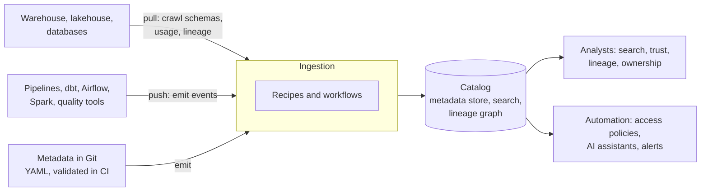

# Data Catalogs in Practice: DataHub and OpenMetadata
> How the two leading open-source data catalogs work, how to get metadata into them from your pipelines, and how to keep a catalog accurate by treating metadata as code.

**Prerequisites:** [Governance & Lineage](governance-lineage.md) · [Data Quality](data-quality.md) · [Python for DE](../00-foundations/python-reference.md)

**Related:** [Pipeline Observability](pipeline-observability.md) · [Data Security & Privacy](data-security-privacy.md) · [dbt](../02-processing/dbt-reference.md) · [BI Tools](../02-processing/bi-tools.md) · [MCP and Text-to-SQL](../07-ai/mcp-text-to-sql.md) · [Testing and CI/CD](../06-infrastructure/testing-cicd.md) · [Glossary](../99-reference/glossary.md)

---

## Overview

**Challenge:** A platform with hundreds of tables answers the same questions over and over. Which table is the trusted one for revenue? Who owns it? Does it hold personal data? What breaks if this column changes? Without a shared, searchable record, the answers live in people's heads and in stale documents, and the people who know leave. The [Governance & Lineage](governance-lineage.md) guide explains what a catalog is for. This guide is about the tools that implement one.

**Solution:** A data catalog stores **metadata** about your data assets and makes it searchable: technical metadata (schemas, locations), operational metadata (run history, freshness, usage) and business metadata (descriptions, owners, glossary terms, classifications). DataHub and OpenMetadata are the two most widely used open-source catalogs. Both harvest metadata from your systems automatically, model it in a graph, and let people search, follow lineage and assign ownership. The part that decides whether a catalog succeeds is not the tool. It is whether the metadata is **complete and current**, which means it has to come from the pipelines and from code, not from people typing into a form.



**Relevance to data engineering:** Data engineers own the ingestion side. That means choosing pull or push, scheduling crawls, emitting lineage from jobs, enforcing that new datasets ship with an owner and a description, and alerting when ingestion fails. The examples run without a catalog server: they use DataHub's file sink, which is also how you test metadata code in CI.

---

**On this page**

**Basic**
- [What a Catalog Adds](#what-a-catalog-adds)
- [DataHub and OpenMetadata at a Glance](#datahub-and-openmetadata-at-a-glance)
- [How a Catalog Gets Its Metadata](#how-a-catalog-gets-its-metadata)

**Intermediate**
- [DataHub](#datahub)
- [Pull-Based Ingestion with a Recipe](#pull-based-ingestion-with-a-recipe)
- [OpenMetadata](#openmetadata)

**Advanced**
- [Catalog as Code](#catalog-as-code)
- [Lineage and Integrations](#lineage-and-integrations)
- [Running a Catalog in Production](#running-a-catalog-in-production)
- [Adopting a Catalog](#adopting-a-catalog)
- [Choosing a Catalog](#choosing-a-catalog)

**Reference**
- [Common Pitfalls](#common-pitfalls)
- [Cheat Sheet](#cheat-sheet)
- [Interview Questions](#interview-questions)
- [Further Reading](#further-reading)

---

## What a Catalog Adds

A wiki page can hold a description. A catalog holds it next to the schema, the lineage, the owner and the usage, and keeps all of them current from the source systems.

| Capability | What it gives people |
|------------|---------------------|
| **Search and discovery** | Find a dataset by name, description, column, owner or tag |
| **Ownership** | A named team accountable for each asset, and a route to ask questions |
| **Lineage** | Where a column came from and what depends on it, so a change can be assessed |
| **Glossary and classification** | Shared business terms, and tags such as `pii` that drive access policy |
| **Trust signals** | Certification, deprecation notices, freshness and quality results |
| **Usage** | Which assets are queried, by whom, and how often, so effort goes to what matters |
| **A programmatic API** | Access policies, dashboards and AI assistants can read the same metadata |

You probably need one when people regularly ask in chat "which table should I use?", when nobody can say what depends on a table before changing it, or when audits require showing where personal data lives.

---

## DataHub and OpenMetadata at a Glance

| | DataHub | OpenMetadata |
|-|---------|--------------|
| **Licence** | Apache 2.0 | Apache 2.0 |
| **Latest release (Sep 2026)** | 1.7 | 2.0 |
| **Design idea** | A model-first, event-driven metadata platform. Metadata changes flow as events, so changes propagate within seconds and other systems can react | A schema-first platform. JSON Schemas define every entity, and code for the API, the ingestion framework and the UI is generated from them |
| **Core building blocks** | Entities, aspects, URNs. A metadata service (GMS), ingestion framework, event streaming, search and graph | Five pillars: API, UI, ingestion framework, an entity store (MySQL in the architecture documentation) and a search engine (Elasticsearch) |
| **Ingestion** | Pull-based crawlers (recipes) and push-based emitters (Python and Java SDKs and integrations) | Connector-based ingestion workflows defined in YAML or configured in the UI, run by the ingestion framework |
| **Python for ingestion** | Documentation asks for Python 3.10 or later, and the package warns that versions above 3.11 are not actively tested | Documentation lists Python 3.9 to 3.11 |
| **Local trial** | `datahub docker quickstart` | Docker Compose |
| **Standout for** | Event-driven automation and a flexible metadata model | A unified, schema-defined model with data quality and governance built in, and many connectors |

Both are actively developed and both can be run yourself or bought as a managed service. Neither is a bad choice. The differences that usually decide it are the operating footprint you can support, the connectors you need and how you want to automate against the catalog.

---

## How a Catalog Gets Its Metadata

There are two ways in, and a good catalog uses both.

| | Pull | Push |
|-|------|------|
| **How** | A crawler connects to a system on a schedule and reads what is there | A job emits metadata as it runs |
| **Examples** | Snowflake, BigQuery, dbt, Looker, Airflow crawlers | The Python and Java SDKs, Spark, Great Expectations, your own pipeline code |
| **Strength** | No change to the source system. Discovers everything, including what nobody registered | Fresh, precise and can carry information only the job knows, such as lineage and quality results |
| **Weakness** | Only as fresh as the schedule, and cannot know business meaning | Needs each pipeline to emit, so coverage depends on discipline |

Crawling gives **breadth** (every table appears) and pushing gives **depth** (the job says what it read, what it wrote and whether it passed). Descriptions, owners and classifications are business knowledge, and no crawler can discover them, which is why the last part of this guide keeps them in Git.

---

## DataHub

DataHub describes itself as a third-generation data catalog built around three ideas: **schema-first metadata modelling** (a typed language for metadata, exposed over REST, GraphQL and Avro-based APIs over Kafka), **stream-based real-time operations** (metadata changes flow through Kafka, so they can propagate within seconds and trigger automation, for example restricting access when a PII field is added to a public dataset), and **federated serving** (several metadata services can share a central search index and graph, which suits teams that keep ownership of their own metadata).

### The metadata model

Three terms carry the whole model.

| Term | Meaning |
|------|---------|
| **Entity** | The primary node in the metadata graph: a dataset, chart, dashboard, user and so on |
| **Aspect** | A collection of attributes describing one facet of an entity, such as ownership, tags or schema. It is the smallest unit you can write, and different aspects of one entity are updated independently |
| **URN** | The stringified key of an entity, in the form `urn:li:<entity-name>:<key-fields>`. A dataset URN looks like `urn:li:dataset:(urn:li:dataPlatform:foo,bar,PROD)`: the platform, the name and the environment |

Relationships are named edges between entities, declared in aspects, and can be followed in both directions (for example from a chart to its owner and from an owner to their charts). Aspects are stored in two ways. **Versioned aspects** such as ownership and tags keep a numeric version and are persisted in a relational database, so changes are tracked. **Timeseries aspects** such as a dataset profile carry a timestamp and live in the search index and the message queue, which suits time-range queries.

Because the aspect is the unit of writing, a pipeline can update a dataset's lineage without touching its owner, and two teams can update different aspects of the same dataset without overwriting each other. That is why the code below emits **one event per aspect**.

### Emitting metadata from code

The Python SDK builds an event from an aspect class and sends it with an emitter. This is the pattern from the DataHub documentation, sending to a running server over REST:

```python
import datahub.emitter.mce_builder as builder
from datahub.emitter.mcp import MetadataChangeProposalWrapper
from datahub.metadata.schema_classes import DatasetPropertiesClass
from datahub.emitter.rest_emitter import DatahubRestEmitter

emitter = DatahubRestEmitter(gms_server="http://localhost:8080", extra_headers={})
emitter.test_connection()

event = MetadataChangeProposalWrapper(
    entityUrn=builder.make_dataset_urn("bigquery", "my-project.my-dataset.user-table"),
    aspect=DatasetPropertiesClass(
        description="This table stores the canonical user profile",
        customProperties={"governance": "ENABLED"},
    ),
)
emitter.emit(event)
```

A Kafka emitter (`DatahubKafkaEmitter`) sends the same events onto Kafka instead, which suits high volume and decoupling. Emitting requires a running server, so the rest of this guide writes events to a file and lets DataHub's `file` source read them back.

### Trying it locally

`datahub docker quickstart` starts a local DataHub (the documentation asks for Docker with about 2 CPUs, 8 GB of memory and 13 GB of disk) with the interface at `http://localhost:9002`. `datahub datapack load showcase-ecommerce` loads roughly 1,050 sample entities.

---

## Pull-Based Ingestion with a Recipe

A **recipe** is a YAML file with a `source` (where to read) and a `sink` (where to send). The documentation shows a Snowflake source sending to a server over `datahub-rest`, run with `datahub ingest -c recipe.yml`. To try it with no server and no cloud account, this recipe crawls a SQLite database and writes the events to a file:

```yaml
# recipe_pull.yml
source:
  type: sqlalchemy
  config:
    platform: sqlite
    connect_uri: sqlite:///./shop.db
    env: DEV

sink:
  type: file
  config:
    filename: ./out/pulled.json
```

```bash
pip install 'acryl-datahub[sqlalchemy]'
datahub ingest -c recipe_pull.yml
```

Against a small SQLite database with two tables, the run reported `Pipeline finished successfully; produced 19 events` and extracted each table's columns and native types, for example `orders` with `order_id INTEGER`, `customer_id INTEGER`, `amount NUMERIC` and `order_date DATE`.

Four things learned from running it:

- **Sources are optional extras.** Without the `sqlalchemy` extra the run stops with a message naming the exact `pip install 'acryl-datahub[sqlalchemy]'` to run. Install only the extras for the sources you use.
- **Ingestion fails per table, and it says so.** With DataHub 1.7.0.13, the generic SQLAlchemy source raised an error on a SQLite table that declared a foreign key, while the other table was extracted normally. The run's report listed the failure, and the run did not stop the others. Read the report, and **alert when it lists failures**, because a silent partial crawl is a catalog with missing assets.
- **Match the supported Python version.** The package warns that Python above 3.11 is not actively tested. Check the documentation for the version you deploy.
- **A file sink is a test harness.** The same recipe with a `datahub-rest` sink sends to a server. Using `file` in CI lets you test metadata code without one.

---

## OpenMetadata

OpenMetadata's documentation describes five pillars: the **API**, which unifies communication with internal and external systems; the **UI**, focused on discovery and collaboration; the **ingestion framework**, the foundation of the connectors; an **entity store**, a MySQL database holding the real-time state of entities and their relationships; and a **search engine**, Elasticsearch, which powers indexing for the interface.

Its central idea is that **JSON Schemas are the single source of truth** for metadata definitions. Code is generated from them: Java classes for the API, Python classes for the ingestion framework and TypeScript types for the UI, so every layer agrees. Entities keep their intrinsic attributes separate from their relationships, in three kinds of storage: entity tables that hold JSON documents, a relationship table that forms the graph, and a `change_event` table that records every `PUT`, `POST` or `PATCH` as an audit trail and a version history.

### An ingestion workflow

A workflow names the source, what to read from it, the sink and how to reach the server. This is the structure from the project's own MySQL example, with placeholders for the credentials:

```yaml
source:
  type: mysql
  serviceName: local_mysql
  serviceConnection:
    config:
      type: Mysql
      username: <username>
      authType:
        password: <password>
      hostPort: localhost:3306
      databaseSchema: <database>
  sourceConfig:
    config:
      type: DatabaseMetadata
sink:
  type: metadata-rest
  config: {}
workflowConfig:
  openMetadataServerConfig:
    hostPort: http://localhost:8585/api
    authProvider: openmetadata
    securityConfig:
      jwtToken: "<bot-jwt-token>"
```

```bash
pip install "openmetadata-ingestion[mysql]"
metadata ingest -c workflow.yaml
```

Points to note. The workflow authenticates as a **bot** with a JWT, so keep the token in a secret store and inject it at run time, never in the file. The user the workflow connects as needs read access to the database's metadata (for MySQL, `INFORMATION_SCHEMA`, with `SELECT` and `SHOW VIEW`). The `sourceConfig` block chooses what to ingest: options include marking tables that have disappeared as deleted, and whether to include views. A large subset of connectors also ingests **lineage** by processing queries to work out upstream and downstream tables. The ingestion package documents supported Python versions of 3.9 to 3.11.

A local trial uses Docker Compose, and the documentation asks for at least 6 GiB of memory and 4 vCPUs. It starts the server, a MySQL or PostgreSQL database, Elasticsearch and an Airflow-based ingestion service, with the interface at `http://localhost:8585`. Change the default credentials before exposing it anywhere.

---

## Catalog as Code

Crawlers find your tables, but only people know what a table means, who owns it and how sensitive it is. If that knowledge lives only in the catalog's user interface, it depends on someone remembering to update it. The alternative is to keep it in Git, next to the pipeline that produces the table, and load it into the catalog automatically. That gives you review, history, and something you can **enforce in CI**: a new dataset cannot merge without an owner and a description.

A dataset described in YAML:

```yaml
# catalog/orders.yaml
platform: postgres
name: shop.public.orders
env: PROD
description: One row per customer order. The source of truth for revenue reporting.
owner: data-orders-team
domain: sales
classification: confidential
tags: [certified]
columns:
  - name: order_id
    type: bigint
    description: Primary key of the order.
  - name: customer_email
    type: text
    description: Email address the order confirmation was sent to.
    tags: [pii]
  - name: amount
    type: numeric
    description: Order value in the shop's currency, after discounts and before tax.
upstream:
  - postgres:shop.raw.orders
```

And a second file for the customers table, which is restricted:

```yaml
# catalog/customers.yaml
platform: postgres
name: shop.public.customers
env: PROD
description: One row per customer, with the country used for regional reporting.
owner: data-customers-team
domain: sales
classification: restricted
tags: []
columns:
  - name: customer_id
    type: bigint
    description: Primary key of the customer.
  - name: email
    type: text
    description: Customer email address, used for order confirmations.
    tags: [pii]
  - name: country
    type: text
    description: Two-letter country code from the billing address.
```

The code loads it, checks it against your rules, and converts it into DataHub events, one per aspect. The rules here are examples to adapt: an owner, a real description, a classification from a fixed list, a description for every column, tags from an approved vocabulary, and the rule that a column tagged `pii` requires a `confidential` or `restricted` table.

```python
# catalog_as_code.py
"""Describe datasets in YAML, check them against governance rules, and turn them into DataHub metadata events."""
import json
from pathlib import Path

import yaml
from datahub.emitter import mce_builder
from datahub.emitter.mcp import MetadataChangeProposalWrapper
from datahub.metadata import schema_classes as sc

CLASSIFICATIONS = ["public", "internal", "confidential", "restricted"]
ALLOWED_TAGS = {"pii", "certified"}
SENSITIVE = {"confidential", "restricted"}          # the classifications that may contain personal data
TYPES = {
    "text": sc.StringTypeClass, "varchar": sc.StringTypeClass,
    "bigint": sc.NumberTypeClass, "integer": sc.NumberTypeClass, "numeric": sc.NumberTypeClass,
    "boolean": sc.BooleanTypeClass, "date": sc.DateTypeClass,
}


def load(path: Path) -> dict:
    return yaml.safe_load(path.read_text())


def validate(spec: dict) -> list[str]:
    """Return every problem found, so a pull request shows them all at once."""
    problems = []
    name = spec.get("name", "<no name>")
    for key in ("platform", "name", "owner", "classification"):
        if not spec.get(key):
            problems.append(f"{name}: '{key}' is required")
    if len(spec.get("description", "")) < 20:
        problems.append(f"{name}: the description must say what a row is (at least 20 characters)")
    if spec.get("classification") not in CLASSIFICATIONS:
        problems.append(f"{name}: classification must be one of {CLASSIFICATIONS}")

    tags = set(spec.get("tags", []))
    for column in spec.get("columns", []):
        if not column.get("description"):
            problems.append(f"{name}.{column['name']}: the column needs a description")
        if column.get("type") not in TYPES:
            problems.append(f"{name}.{column['name']}: unknown type '{column.get('type')}'")
        tags |= set(column.get("tags", []))
        if "pii" in column.get("tags", []) and spec.get("classification") not in SENSITIVE:
            problems.append(f"{name}.{column['name']}: a pii column needs a confidential or restricted table")
    for tag in tags - ALLOWED_TAGS:
        problems.append(f"{name}: tag '{tag}' is not in the approved vocabulary {sorted(ALLOWED_TAGS)}")
    for upstream in spec.get("upstream", []):
        if ":" not in upstream:
            problems.append(f"{name}: upstream '{upstream}' must look like platform:database.schema.table")
    return problems


def to_events(spec: dict) -> list[MetadataChangeProposalWrapper]:
    """One event per aspect. Each event upserts that aspect of the dataset."""
    urn = mce_builder.make_dataset_urn(spec["platform"], spec["name"], spec.get("env", "PROD"))

    fields = [
        sc.SchemaFieldClass(
            fieldPath=column["name"],
            type=sc.SchemaFieldDataTypeClass(type=TYPES[column["type"]]()),
            nativeDataType=column["type"],
            description=column["description"],
            globalTags=sc.GlobalTagsClass(tags=[sc.TagAssociationClass(mce_builder.make_tag_urn(t)) for t in column.get("tags", [])])
            if column.get("tags") else None,
        )
        for column in spec.get("columns", [])
    ]
    aspects = [
        sc.DatasetPropertiesClass(description=spec["description"], customProperties={"classification": spec["classification"]}),
        sc.SchemaMetadataClass(
            schemaName=spec["name"],
            platform=mce_builder.make_data_platform_urn(spec["platform"]),
            version=0,
            hash="",
            platformSchema=sc.OtherSchemaClass(rawSchema=""),
            fields=fields,
        ),
        sc.OwnershipClass(owners=[sc.OwnerClass(owner=mce_builder.make_group_urn(spec["owner"]), type=sc.OwnershipTypeClass.DATAOWNER)]),
    ]
    if spec.get("tags"):
        aspects.append(sc.GlobalTagsClass(tags=[sc.TagAssociationClass(mce_builder.make_tag_urn(t)) for t in spec["tags"]]))
    if spec.get("domain"):
        aspects.append(sc.DomainsClass(domains=[f"urn:li:domain:{spec['domain']}"]))
    if spec.get("upstream"):
        upstreams = []
        for ref in spec["upstream"]:
            platform, table = ref.split(":", 1)
            upstreams.append(sc.UpstreamClass(dataset=mce_builder.make_dataset_urn(platform, table, spec.get("env", "PROD")),
                                              type=sc.DatasetLineageTypeClass.TRANSFORMED))
        aspects.append(sc.UpstreamLineageClass(upstreams=upstreams))

    return [MetadataChangeProposalWrapper(entityUrn=urn, aspect=aspect) for aspect in aspects]


def write_events(events: list[MetadataChangeProposalWrapper], path: Path) -> None:
    """The file format DataHub's `file` source reads: a JSON list of metadata change proposals."""
    path.parent.mkdir(parents=True, exist_ok=True)
    path.write_text(json.dumps([event.to_obj() for event in events], indent=2))


def main(directory: str = "catalog", output: str = "out/events.json") -> int:
    events, problems = [], []
    for file in sorted(Path(directory).glob("*.yaml")):
        spec = load(file)
        found = validate(spec)
        problems += found
        if not found:
            events += to_events(spec)
    for problem in problems:
        print("ERROR", problem)
    if problems:
        return 1
    write_events(events, Path(output))
    print(f"wrote {len(events)} events to {output}")
    return 0


if __name__ == "__main__":
    raise SystemExit(main())
```

Every check returns a message and `validate` collects all of them, so a pull request shows every problem at once, not one per push. The events are written in the JSON format that DataHub's `file` source reads. Running it against the example catalog wrote 10 events for two datasets, and running the resulting file through DataHub's own ingestion pipeline (`file` source to `file` sink, using this recipe) produced `Pipeline finished successfully; produced 10 events`, which proves DataHub accepts them:

```yaml
# recipe.yml
source:
  type: file
  config:
    filename: ./out/events.json

sink:
  type: file
  config:
    filename: ./out/ingested.json
```

Swapping the sink to `datahub-rest` sends the same events to a real server, and that step belongs in a deployment job that runs only from the main branch. The tests are the specification of the governance rules:

```python
# tests/test_catalog_as_code.py
import copy
import json
from pathlib import Path

import pytest
import yaml
from datahub.ingestion.run.pipeline import Pipeline

from catalog_as_code import load, main, to_events, validate, write_events

CATALOG = Path(__file__).resolve().parent.parent / "catalog"

GOOD = {
    "platform": "postgres",
    "name": "shop.public.orders",
    "description": "One row per customer order. The source of truth for revenue.",
    "owner": "data-orders-team",
    "classification": "confidential",
    "tags": ["certified"],
    "columns": [
        {"name": "order_id", "type": "bigint", "description": "Primary key."},
        {"name": "email", "type": "text", "description": "Customer email address.", "tags": ["pii"]},
    ],
    "upstream": ["postgres:shop.raw.orders"],
}


def broken(**changes):
    spec = copy.deepcopy(GOOD)
    spec.update(changes)
    return spec


def test_the_example_catalog_passes_every_rule():
    for file in CATALOG.glob("*.yaml"):
        assert validate(load(file)) == [], file.name


def test_a_complete_spec_has_no_problems():
    assert validate(GOOD) == []


@pytest.mark.parametrize("spec, expected", [
    (broken(owner=""), "'owner' is required"),
    (broken(description="Orders."), "must say what a row is"),
    (broken(classification="secret"), "classification must be one of"),
    (broken(classification="internal"), "a pii column needs a confidential or restricted table"),
    (broken(tags=["certified", "gdpr"]), "tag 'gdpr' is not in the approved vocabulary"),
    (broken(upstream=["shop.raw.orders"]), "must look like platform:database.schema.table"),
    (broken(columns=[{"name": "order_id", "type": "bigint"}]), "the column needs a description"),
    (broken(columns=[{"name": "order_id", "type": "money", "description": "Primary key."}]), "unknown type 'money'"),
])
def test_each_rule_reports_a_clear_problem(spec, expected):
    problems = validate(spec)
    assert any(expected in problem for problem in problems), problems


def test_all_problems_are_reported_together():
    spec = broken(owner="", classification="internal", tags=["gdpr"])
    assert len(validate(spec)) >= 3


def test_events_cover_the_aspects_a_catalog_needs():
    events = to_events(GOOD)
    aspects = {event.aspectName for event in events}
    assert aspects == {"datasetProperties", "schemaMetadata", "ownership", "globalTags", "upstreamLineage"}
    assert {event.entityUrn for event in events} == {
        "urn:li:dataset:(urn:li:dataPlatform:postgres,shop.public.orders,PROD)"
    }


def test_the_owner_is_a_group_and_the_lineage_points_at_the_upstream_dataset():
    by_aspect = {event.aspectName: event.aspect for event in to_events(GOOD)}

    assert by_aspect["ownership"].owners[0].owner == "urn:li:corpGroup:data-orders-team"
    assert by_aspect["upstreamLineage"].upstreams[0].dataset == (
        "urn:li:dataset:(urn:li:dataPlatform:postgres,shop.raw.orders,PROD)"
    )


def test_a_pii_tag_lands_on_the_column_and_not_on_the_others():
    schema = {event.aspectName: event.aspect for event in to_events(GOOD)}["schemaMetadata"]
    tags = {field.fieldPath: [t.tag for t in field.globalTags.tags] if field.globalTags else [] for field in schema.fields}

    assert tags == {"order_id": [], "email": ["urn:li:tag:pii"]}


def test_the_events_are_accepted_by_datahubs_own_ingestion_pipeline(tmp_path):
    events_file = tmp_path / "events.json"
    write_events(to_events(GOOD), events_file)

    pipeline = Pipeline.create({
        "source": {"type": "file", "config": {"filename": str(events_file)}},
        "sink": {"type": "file", "config": {"filename": str(tmp_path / "ingested.json")}},
    })
    pipeline.run()
    pipeline.raise_from_status()

    ingested = json.loads((tmp_path / "ingested.json").read_text())
    assert len(ingested) == 5


def test_an_invalid_catalog_fails_the_build_and_writes_nothing(tmp_path):
    (tmp_path / "bad.yaml").write_text(yaml.safe_dump(broken(owner="")))
    output = tmp_path / "out" / "events.json"

    assert main(str(tmp_path), str(output)) == 1
    assert not output.exists()


def test_a_valid_catalog_writes_events(tmp_path):
    (tmp_path / "good.yaml").write_text(yaml.safe_dump(GOOD))
    output = tmp_path / "out" / "events.json"

    assert main(str(tmp_path), str(output)) == 0
    assert len(json.loads(output.read_text())) == 5
```

A few design choices are worth explaining:

- **The owner is a group, not a person.** People leave. The events use a `corpGroup` URN, and the test `test_the_owner_is_a_group_and_the_lineage_points_at_the_upstream_dataset` pins it.
- **Tags on columns, not only tables.** A `pii` tag on the `email` column lets an access policy mask that column while leaving the rest of the table open. See [Data Security & Privacy](data-security-privacy.md).
- **Lineage from declared upstreams.** The `upstream` list becomes an upstream-lineage aspect. Crawlers and query-log parsing add more, and declared lineage covers what they cannot see.
- **The tests reject an invalid catalog before anything is written.** `test_an_invalid_catalog_fails_the_build_and_writes_nothing` checks that a single bad file blocks the whole emit.
- **Each rule is pinned by a test.** Removing any of the rules from `validate`, or changing the owner mapping, makes at least one test fail. This was checked by deleting each rule in turn and running the suite, the same way as for the safety code in [MCP and Text-to-SQL](../07-ai/mcp-text-to-sql.md).

Wire it into CI with a check that runs `pytest` and `python catalog_as_code.py` on every pull request, and a deployment job that emits to the catalog from the main branch. See [Testing and CI/CD](../06-infrastructure/testing-cicd.md). For a large estate, generate the YAML from what you already have, such as dbt model descriptions and schema files, and validate rather than hand-write.

---

## Lineage and Integrations

Lineage is what turns a catalog from a directory into an impact-analysis tool. There are three sources, and mature setups combine them.

| Source | How it works | Trade-off |
|--------|--------------|-----------|
| **Query-log parsing** | The crawler reads the warehouse's query history and works out which tables each statement read and wrote. A large subset of OpenMetadata's connectors do this | Automatic, but only sees what ran in the window, and complex SQL can be misparsed |
| **Tool integrations** | dbt, Airflow, Spark and similar tools emit lineage as they run, or a crawler reads their metadata | Accurate for that tool, and needs each tool wired up |
| **Declared lineage** | Written by people or code, as the `upstream` list above | Covers what the others cannot see, and can go stale unless validated |

The open standard for pipeline-emitted lineage is OpenLineage, covered in [Governance & Lineage](governance-lineage.md#openlineage). Prefer emitting from the pipeline over inferring it afterwards, and use column-level lineage where the tools support it, since table-level lineage cannot say which downstream reports use a personal-data column.

The catalog also feeds other parts of the platform:

- **BI tools.** Ingest dashboards and charts so lineage runs from source to report, and record which dashboards depend on which models. See [BI Tools](../02-processing/bi-tools.md).
- **AI assistants.** Descriptions and column meanings are what let a model write correct SQL, so publish them as the schema resource of an MCP server instead of maintaining a second copy. See [MCP and Text-to-SQL](../07-ai/mcp-text-to-sql.md).
- **Access policy.** Classification tags can drive masking and row filters, so a policy is written once and applies as tags change.
- **Quality and observability.** Show test results and freshness next to the dataset, so consumers see whether it can be trusted. See [Pipeline Observability](pipeline-observability.md).

---

## Running a Catalog in Production

A catalog is a production service, and its users lose trust the first time it shows stale or missing data.

- **Schedule ingestion and alert on it.** Run crawlers from your orchestrator, treat a failed or partial run as an incident, and read the report, not just the exit code. A partial crawl leaves gaps that look like missing tables.
- **Back up the stores.** The relational database holds the versioned metadata, and the search index can be rebuilt from it. Test a restore, and know how to reindex.
- **Size it for its search and graph,** not only the database. Search and lineage are what users feel.
- **Secure it.** Put single sign-on in front, restrict who can edit ownership and classification, keep ingestion credentials and bot tokens in a secret manager, and give crawlers read-only, least-privilege access. Metadata can itself be sensitive: column names and descriptions can reveal what a company holds.
- **Pin versions and read the release notes.** Both projects change quickly, including their supported Python versions, so upgrade a staging copy first.
- **Watch freshness.** Track when each source was last ingested, and show it to users.
- **Mind the load on sources.** A crawl or query-log parse reads from your warehouse. Run it off-peak with a read-only role.
- **Decide managed or self-hosted.** Running a metadata store, a search cluster and an event stream is real operating work. If the team cannot own that, a managed offering is the better choice.

---

## Adopting a Catalog

Most catalogs fail for organisational reasons.

1. **Start with the assets people ask about,** the top 20 to 50 datasets, and make those excellent: owned, described, certified, with lineage.
2. **Require ownership and a description to publish,** and enforce it in CI, as above. An unowned dataset is the one that breaks silently.
3. **Automate everything a machine can know** (schemas, usage, lineage, freshness), and reserve people's time for meaning and judgement.
4. **Put the catalog where people already are,** with links from dashboards, dbt docs and chat, so it is not one more tool to remember.
5. **Certify and deprecate visibly.** People need to know which table to use and which to avoid.
6. **Measure it.** Track the percentage of datasets with an owner and a description, ingestion success, and whether people find what they search for, and review it regularly.
7. **Give stewards time.** A catalog with no one accountable for its quality decays.

---

## Choosing a Catalog

| If | Consider |
|----|----------|
| You want event-driven automation on metadata changes and a flexible model | DataHub |
| You want a schema-defined model, built-in data quality and governance features, and a broad connector list | OpenMetadata |
| Your platform vendor provides a catalog that covers your estate (Unity Catalog, Dataplex, Purview, Horizon) | Start there, and add an open-source catalog only for what it does not cover |
| You cannot run the infrastructure | A managed offering from the project's maintainers or your cloud |
| You only need lineage for one system | A lighter tool, or the lineage features of your orchestrator or dbt |

Trial both on a real slice of your estate. Judge them on the connectors you need, how much of the metadata arrives automatically, how easy it is to automate against, and what it costs to operate. Whichever you pick, the catalog-as-code approach above works the same way.

---

## Common Pitfalls

| Pitfall | Symptom | Fix |
|---------|---------|-----|
| A catalog filled by hand | Stale descriptions and missing assets within months | Harvest automatically, and keep business metadata in Git |
| Crawling only, never pushing | Tables listed with no meaning or lineage | Push lineage and quality from the pipelines |
| A partial crawl treated as a success | Missing tables and nobody notices | Read the ingestion report and alert on failures |
| No owner on a dataset | Questions and incidents go nowhere | Require an owner, and use a group rather than a person |
| Owners as individuals | The owner leaves and the asset is orphaned | Group or team ownership |
| Free-text classification | Inconsistent tags that policies cannot use | A fixed vocabulary, validated in CI |
| A `pii` column in a table marked public | Personal data exposed by default | Validate that pii columns require a sensitive classification |
| Ingestion credentials in a workflow file | A leaked token or password | A secret manager and short-lived bot tokens |
| Ingestion run from a laptop | No schedule and no history | Run it from the orchestrator |
| An unsupported Python version | Confusing failures or warnings | Use the version the documentation lists |
| Skipping the search index in backups | Long, painful recovery | Back up the database and know how to reindex |
| Trying to catalogue everything first | Years of effort and no visible benefit | Start with the assets people ask about |
| No measure of catalog quality | Decay goes unnoticed | Track ownership and description coverage and ingestion success |
| Treating the catalog as the source of truth for access | A tag and a policy drift apart | Generate policies from tags, and test them |

---

## Cheat Sheet

| Task | DataHub | OpenMetadata |
|------|---------|--------------|
| Install the CLI | `pip install acryl-datahub` (plus extras such as `[sqlalchemy]`) | `pip install "openmetadata-ingestion[mysql]"` |
| Run ingestion | `datahub ingest -c recipe.yml` | `metadata ingest -c workflow.yaml` |
| Configuration | A recipe with `source` and `sink` | A workflow with `source`, `sourceConfig`, `sink`, `workflowConfig` |
| Sink | `datahub-rest`, `datahub-kafka`, `file` | `metadata-rest` |
| Emit from code | `DatahubRestEmitter`, `MetadataChangeProposalWrapper` | The Python SDK and REST API |
| Identifier | URN: `urn:li:dataset:(urn:li:dataPlatform:postgres,shop.public.orders,PROD)` | Fully qualified names such as `service.database.schema.table` |
| Unit of write | Aspect | Entity, versioned through `change_event` |
| Local trial | `datahub docker quickstart` (UI on port 9002) | Docker Compose (UI on port 8585) |
| Test without a server | The `file` sink | Not covered here |
| Licence | Apache 2.0 | Apache 2.0 |

**Order of work:** harvest schemas → require owners and descriptions in Git → push lineage and quality → alert on ingestion failures → measure coverage

---

## Interview Questions

**Q: What does a data catalog give you beyond documentation?**
A: It keeps descriptions next to the schema, lineage, ownership, usage and trust signals, and refreshes technical and operational metadata automatically from the source systems, so it does not go stale the way a wiki does. It makes assets searchable, shows what depends on a change, gives every asset an accountable owner, and exposes the metadata through an API so access policies, dashboards and AI assistants can use the same source.

**Q: What is the difference between pull-based and push-based ingestion, and when do you use each?**
A: Pull-based ingestion has a crawler read a system on a schedule, which gives breadth (every table appears) with no change to the source. Push-based ingestion has a job emit metadata as it runs, which gives depth and freshness, such as exactly what a job read and wrote and whether its tests passed. I use both: crawl for coverage, push lineage and quality from the pipelines, and keep business metadata such as owners and classifications in Git.

**Q: Explain DataHub's metadata model.**
A: An entity is a node in the graph, such as a dataset or dashboard, identified by a URN, for example `urn:li:dataset:(urn:li:dataPlatform:postgres,shop.public.orders,PROD)`. An aspect is one facet of an entity, such as ownership, tags or schema, and it is the smallest unit that can be written, so different aspects can be updated independently. Relationships are named edges declared in aspects. Versioned aspects are stored relationally with a version number, and timeseries aspects such as profiles live in the search index and the message queue.

**Q: What is OpenMetadata's architecture?**
A: Five parts: an API, a UI, an ingestion framework that holds the connectors, an entity store in MySQL, and an Elasticsearch search engine. Its central idea is schema-first design, where JSON Schemas define every entity and generate the Java, Python and TypeScript code. Entities are stored as JSON documents with a separate relationship table for the graph, and a change-event table records each change for audit and history.

**Q: How would you keep a catalog accurate at scale?**
A: Automate what machines can know and version what only people know. Crawl schemas, usage and lineage on a schedule from the orchestrator, push lineage and quality results from pipelines, and keep owners, descriptions and classifications in YAML in Git, validated in CI so a dataset cannot merge without an owner and a description, and emitted to the catalog on deploy. Alert on partial or failed ingestion, and track coverage metrics such as the share of datasets with an owner.

**Q: What would you check before relying on an ingestion run?**
A: The run's report, not only its exit code. Ingestion can fail on individual tables and still finish, so I look for a non-empty failure list and alert on it. I also check that the credentials are read-only and from a secret store, that the Python and package versions are supported, that the source sees the expected number of tables, and that the freshness of each source is visible to users.

---

## Further Reading

- [DataHub documentation](https://docs.datahub.com/), its [architecture](https://docs.datahub.com/docs/architecture/architecture), [metadata model](https://docs.datahub.com/docs/metadata-modeling/metadata-model) and [quickstart](https://docs.datahub.com/docs/quickstart)
- [DataHub ingestion](https://docs.datahub.com/docs/metadata-ingestion) and [using the Python emitter](https://docs.datahub.com/docs/metadata-ingestion/as-a-library)
- [OpenMetadata documentation](https://docs.open-metadata.org/), its [high-level design](https://docs.open-metadata.org/v2.0.x/main-concepts/high-level-design) and [Docker deployment](https://docs.open-metadata.org/latest/quick-start/local-docker-deployment)
- [OpenMetadata: MySQL ingestion workflow](https://docs.open-metadata.org/latest/connectors/database/mysql/yaml)
- [OpenLineage](https://openlineage.io/), the open standard for lineage events

---

**Previous:** [Data Governance & Lineage](governance-lineage.md) · **Next:** [Data Security & Privacy](data-security-privacy.md) · **Back to:** [Index](../README.md)
