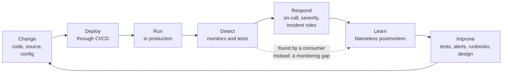

# DataOps: On-Call, Incidents and the Operating Model
> How a data team runs its pipelines like a production service: severity levels, on-call rotations, incident response, blameless postmortems and the few metrics that show whether it is getting better.

**Prerequisites:** [Pipeline Observability](pipeline-observability.md) · [Data Quality](data-quality.md) · [Testing and CI/CD](../06-infrastructure/testing-cicd.md)

**Related:** [Data Catalogs in Practice](data-catalogs.md) · [Governance & Lineage](governance-lineage.md) · [Airflow](../03-orchestration/airflow-reference.md) · [System Design](../08-architecture/system-design.md) · [Glossary](../99-reference/glossary.md)

---

## Overview

**Challenge:** Pipelines run around the clock, but teams work in office hours. When a job fails at 02:00, or a source ships a changed schema, or a join starts duplicating rows, the response depends on who happens to notice. The people who find out first are often the consumers of the data, an executive reading a wrong number, not the team that owns it. Incidents are handled from memory in a chat thread, the same failures recur, and a few people become the heroes who know how everything works and are permanently on call.

**Solution:** DataOps is the discipline of running data pipelines the way a good engineering team runs a service. [Pipeline Observability](pipeline-observability.md) covers how to *detect* problems: the five signals, SLIs and SLOs, alert design. This guide covers what a team does with that detection: who is responsible at 02:00, how bad an incident is, how the team responds together, how it learns afterwards, and how it measures whether things are improving. The aim is a process that works without heroes.



**Relevance to data engineering:** Data incidents have their own character. The pipeline is often "green" while the data is wrong, the damage spreads downstream to dashboards and models before anyone notices, and the fix usually needs a backfill as well as a code change. A data-specific process handles all three. The code in this guide (a severity classifier, incident metrics, an on-call load report and a runbook linter) is small and tested, so you can adopt it or adapt it.

---

**On this page**

**Basic**
- [What DataOps Is](#what-dataops-is)
- [Ownership: You Build It, You Run It](#ownership-you-build-it-you-run-it)
- [Severity Levels](#severity-levels)

**Intermediate**
- [Designing On-Call](#designing-on-call)
- [Measuring On-Call Load](#measuring-on-call-load)
- [Runbooks](#runbooks)

**Advanced**
- [Running an Incident](#running-an-incident)
- [The Data-Specific Playbook](#the-data-specific-playbook)
- [Blameless Postmortems](#blameless-postmortems)
- [Measuring Improvement](#measuring-improvement)
- [Change Management](#change-management)
- [Practising](#practising)

**Reference**
- [Common Pitfalls](#common-pitfalls)
- [Cheat Sheet](#cheat-sheet)
- [Interview Questions](#interview-questions)
- [Further Reading](#further-reading)

---

## What DataOps Is

The DataOps Manifesto states its values as a set of preferences: **individuals and interactions** over processes and tools, **working analytics** over comprehensive documentation, **customer collaboration** over contract negotiation, **experimentation, iteration and feedback** over extensive upfront design, and **cross-functional ownership of operations** over siloed responsibilities. Several of its 18 principles are practical rules for operations:

| Principle | What it means for operating pipelines |
|-----------|---------------------------------------|
| **Reduce heroism** | Sustainable processes that do not depend on one person who knows how it all works |
| **Analytics is code** | Pipelines, tests, alerts and runbooks live in version control and are reviewed |
| **Make it reproducible** | Version everything, from data to configuration, so a problem can be recreated |
| **Disposable environments** | Create and destroy test environments on demand, so testing does not touch production |
| **Quality is paramount** | Detect abnormalities and security issues automatically |
| **Monitor quality and performance** | Track metrics continuously |
| **Improve cycle times** | Shorten the time from an idea to a working result |
| **Reflect** | Regularly assess how the team operates and adjust |

These are the same ideas as DevOps and site reliability engineering applied to data, and much of the practice is borrowed directly. The parts that are different are the failure modes (wrong data instead of downtime) and the fixes (a backfill). The rest of this guide adopts practice from the Google SRE book, which is the best-documented source, and adapts it for data.

| | DevOps | SRE | DataOps |
|-|--------|-----|---------|
| **Focus** | Delivering software quickly and reliably | Reliability targets, error budgets and on-call | Delivering trustworthy data and analytics |
| **Typical failure** | Outage, bug | Outage, latency | Wrong, late or missing data, often with no error |
| **Recovery** | Roll back, redeploy | Mitigate, restore | Stop publishing, fix, backfill, verify |
| **Shared practices** | CI/CD, infrastructure as code | SLOs, postmortems, incident response | All of these, plus data testing and lineage |

---

## Ownership: You Build It, You Run It

Reliability follows ownership. A pipeline that nobody is accountable for at 02:00 will fail at 02:00 and stay failed until someone complains. The model that works is **cross-functional ownership**: the team that builds a data product also runs it, and is on call for it.

- **Every production dataset has one owning team,** recorded where people can find it, in the [catalog](data-catalogs.md) and in the runbook. Use a team, not a person, since people leave and go on holiday.
- **Ownership includes the alerts.** The owner decides the SLO, receives the page, and fixes or removes any alert that is not useful.
- **A platform team owns the platform** (orchestrator, warehouse, deployment pipeline), and product teams own their pipelines on top of it. Make the boundary explicit, or incidents fall between the two.
- **Consumers are stakeholders,** not bystanders. They agree the SLO, and they are told when it is breached.

---

## Severity Levels

Severity decides how loud the response is: who gets woken, who is told and how fast. If it is decided by how alarming an incident *feels*, the same incident is handled differently by different people. Define severity from **facts**, and write the rules down. This matrix asks four questions: who consumes the data, whether bad data was actually published, whether an SLA was breached, and whether sensitive data was exposed.

| Severity | Criteria | Typical response |
|----------|----------|------------------|
| **SEV1** | Sensitive data was exposed, or wrong data reached external consumers (customers, regulators) | Page immediately at any hour. An incident commander. Leadership and affected consumers are told |
| **SEV2** | Wrong data reached many internal consumers, or an SLA was breached | Page during on-call hours. An incident commander. Consumers are told |
| **SEV3** | Wrong data, contained to one team, with a workaround | Handled in working hours by the owning team. A ticket, no page |
| **SEV4** | Caught before it reached anyone | Fix in the normal course of work. Learn from it if it was a near miss |

The rules are code, so they are unambiguous and testable:

```python
# ops/incidents.py
"""Classify data incidents objectively and measure how well the team detects and resolves them."""
import statistics
from collections import Counter
from dataclasses import dataclass
from datetime import datetime, timedelta

AUDIENCES = ("team", "internal", "external")     # who consumes the affected data, from narrowest to widest


def classify_severity(audience: str, bad_data_published: bool, sla_breached: bool, sensitive_exposed: bool) -> str:
    """Return SEV1 (worst) to SEV4 from facts about the incident, not from how alarming it feels."""
    if audience not in AUDIENCES:
        raise ValueError(f"audience must be one of {AUDIENCES}")
    if sensitive_exposed:
        return "SEV1"
    if bad_data_published and audience == "external":
        return "SEV1"
    if bad_data_published and (audience == "internal" or sla_breached):
        return "SEV2"
    if sla_breached:
        return "SEV2"
    if bad_data_published:
        return "SEV3"
    return "SEV4"                                 # caught before it reached anyone


@dataclass
class Incident:
    id: str
    severity: str
    cause: str
    detected_by: str                              # "monitor", "engineer" or "consumer"
    started_at: datetime                          # when the data first went wrong or late (often found later)
    detected_at: datetime
    acknowledged_at: datetime
    resolved_at: datetime


def _minutes(delta: timedelta) -> float:
    return delta.total_seconds() / 60


def _summary(values: list[float]) -> dict:
    ordered = sorted(values)
    p90 = ordered[0] if len(ordered) == 1 else statistics.quantiles(ordered, n=10, method="inclusive")[-1]
    return {"median": round(statistics.median(ordered), 1), "p90": round(p90, 1)}


def incident_metrics(incidents: list[Incident]) -> dict:
    """Times are in minutes. Medians and 90th percentiles resist a single very long incident better than means."""
    if not incidents:
        raise ValueError("no incidents to summarise")
    by_consumers = sum(i.detected_by == "consumer" for i in incidents)
    return {
        "count": len(incidents),
        "by_severity": dict(sorted(Counter(i.severity for i in incidents).items())),
        "by_cause": dict(Counter(i.cause for i in incidents).most_common()),
        "time_to_detect": _summary([_minutes(i.detected_at - i.started_at) for i in incidents]),
        "time_to_acknowledge": _summary([_minutes(i.acknowledged_at - i.detected_at) for i in incidents]),
        "time_to_resolve": _summary([_minutes(i.resolved_at - i.detected_at) for i in incidents]),
        "found_by_consumers": round(by_consumers / len(incidents), 2),
    }
```

Notes on the design. Severity comes only from facts, so an argument about severity becomes an argument about a fact ("was bad data published?"). The order of the checks matters and is tested: sensitive exposure beats everything, and a late-but-correct dataset that breaches an SLA is a SEV2 even though nothing wrong was published. Adjust the rules for your organisation, but keep them explicit. A response-time target for each level (for example a few minutes for a page that wakes someone, and longer for a working-hours ticket) is a choice for your team. The SRE book uses about 5 minutes for user-facing services and about 30 minutes for less time-sensitive systems as reference points.

---

## Designing On-Call

On-call is the mechanism that turns ownership into a response. Done badly, it burns people out and the best engineers leave. The Google SRE book gives concrete guidance that applies well to data teams:

| Guidance | Detail |
|----------|--------|
| **Cap the time spent on-call** | No more than 25% of an engineer's time, with at least 50% on engineering work |
| **Cap the incidents per shift** | At most 2 per 12-hour shift. More than that and the on-call cannot do the follow-up properly |
| **Account for follow-up** | An incident takes about 6 hours on average once root-cause analysis, remediation and the postmortem are included, not just the page |
| **Have enough people** | At least 8 engineers for a single-site 24/7 rotation with primary and secondary coverage, or 6 per site when two sites share the rotation |
| **Keep everyone practised** | Each engineer on-call once or twice a quarter, to avoid a few experts and a rusty rest |
| **Compensate it** | Time off in lieu or cash, capped at a proportion of salary, so on-call is recognised without an incentive to be paged |

Adapt the numbers to your size. A team of four cannot run a 24/7 rotation without exhausting itself, and the honest answer may be business-hours on-call with a defined best-effort out of hours, tied to the SLOs (if the data is not needed until 09:00, nobody should be woken at 03:00 for it). Also:

- **A primary and a secondary,** so a missed page has somewhere to go, and an escalation path with times ("after 30 minutes, page the team lead").
- **A written handoff** at each rotation change: what is open, what is fragile, what changed.
- **The right to fix the system.** Time after a bad shift to make sure it does not happen again is part of the job, not a favour.
- **Follow-the-sun only if you have the people.** Two sites share the load only if both have a real team.

---

## Measuring On-Call Load

On-call quality is measurable. Overload shows up in the pages, before it shows up in resignations. This module takes the pages from your paging tool and reports what needs fixing, against the SRE guidance above:

```python
# ops/oncall.py
"""Measure the load on an on-call rotation, so overload is seen before people burn out."""
from collections import defaultdict
from dataclasses import dataclass
from datetime import datetime, timedelta

MAX_PAGES_PER_12H = 2          # the SRE book's ceiling for incidents in one 12-hour shift
NOISY_ACTIONABLE_RATE = 0.5    # an alert that leads to action less than half the time is training people to ignore it
MIN_PAGES_TO_JUDGE = 5         # too few pages to say anything about an alert


@dataclass
class Page:
    at: datetime
    person: str
    alert: str
    actionable: bool           # did the page need a human to do something?


def out_of_hours(at: datetime, start_hour: int = 9, end_hour: int = 18) -> bool:
    return at.weekday() >= 5 or not (start_hour <= at.hour < end_hour)


def busiest_12h_window(pages: list[Page]) -> int:
    """The most pages any one person received inside any 12-hour window."""
    worst = 0
    by_person = defaultdict(list)
    for page in pages:
        by_person[page.person].append(page.at)
    for times in by_person.values():
        times.sort()
        for i, start in enumerate(times):
            in_window = sum(1 for t in times[i:] if t - start < timedelta(hours=12))
            worst = max(worst, in_window)
    return worst


def oncall_report(pages: list[Page]) -> dict:
    """Summarise the load and list what needs fixing."""
    if not pages:
        return {"pages": 0, "out_of_hours_share": 0.0, "busiest_12h": 0, "noisy_alerts": [], "findings": []}

    by_alert = defaultdict(list)
    for page in pages:
        by_alert[page.alert].append(page.actionable)
    noisy = sorted(
        alert for alert, flags in by_alert.items()
        if len(flags) >= MIN_PAGES_TO_JUDGE and sum(flags) / len(flags) < NOISY_ACTIONABLE_RATE
    )
    busiest = busiest_12h_window(pages)
    off_hours = sum(out_of_hours(p.at) for p in pages) / len(pages)

    findings = []
    if busiest > MAX_PAGES_PER_12H:
        findings.append(f"someone received {busiest} pages in 12 hours (guidance: at most {MAX_PAGES_PER_12H})")
    for alert in noisy:
        findings.append(f"alert '{alert}' is mostly not actionable: fix it or remove it")
    return {
        "pages": len(pages),
        "out_of_hours_share": round(off_hours, 2),
        "busiest_12h": busiest,
        "noisy_alerts": noisy,
        "findings": findings,
    }
```

It reports the number of pages, the share outside working hours, the busiest 12-hour window for any one person, and the **noisy alerts**: alerts that lead to action less than half the time, once there are enough pages to judge. A page that needs no action is worse than useless, because it teaches the team to ignore pages. Fix such an alert, tune its threshold, turn it into a ticket, or delete it. On a small example the report looks like this:

```json
{
  "pages": 9,
  "out_of_hours_share": 0.44,
  "busiest_12h": 3,
  "noisy_alerts": ["row-count-drift"],
  "findings": [
    "someone received 3 pages in 12 hours (guidance: at most 2)",
    "alert 'row-count-drift' is mostly not actionable: fix it or remove it"
  ]
}
```

Review this every week or every rotation, and treat a finding as work to schedule, not a fact of life. **Every page should be actionable, urgent and new.** If it is none of these, change the alert.

---

## Runbooks

A runbook is what someone half awake at 03:00 reads. It should let a competent engineer who did not build the pipeline diagnose and mitigate the common failure without asking anyone. A good runbook covers one alert or one failure, and has the same sections every time: the **symptoms** that trigger it, the **impact** (who is affected, and by when it matters), how to **diagnose**, how to **mitigate**, when and whom to **escalate** to, and who **owns** it. It records when it was **last reviewed**, because a stale runbook is worse than none. The linter checks these:

```python
# ops/runbook.py
"""Check that a runbook has what someone woken at 03:00 needs."""
import re
from datetime import date

REQUIRED_SECTIONS = ["Symptoms", "Impact", "Diagnosis", "Mitigation", "Escalation", "Owner"]
MAX_AGE_DAYS = 180


def lint_runbook(markdown: str, today: date) -> list[str]:
    """Return the problems found. An empty list means the runbook is usable."""
    problems = []
    headings = {h.strip().lower() for h in re.findall(r"^#{1,3}\s+(.+)$", markdown, re.MULTILINE)}
    for section in REQUIRED_SECTIONS:
        if section.lower() not in headings:
            problems.append(f"missing section: {section}")

    reviewed = re.search(r"^\*?\*?Last reviewed:?\*?\*?:?\s*(\d{4}-\d{2}-\d{2})", markdown, re.MULTILINE | re.IGNORECASE)
    if not reviewed:
        problems.append("missing 'Last reviewed: YYYY-MM-DD'")
    else:
        age = (today - date.fromisoformat(reviewed.group(1))).days
        if age > MAX_AGE_DAYS:
            problems.append(f"last reviewed {age} days ago (limit {MAX_AGE_DAYS})")

    if "## Mitigation" in markdown and not re.search(r"^\s*(\d+\.|-|\*)\s+\S", markdown.split("## Mitigation", 1)[1], re.MULTILINE):
        problems.append("the Mitigation section has no steps")
    return problems
```

An example runbook that passes, in the format the linter expects:

```markdown
# fct_orders is late

**Last reviewed:** 2026-08-20

## Symptoms
The freshness alert fires and the finance dashboard shows yesterday's numbers.

## Impact
Finance cannot close the day. Affects the 08:00 report.

## Diagnosis
1. Check the orchestrator for the failed task.
2. Check whether the source system delivered its file.

## Mitigation
1. Re-run the failed task.
2. If the source file is missing, ask the source team and post in #data-orders.

## Escalation
After 30 minutes, page the data-orders lead.

## Owner
data-orders-team
```

The tests for all four modules are the specification of the rules, so read them before you change a threshold:

```python
# tests/test_ops.py
from datetime import date, datetime, timedelta

import pytest

from ops.incidents import Incident, classify_severity, incident_metrics
from ops.oncall import Page, busiest_12h_window, oncall_report, out_of_hours
from ops.runbook import lint_runbook


# ---- severity ---------------------------------------------------------------------------

@pytest.mark.parametrize("audience, bad_data, sla, sensitive, expected", [
    ("team", False, False, True, "SEV1"),          # exposed sensitive data is always the worst
    ("external", True, False, False, "SEV1"),      # wrong data reached customers or a regulator
    ("internal", True, False, False, "SEV2"),      # wrong data reached many internal consumers
    ("team", True, True, False, "SEV2"),           # an SLA was breached
    ("team", False, True, False, "SEV2"),          # late data that breached an SLA, nothing wrong published
    ("team", True, False, False, "SEV3"),          # wrong data, contained to one team
    ("team", False, False, False, "SEV4"),         # caught before publishing
])
def test_severity_follows_the_facts(audience, bad_data, sla, sensitive, expected):
    assert classify_severity(audience, bad_data, sla, sensitive) == expected


def test_an_unknown_audience_is_refused():
    with pytest.raises(ValueError):
        classify_severity("everyone", True, True, True)


# ---- incident metrics -------------------------------------------------------------------

T0 = datetime(2026, 9, 1, 2, 0)


def incident(id, severity="SEV3", cause="upstream", by="monitor", started=0, detected=10, acked=15, resolved=70):
    return Incident(id, severity, cause, by, T0 + timedelta(minutes=started), T0 + timedelta(minutes=detected),
                    T0 + timedelta(minutes=acked), T0 + timedelta(minutes=resolved))


def test_metrics_report_medians_and_percentiles_in_minutes():
    incidents = [incident("a", detected=10, acked=12, resolved=40),
                 incident("b", detected=30, acked=35, resolved=90),
                 incident("c", detected=600, acked=610, resolved=700)]     # found ten hours late

    result = incident_metrics(incidents)

    assert result["count"] == 3
    assert result["time_to_detect"]["median"] == 30.0
    assert result["time_to_detect"]["p90"] > result["time_to_detect"]["median"]
    assert result["time_to_acknowledge"]["median"] == 5.0


def test_the_share_found_by_consumers_is_the_health_signal_that_matters():
    incidents = [incident("a", by="monitor"), incident("b", by="consumer"), incident("c", by="consumer"), incident("d", by="engineer")]
    assert incident_metrics(incidents)["found_by_consumers"] == 0.5


def test_counts_by_severity_and_cause():
    incidents = [incident("a", "SEV2", "schema change"), incident("b", "SEV3", "schema change"), incident("c", "SEV3", "late source")]
    result = incident_metrics(incidents)
    assert result["by_severity"] == {"SEV2": 1, "SEV3": 2}
    assert list(result["by_cause"].items())[0] == ("schema change", 2)


def test_a_single_incident_can_still_be_summarised():
    assert incident_metrics([incident("only")])["time_to_resolve"]["median"] == 60.0


def test_no_incidents_is_an_error_not_a_zero():
    with pytest.raises(ValueError, match="no incidents to summarise"):
        incident_metrics([])


# ---- on-call load -----------------------------------------------------------------------

MONDAY_NOON = datetime(2026, 9, 7, 12, 0)


def test_weekends_and_nights_are_out_of_hours():
    assert out_of_hours(MONDAY_NOON) is False
    assert out_of_hours(MONDAY_NOON.replace(hour=3)) is True
    assert out_of_hours(datetime(2026, 9, 5, 12, 0)) is True       # a Saturday


def test_the_busiest_window_counts_pages_for_one_person():
    pages = [Page(MONDAY_NOON + timedelta(hours=h), "ana", "freshness", True) for h in (0, 1, 2, 30)]
    pages += [Page(MONDAY_NOON, "bo", "freshness", True)]
    assert busiest_12h_window(pages) == 3


def test_an_overloaded_shift_is_reported():
    pages = [Page(MONDAY_NOON + timedelta(hours=h), "ana", "freshness", True) for h in (0, 1, 2)]
    report = oncall_report(pages)
    assert report["busiest_12h"] == 3
    assert any("3 pages in 12 hours" in finding for finding in report["findings"])


def test_a_mostly_non_actionable_alert_is_called_noisy_but_only_with_enough_evidence():
    noisy = [Page(MONDAY_NOON + timedelta(days=d), "ana", "row-count-drift", d == 0) for d in range(6)]    # 1 in 6 actionable
    rare = [Page(MONDAY_NOON, "ana", "rarely-fires", False)]                                               # one page proves nothing
    report = oncall_report(noisy + rare)
    assert report["noisy_alerts"] == ["row-count-drift"]


def test_a_quiet_rotation_has_no_findings():
    pages = [Page(MONDAY_NOON + timedelta(days=d), "ana", "freshness", True) for d in range(3)]
    assert oncall_report(pages)["findings"] == []


def test_no_pages_is_an_empty_report():
    assert oncall_report([])["pages"] == 0


# ---- runbooks ---------------------------------------------------------------------------

GOOD_RUNBOOK = """\
# fct_orders is late

**Last reviewed:** 2026-08-20

## Symptoms
The freshness alert fires and the finance dashboard shows yesterday's numbers.

## Impact
Finance cannot close the day. Affects the 08:00 report.

## Diagnosis
1. Check the orchestrator for the failed task.
2. Check whether the source system delivered its file.

## Mitigation
1. Re-run the failed task.
2. If the source file is missing, ask the source team and post in #data-orders.

## Escalation
After 30 minutes, page the data-orders lead.

## Owner
data-orders-team
"""


def test_a_complete_recent_runbook_passes():
    assert lint_runbook(GOOD_RUNBOOK, today=date(2026, 9, 28)) == []


@pytest.mark.parametrize("section", ["Symptoms", "Impact", "Diagnosis", "Mitigation", "Escalation", "Owner"])
def test_each_missing_section_is_reported(section):
    text = GOOD_RUNBOOK.replace(f"## {section}", "## Notes")
    assert f"missing section: {section}" in lint_runbook(text, today=date(2026, 9, 28))


def test_a_stale_runbook_is_reported():
    problems = lint_runbook(GOOD_RUNBOOK, today=date(2027, 3, 1))
    assert any("days ago" in problem for problem in problems)


def test_a_runbook_with_no_review_date_is_reported():
    text = GOOD_RUNBOOK.replace("**Last reviewed:** 2026-08-20\n", "")
    assert "missing 'Last reviewed: YYYY-MM-DD'" in lint_runbook(text, today=date(2026, 9, 28))


def test_a_mitigation_with_no_steps_is_reported():
    text = GOOD_RUNBOOK.replace("1. Re-run the failed task.\n2. If the source file is missing, ask the source team and post in #data-orders.\n",
                                "Fix it.\n")
    assert "the Mitigation section has no steps" in lint_runbook(text, today=date(2026, 9, 28))
```

Keep runbooks in Git beside the pipeline, link each alert to its runbook, run the linter in CI, and update the runbook in the postmortem of any incident it did not help with. Better still, automate the mitigation: a runbook step that never changes is a candidate for code.

---

## Running an Incident

Google's incident management framework separates roles so that no one is doing everything at once. For small teams one person may hold several roles, but the roles should still be named.

| Role | Responsibility |
|------|----------------|
| **Incident commander** | Holds the high-level state of the incident, structures the response and assigns roles by need and priority. Does not fix things personally |
| **Operations lead** | Works with the commander and applies the operational tools to the problem: the person with hands on the system |
| **Communications** | The point of contact for the responders and stakeholders: sends the periodic updates and keeps the incident record accurate |
| **Planning** | Handles longer-term concerns: filing tickets, arranging handoffs, tracking how the system differs from normal |

Practices that make it work:

- **Declare an incident** when the criteria are met, so the response starts properly. The SRE book's criteria: a second team is needed, the outage affects customers, or the problem is unsolved after an hour of concentrated analysis. Add a data criterion: bad data was published.
- **Use one command post,** a single channel where everyone can reach the commander, so information does not fragment across threads and direct messages.
- **Keep a live incident document.** It is the commander's most important responsibility: a running timeline of what is known, what was tried and who is doing what.
- **Separate responsibilities.** A clear division lets people act without second-guessing each other.
- **Hand off explicitly.** When command passes, the outgoing commander says so and waits for acknowledgment.
- **Communicate on a schedule,** even when there is nothing new ("still investigating, next update at 10:30"), so consumers do not have to ask.

---

## The Data-Specific Playbook

Most of the incident is the same as any service, but data incidents have their own first moves.

1. **Stop the bleeding.** Pause the downstream jobs and publishing so bad data does not spread further, and hide or flag the affected tables or dashboards. Stopping publication is nearly always right.
2. **Assess the blast radius.** Use lineage to list the downstream tables, dashboards and models, and who consumes them. A [catalog](data-catalogs.md) turns this from an hour of guessing into a query.
3. **Tell the consumers,** with the same clarity as an outage: which data, since when, what to do until it is fixed. Silence costs more trust than the incident.
4. **Find and fix the cause.** Roll back the change, fix the source or repair the logic. Bisect by time: what changed just before the data went wrong?
5. **Repair the data.** Backfill the affected range. Because runs are idempotent, this is a rerun, and it should be a documented, tested operation. See [Testing and CI/CD](../06-infrastructure/testing-cicd.md#testing-idempotency-and-backfills).
6. **Verify before reopening.** Compare the repaired output with a known-good baseline (a data diff), run the tests, and check the downstream results. See [comparing outputs](../06-infrastructure/testing-cicd.md#comparing-outputs-with-a-data-diff).
7. **Resume publishing and confirm** with the consumers.
8. **Record the timeline** as you go, since the postmortem depends on it.

The most valuable question at the end of an incident is "how did we find out?". If a consumer found it, monitoring failed, and closing that gap is the first action.

---

## Blameless Postmortems

A postmortem is a written record of an incident, its impact, what was done to mitigate or resolve it, the root causes, and the follow-up actions that prevent a recurrence. It is **blameless**: it identifies contributing causes without blaming any individual or team, on the assumption that everyone acted with good intentions given what they knew. The reason is practical. People who fear punishment hide problems, and hidden problems recur.

**Decide the triggers in advance.** Common criteria, from the SRE book, that map directly to data teams: user-visible degradation beyond a threshold, **data loss of any kind**, an on-call engineer having to intervene, a resolution time above a threshold, and **a monitoring failure** (which usually means someone found the problem manually). Anyone may request a postmortem.

A useful template:

| Section | Content |
|---------|---------|
| **Summary** | Two or three sentences a stranger can understand |
| **Impact** | Which data, which consumers, for how long, and any decisions made on wrong numbers |
| **Timeline** | What happened, in order, with times: when it started, when it was detected and by whom, and each action |
| **Root and contributing causes** | Several causes, not a single culprit. Include why detection and prevention failed |
| **What went well** | Recognise the good, so it is repeated |
| **Action items** | Each with an owner and a due date, and each aimed at the system (a test, an alert, a contract, a runbook), not at reminding people to be careful |
| **Lessons** | What the team understands now that it did not before |

Keep the culture healthy: review every postmortem (as the SRE book puts it, "an unreviewed postmortem might as well never have existed"), share them widely, follow up on the action items, and recognise good incident handling and good postmortems. **Track the action items to completion.** A postmortem whose actions never get done is a ritual. The commonest fixes for data incidents are a new test, a new monitor, a data contract with the producer, and a better runbook.

---

## Measuring Improvement

Measure the process to see whether it works, and keep the set small. The incident toolkit computes the timing metrics from a list of incidents. This script builds five sample incidents and some pages, and prints both reports:

```python
# demo.py
import json
from datetime import datetime, timedelta

from ops.incidents import Incident, incident_metrics
from ops.oncall import Page, oncall_report

t = datetime(2026, 9, 1, 2, 0)


def incident(id, severity, cause, by, started, detected, acked, resolved):
    m = lambda minutes: t + timedelta(minutes=minutes)
    return Incident(id, severity, cause, by, m(started), m(detected), m(acked), m(resolved))


incidents = [
    incident("INC-101", "SEV3", "late source file", "monitor", 0, 12, 15, 75),
    incident("INC-102", "SEV2", "schema change upstream", "consumer", 0, 300, 310, 480),
    incident("INC-103", "SEV3", "late source file", "monitor", 0, 20, 22, 60),
    incident("INC-104", "SEV2", "bad join after a release", "consumer", 0, 720, 735, 900),
    incident("INC-105", "SEV4", "failed task, retried", "monitor", 0, 5, 6, 25),
]
print(json.dumps(incident_metrics(incidents), indent=2))

monday = datetime(2026, 9, 7, 3, 0)
pages = [Page(monday + timedelta(hours=h), "ana", "freshness-orders", True) for h in (0, 2, 5)]
pages += [Page(monday + timedelta(days=d, hours=9), "bo", "row-count-drift", d == 0) for d in range(6)]
print(json.dumps(oncall_report(pages), indent=2))
```

The first report, for the incidents:

```json
{
  "count": 5,
  "by_severity": {"SEV2": 2, "SEV3": 2, "SEV4": 1},
  "by_cause": {
    "late source file": 2,
    "schema change upstream": 1,
    "bad join after a release": 1,
    "failed task, retried": 1
  },
  "time_to_detect": {"median": 20.0, "p90": 552.0},
  "time_to_acknowledge": {"median": 3.0, "p90": 13.0},
  "time_to_resolve": {"median": 63.0, "p90": 180.0},
  "found_by_consumers": 0.4
}
```

This is a small worked example, and what it shows is typical. The **median time to detect is 20 minutes, but the 90th percentile is 552**. The average would hide that. The long tail is the two incidents that consumers found first (`found_by_consumers` is 0.4), and they are also the two SEV2s. Time to acknowledge is short, so paging works, and detection is the weakness. **That share of incidents found by consumers is the single most telling measure of a data team's monitoring**, and the goal is to drive it towards zero. The counts by cause show where prevention pays: two of the five incidents were a late source file, which is a candidate for a contract and an alert with a longer grace period.

| Metric | What it tells you |
|--------|-------------------|
| **Found by consumers** | Whether monitoring catches problems before the business does |
| **Time to detect** (median and p90) | How long bad data is live before anyone knows |
| **Time to acknowledge** | Whether paging and on-call work |
| **Time to resolve** (median and p90) | How effective runbooks and tooling are |
| **Incidents by severity and cause** | Where to invest in prevention |
| **Pages per shift, out-of-hours share, noisy alerts** | Whether on-call is sustainable |
| **Postmortem action items closed** | Whether the team learns |

**Use medians and percentiles, not averages,** because one very long incident distorts a mean. Review the metrics on a schedule, and compare quarter to quarter.

For the delivery side, DORA's software delivery metrics apply to pipeline changes as well. **Change lead time** is the time from a commit to running in production, **deployment frequency** is how often you deploy, **failed deployment recovery time** is how long it takes to recover from a deployment that needs immediate intervention, **change fail rate** is the share of deployments that need that intervention (a rollback or a hotfix), and **deployment rework rate** is the share of deployments that are unplanned and result from a production incident. Fast, frequent, safe change and reliable operations go together: small, well-tested changes fail less and are easier to fix.

If you have SLOs, connect them: an **error budget** (the failure an SLO allows, defined in [Pipeline Observability](pipeline-observability.md)) gives the team a principled rule. While the budget remains, ship changes. When it is spent, slow down and fix reliability.

---

## Change Management

Most data incidents follow a change: a release, a source schema change, a configuration edit or a backfill. Good operations make change safe and visible.

- **Ship through CI/CD,** with tests, a data diff and a review, so changes are verified before production. See [Testing and CI/CD](../06-infrastructure/testing-cicd.md).
- **Prefer small, frequent changes.** They are easier to review, to bisect and to roll back than large batches.
- **Make changes visible.** A change log or deployment feed that responders can check first when something breaks. "What changed?" is the first question of nearly every incident.
- **Decide roll back or roll forward in advance,** and keep the previous output until the new one has proven itself.
- **Agree changes with producers and consumers.** A contract with the upstream team turns a surprise schema change into a reviewed one.
- **Control the risky moments.** Freeze non-essential changes around critical periods (a financial close, a launch), and require approval for backfills that touch a lot of data or a lot of money.
- **Schedule with care.** Avoid Friday-evening deployments, and make sure someone is around after a change.

---

## Practising

A process you have never used will fail when you need it. Practise it while the stakes are low.

- **Tabletop exercises.** Walk the team through a scenario: "the orders table has double-counted for two days and finance has already reported it". Who declares? Who tells whom? What is the first move? Gaps in roles, runbooks and contacts appear quickly.
- **Game days.** Cause a controlled failure in a test environment, such as a late file or a broken schema, and watch how the team detects and responds. Practise the backfill too.
- **Shadowing.** New on-call engineers shadow an experienced one before taking a rotation.
- **Runbook drills.** Have someone who did not write the runbook follow it. Fix every step where they get stuck.
- **Review the process.** After every serious incident, and on a schedule, ask what about the process itself (not just the system) should change.

---

## Common Pitfalls

| Pitfall | Symptom | Fix |
|---------|---------|-----|
| Consumers find the incidents | Executives report wrong numbers to the team | Track and drive down the share found by consumers, and add monitors after each miss |
| Severity by feel | The same incident handled differently each time | Facts-based rules, written down and tested |
| Heroes | One person is always paged, and leaves | Runbooks, rotations, and cross-training |
| Alerts that are not actionable | The team ignores pages | Measure the actionable rate, and fix or delete noisy alerts |
| Too few people in the rotation | Burnout and attrition | Follow the sizing guidance, or use business-hours on-call tied to SLOs |
| Paging for data not needed until morning | Sleepless nights for nothing | Derive urgency from the SLO |
| No runbook, or a stale one | Every incident starts from zero | Write one per alert, lint it, review it after incidents |
| Everyone debugging in private threads | Duplicate work and lost information | One command post and a live incident document |
| No incident commander | Confusion about who decides | Name the role, even in a small team |
| Not telling consumers | Loss of trust, and duplicate questions | A communication plan and regular updates |
| Fixing the code but not the data | Wrong numbers remain in the warehouse | Backfill and verify with a data diff |
| Reopening publishing without verification | The bad data returns | Compare with a baseline and run the tests first |
| Blaming people in postmortems | Problems get hidden | Blameless format, focused on system causes |
| Action items without owners | The same incident repeats | An owner and a due date for each, tracked to completion |
| Postmortems nobody reads | No organisational learning | Review and share them, and recognise good ones |
| Measuring averages | A long tail hidden by a good mean | Medians and 90th percentiles |
| Untested process | It fails on the first real incident | Tabletops and game days |
| Changes with no visible log | Nobody can answer "what changed?" | A deployment and change feed |

---

## Cheat Sheet

| Task | Practice |
|------|----------|
| Rate an incident | Ask: who consumes the data, was bad data published, was an SLA breached, was sensitive data exposed |
| Declare an incident | A second team is needed, customers or consumers are affected, bad data was published, or it is unsolved after an hour |
| Roles | Incident commander · operations lead · communications · planning |
| First data move | Stop publishing, then find the blast radius from lineage |
| Communicate | On a schedule, even with no news |
| Repair | Fix the cause, backfill (idempotent), verify with a data diff |
| On-call limits | At most 25% of time on-call, at most 2 incidents per 12-hour shift, enough people to rotate |
| Good alert | Actionable, urgent and new |
| Runbook sections | Symptoms · Impact · Diagnosis · Mitigation · Escalation · Owner · Last reviewed |
| Postmortem triggers | Data loss · on-call intervention · long resolution · monitoring failure |
| Postmortem output | Blameless timeline, causes, action items with owners |
| Key metrics | Found by consumers · time to detect (median, p90) · time to resolve · pages per shift |
| DORA | Change lead time · deployment frequency · failed deployment recovery time · change fail rate · deployment rework rate |
| Practise | Tabletop exercises, game days, runbook drills |

**Order of adoption:** name owners → define severity → set up on-call with a runbook per alert → run incidents with roles → blameless postmortems → measure found-by-consumers → practise

---

## Interview Questions

**Q: What is DataOps, and how does it differ from DevOps?**
A: DataOps applies the ideas of DevOps and site reliability engineering to data work: version-controlled, tested pipelines, automated deployment, monitoring, cross-functional ownership and continuous improvement, with a focus on reducing heroism. The difference is the failure mode and the recovery. Data failures are often wrong or late data with no error, they spread downstream before anyone notices, and the fix usually needs a backfill and verification, not only a rollback.

**Q: How do you decide the severity of a data incident?**
A: From facts, using written rules, not from how alarming it feels. I ask who consumes the affected data, whether bad data was actually published, whether an SLA was breached, and whether sensitive data was exposed. Sensitive exposure or wrong data reaching external consumers is the highest severity, wrong data reaching many internal consumers or an SLA breach is next, contained wrong data is lower, and something caught before it reached anyone is the lowest. The severity then sets the response: who is paged, whether a commander is assigned, and who is told.

**Q: How would you design a sustainable on-call rotation for a data team?**
A: Tie urgency to SLOs so nobody is woken for data that is not needed until morning. Cap the load using the SRE guidance: no more than about a quarter of time on-call and at most two incidents per 12-hour shift, and remember that an incident takes hours of follow-up. Have enough people for a primary and secondary, and if the team is too small, use business-hours on-call with best-effort outside them. Give every alert a runbook, measure pages and non-actionable alerts each rotation, and give people time to fix causes.

**Q: Walk me through how you would run a serious data incident.**
A: Declare it and name an incident commander, an operations lead and someone for communications, in one channel with a live document. First stop the bleeding by pausing publishing and downstream jobs, then use lineage to find the affected tables and consumers, and tell them, with regular updates. Find the cause by asking what changed, fix or roll back, then backfill the bad range. Verify the repaired data against a baseline before resuming, and confirm with consumers. Afterwards run a blameless postmortem, and ask how we found out.

**Q: What is a blameless postmortem, and what makes it effective?**
A: It is a written record of an incident, its impact, the actions taken, the causes and the follow-up actions, focused on contributing causes in the system instead of on individuals, on the assumption that people acted reasonably with what they knew. That makes people willing to surface problems. It is effective when triggers are decided in advance (data loss, on-call intervention, a monitoring failure), it is reviewed and shared, and the action items have owners and dates and are actually completed, ideally as tests, monitors, contracts and runbooks.

**Q: Which metrics would you track to know whether the data team's operations are improving?**
A: The share of incidents found by consumers, which measures whether monitoring works, time to detect and time to resolve as medians and 90th percentiles, incidents by severity and cause to direct prevention, on-call load (pages per shift, out-of-hours share, noisy alerts), and the closure rate of postmortem action items. For delivery I add DORA's change lead time, deployment frequency, change fail rate and recovery time. I use percentiles because a single long incident distorts an average.

---

## Further Reading

- [The DataOps Manifesto](https://dataopsmanifesto.org/en/)
- [Google SRE book: Being On-Call](https://sre.google/sre-book/being-on-call/)
- [Google SRE book: Managing Incidents](https://sre.google/sre-book/managing-incidents/)
- [Google SRE book: Postmortem Culture](https://sre.google/sre-book/postmortem-culture/)
- [DORA's software delivery metrics](https://dora.dev/guides/dora-metrics/)

---

**Previous:** [Pipeline Observability](pipeline-observability.md) · **Next:** [Apache Airflow](../03-orchestration/airflow-reference.md) · **Back to:** [Index](../README.md)
