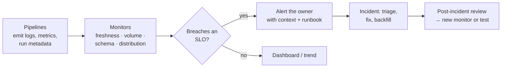

# Pipeline Observability & Incident Response
> How to know your pipelines are healthy before the business tells you they are not: SLAs, freshness and volume monitoring, structured logs, alerts, and a runbook for when something breaks.

**Prerequisites:** [Data Quality](data-quality.md) · [Apache Airflow](../03-orchestration/airflow-reference.md)

**Related:** [DataOps](dataops-operations.md) · [Governance & Lineage](governance-lineage.md) · [Dagster](../03-orchestration/dagster-reference.md) · [AI Observability](../07-ai/ai-observability.md) · [Glossary](../99-reference/glossary.md)

---

## Overview

**Challenge:** A pipeline can be "green" in the orchestrator and still deliver wrong data: a source stopped sending rows, a join silently dropped half of them, a column started arriving as null. Nobody notices until an executive asks why the dashboard is flat. Meanwhile, real failures generate so many noisy alerts that the team ignores all of them.

**Solution:** Observability means being able to answer *is the data fresh, complete and correct, and if not, where did it break?* from signals the pipeline already emits. Define what "healthy" means as measurable targets (SLIs and SLOs), monitor the few signals that matter (freshness, volume, schema, distribution, lineage), route alerts to an owner with a runbook, and learn from every incident.



**Relevance to data engineering:** Data downtime (data that is late, missing or wrong) is the main quality failure of a data platform. Observability is how you shorten the time to detect it and the time to resolve it.

---

**On this page**

**Basic**
- [The Five Signals](#the-five-signals)
- [SLIs, SLOs and SLAs for Data](#slis-slos-and-slas-for-data)
- [Structured Logging](#structured-logging)

**Intermediate**
- [Freshness Checks](#freshness-checks)
- [Volume and Anomaly Detection](#volume-and-anomaly-detection)
- [Pipeline Run Metrics](#pipeline-run-metrics)

**Advanced**
- [Alerting Design](#alerting-design)
- [Lineage and Impact Analysis](#lineage-and-impact-analysis)
- [Incident Response Runbook](#incident-response-runbook)
- [Tooling](#tooling)

**Reference**
- [Common Pitfalls](#common-pitfalls)
- [Cheat Sheet](#cheat-sheet)
- [Interview Questions](#interview-questions)
- [Further Reading](#further-reading)

---

## The Five Signals

| Signal | Question | Example failure it catches |
|--------|----------|----------------------------|
| **Freshness** | Did the data arrive on time? | The nightly load did not run, so yesterday's numbers are still showing |
| **Volume** | Did we get about the expected number of rows? | A source outage sends 3,000 rows instead of 6,000 |
| **Schema** | Did the structure change? | A column was renamed or its type changed upstream |
| **Distribution** | Are the values plausible? | Nulls in `customer_id` jump from 0.1% to 40% |
| **Lineage** | What produced this, and what depends on it? | A broken staging table breaks 12 dashboards, and you need to know which |

Job status (success or failure) is a sixth, weaker signal. It tells you the code ran, not that the data is right, which is why the other five matter. Pair these monitors with tests in the pipeline itself: tests block bad data at write time, and monitors watch for what tests did not anticipate. See [Data Quality](data-quality.md).

---

## SLIs, SLOs and SLAs for Data

| Term | Meaning | Data example |
|------|---------|--------------|
| **SLI** (indicator) | A measurement | Minutes between the source's last event and the table's latest row |
| **SLO** (objective) | An internal target for the SLI | 99% of days, `fct_orders` is ready by 07:00 UTC |
| **SLA** (agreement) | A commitment to consumers, with consequences | The finance report is delivered by 08:00 on working days |
| **Error budget** | The allowed amount of failure | About 3 late days per year at a 99% SLO |

Write SLOs per **data product**, agreed with the people who use it, not per job. A useful template:

> **`fct_orders`**: owner *orders-data team*. Ready by 07:00 UTC on 99% of days. Row count within ±20% of the trailing 7-day average. No null `order_id`. Alerts to `#data-orders`, escalates to on-call after 30 minutes.

An SLO makes trade-offs explicit: if you do not need the data until 09:00, you do not need to page anyone at 03:00.

---

## Structured Logging

Free-text logs are hard to query. Emit one **JSON event per meaningful step**, with the same fields every time, so a log system can filter by table, run or duration.

```python
import json
import logging


class JsonFormatter(logging.Formatter):
    def format(self, record: logging.LogRecord) -> str:
        payload = {
            "ts": self.formatTime(record, "%Y-%m-%dT%H:%M:%S%z"),
            "level": record.levelname,
            "msg": record.getMessage(),
            **getattr(record, "ctx", {}),
        }
        return json.dumps(payload)


handler = logging.StreamHandler()
handler.setFormatter(JsonFormatter())
log = logging.getLogger("pipeline")
log.addHandler(handler)
log.setLevel(logging.INFO)

log.info("load finished", extra={"ctx": {"table": "orders", "rows": 6300, "duration_s": 12.4, "run_id": "r-42"}})
# {"ts": "...", "level": "INFO", "msg": "load finished", "table": "orders", "rows": 6300, "duration_s": 12.4, "run_id": "r-42"}
```

Include a **`run_id`** that ties together every log line, metric and output row from one execution. Log counts at every stage boundary (read, rejected, written), because the gap between "read" and "written" is where data goes missing. Never log secrets or personal data. See [Data Security & Privacy](data-security-privacy.md).

---

## Freshness Checks

Freshness compares the newest timestamp in a table with the current time.

```python
from datetime import datetime

import duckdb

con = duckdb.connect()
con.sql("CREATE TABLE orders AS SELECT i AS order_id, TIMESTAMP '2024-03-15 06:00:00' + INTERVAL (i) MINUTE AS loaded_at FROM range(100) t(i)")


def freshness_minutes(con, table: str, column: str, now: datetime) -> float:
    latest = con.sql(f"SELECT max({column}) FROM {table}").fetchone()[0]
    return (now - latest).total_seconds() / 60


age = freshness_minutes(con, "orders", "loaded_at", now=datetime(2024, 3, 15, 9, 0))
print(f"newest row is {age:.0f} minutes old")           # 81
if age > 120:
    raise RuntimeError("orders is stale: SLO is 120 minutes")
```

Two things to get right:
- Measure freshness on an **event or load timestamp that your pipeline controls**, not the newest business date, which stays the same on a quiet weekend.
- Check the **source** as well as the output: if the source itself has not sent anything, alert on that, not just on the resulting delay.

dbt has `source freshness` (`dbt source freshness`, with `loaded_at_field`, `warn_after` and `error_after`), Dagster has freshness checks, and Airflow supports SLAs and deadline alerts on DAGs. See [dbt](../02-processing/dbt-reference.md).

---

## Volume and Anomaly Detection

A fixed threshold ("at least 5,000 rows") breaks when the business grows or on weekends. Compare with recent history instead, using a z-score: how many standard deviations today is from the trailing average.

```python
import statistics


def volume_anomaly(history: list[int], today: int, z: float = 3.0) -> tuple[bool, float]:
    mean, sd = statistics.mean(history), statistics.pstdev(history) or 1.0
    score = (today - mean) / sd
    return abs(score) > z, round(score, 1)


last_week = [6100, 6300, 6250, 6400, 6200, 6350, 6280]
volume_anomaly(last_week, today=3100)     # (True, -34.7): half the usual volume, investigate
volume_anomaly(last_week, today=6320)     # (False, 0.6): normal
```

The same idea in SQL, so it can run inside the warehouse as a scheduled check:

```sql
WITH s AS (
  SELECT d, n,
         AVG(n)        OVER w AS mu,
         STDDEV_POP(n) OVER w AS sd
  FROM daily_counts
  WINDOW w AS (ORDER BY d ROWS BETWEEN 7 PRECEDING AND 1 PRECEDING)   -- the previous 7 days, not today
)
SELECT d, n, ROUND((n - mu) / NULLIF(sd, 0), 1) AS z
FROM s
WHERE sd IS NOT NULL
ORDER BY d DESC;
```

Make it robust:
- Compare **the same weekday** (last four Mondays) if the data has a weekly cycle.
- A simple z-score is a good start, and seasonal data may need a proper forecasting or vendor tool.
- Alert on **both** too few and too many rows: a doubled count often means duplicates.
- For distribution, track the null rate, distinct count, min, max and mean of key columns, and alert when they move sharply.

---

## Pipeline Run Metrics

Metrics are numbers over time. Emit a few per run and chart them:

| Metric | Why |
|--------|-----|
| `rows_read`, `rows_written`, `rows_rejected` | Completeness at each stage |
| `duration_seconds` | A steadily growing runtime warns you before an SLA breach |
| `bytes_processed` (or cost) | Spot a runaway query or an accidental full scan |
| `last_success_timestamp` | Drives the freshness alert, independent of the scheduler |
| `retries` | Frequent retries hide a fragile source |

Send them to whatever your team uses: Prometheus (through a Pushgateway for batch jobs), Datadog, CloudWatch, or a plain `pipeline_runs` table that dashboards read. A table is often enough:

```sql
CREATE TABLE ops.pipeline_runs (
  run_id STRING, pipeline STRING, started_at TIMESTAMP, finished_at TIMESTAMP,
  status STRING, rows_read BIGINT, rows_written BIGINT, rows_rejected BIGINT
);
```

OpenTelemetry provides a vendor-neutral way to emit traces and metrics, and OpenLineage does the same for lineage events. See [Governance & Lineage](governance-lineage.md).

---

## Alerting Design

Alerts are a product for the on-call person. A noisy channel trains people to ignore it.

| Rule | Why |
|------|-----|
| **Alert on symptoms tied to an SLO**, not on every internal error | "Orders data is 3 hours late" matters. "One task retried once" does not |
| **Every alert has an owner and a runbook link** | Someone must know it is theirs, and how to start |
| **Two levels**: page for imminent SLO breach, ticket or channel message for the rest | Sleep is a resource |
| **Deduplicate and group** | One upstream failure should produce one alert, not forty |
| **Include context in the message** | Pipeline, run ID, table, expected vs actual, link to logs and lineage |
| **Delete or fix alerts that fire and get ignored** | Review alert volume monthly |
| **Alert on missing runs** (a "dead man's switch") | A job that never started produces no error to alert on |

Example message: `orders_daily: fct_orders is 190 min stale (SLO 120). Last successful run 2024-03-15 04:12 UTC, run r-42 failed at "load". Logs: <link>. Runbook: <link>. Downstream: finance_dashboard, revenue_report.`

---

## Lineage and Impact Analysis

When a table breaks, the first two questions are *what caused it* (upstream) and *who is affected* (downstream). Lineage answers both:

- **Upstream:** trace the bad column back to the source table, job or deployment that changed it.
- **Downstream:** list the models, dashboards and exports that read it, so you can warn owners before they find out.

Sources of lineage: dbt's `manifest.json`, warehouse query logs, OpenLineage events from Airflow and Spark, and orchestrators that model assets (Dagster). A lightweight approach also works: keep an "exposures" list (dbt `exposures`) naming the dashboards and reports that matter, so the alert can name them.

---

## Incident Response Runbook

A written runbook turns a stressful night into a checklist.

1. **Acknowledge** the alert and say so in the channel, so others know it is owned.
2. **Assess impact:** which data products and consumers are affected? Use lineage. Is bad data already published? If so, **stop the bleeding**: pause downstream jobs or mark the data product as delayed.
3. **Find the cause**, working from the symptom backwards:
   - Did the job run and finish? (orchestrator)
   - Did the source deliver? (volume and freshness of raw)
   - Did the code or schema change? (recent deploys, upstream announcements)
   - Did an infrastructure limit hit? (quota, memory, credentials expired)
4. **Fix or mitigate.** Prefer a rollback of the last change over a clever forward fix at 3 a.m.
5. **Recover the data:** rerun or backfill the affected partitions. Idempotent loads make this safe. Table formats with time travel and `RESTORE` help. See [Delta Lake](../01-storage/delta-lake.md).
6. **Verify:** re-run the checks, and compare key numbers to a trusted source.
7. **Communicate:** tell consumers what was wrong, for how long, and that it is fixed.
8. **Review:** within a few days, write a blameless post-incident review.

A short review template:

| Section | Content |
|---------|---------|
| Summary | What happened, in two sentences |
| Impact | Who and what was affected, and for how long |
| Timeline | Detection, acknowledgement, cause found, fixed, verified |
| Root cause | The technical and process cause. Ask "why" five times |
| Detection | How did we find out? Could a monitor have found it sooner? |
| Actions | Specific, owned, dated: a new test, a new monitor, a runbook update |

The most valuable output of an incident is a **new automated check** that would have caught it earlier.

---

## Tooling

| Need | Options |
|------|---------|
| Tests and checks in the pipeline | dbt tests, Great Expectations, Soda, Dagster asset checks |
| Data observability (freshness, volume, schema, distribution) | Elementary (open-source, dbt-native), Monte Carlo, Soda Cloud, Bigeye, warehouse-native monitors |
| Orchestrator alerts | Airflow callbacks and SLAs, Dagster sensors, Prefect automations |
| Metrics and dashboards | Prometheus + Grafana, Datadog, CloudWatch, or a warehouse table + BI |
| Logs | The cloud's log service, Loki, Elastic, Datadog |
| Lineage | OpenLineage with Marquez, DataHub, OpenMetadata, dbt docs, warehouse catalogue |
| On-call and paging | PagerDuty, Opsgenie, Slack workflows |

Start small: a freshness and a volume check on the five most important tables, an alert to one channel, and a runbook. Buy or adopt a platform when the number of tables grows beyond what you can hand-maintain.

---

## Common Pitfalls

| Pitfall | Symptom | Fix |
|---------|---------|-----|
| Trusting "the job succeeded" | Wrong or empty data with a green pipeline | Monitor the data itself: freshness, volume, distribution |
| Fixed row-count thresholds | False alarms on weekends and growth, misses on real drops | Compare with history (same weekday, z-score) |
| Alert fatigue | Everyone mutes the channel | Alert only on SLO impact, group duplicates, retire noisy alerts |
| Alerts with no owner or runbook | Alert sits unacknowledged | Owner and runbook on every alert |
| No alert for a job that never ran | Silence, and then a stale dashboard | Add a missing-run (dead man's switch) alert |
| Freshness measured on business dates | A quiet Sunday looks like an outage, or an outage looks fine | Use the load timestamp your pipeline sets |
| Logs without a run ID | Cannot follow one run across systems | Put `run_id` in every log line, metric and output row |
| Incident closed without a new check | The same failure repeats | Every review ends with a new test or monitor |

---

## Cheat Sheet

| Task | Approach |
|------|----------|
| Is it fresh? | `now - MAX(loaded_at)` compared with the SLO |
| Is it complete? | Row count vs the trailing same-weekday average (z-score) |
| Did the schema change? | Compare the column list and types with the last run, or with a contract |
| Are values sane? | Track null rate, distinct count, min, max for key columns |
| What broke and who is affected? | Lineage upstream and downstream |
| Job never ran | Alert on `now - last_success_timestamp` |
| dbt freshness | `dbt source freshness` with `loaded_at_field`, `warn_after`, `error_after` |
| Structured log | One JSON line per event, with `run_id`, table, rows, duration |
| First response | Acknowledge, assess impact, stop the bleeding, then investigate |

---

## Interview Questions

**Q: A dashboard shows flat revenue and all pipelines are green. How do you investigate?**
A: Green only means the code ran. I would check freshness and row counts of the source and each layer to find where the volume drops, compare the schema with the last good run, and look at null rates in the join keys. Lineage tells me which upstream table to look at first. Then I fix the cause, backfill the affected days, and add a volume monitor so it is caught earlier next time.

**Q: What is the difference between an SLI, an SLO and an SLA?**
A: An SLI is a measurement, such as minutes of data delay. An SLO is the internal target for it, such as under 60 minutes for 99% of days. An SLA is the promise to a customer, often with consequences. I set SLOs stricter than SLAs so I have room to react before a breach.

**Q: How would you monitor a table's volume without hardcoding thresholds?**
A: Compare today's count to the recent history for the same weekday and alert when it is more than a few standard deviations away, in both directions. For strongly seasonal data I would use a forecasting-based monitor. I would also alert when a run produces no rows at all.

**Q: How do you keep alerting from becoming noise?**
A: Alert on SLO-relevant symptoms rather than internal errors, group duplicates from one root cause, give every alert an owner and a runbook, page only when action is needed now, and review alert volume regularly, deleting or fixing any that people ignore.

**Q: What makes a good post-incident review?**
A: It is blameless and specific: timeline, impact, root cause, why detection took as long as it did, and owned action items with dates. The best action is an automated check or monitor that catches the same class of failure earlier.

---

## Further Reading

- [Google SRE Book: Service Level Objectives](https://sre.google/sre-book/service-level-objectives/)
- [dbt source freshness](https://docs.getdbt.com/docs/deploy/source-freshness)
- [Elementary data observability](https://docs.elementary-data.com/)
- [OpenLineage](https://openlineage.io/docs/)
- [OpenTelemetry](https://opentelemetry.io/docs/)
- *Data Quality Fundamentals* — Barr Moses, Lior Gavish & Molly Vorwerck (O'Reilly)

---

**Previous:** [Data Security & Privacy](data-security-privacy.md) · **Next:** [DataOps](dataops-operations.md) · **Back to:** [Index](../README.md)
