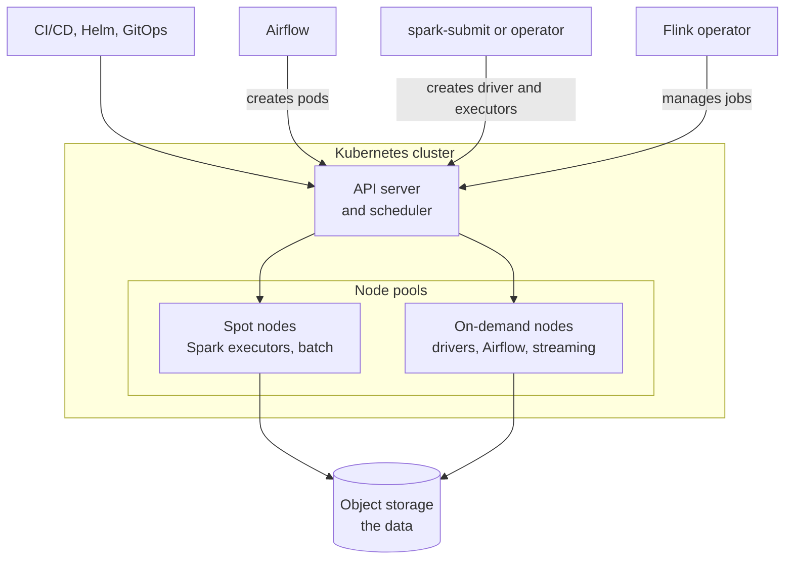

# Kubernetes for Data Workloads
> How data engineers use Kubernetes to run batch jobs, Spark, Airflow and streaming applications: the objects that matter, resource and cost control, and the operational habits that keep data jobs reliable.

**Prerequisites:** [Docker](docker-reference.md) · [Linux & Bash](../00-foundations/linux-bash.md)

**Related:** [PySpark](../02-processing/pyspark-reference.md) · [Airflow](../03-orchestration/airflow-reference.md) · [Apache Flink](../04-streaming/flink-reference.md) · [Kafka](../04-streaming/kafka-reference.md) · [Terraform](terraform-for-de.md) · [Testing and CI/CD](testing-cicd.md) · [Cost Optimization](../08-architecture/cost-optimization.md) · [Glossary](../99-reference/glossary.md)

---

## Overview

**Challenge:** Data platforms run many kinds of workloads at once: scheduled batch jobs, Spark applications that need dozens of workers for twenty minutes, an orchestrator, and streaming jobs that never stop. Provisioning a fixed set of servers for the peak wastes money, and giving each tool its own cluster multiplies the operational work.

**Solution:** Kubernetes is a scheduler for containers. You describe what to run and how much CPU and memory it needs, and Kubernetes places it on a shared pool of nodes, restarts it when it fails, and lets the pool grow and shrink. Most data tools have a Kubernetes integration: Spark can start its driver and executors as pods, Airflow can run each task in its own pod, and Flink has an operator that manages streaming jobs. One platform then runs batch, streaming and orchestration with the same tooling for isolation, resource limits and access control.



**Relevance to data engineering:** Kubernetes is the runtime under many cloud data platforms, and knowing how it schedules and limits containers explains a large share of production failures: out-of-memory kills, pods stuck pending, throttled CPU and surprise bills. This guide is about using it well for data, not about administering a cluster. See [Docker](docker-reference.md) first, since Kubernetes runs container images.

---

**On this page**

**Basic**
- [When Kubernetes Fits Data Work](#when-kubernetes-fits-data-work)
- [The Objects You Need](#the-objects-you-need)
- [Running a Batch Job](#running-a-batch-job)
- [Scheduled Jobs](#scheduled-jobs)

**Intermediate**
- [Resources: Requests, Limits and Out-of-Memory Kills](#resources-requests-limits-and-out-of-memory-kills)
- [Namespaces, Quotas and Defaults](#namespaces-quotas-and-defaults)
- [Placement: Node Pools and Spot Capacity](#placement-node-pools-and-spot-capacity)
- [Parallel Work with Indexed Jobs](#parallel-work-with-indexed-jobs)
- [Configuration, Secrets and Identity](#configuration-secrets-and-identity)

**Advanced**
- [Spark on Kubernetes](#spark-on-kubernetes)
- [Airflow on Kubernetes](#airflow-on-kubernetes)
- [Flink on Kubernetes](#flink-on-kubernetes)
- [Observability and Debugging](#observability-and-debugging)
- [Cost and Autoscaling](#cost-and-autoscaling)
- [Deploying and Validating Manifests](#deploying-and-validating-manifests)

**Reference**
- [Common Pitfalls](#common-pitfalls)
- [Cheat Sheet](#cheat-sheet)
- [Interview Questions](#interview-questions)
- [Further Reading](#further-reading)

---

## When Kubernetes Fits Data Work

| Fits well | Fits poorly |
|-----------|-------------|
| Spiky batch workloads that need many workers briefly, then none | A small team with a handful of scheduled scripts. A managed scheduler or a single VM is simpler |
| Many teams sharing a platform, needing isolation and quotas | Stateful databases and brokers you would run yourself. Prefer a managed service, or an operator built for that system |
| Running the same tooling for batch, orchestration and streaming | Workloads that need very fast, tightly coupled networking or specialised hardware you cannot get on your platform |
| Per-task isolation and different dependencies per job | Teams without anyone to own the cluster. Consider a managed data platform |

Kubernetes has real operating costs: networking, upgrades, node images, security patches. On the major clouds, the managed control planes (Amazon EKS, Google GKE, Azure AKS) remove the hardest part, and many data platforms hide Kubernetes entirely. The question to ask is whether the flexibility is worth the operating effort for your team. This guide assumes you already have, or will have, a cluster.

---

## The Objects You Need

You do not need all of Kubernetes. These objects cover most data work.

| Object | Purpose | Data example |
|--------|---------|--------------|
| **Pod** | One or more containers scheduled together | One run of an extract script; a Spark executor |
| **Job** | Runs pods until they complete, retrying on failure | A daily load or a backfill |
| **CronJob** | Creates Jobs on a schedule | A nightly export |
| **Deployment** | Keeps N identical pods running | A long-running service, such as an API or a consumer |
| **StatefulSet** | Pods with stable identity and storage | Stateful systems, usually via an operator |
| **Namespace** | A boundary for names, quotas and access | One per team or environment |
| **ConfigMap and Secret** | Configuration and credentials injected into pods | Job arguments, database passwords |
| **ServiceAccount, Role, RoleBinding** | Identity and permissions inside the cluster | Allowing a Spark driver to create executors |
| **ResourceQuota and LimitRange** | Caps and defaults per namespace | Stop one team using the whole cluster |
| **Custom resource** | An object type added by an operator | A `FlinkDeployment` |

Everything is declared in YAML and submitted with `kubectl apply`. Kubernetes then continuously works to make the cluster match what you declared.

---

## Running a Batch Job

A **Job** is the unit of batch work. This one runs a container to completion, retries failures, stops if it runs too long, and cleans up after itself:

```yaml
apiVersion: batch/v1
kind: Job
metadata:
  name: load-orders-2026-09-01
  namespace: data-batch
spec:
  backoffLimit: 2                  # retries before the Job is marked failed (the default is 6)
  activeDeadlineSeconds: 3600      # stop the Job if it runs longer than an hour
  ttlSecondsAfterFinished: 86400   # delete the finished Job and its pods after a day
  template:
    metadata:
      labels:
        app: load-orders
    spec:
      restartPolicy: Never         # Jobs allow Never or OnFailure
      serviceAccountName: loader
      containers:
        - name: load
          image: registry.example.com/data/load-orders:1.4.2
          args: ["--date", "2026-09-01"]
          env:
            - name: WAREHOUSE_PASSWORD
              valueFrom:
                secretKeyRef:
                  name: warehouse-credentials
                  key: password
          resources:
            requests:
              cpu: "1"
              memory: 2Gi
            limits:
              memory: 2Gi
```

The fields that matter for data work:

| Field | Meaning |
|-------|---------|
| `backoffLimit` | Retries before the Job is marked failed. The default is 6, which is often too many for a job that fails for a data reason and needs a human |
| `activeDeadlineSeconds` | A hard time limit. A hung job is stopped instead of running for days |
| `ttlSecondsAfterFinished` | Deletes the Job and its pods after it finishes. Without it, finished pods accumulate |
| `restartPolicy` | `Never` (a failure creates a new pod) or `OnFailure` (the container restarts in the same pod). Jobs do not allow `Always` |
| `completions`, `parallelism` | How many successful pods are needed and how many run at once, both default to 1 |
| Image tag | Pin a version. `latest` makes a rerun of the same Job run different code |

Because a Job may run more than once (a retry, a node failure, a manual rerun), the container must be **idempotent**: rerunning a day's load must not duplicate data. See [Testing and CI/CD](testing-cicd.md#testing-idempotency-and-backfills).

```bash
kubectl apply -f job.yaml
kubectl get jobs -n data-batch
kubectl logs job/load-orders-2026-09-01 -n data-batch
kubectl describe job load-orders-2026-09-01 -n data-batch
kubectl delete job load-orders-2026-09-01 -n data-batch
```

---

## Scheduled Jobs

A **CronJob** creates a Job on a schedule. For data work the defaults are rarely right, so set these explicitly:

```yaml
apiVersion: batch/v1
kind: CronJob
metadata:
  name: load-orders-daily
  namespace: data-batch
spec:
  schedule: "15 2 * * *"
  timeZone: "Etc/UTC"
  concurrencyPolicy: Forbid          # skip a run if the previous one is still going
  startingDeadlineSeconds: 1800      # a run that cannot start within 30 minutes is skipped
  successfulJobsHistoryLimit: 3
  failedJobsHistoryLimit: 5
  jobTemplate:
    spec:
      backoffLimit: 2
      activeDeadlineSeconds: 3600
      ttlSecondsAfterFinished: 86400
      template:
        spec:
          restartPolicy: OnFailure
          serviceAccountName: loader
          containers:
            - name: load
              image: registry.example.com/data/load-orders:1.4.2
              resources:
                requests:
                  cpu: "1"
                  memory: 2Gi
                limits:
                  memory: 2Gi
```

- **`concurrencyPolicy`** is `Allow` by default, which lets overlapping runs pile up when a job is slow. `Forbid` skips a new run while one is active, and `Replace` cancels the running one. For loads that write the same table, use `Forbid`.
- **`timeZone`** takes an IANA name. Without it the schedule follows the cluster's time zone, which is easy to get wrong across daylight-saving changes.
- **`startingDeadlineSeconds`** bounds how late a missed run may still start.
- A CronJob can create **zero jobs or more than one** for a single schedule in edge cases such as controller downtime, so the job must be idempotent.

A CronJob is a scheduler, not an orchestrator: it has no dependencies between jobs, no backfill and no rich retry history. When you need those, use an orchestrator and let it launch pods. See [Airflow on Kubernetes](#airflow-on-kubernetes) and [Airflow](../03-orchestration/airflow-reference.md).

---

## Resources: Requests, Limits and Out-of-Memory Kills

Every container declares two numbers per resource.

| | Requests | Limits |
|-|----------|--------|
| Used by | The scheduler, to decide which node has room | The kubelet and kernel, to cap usage |
| CPU | A reserved share. The container may use more if the node has spare capacity | A hard cap, enforced by **throttling** |
| Memory | A reserved amount | A cap enforced by killing the container (**out-of-memory kill**) if it exceeds it |

CPU is measured in cores or millicores (`500m` is half a core), and memory in bytes with binary suffixes (`256Mi`, `2Gi`). There is also `ephemeral-storage` for local disk that is lost when the pod goes.

**Quality of service.** Kubernetes derives a class from what you set:

| Class | Criteria | Under node pressure |
|-------|----------|---------------------|
| **Guaranteed** | Every container has CPU and memory requests equal to limits | Evicted last |
| **Burstable** | At least one request or limit is set, but not the Guaranteed conditions | Evicted second |
| **BestEffort** | No requests or limits at all | Evicted first |

**Practical rules for data jobs:**

- **Always set memory requests and limits, and make them equal.** A memory limit above the request lets the node overcommit, and the pod is killed when the node runs short. Equal values give predictable behaviour.
- **Be careful with CPU limits.** A CPU limit throttles the process when it hits the cap, which slows a job without failing it, so the cause is hard to see. Many teams set CPU requests and leave CPU limits off, keeping memory limits.
- **An exit code 137 or the status `OOMKilled` means the container exceeded its memory limit.** The fix is a higher limit or less memory use, not a retry.
- **The runtime counts memory beyond the heap.** A JVM process uses heap plus off-heap and native memory, and a Python process uses native library memory. A limit equal to the heap setting will be exceeded. Spark handles this with an explicit overhead setting (see [Spark on Kubernetes](#spark-on-kubernetes)).
- **Size from measurement.** Run the job, look at its peak memory, add headroom, and revisit. Guessing large wastes money, and guessing small produces kills.

---

## Namespaces, Quotas and Defaults

Give each team or environment a **namespace**, and bound it with a **ResourceQuota** so one team's runaway job cannot take the whole cluster. A **LimitRange** supplies defaults for containers that declare none, so nothing runs as BestEffort by accident.

```yaml
apiVersion: v1
kind: Namespace
metadata:
  name: data-batch
---
apiVersion: v1
kind: ResourceQuota
metadata:
  name: data-batch-quota
  namespace: data-batch
spec:
  hard:
    requests.cpu: "40"
    requests.memory: 160Gi
    limits.memory: 200Gi
    pods: "200"
---
apiVersion: v1
kind: LimitRange
metadata:
  name: data-batch-defaults
  namespace: data-batch
spec:
  limits:
    - type: Container
      defaultRequest:
        cpu: 250m
        memory: 512Mi
      default:
        memory: 1Gi
```

A quota also protects you from yourself: a backfill that launches a thousand pods will queue against the quota instead of starving production jobs. Pods that cannot be admitted or scheduled stay in `Pending`, which is the first thing to check when a job does not start.

---

## Placement: Node Pools and Spot Capacity

Cloud clusters usually have several **node pools** with different machine types and pricing. Data workloads benefit from separating them:

| Pool | Holds | Why |
|------|-------|-----|
| **On-demand** | Spark drivers, Airflow components, streaming jobs, anything that cannot be interrupted | Stable, no surprise termination |
| **Spot or preemptible** | Spark executors, retry-safe batch pods | Much cheaper, but the provider can reclaim nodes at short notice |
| **Memory- or storage-optimised** | Large joins, shuffle-heavy jobs | Right-sized hardware |

Steer pods to a pool with **node selectors**, and keep other pods off a pool with **taints** and **tolerations**: the node carries the taint, and only pods that tolerate it are scheduled there.

```yaml
apiVersion: v1
kind: Pod
metadata:
  name: executor-placement-example
  namespace: data-batch
spec:
  nodeSelector:
    workload: batch                  # a label you put on the batch node pool
  tolerations:
    - key: dedicated
      operator: Equal
      value: batch
      effect: NoSchedule
  terminationGracePeriodSeconds: 120
  containers:
    - name: app
      image: registry.example.com/data/worker:1.4.2
      resources:
        requests:
          cpu: 500m
          memory: 256Mi
          ephemeral-storage: 2Gi
        limits:
          memory: 256Mi
          ephemeral-storage: 4Gi
```

The label and taint names are your own conventions, set when the pool is created. On spot capacity, design for interruption: jobs must be idempotent, checkpoint progress, and be retried. A Spark job survives losing an executor, but losing the driver ends the application, so keep drivers on on-demand nodes. `terminationGracePeriodSeconds` gives a pod time to finish work or write a checkpoint when it is told to stop.

---

## Parallel Work with Indexed Jobs

For a fan-out, such as reprocessing eight shards or partitions, an **Indexed Job** starts one pod per index and tells each which one it is. Kubernetes injects the index as the `JOB_COMPLETION_INDEX` environment variable.

```yaml
apiVersion: batch/v1
kind: Job
metadata:
  name: backfill-shards
  namespace: data-batch
spec:
  completionMode: Indexed            # each Pod gets a stable index 0..completions-1
  completions: 8
  parallelism: 4
  backoffLimitPerIndex: 1            # retry a failing shard once, without failing the others
  maxFailedIndexes: 2
  template:
    spec:
      restartPolicy: Never
      containers:
        - name: worker
          image: registry.example.com/data/backfill:1.4.2
          command: ["sh", "-c", "python backfill.py --shard $JOB_COMPLETION_INDEX --shards 8"]
          resources:
            requests:
              cpu: "2"
              memory: 4Gi
            limits:
              memory: 4Gi
```

- `parallelism: 4` runs four shards at a time, which caps the load on the source and on the quota.
- `backoffLimitPerIndex` retries each shard independently. When it is set, `backoffLimit` defaults to a very large value (2147483647) instead of 6, so what fails the Job is `maxFailedIndexes`, the number of failed shards you will tolerate.
- Each shard must write only its own slice of the output, or the shards will overwrite each other.

---

## Configuration, Secrets and Identity

- **Configuration** (job arguments, feature flags, endpoints) goes in ConfigMaps or arguments and environment variables, never baked into the image. The same image then runs in every environment.
- **Secrets** are injected at run time, as in the `secretKeyRef` above. A Kubernetes Secret is base64-encoded, not encrypted by default, so restrict who can read it, enable encryption at rest on the cluster, and prefer syncing them from a secret manager over committing them anywhere.
- **Never put credentials in an image or in Git.** Anything in an image layer can be extracted, and anything committed is exposed. See [Docker](docker-reference.md).
- **Prefer cloud identity to stored keys.** Cloud providers can map a Kubernetes ServiceAccount to a cloud role (for example IAM roles for service accounts on EKS, Workload Identity on GKE, and workload identity on AKS), so a pod reads object storage with short-lived credentials and no key at all.
- **One ServiceAccount per workload,** with a Role granting only what it needs. The default account should have no useful permissions.
- **Storage:** treat pod disks as scratch space. Data belongs in object storage, and a pod that writes important state to its local disk loses it on reschedule. Use `ephemeral-storage` limits for scratch, and a PersistentVolume only for state that must survive, usually via an operator.

---

## Spark on Kubernetes

Spark can use Kubernetes as its cluster manager. `spark-submit` in cluster mode creates a **driver pod**, and the driver requests **executor pods** from the API server. When the application ends, the executors are removed.

```bash
./bin/spark-submit \
    --master k8s://https://<k8s-apiserver-host>:<k8s-apiserver-port> \
    --deploy-mode cluster \
    --name daily-orders \
    --conf spark.executor.instances=5 \
    --conf spark.kubernetes.namespace=data-batch \
    --conf spark.kubernetes.container.image=<spark-image> \
    --conf spark.kubernetes.authenticate.driver.serviceAccountName=spark \
    local:///opt/app/jobs/daily_orders.py
```

Points from the Spark documentation (checked against Spark 4.2.0):

- The master URL is `k8s://<host>:<port>`, with `https` assumed if you omit the scheme. The port is always required, even for 443.
- The application code is inside the image, referenced with a `local://` path.
- **RBAC.** The driver needs a service account allowed to create, get, list, watch, update and delete `pods`, `services` and `configmaps`, or executors will not start. A namespaced `Role` is enough, and tighter than the broad `edit` cluster role the documentation uses in its example:

```yaml
apiVersion: v1
kind: ServiceAccount
metadata:
  name: spark
  namespace: data-batch
---
apiVersion: rbac.authorization.k8s.io/v1
kind: Role
metadata:
  name: spark-driver
  namespace: data-batch
rules:
  - apiGroups: [""]
    resources: ["pods", "services", "configmaps"]
    verbs: ["create", "get", "list", "watch", "delete", "update"]
---
apiVersion: rbac.authorization.k8s.io/v1
kind: RoleBinding
metadata:
  name: spark-driver
  namespace: data-batch
subjects:
  - kind: ServiceAccount
    name: spark
    namespace: data-batch
roleRef:
  apiGroup: rbac.authorization.k8s.io
  kind: Role
  name: spark-driver
```

- **Dynamic allocation** needs shuffle tracking, because Kubernetes has no external shuffle service. Set `spark.dynamicAllocation.enabled=true` and `spark.dynamicAllocation.shuffleTracking.enabled=true`. Executors holding shuffle data are kept until that data is no longer needed, so also consider `spark.dynamicAllocation.shuffleTracking.timeout`.
- **Memory overhead.** Spark adds `spark.kubernetes.memoryOverheadFactor` on top of the executor memory to cover non-heap memory. The default is 0.1 for JVM jobs and **0.4 for non-JVM jobs such as PySpark**, so a PySpark executor is sized larger by default. An executor killed with `OOMKilled` (exit code 137) usually needs more overhead, not more heap. See [PySpark](../02-processing/pyspark-reference.md).
- **Placement.** Spark has separate settings to put drivers and executors on different node pools, so drivers stay on on-demand nodes and executors use spot capacity.
- **An operator** (the Spark Operator) lets you submit a `SparkApplication` as a Kubernetes object from CI or an orchestrator, instead of running `spark-submit`. Choose it if your team wants job definitions in Git and managed like other manifests.

---

## Airflow on Kubernetes

There are two separate ideas. **Where Airflow itself runs** (its scheduler, API server and workers) and **where its tasks run**.

| Option | What it does | Notes |
|--------|--------------|-------|
| **`KubernetesExecutor`** | Runs every task in its own pod | Isolation per task, and dependencies per task. Costs a pod start for each task |
| **`KubernetesPodOperator`** | A task that launches a pod from an image you specify | Use with any executor. The best way to run containerised jobs, in any language |
| **Official Helm chart** | Deploys Airflow itself onto Kubernetes | Configure the executor, image and secrets through values |

The `KubernetesPodOperator` runs a container as a task, waits for it and reports its exit status:

```python
from datetime import datetime

from airflow.providers.cncf.kubernetes.operators.pod import KubernetesPodOperator
from airflow.sdk import dag
from kubernetes.client import models as k8s


@dag(schedule="@daily", start_date=datetime(2026, 9, 1), catchup=False)
def load_orders():
    KubernetesPodOperator(
        task_id="load",
        name="load-orders",
        namespace="data-batch",
        image="registry.example.com/data/load-orders:1.4.2",
        arguments=["--date", "{{ ds }}"],
        container_resources=k8s.V1ResourceRequirements(
            requests={"cpu": "1", "memory": "2Gi"},
            limits={"memory": "2Gi"},
        ),
        get_logs=True,                  # stream the container's output into the task log
        on_finish_action="delete_pod",  # the default
        startup_timeout_seconds=300,
    )


load_orders()
```

Parameters that matter, from the provider documentation (provider version 10.22.0):

- **`container_resources`** takes a `V1ResourceRequirements` object, and `arguments` is a template, so `{{ ds }}` passes the run date to an idempotent job.
- **`on_finish_action`** is `delete_pod` by default. The other values are `delete_succeeded_pod`, `keep_pod` and `delete_active_pod`. Use `delete_succeeded_pod` to keep failed pods for `kubectl logs` and `kubectl describe`.
- **`startup_timeout_seconds`** defaults to 120. Large images or a busy autoscaler can take longer to start a pod, so raise it or the task fails while the pod is still pending.
- **`node_selector`, `tolerations`, `labels` and `service_account_name`** control placement and identity, as with any pod.
- **`deferrable`** frees the worker slot while the pod runs, which suits long tasks.

The import path for the DAG API in Airflow 3 is `airflow.sdk`, and the operator lives in the separate `apache-airflow-providers-cncf-kubernetes` package, so install it in the image that runs your workers. See the [Airflow guide](../03-orchestration/airflow-reference.md) for the executor comparison.

---

## Flink on Kubernetes

Long-running streaming jobs suit the **Flink Kubernetes Operator**, which manages the whole lifecycle (start, upgrade with state, stop) from a `FlinkDeployment` custom resource. This is the basic example from the operator's repository, on its 1.16 release branch:

```yaml
apiVersion: flink.apache.org/v1beta1
kind: FlinkDeployment
metadata:
  name: basic-example
spec:
  image: flink:2.2
  flinkVersion: v2_2
  flinkConfiguration:
    taskmanager.numberOfTaskSlots: 2
  serviceAccount: flink
  jobManager:
    resources:
      requests:
        memory: "2048m"
        cpu: "1"
  taskManager:
    resources:
      requests:
        memory: "2048m"
        cpu: "1"
  job:
    jarURI: local:///opt/flink/examples/streaming/StateMachineExample.jar
    parallelism: 2
    upgradeMode: stateless
```

The operator needs cert-manager, then installs with Helm:

```bash
kubectl apply -f https://github.com/cert-manager/cert-manager/releases/latest/download/cert-manager.yaml
helm repo add flink-operator-repo https://downloads.apache.org/flink/flink-kubernetes-operator-1.16.1/
helm install flink-kubernetes-operator flink-operator-repo/flink-kubernetes-operator
```

The version is part of the repository URL, and `downloads.apache.org` keeps only the current release of each line. The operator's own quick start still names 1.16.0, which has moved to `archive.apache.org`, so the command in it no longer works from the primary download site. Use the newest directory listed at `https://downloads.apache.org/flink/`, and pin that version in your deployment code.

`upgradeMode: stateless` discards state on upgrade. Production jobs with state normally use a stateful upgrade mode with checkpoints in object storage, so the operator can redeploy without losing progress. Pin the image and the operator version, and check the operator's compatibility table for the Flink versions it supports. See [Apache Flink](../04-streaming/flink-reference.md).

For **Kafka and databases**, prefer a managed service. If you run them on Kubernetes, use an operator built for that system rather than plain StatefulSets, and treat the storage and upgrade procedures with the care you would give any stateful production system. See [Kafka](../04-streaming/kafka-reference.md).

---

## Observability and Debugging

When something goes wrong, work from the status of the pod outward.

```bash
kubectl get pods -n data-batch                          # status at a glance
kubectl describe pod <pod> -n data-batch                # events: scheduling, image pulls, OOM
kubectl logs <pod> -n data-batch                        # container output
kubectl logs <pod> -n data-batch --previous             # output of the container that just crashed
kubectl get events -n data-batch --sort-by=.lastTimestamp
kubectl top pod -n data-batch                           # live CPU and memory (needs metrics-server)
```

| Status | Meaning | Usual cause and fix |
|--------|---------|---------------------|
| `Pending` | Not scheduled | No node has the requested resources, a quota is exhausted, or no node matches the selector or tolerations. `describe` shows the reason. Check requests, quotas and node pools |
| `ImagePullBackOff` | The image cannot be pulled | Wrong tag, a private registry without pull credentials, or a rate limit. Fix the tag or add an image pull secret |
| `CrashLoopBackOff` | The container keeps exiting | An application error at startup. Read `logs --previous` |
| `OOMKilled` (exit code 137) | Memory limit exceeded | Raise the limit, reduce memory use, or, for Spark, raise the memory overhead |
| `Evicted` | The node ran short of a resource | Set requests so the pod is not BestEffort, and reduce ephemeral storage use |
| `Completed` | The container exited with 0 | Normal for a Job pod |

Logs and metrics on a pod disappear with it, so ship them elsewhere: forward container logs to a central store, and collect metrics with a monitoring stack, so a failed job's output survives the cleanup that `ttlSecondsAfterFinished` and `delete_pod` perform. Track job duration, failure rate, and pending time. See [Pipeline Observability](../05-quality-governance/pipeline-observability.md).

---

## Cost and Autoscaling

- **Autoscale nodes.** A node autoscaler (the Cluster Autoscaler, or a provisioner such as Karpenter on supported clouds) adds nodes when pods are pending and removes them when idle, so a Spark job that requests fifty executors gets nodes for the run, not all day.
- **Use spot capacity for retry-safe work,** and keep drivers and streaming jobs on on-demand nodes.
- **Right-size requests.** The scheduler reserves what you request, not what you use. Oversized requests leave nodes half empty while you pay for them. Compare requested to actual usage from metrics, and adjust.
- **Bound everything.** Quotas per namespace, `activeDeadlineSeconds` on jobs, and limits on executor counts stop a mistake from becoming a large bill.
- **Scale to zero.** Batch pools should have no nodes when there is no work. Event-driven autoscalers such as KEDA can scale consumers from queue depth.
- **Clean up.** `ttlSecondsAfterFinished` and history limits stop finished objects accumulating in the control plane.

See [Cost Optimization](../08-architecture/cost-optimization.md) for the wider practice.

---

## Deploying and Validating Manifests

Keep manifests in Git and deploy them from CI, not from laptops. Two tools are common: **Helm** packages a set of manifests with parameters (the official Airflow chart and the Flink operator install this way), and **GitOps** tools such as Argo CD and Flux apply what is in a Git repository and correct any drift.

Validate manifests before they reach a cluster, in CI:

```bash
pip install kubernetes-validate
kubernetes-validate -k 1.36.0 --strict manifests/job.yaml

kubectl apply --dry-run=server -f manifests/job.yaml    # asks the API server, needs cluster access
```

`kubernetes-validate` checks a manifest against the published schema for a given Kubernetes version, so it catches a misspelled field such as `ttlSecondsAfterFinish` without any cluster (every core Kubernetes manifest in this guide passes it for version 1.36). It checks structure only: it does not know that a Job may not use `restartPolicy: Always`, or that a quota is exhausted, and it does not validate custom resources such as `FlinkDeployment` without their definitions. `kubectl apply --dry-run=server` runs the API server's full admission checks and catches those. Run both. See [Testing and CI/CD](testing-cicd.md).

For local practice, tools such as kind or minikube run a small cluster in Docker on a laptop. Use the same manifests you deploy elsewhere, with smaller requests.

---

## Common Pitfalls

| Pitfall | Symptom | Fix |
|---------|---------|-----|
| No resource requests | The pod is BestEffort, evicted first and packed unpredictably | Requests on every container, with a LimitRange for defaults |
| Memory limit too tight for the runtime | `OOMKilled`, exit code 137 | Measure peak, add headroom, and for Spark and PySpark raise the memory overhead |
| CPU limits set low | The job is slow with no errors | Set CPU requests, and avoid tight CPU limits |
| Default `backoffLimit` of 6 | A job that fails for a data reason retries six times and duplicates work | Set a small `backoffLimit` and make the job idempotent |
| No `activeDeadlineSeconds` | A hung job runs forever | Set a deadline that is well above the normal duration |
| `latest` image tag | A rerun uses different code | Pin a version or digest |
| CronJob with `concurrencyPolicy: Allow` on a slow job | Overlapping runs write the same table | `Forbid`, and an idempotent job |
| Assuming a CronJob runs exactly once | A skipped or doubled run | Idempotent jobs, and monitoring for missed runs |
| Spark driver and executors both on spot nodes | The application dies when the driver node is reclaimed | Drivers on on-demand nodes |
| Missing RBAC for the Spark driver | Executors never start, with a forbidden error in the driver log | A service account allowed to manage pods, services and configmaps |
| Dynamic allocation without shuffle tracking | Executors fail to scale or the setting is rejected | Enable `spark.dynamicAllocation.shuffleTracking.enabled` |
| Pod logs lost after the job is cleaned up | No evidence of why a task failed | Forward logs centrally, or keep failed pods with `delete_succeeded_pod` |
| Secrets in images or Git | Credentials exposed | Inject at run time, use workload identity, keep secrets in a manager |
| Data on a pod's local disk | Data lost on reschedule | Write to object storage, and use ephemeral storage only as scratch |
| One namespace with no quota | One team's backfill starves everyone | A namespace and ResourceQuota per team |
| Validating only against the schema | A manifest passes but fails at apply | Add `kubectl apply --dry-run=server` |

---

## Cheat Sheet

| Task | Command / setting |
|------|-------------------|
| Apply and delete | `kubectl apply -f x.yaml` · `kubectl delete -f x.yaml` |
| Watch pods | `kubectl get pods -n <ns> -w` |
| Why is it pending or failing? | `kubectl describe pod <pod>` · `kubectl get events --sort-by=.lastTimestamp` |
| Logs | `kubectl logs <pod>` · `--previous` · `job/<name>` |
| Usage | `kubectl top pod` (needs metrics-server) |
| Job safety | `backoffLimit` · `activeDeadlineSeconds` · `ttlSecondsAfterFinished` · `restartPolicy: Never` |
| CronJob safety | `concurrencyPolicy: Forbid` · `timeZone` · `startingDeadlineSeconds` |
| Parallel shards | `completionMode: Indexed` · `$JOB_COMPLETION_INDEX` · `backoffLimitPerIndex` |
| Resource sizing | `requests` = `limits` for memory; CPU requests without tight limits |
| OOM | Exit code 137, `OOMKilled` |
| Placement | `nodeSelector` · `tolerations` · separate on-demand and spot pools |
| Spark submit | `--master k8s://https://<host>:<port> --deploy-mode cluster --conf spark.kubernetes.container.image=<image>` |
| Spark driver RBAC | `pods`, `services`, `configmaps`: create, get, list, watch, delete, update |
| Spark dynamic allocation | `spark.dynamicAllocation.shuffleTracking.enabled=true` |
| Airflow pod task | `KubernetesPodOperator(image=..., container_resources=..., on_finish_action=...)` |
| Flink | `FlinkDeployment` custom resource with the Flink Kubernetes Operator |
| Validate manifests | `kubernetes-validate -k 1.36.0 --strict f.yaml` · `kubectl apply --dry-run=server -f f.yaml` |

**Sizing rule:** measure peak memory · set request equal to limit · add headroom · avoid tight CPU limits · put drivers and streaming on on-demand nodes and executors on spot

---

## Interview Questions

**Q: Why would a data team run workloads on Kubernetes?**
A: It is a shared, elastic scheduler for containers. Batch and Spark jobs get many workers briefly and release them, orchestration and streaming run beside them, and each workload gets isolation, resource limits and access control from one platform. The cost is operating it, so it makes most sense with several teams or workloads, or where a managed offering hides the operational work.

**Q: What is the difference between resource requests and limits, and why does it matter for data jobs?**
A: A request is what the scheduler reserves when placing a pod, and a limit is the cap enforced at run time. Exceeding a CPU limit throttles the process, which makes a job slow without an error. Exceeding a memory limit gets the container killed with exit code 137. For data jobs I set memory requests equal to limits so behaviour is predictable, measure peak usage to size them, and avoid tight CPU limits.

**Q: How does Spark run on Kubernetes?**
A: `spark-submit` in cluster mode with a `k8s://` master creates a driver pod, and the driver creates executor pods through the API server, so its service account needs permission to manage pods, services and configmaps. The code and dependencies are in the container image. Dynamic allocation needs shuffle tracking because Kubernetes has no external shuffle service, and memory overhead is separate from the heap, with a larger default for non-JVM jobs such as PySpark. Drivers belong on on-demand nodes, executors can use spot.

**Q: How would you run containerised tasks from Airflow?**
A: Use the `KubernetesPodOperator` so each task launches a pod from a versioned image with its own resources and dependencies, and pass the run date as a templated argument to an idempotent job. Alternatively the `KubernetesExecutor` runs every task in its own pod. I would stream logs into the task log, keep failed pods for debugging, and raise the startup timeout for large images.

**Q: A job is stuck in Pending. How do you diagnose it?**
A: `kubectl describe pod` shows the scheduling events. The usual causes are that no node has enough of the requested CPU or memory, the namespace's quota is exhausted, or no node matches the pod's node selector or tolerations. The fixes are to lower the request, raise the quota, add capacity or let the autoscaler add a node, or correct the placement rules.

**Q: How do you make batch jobs safe on spot capacity?**
A: Assume the node can disappear. Make the job idempotent and retryable, checkpoint progress where the work is long, set a termination grace period, and keep anything that cannot be restarted cheaply, such as a Spark driver or a stateful streaming job, on on-demand nodes. Executors and shards that can be recomputed go on spot, with retries bounded so a permanent data error does not loop.

**Q: A CronJob sometimes runs twice or not at all. Is that a bug?**
A: No, Kubernetes documents that a schedule may produce zero or more than one job in edge cases. The job has to be idempotent, `concurrencyPolicy: Forbid` prevents overlap, and monitoring should alert on a missed run. When you need dependencies and backfills, use an orchestrator.

---

## Further Reading

- [Kubernetes documentation](https://kubernetes.io/docs/home/)
- [Jobs](https://kubernetes.io/docs/concepts/workloads/controllers/job/) and [CronJobs](https://kubernetes.io/docs/concepts/workloads/controllers/cron-jobs/)
- [Resource management for containers](https://kubernetes.io/docs/concepts/configuration/manage-resources-containers/) and [Pod quality of service classes](https://kubernetes.io/docs/concepts/workloads/pods/pod-qos/)
- [Running Spark on Kubernetes](https://spark.apache.org/docs/latest/running-on-kubernetes.html)
- [Airflow `KubernetesPodOperator`](https://airflow.apache.org/docs/apache-airflow-providers-cncf-kubernetes/stable/_api/airflow/providers/cncf/kubernetes/operators/pod/index.html) and the [Airflow Helm chart](https://airflow.apache.org/docs/helm-chart/stable/index.html)
- [Flink Kubernetes Operator](https://nightlies.apache.org/flink/flink-kubernetes-operator-docs-stable/)
- [`kubernetes-validate`](https://github.com/willthames/kubernetes-validate)

---

**Previous:** [Docker](docker-reference.md) · **Next:** [Terraform](terraform-for-de.md) · **Back to:** [Index](../README.md)
