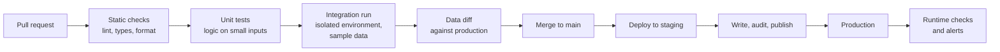

# Testing and CI/CD for Data Pipelines
> How to test pipeline code and pipeline behaviour, and how to build a CI/CD process that builds in isolation, audits before publishing, and promotes changes safely.

**Prerequisites:** [Git for DE](../00-foundations/git-for-de.md) · [Python for DE](../00-foundations/python-reference.md) · [SQL](../00-foundations/sql-reference.md)

**Related:** [Data Quality](../05-quality-governance/data-quality.md) · [dbt](../02-processing/dbt-reference.md) · [Airflow](../03-orchestration/airflow-reference.md) · [Docker](docker-reference.md) · [Terraform](terraform-for-de.md) · [Pipeline Observability](../05-quality-governance/pipeline-observability.md) · [Glossary](../99-reference/glossary.md)

**Practice:** [Lab 02 — dbt Transformations](https://github.com/sarangambekar1997/data-engineering-handbook/tree/main/labs/02-dbt-transformations) (data tests and unit tests) · [Capstone 06](https://github.com/sarangambekar1997/data-engineering-handbook/tree/main/labs/06-capstone-ecommerce) (blocking quality checks)

---

## Overview

**Challenge:** A data pipeline can fail in ways that application code rarely does. It can run successfully and still produce wrong numbers, because a source changed shape, a late record arrived, or a rerun counted a day twice. Two things change independently, the code and the data, and a passing deployment says nothing about whether tomorrow's data will be handled correctly.

**Solution:** Test at several layers, each answering a different question, and run the cheap ones on every change. Unit tests prove the transformation logic on small hand-written inputs. Pipeline tests prove behaviours such as idempotency and correct handling of late data. Data checks run against real output, and a publish step blocks bad data before consumers see it. CI runs all of this in an isolated environment on every pull request, and CD promotes the same tested code through environments.



**Relevance to data engineering:** This guide is tool-neutral. Examples use Python, `pytest` and DuckDB because they run anywhere with no setup, and they apply unchanged to any warehouse or engine. Tool-specific mechanisms (dbt unit tests and state-based selection, Airflow DAG checks) are noted where they matter. Runtime quality checks in production are covered in [Data Quality](../05-quality-governance/data-quality.md); this guide is about proving changes are safe before they ship.

---

**On this page**

**Basic**
- [What to Test in a Pipeline](#what-to-test-in-a-pipeline)
- [Unit-Testing Transformation Logic](#unit-testing-transformation-logic)
- [Test Data](#test-data)
- [Static Checks](#static-checks)

**Intermediate**
- [Property-Based Tests](#property-based-tests)
- [Testing Idempotency and Backfills](#testing-idempotency-and-backfills)
- [Testing Orchestration and Spark Code](#testing-orchestration-and-spark-code)
- [Contracts and Schema Checks](#contracts-and-schema-checks)

**Advanced**
- [Designing the CI Pipeline](#designing-the-ci-pipeline)
- [Comparing Outputs with a Data Diff](#comparing-outputs-with-a-data-diff)
- [Write, Audit, Publish](#write-audit-publish)
- [Environments and Promotion](#environments-and-promotion)
- [Testing Infrastructure Changes](#testing-infrastructure-changes)

**Reference**
- [Common Pitfalls](#common-pitfalls)
- [Cheat Sheet](#cheat-sheet)
- [Interview Questions](#interview-questions)
- [Further Reading](#further-reading)

---

## What to Test in a Pipeline

| Layer | Question it answers | Speed | Runs |
|-------|--------------------|-------|------|
| **Static checks** | Is the code well formed and consistently styled? | Seconds | Every commit |
| **Unit tests** | Is the transformation logic right on known inputs? | Seconds | Every commit |
| **Property and edge-case tests** | Does the logic hold for inputs I did not think of, such as empty batches and duplicates? | Seconds | Every commit |
| **Pipeline behaviour tests** | Is a rerun safe? Does a backfill in any order give one result? Is late data handled? | Seconds to minutes | Every pull request |
| **Integration tests** | Do the pieces work together against a real engine and sample data? | Minutes | Every pull request |
| **Data diff** | How does the output change compared with production? | Minutes | Every pull request |
| **Audits** | Is this run's output valid before it is published? | Per run | Every run |
| **Monitoring** | Is production data still healthy? | Continuous | Always |

A useful rule is to test each thing at the cheapest layer that can catch it. Wrong logic belongs to a unit test, not to an integration run that takes ten minutes. A bad source file belongs to an audit, not to a unit test, because no test can know what tomorrow's file looks like.

---

## Unit-Testing Transformation Logic

A unit test builds a tiny input in the test, runs the transformation, and asserts on the output. The transformation must therefore be callable on its own: a function or a SQL statement that takes a table name, not a script that reads production.

The example deduplicates versions of an order and keeps the newest. The code runs on DuckDB, which starts in memory in milliseconds and needs no credentials.

```python
# pipeline/transforms.py
import duckdb


def dedupe_latest(con: duckdb.DuckDBPyConnection, source: str, target: str) -> None:
    """Keep the most recent version of each order."""
    con.execute(f"""
        CREATE OR REPLACE TABLE {target} AS
        SELECT * EXCLUDE (rn)
        FROM (
            SELECT *,
                   ROW_NUMBER() OVER (PARTITION BY order_id ORDER BY updated_at DESC) AS rn
            FROM {source}
        )
        WHERE rn = 1
    """)
```

A fixture gives every test its own empty database, so tests cannot affect each other:

```python
# tests/conftest.py
import duckdb
import pytest


def new_connection():
    """A fresh in-memory database with the raw table. Tests never share state."""
    connection = duckdb.connect(":memory:")
    connection.execute(
        "CREATE TABLE raw_orders (order_id INTEGER, status VARCHAR, updated_at TIMESTAMP)"
    )
    return connection


@pytest.fixture
def con():
    connection = new_connection()
    yield connection
    connection.close()


def insert_orders(con, rows):
    if rows:                       # executemany rejects an empty batch
        con.executemany("INSERT INTO raw_orders VALUES (?, ?, ?)", rows)
```

```python
# tests/test_transforms.py
from pipeline.transforms import dedupe_latest
from tests.conftest import insert_orders


def test_keeps_the_latest_version_of_each_order(con):
    insert_orders(con, [
        (1, "placed", "2024-03-01 09:00:00"),
        (1, "shipped", "2024-03-02 09:00:00"),
        (2, "placed", "2024-03-01 10:00:00"),
    ])

    dedupe_latest(con, "raw_orders", "orders")

    rows = con.execute("SELECT order_id, status FROM orders ORDER BY order_id").fetchall()
    assert rows == [(1, "shipped"), (2, "placed")]


def test_late_arriving_older_version_does_not_overwrite_newer(con):
    insert_orders(con, [
        (1, "shipped", "2024-03-02 09:00:00"),
        (1, "placed", "2024-03-01 09:00:00"),      # arrives last, but is older
    ])

    dedupe_latest(con, "raw_orders", "orders")

    assert con.execute("SELECT status FROM orders").fetchone() == ("shipped",)
```

```bash
pip install pytest duckdb
pytest -q
```

Good unit tests have a few things in common:

- **Names describe behaviour**, such as `late_arriving_older_version_does_not_overwrite_newer`, so a failure explains itself.
- **One behaviour per test**, with inputs small enough to read in the test itself.
- **The tests can fail.** Reverse the `ORDER BY updated_at DESC` to `ASC` and the two tests above fail. A test that still passes after you break the code under test is not testing it. Make this check a habit when you write a new test.

> **dbt:** dbt has the same idea built in. `unit_tests:` in YAML define mock inputs and expected outputs for a model, and run with `dbt test --select "test_type:unit"`. See the [dbt guide](../02-processing/dbt-reference.md#unit-tests-dbt-18).

---

## Test Data

Tests are only as good as their inputs. Three sources cover most needs.

| Source | Use for | Notes |
|--------|---------|-------|
| **Hand-written rows** | Unit tests | Small, readable, one behaviour each |
| **Deterministic synthetic data** | Integration tests, performance checks | A generator with a fixed seed gives the same data every run, so results can be compared. The handbook's [labs](https://github.com/sarangambekar1997/data-engineering-handbook/tree/main/labs) use one, with duplicates, missing keys and late events built in |
| **A sample of production data** | Realistic edge cases | Mask or remove personal data first. Some warehouses can clone production cheaply; otherwise take a bounded sample |

Include the ugly cases on purpose: duplicates, nulls in key columns, out-of-order events, empty batches, the first and last day of a partition, and values at the edge of their type. Bugs cluster there.

Never test against production tables directly, and never let tests write to a shared schema.

---

## Static Checks

Static checks find mistakes without running anything, so they are the cheapest gate.

```bash
ruff check .                                   # Python lint
ruff format --check .                          # Python formatting
sqlfluff lint sql/ --dialect duckdb            # SQL lint; use your engine's dialect
```

`sqlfluff lint` exits non-zero when it finds a problem, so CI can fail on it. A query such as `select a,b from   t where a=1` reports layout violations with line and position. Set the dialect to the engine you deploy to, since SQL syntax differs, and keep the rules in a config file in the repository so local runs and CI agree.

For Terraform, the equivalents are `terraform fmt -check` and `terraform validate`. Configuration files (YAML, JSON) can be parsed with a schema validator so a malformed file fails before deployment, not at 02:00.

---

## Property-Based Tests

An example-based test checks the inputs you thought of. A **property-based test** states a rule that must hold for all inputs, and a library generates many inputs, including odd ones, to try to break it. For the deduplication above, the rule is "one row per order, and it is the newest".

```python
from hypothesis import given, settings, strategies as st

from pipeline.transforms import dedupe_latest
from tests.conftest import insert_orders, new_connection


@settings(max_examples=50, deadline=None)
@given(st.lists(
    st.tuples(st.integers(1, 5), st.datetimes()),
    max_size=30,
))
def test_one_row_per_order_and_it_is_the_newest(versions):
    con = new_connection()          # a fixture is not reset between generated examples
    insert_orders(con, [(order_id, "x", ts) for order_id, ts in versions])

    dedupe_latest(con, "raw_orders", "orders")

    newest = {}
    for order_id, ts in versions:
        newest[order_id] = max(ts, newest.get(order_id, ts))
    got = dict(con.execute("SELECT order_id, updated_at FROM orders").fetchall())
    assert got == newest
    con.close()
```

Two things are worth knowing from writing this test:

- **It finds the cases you skipped.** The first run failed on an empty list, because the test helper called `executemany` with no rows and DuckDB rejects that. The pipeline's own empty-batch behaviour deserves the same scrutiny, since empty files and empty partitions are routine in production.
- **Fixtures and generated examples do not mix.** Hypothesis refuses to reuse a function-scoped `pytest` fixture across the examples it generates, because state would leak between them. Create the connection inside the test, as above, or use a context manager.

Use properties for invariants: row counts never increase after deduplication, totals are preserved by a join that should not drop rows, and applying a transformation twice equals applying it once.

---

## Testing Idempotency and Backfills

Pipelines are rerun constantly: after a failure, after a fix, and when data is backfilled. Two behaviours should be tested explicitly.

- **Idempotency:** running the same load twice leaves the same result.
- **Order independence:** backfilling days in any order gives one result.

```python
# pipeline/load.py
def load_day(con, day: str) -> None:
    """Replace one day's partition of daily_revenue from the raw orders. Safe to re-run."""
    con.execute("BEGIN")
    con.execute("DELETE FROM daily_revenue WHERE order_date = ?", [day])
    con.execute(
        """
        INSERT INTO daily_revenue
        SELECT CAST(updated_at AS DATE) AS order_date, SUM(amount) AS revenue
        FROM raw_sales
        WHERE CAST(updated_at AS DATE) = ?
        GROUP BY 1
        """,
        [day],
    )
    con.execute("COMMIT")
```

```python
# tests/test_backfill.py
import itertools

import duckdb
import pytest

from pipeline.load import load_day

SALES = [
    ("2024-03-01 09:00:00", 10.0),
    ("2024-03-01 15:00:00", 5.0),
    ("2024-03-02 11:00:00", 20.0),
    ("2024-03-03 08:00:00", 7.5),
]


@pytest.fixture
def con():
    connection = duckdb.connect(":memory:")
    connection.execute("CREATE TABLE raw_sales (updated_at TIMESTAMP, amount DOUBLE)")
    connection.executemany("INSERT INTO raw_sales VALUES (?, ?)", SALES)
    connection.execute("CREATE TABLE daily_revenue (order_date DATE, revenue DOUBLE)")
    yield connection
    connection.close()


def snapshot(con):
    return con.execute("SELECT order_date, revenue FROM daily_revenue ORDER BY order_date").fetchall()


DAYS = ["2024-03-01", "2024-03-02", "2024-03-03"]


def test_rerunning_a_day_does_not_double_count(con):
    load_day(con, "2024-03-01")
    once = snapshot(con)

    load_day(con, "2024-03-01")

    assert snapshot(con) == once


@pytest.mark.parametrize("order", list(itertools.permutations(DAYS)))
def test_backfill_order_does_not_change_the_result(con, order):
    for day in DAYS:
        load_day(con, day)
    expected = snapshot(con)
    con.execute("DELETE FROM daily_revenue")

    for day in order:
        load_day(con, day)

    assert snapshot(con) == expected
```

You need both tests, because they catch different faults. Remove the `DELETE` from `load_day` so that a rerun appends instead of replacing: the rerun test fails, but all six backfill-order tests still pass, because each ordering loads every day only once. The order tests find load logic that depends on what was loaded before; the rerun test finds duplicate loading.

Other behaviours worth a test, each with a small input: a **late-arriving record** for a closed day, a **schema change** such as a new nullable column, an **empty source**, and a **partial failure** halfway through a load, after which the target should be either the old state or the new one, never a mixture.

---

## Testing Orchestration and Spark Code

**Orchestrator definitions** need a test that they load, because a syntax error or a missing import stops every task in the file. For Airflow, load the DAG folder and assert there are no import errors:

```python
# Needs Airflow installed and your DAG folder configured; "daily_orders" is your own DAG id
import pytest

from airflow.dag_processing.dagbag import DagBag


@pytest.fixture()
def dagbag():
    return DagBag(include_examples=False)


def test_all_dags_import(dagbag):
    assert dagbag.import_errors == {}


def test_daily_orders_has_expected_shape(dagbag):
    dag = dagbag.get_dag("daily_orders")
    assert dag is not None
    assert {"extract", "load", "quality_gate"} <= {t.task_id for t in dag.tasks}
```

The import location of `DagBag` is version-sensitive. The Airflow 3 documentation imports it from `airflow.dag_processing.dagbag`, while Airflow 2 used `airflow.models`, so check the version you run. Airflow's loader test is also worth using: running `python dag_file.py` without an error shows the file has no uninstalled dependency or syntax error. To test task code without a database, set connections and variables through the `AIRFLOW_CONN_<ID>` and `AIRFLOW_VAR_<KEY>` environment variables, with `unittest.mock.patch.dict`. See the [Airflow guide](../03-orchestration/airflow-reference.md).

**Spark code** is tested with a local session, sized small so the suite stays fast. A session-scoped fixture avoids paying the startup cost per test. This needs Java and PySpark installed:

```python
# Needs Java and PySpark; dedupe_latest is your own transformation, written as DataFrame -> DataFrame
import pytest
from pyspark.sql import SparkSession


@pytest.fixture(scope="session")
def spark():
    session = (
        SparkSession.builder.master("local[2]")
        .appName("tests")
        .config("spark.sql.shuffle.partitions", "1")   # tiny data: avoid 200 empty tasks
        .getOrCreate()
    )
    yield session
    session.stop()


def test_dedupe_keeps_latest(spark):
    df = spark.createDataFrame(
        [(1, "placed", "2024-03-01"), (1, "shipped", "2024-03-02")],
        ["order_id", "status", "updated_at"],
    )
    result = dedupe_latest(df)          # your transformation, written as df -> df
    assert result.collect()[0]["status"] == "shipped"
```

Structure transformations as functions from DataFrame to DataFrame, so the test builds a DataFrame from a list and asserts on the result. Logic that lives inside a job's `main()` cannot be tested this way.

---

## Contracts and Schema Checks

A **data contract** is an agreement about a dataset's schema and guarantees between its producer and its consumers. In a test it becomes an explicit check that runs when either side changes.

```python
EXPECTED = {
    "order_id": "INTEGER",
    "status": "VARCHAR",
    "updated_at": "TIMESTAMP",
}


def test_orders_schema_matches_the_contract(con):
    dedupe_latest(con, "raw_orders", "orders")

    actual = dict(con.execute(
        "SELECT column_name, data_type FROM information_schema.columns WHERE table_name = 'orders'"
    ).fetchall())

    assert actual == EXPECTED
```

Check the properties consumers rely on, not only the column list:

- Column names and types, and which are nullable.
- Uniqueness of keys and the absence of nulls in them.
- Allowed values (status is one of a known set) and ranges.
- Freshness and volume, checked at runtime as audits.

Failing on an unexpected change is the goal. A producer who renames a column should see a red build in their own pull request, not a consumer's dashboard breaking a day later. Warehouse-level features enforce some of this for you, such as model contracts in dbt. See [Governance & Lineage](../05-quality-governance/governance-lineage.md).

---

## Designing the CI Pipeline

A CI run for a data repository has four jobs: fail fast, isolate, control cost, and keep secrets safe.

```yaml
# .github/workflows/ci.yml
name: Data pipeline CI

on:
  pull_request:
    paths:
      - "pipeline/**"
      - "sql/**"
      - "tests/**"
      - "pyproject.toml"

concurrency:
  group: ci-${{ github.ref }}
  cancel-in-progress: true        # a new push supersedes the running check

permissions:
  contents: read

jobs:
  static:
    runs-on: ubuntu-24.04
    steps:
      - uses: actions/checkout@v7
      - uses: actions/setup-python@v7
        with:
          python-version: "3.12"
          cache: pip
      - run: pip install -e ".[dev]"
      - run: ruff check .
      - run: sqlfluff lint sql/ --dialect duckdb

  unit:
    runs-on: ubuntu-24.04
    steps:
      - uses: actions/checkout@v7
      - uses: actions/setup-python@v7
        with:
          python-version: "3.12"
          cache: pip
      - run: pip install -e ".[dev]"
      - run: pytest -q tests/

  integration:
    needs: [static, unit]                # only spend warehouse credits on code that passes the cheap checks
    runs-on: ubuntu-24.04
    permissions:
      contents: read
      id-token: write                    # lets the job exchange a short-lived token, with no stored key
    env:
      CI_SCHEMA: ci_pr_${{ github.event.pull_request.number }}
    steps:
      - uses: actions/checkout@v7
      - run: ./scripts/build_and_test.sh "$CI_SCHEMA"
      - if: always()
        run: ./scripts/drop_schema.sh "$CI_SCHEMA"
```

**Design points:**

- **Fail fast.** Order the jobs so lint and unit tests run first, and make the expensive integration job depend on them with `needs:`.
- **Isolate.** Give every pull request its own schema or database (`ci_pr_123`) and drop it afterwards, even when the run fails. Two pull requests never interfere, and nothing writes to production.
- **Control cost.** Use `paths:` filters so a docs change does not run the warehouse job. Cancel superseded runs with `concurrency`. Build only what changed, for example with dbt's `state:modified+ --defer --state` (see the [dbt guide](../02-processing/dbt-reference.md)), and cache dependencies.
- **Protect secrets.** Prefer short-lived credentials from OpenID Connect (`id-token: write`) to long-lived keys stored as secrets, and give CI a least-privilege account that can write only to CI schemas. Workflows triggered from forks do not receive repository secrets, so tests that need credentials run only on trusted branches.
- **Pin versions.** Pin dependencies and tool versions so a new release cannot turn the build red with no code change, and run the suite on a schedule to notice upstream drift early.
- **Keep it deterministic.** Seeded data, fixed clocks and no network calls in unit tests remove flaky failures, which teach a team to ignore red builds.

---

## Comparing Outputs with a Data Diff

Tests you wrote check the behaviours you expected. A **data diff** shows what actually changed in the output when the code changed, which catches the unexpected. Build the candidate output in the CI schema, then compare it with production.

```sql
-- Rows that differ between production and the candidate build
SELECT 'only_in_prod' AS side, *
FROM (SELECT * FROM prod.daily_revenue EXCEPT SELECT * FROM ci.daily_revenue)
UNION ALL
SELECT 'only_in_candidate', *
FROM (SELECT * FROM ci.daily_revenue EXCEPT SELECT * FROM prod.daily_revenue)
ORDER BY order_date, side;
```

If production holds revenue of 250.0 for 2 March and 80.0 for 3 March, while the candidate build holds 245.0 for 2 March and a new row of 60.0 for 4 March, the query returns four rows:

| side | order_date | revenue |
|------|------------|--------:|
| only_in_candidate | 2024-03-02 | 245.0 |
| only_in_prod | 2024-03-02 | 250.0 |
| only_in_prod | 2024-03-03 | 80.0 |
| only_in_candidate | 2024-03-04 | 60.0 |

A changed value appears on both sides, once with the old figure and once with the new. Summarise the diff for reviewers as counts of added, removed and changed rows and per-column differences, and post it on the pull request. A change that should only touch one metric but alters ten thousand rows is visible immediately. Dedicated data-diff tools do this at scale, but the idea needs only two queries.

---

## Write, Audit, Publish

Tests run before a change ships. **Write-audit-publish** (WAP) protects each run in production. The pipeline writes its output to a staging table, audits that table, and publishes it only if every audit passes. Consumers never see a half-built or invalid table.

```python
# pipeline/publish.py
import duckdb


class AuditFailed(Exception):
    pass


def write_audit_publish(
    con: duckdb.DuckDBPyConnection,
    build_sql: str,
    target: str,
    audits: dict[str, str],
) -> None:
    """Build into a staging table, run audits against it, and swap it in only if all pass.

    Each audit is a query, containing {table}, that returns the number of bad rows.
    """
    staging = f"{target}__staging"
    con.execute(f"CREATE OR REPLACE TABLE {staging} AS {build_sql}")

    failed = {
        name: bad
        for name, sql in audits.items()
        if (bad := con.execute(sql.format(table=staging)).fetchone()[0]) > 0
    }
    if failed:
        con.execute(f"DROP TABLE {staging}")
        raise AuditFailed(f"{target}: {failed}")

    con.execute("BEGIN")
    con.execute(f"DROP TABLE IF EXISTS {target}")
    con.execute(f"ALTER TABLE {staging} RENAME TO {target}")
    con.execute("COMMIT")
```

```python
# tests/test_publish.py
import pytest

from pipeline.publish import AuditFailed, write_audit_publish
from tests.conftest import insert_orders

AUDITS = {
    "null_keys": "SELECT COUNT(*) FROM {table} WHERE order_id IS NULL",
    "duplicate_keys": "SELECT COUNT(*) - COUNT(DISTINCT order_id) FROM {table}",
}


def test_good_data_is_published(con):
    insert_orders(con, [(1, "placed", "2024-03-01 00:00:00")])

    write_audit_publish(con, "SELECT * FROM raw_orders", "orders", AUDITS)

    assert con.execute("SELECT COUNT(*) FROM orders").fetchone() == (1,)


def test_failed_audit_leaves_the_published_table_untouched(con):
    insert_orders(con, [(1, "placed", "2024-03-01 00:00:00")])
    write_audit_publish(con, "SELECT * FROM raw_orders", "orders", AUDITS)

    insert_orders(con, [(1, "paid", "2024-03-02 00:00:00")])      # now a duplicate key
    with pytest.raises(AuditFailed, match="duplicate_keys"):
        write_audit_publish(con, "SELECT * FROM raw_orders", "orders", AUDITS)

    assert con.execute("SELECT status FROM orders").fetchone() == ("placed",)
```

The second test states the guarantee: after a failed audit, the previously published table is unchanged. Note the swap happens in one transaction, so a reader sees the old table or the new one. This relies on transactional DDL; where the engine lacks it, use an atomic operation it does provide, such as a view or pointer that is repointed, or a table-format branch that is fast-forwarded. Audits in production are the same checks as in [Data Quality](../05-quality-governance/data-quality.md); WAP makes them blocking.

---

## Environments and Promotion

| Environment | Purpose | Data |
|-------------|---------|------|
| **Local** | Fast feedback while developing | Synthetic or a small sample, in-memory engine |
| **CI (ephemeral)** | Verify one pull request | Synthetic or masked sample, in a per-PR schema, dropped afterwards |
| **Staging** | Rehearse the deployment end to end | Production-like volume, masked where needed |
| **Production** | Serve consumers | Real |

**Promote the same artifact.** Build once, version it (a Git tag or image digest), and deploy that exact version to each environment. Rebuilding per environment means production runs code that was never tested. Keep differences (connections, schema names, capacity) in configuration per environment, not in code, and never edit a deployed environment by hand.

Ways to reduce deployment risk:

- **Deploy only from `main`,** after review and green CI, with the deployment step gated by an approval for production.
- **Blue/green tables.** Build the new version alongside the old one and switch consumers over atomically, as in the swap above. Rollback is switching back.
- **Shadow runs.** Run the new pipeline against production input without publishing, and compare its output with the current one using a data diff, before switching.
- **Roll forward or back.** Decide in advance. Pipelines that write data cannot always be rolled back by reverting code, so keep the previous output until the new one has proven itself, and make backfills a documented, tested operation.
- **Schema changes.** Make them backward compatible (add nullable columns, do not drop or rename in place), deploy the producer first, migrate consumers, then remove the old column in a later release.

Orchestrator deployments need care too. Deploying a changed DAG while runs are in flight, or changing the schedule, can trigger unintended backfills. Test the change in staging with the same schedule and catch-up settings.

---

## Testing Infrastructure Changes

Infrastructure as code goes through the same gates. In a pull request, run formatting and validation, then a **plan** that shows what would change, and require review of the plan before apply.

```yaml
      - run: terraform fmt -check -recursive
      - run: terraform init -backend=false
      - run: terraform validate
      - run: terraform plan -out=tfplan      # in a job with read access to the target environment
```

Apply only from `main`, with a manual approval for production, and treat any plan that destroys a stateful resource (a database, a bucket, a topic) as needing explicit human sign-off. See the [Terraform guide](terraform-for-de.md). Container images have their own checks: build them in CI, run the test suite inside the image that will ship, and scan for known vulnerabilities. See [Docker](docker-reference.md).

---

## Common Pitfalls

| Pitfall | Symptom | Fix |
|---------|---------|-----|
| Only testing that the pipeline ran | A green run with wrong numbers | Assert on output values: unit tests, audits and data diffs |
| Tests that share a database or schema | Order-dependent failures that pass alone | A fresh connection or schema per test; per-PR schemas in CI |
| A test that cannot fail | A regression ships with a passing suite | Break the code under test on purpose and confirm the test fails |
| Testing only the first run | Double counting after a retry | An explicit rerun test, and a backfill-order test as well |
| Using a `pytest` fixture in a Hypothesis test | Health-check failure about function-scoped fixtures | Build the resource inside the test |
| Property test skips empty inputs | An empty batch crashes production | Allow empty lists in the generator, and handle empty input in code |
| Running the whole warehouse build on every commit | Slow, expensive CI | `paths:` filters, `needs:` ordering, changed-only builds |
| Long-lived warehouse keys in CI secrets | A leaked key gives standing access | Short-lived tokens through OpenID Connect and a least-privilege account |
| CI writing to shared or production schemas | A pull request corrupts real data | A per-PR schema that is dropped in an `always()` step |
| Flaky tests (real clocks, network, unseeded data) | The team ignores red builds | Fixed seeds and clocks, no network in unit tests, quarantine and fix flaky tests |
| Rebuilding per environment | Production runs untested code | Build once, promote the same versioned artifact |
| Applying infrastructure changes without reading the plan | A destroyed database or topic | Review the plan in the pull request and gate production applies |
| `DagBag` imported from the wrong module | `ImportError` after an Airflow upgrade | Check the import path for your version (`airflow.dag_processing.dagbag` in Airflow 3) |

---

## Cheat Sheet

| Task | Command / pattern |
|------|-------------------|
| Run tests | `pytest -q` · `pytest -k name` · `pytest -x` (stop at first failure) |
| Lint Python and format check | `ruff check .` · `ruff format --check .` |
| Lint SQL | `sqlfluff lint sql/ --dialect <engine>` |
| Fresh state per test | A fixture that creates and closes an in-memory database |
| Property test | `@given(st.lists(...))` with `hypothesis`; create resources inside the test |
| Idempotency test | Run the load twice; assert the result is unchanged |
| Backfill test | Load days in every order (`itertools.permutations`); assert one result |
| DAG import test | `DagBag(include_examples=False).import_errors == {}` |
| Data diff | `(a EXCEPT b) UNION ALL (b EXCEPT a)` |
| Publish safely | Write to staging, audit, swap in one transaction |
| dbt unit tests / changed-only build | `dbt test -s "test_type:unit"` · `dbt build -s state:modified+ --defer --state <dir>` |
| Cancel superseded CI runs | `concurrency: { group: ..., cancel-in-progress: true }` |
| Short-lived cloud credentials | `permissions: id-token: write` |
| Infrastructure gate | `terraform fmt -check` · `validate` · `plan` |

**Order of jobs:** static checks → unit tests → integration in an isolated schema → data diff → merge → deploy → audit → publish

---

## Interview Questions

**Q: How do you test a data pipeline?**
A: In layers. Static checks and unit tests on small hand-written inputs run on every commit and prove the transformation logic. Pipeline behaviour tests check that a rerun is idempotent, that backfills in any order agree, and that late and empty data are handled. An integration run in an isolated schema exercises the pieces together, and a data diff against production shows the effect of the change. In production, audits block bad output before publishing, and monitoring catches drift that no test could anticipate.

**Q: What is idempotency and how do you test it?**
A: An idempotent load produces the same result however many times it runs for the same input, which makes retries and backfills safe. Test it by running the same load twice and asserting the output is unchanged, and by running a set of partitions in every order and asserting one result. The two tests catch different faults: dropping the delete step breaks the rerun test but not the ordering test, so you want both. Implement it with partition overwrite, delete-then-insert in a transaction, or a keyed merge.

**Q: What is write-audit-publish?**
A: The pipeline writes its output to a staging location, runs audits against it, such as null keys, duplicates, row counts and referential checks, and publishes only if every audit passes. If one fails, the run stops and consumers keep the last good table. Publishing should be atomic, for example a rename inside a transaction, so a reader never sees a partial table.

**Q: What would you put in CI for a data repository, and how do you keep it cheap?**
A: Lint and unit tests first, then an integration run in a per-pull-request schema that is dropped afterwards, plus a data diff comment. To keep it cheap, filter by changed paths, order jobs with `needs` so expensive work runs only after cheap checks pass, cancel superseded runs, cache dependencies, and build only the changed models and their dependants. Use a least-privilege account and short-lived credentials, and remember that runs from forks receive no secrets.

**Q: How do you deploy changes to a pipeline safely?**
A: Build one versioned artifact and promote it through staging to production, keeping environment differences in configuration. Gate production on review and green CI. Reduce risk with blue/green tables or a shadow run compared by data diff, and keep the previous output until the new one has proven itself. Make schema changes backward compatible and staged (add, migrate consumers, then remove), and treat backfill as a tested, documented operation.

**Q: A property-based test fails on an input you would never expect. What now?**
A: First decide whether the input can occur in production. Empty batches, duplicate keys and out-of-order events usually can, so the failure is a real bug or an unhandled case, and the shrunk example the library prints is the minimal reproduction. Fix the code, or make the assumption explicit by rejecting that input with a clear error. Add the failing example as a normal unit test so it stays covered.

---

## Further Reading

- [pytest documentation](https://docs.pytest.org/)
- [Hypothesis: property-based testing for Python](https://hypothesis.readthedocs.io/)
- [SQLFluff](https://docs.sqlfluff.com/)
- [Airflow best practices: testing a DAG](https://airflow.apache.org/docs/apache-airflow/stable/best-practices.html)
- [dbt unit tests](https://docs.getdbt.com/docs/build/unit-tests) and [state-based selection](https://docs.getdbt.com/reference/node-selection/state-selection)
- [GitHub Actions: security hardening with OpenID Connect](https://docs.github.com/en/actions/security-for-github-actions/security-hardening-your-deployments/about-security-hardening-with-openid-connect)
- [Terraform: `plan`, `validate` and `fmt`](https://developer.hashicorp.com/terraform/cli/commands)

---

**Previous:** [Terraform](terraform-for-de.md) · **Next:** [Snowflake](../01-storage/snowflake-reference.md) · **Back to:** [Index](../README.md)
