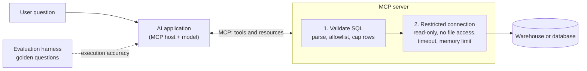

# MCP and Text-to-SQL for Data
> How to give an AI assistant safe access to your data with the Model Context Protocol, and how to measure whether the SQL it writes is right.

**Prerequisites:** [SQL](../00-foundations/sql-reference.md) · [LLM APIs](llm-apis.md) · [AI Agents](ai-agents.md)

**Related:** [Claude Code](claude-code.md) · [Eval & Evals](eval-and-evals.md) · [Semantic Layer & Metrics](../02-processing/semantic-layer-metrics.md) · [Data Security & Privacy](../05-quality-governance/data-security-privacy.md) · [Testing and CI/CD](../06-infrastructure/testing-cicd.md) · [Glossary](../99-reference/glossary.md)

---

## Overview

**Challenge:** People want to ask questions of company data in plain language, and assistants can write SQL well enough to be useful. But a model that can run any query against a warehouse can also read data it should not, delete tables, or run a query that costs a fortune. Wiring each assistant to each database by hand is also repetitive, and nobody can tell how often the generated SQL is actually right.

**Solution:** Put a narrow, governed interface between the model and the data, and measure its quality. The **Model Context Protocol (MCP)** is an open standard for connecting AI applications to external systems, so one server can serve any compatible assistant. The server exposes a small set of **tools** (here, one read-only query tool) and **resources** (the schema). Every query the model writes is checked before it runs, executed on a locked-down connection, and returned in a form the model can use. A separate **evaluation** measures how often the generated SQL returns the right rows.



**Relevance to data engineering:** Data engineers are the ones who decide what an assistant can see and how much it can spend, so this is platform work: access control, resource limits, audit and testing. The guide builds a complete, tested example and is honest about its limits. It uses DuckDB so that everything runs locally, and the same design applies to a warehouse such as Snowflake or BigQuery, where the restrictions come from roles, warehouses and quotas instead.

---

**On this page**

**Basic**
- [What MCP Is](#what-mcp-is)
- [Why Text-to-SQL Is Hard](#why-text-to-sql-is-hard)
- [Design Principles](#design-principles)

**Intermediate**
- [Layer 1: Restrict the Connection](#layer-1-restrict-the-connection)
- [Layer 2: Validate the SQL](#layer-2-validate-the-sql)
- [The MCP Server](#the-mcp-server)
- [Testing the Server](#testing-the-server)

**Advanced**
- [Generating SQL with a Model](#generating-sql-with-a-model)
- [Measuring Accuracy](#measuring-accuracy)
- [Security and Governance](#security-and-governance)
- [Running It for Real](#running-it-for-real)

**Reference**
- [Common Pitfalls](#common-pitfalls)
- [Cheat Sheet](#cheat-sheet)
- [Interview Questions](#interview-questions)
- [Further Reading](#further-reading)

---

## What MCP Is

MCP is "an open-source standard for connecting AI applications to external systems", described as a USB-C port for AI applications: one standard connector instead of a custom cable for every pairing. It has three participants:

| Participant | Role |
|-------------|------|
| **Host** | The AI application, such as Claude Code or an IDE, that coordinates one or more clients |
| **Client** | A component inside the host that keeps a dedicated connection to one server |
| **Server** | A program that provides context. It can run locally or remotely |

A server exposes **primitives**:

| Primitive | Meaning | Data example |
|-----------|---------|--------------|
| **Tools** | Functions the model can call | `run_query` |
| **Resources** | Data that provides context | The schema of the database |
| **Prompts** | Reusable templates for interacting with the model | An analyst prompt with few-shot examples |

Messages are JSON-RPC 2.0. There are two transports: **stdio**, where the host starts the server as a local subprocess (a single client, no network), and **Streamable HTTP**, for remote servers that many clients share and that use standard HTTP authentication, with OAuth recommended.

**The protocol is versioned by date, and it has changed.** The current specification, version `2026-07-28`, is **stateless**: every request carries the protocol version and the client's capabilities in its `_meta` field, so a server can handle each request on its own and there is no connection handshake. A server describes itself through a `server/discover` request, which clients may send first. Sampling (asking the client's model for a completion) and server logging are deprecated in this version, and servers that need state across calls return an explicit handle that the model passes back as a tool argument. When you read a tutorial, check which protocol version and SDK version it targets.

The Python SDK changed with it. In version 2 of the `mcp` package, `FastMCP` was renamed to **`MCPServer`**, and tutorials written for version 1 fail with an import error. The examples here use version 2 (`pip install mcp`), and `pip install "mcp<2"` keeps version 1 code running. The `Client` class can connect to a server object in the same process, which makes servers testable without a subprocess.

---

## Why Text-to-SQL Is Hard

Turning a question into SQL looks like translation, but the difficulty is mostly not the SQL.

| Difficulty | Example |
|------------|---------|
| **Schema linking** | "Revenue by country" needs a join through `orders` to `customers`, and the model must find the right columns among hundreds |
| **Business definitions** | Does "revenue" include refunds and tax? The database does not say. A semantic layer does |
| **Ambiguity** | "Last month", "top customers", "active users" each have several reasonable meanings |
| **Dirty data** | Codes, casing and null conventions the model has never seen. Values such as `'Germany'` versus `'DE'` |
| **Correct but expensive** | A query that returns the right rows but scans a huge table with no filter |
| **Confident and wrong** | The output looks plausible. Nothing tells the user it is wrong |

Public benchmarks reflect this. **Spider** has 10,181 questions and 5,693 unique SQL queries over 200 databases in 138 domains, and it tests whether systems generalise to new schemas. **BIRD** has more than 12,751 question and SQL pairs over 95 large databases (33.4 GB) in more than 37 domains, and it deliberately keeps dirty values, includes questions that need external knowledge, and scores query efficiency as well as correctness. Both report **execution accuracy** as a main metric: does the generated query return the same result as a reference query? That is the metric this guide implements. Benchmark scores do not predict how a system does on your schema and your questions, so you need your own evaluation.

---

## Design Principles

1. **The model proposes, the system disposes.** Never rely on the prompt to keep the model safe. Enforce every rule in code.
2. **Read-only, least privilege.** The connection should be unable to write, whatever the model sends.
3. **Layer the defences.** Validate the SQL, restrict the connection, and limit time and memory. Each layer assumes the others can fail.
4. **Give the model a small, explicit surface.** One query tool over an allowlist of tables is easier to secure than a tool that reaches the whole warehouse.
5. **Return errors the model can act on.** A clear rejection lets it correct itself. A vague one makes it guess.
6. **Ground it in definitions.** Expose curated tables or a semantic layer, not the raw schema. See [Semantic Layer & Metrics](../02-processing/semantic-layer-metrics.md).
7. **Measure it.** Keep a golden set of real questions, and track execution accuracy over time.
8. **Log everything.** Who asked, what SQL ran, what it cost, and what was rejected.

---

## Layer 1: Restrict the Connection

The last line of defence is the database connection itself. If it cannot write or read files, a mistake in the validator still cannot do damage. This module creates a small sample database for the example, and opens it with the restrictions.

```python
# analytics/database.py
"""A restricted, read-only DuckDB connection for model-written queries."""
import threading

import duckdb


def create_sample_database(path: str) -> None:
    """Create a small deterministic shop database. Only used for the example and its tests."""
    con = duckdb.connect(path)
    con.execute("""
        CREATE OR REPLACE TABLE customers AS
        SELECT * FROM (VALUES
            (1, 'Ana', 'DE'), (2, 'Bo', 'US'), (3, 'Chen', 'US'), (4, 'Dara', 'IN')
        ) AS t(customer_id, name, country)
    """)
    con.execute("""
        CREATE OR REPLACE TABLE orders AS
        SELECT i AS order_id,
               1 + (i % 4) AS customer_id,
               CAST(10 + (i * 7) % 50 AS DECIMAL(10, 2)) AS amount,
               DATE '2026-09-01' + INTERVAL (i % 20) DAY AS order_date
        FROM range(1, 201) AS r(i)
    """)
    con.close()


def open_read_only(path: str, memory_limit: str = "256MB") -> duckdb.DuckDBPyConnection:
    con = duckdb.connect(path, read_only=True)          # the file cannot be modified through this connection
    con.execute("SET enable_external_access = false")   # no reading files, no HTTP, no ATTACH of other files
    con.execute(f"SET memory_limit = '{memory_limit}'")
    con.execute("SET threads = 2")
    con.execute("SET lock_configuration = true")         # the settings above cannot be changed afterwards
    return con


def run_with_timeout(con: duckdb.DuckDBPyConnection, sql: str, seconds: float):
    """Execute `sql` and return its rows, interrupting the query if it runs longer than `seconds`."""
    timer = threading.Timer(seconds, con.interrupt)
    timer.start()
    try:
        cursor = con.execute(sql)
        columns = [column[0] for column in cursor.description]
        return columns, cursor.fetchall()
    except duckdb.InterruptException as error:
        raise TimeoutError(f"The query took longer than {seconds} seconds and was stopped.") from error
    finally:
        timer.cancel()
```

What each setting does:

- **`read_only=True`** opens the file so it cannot be modified through this connection.
- **`enable_external_access = false`** blocks access to external state such as files, so even `read_csv('/etc/passwd')` fails. The tests below check this case, and the DuckDB documentation lists what else the setting covers.
- **`memory_limit` and `threads`** cap what one query can consume.
- **`lock_configuration = true`** freezes these settings. Without it, a query could simply run `SET enable_external_access = true`.
- **The timeout** stops a query that runs too long: a timer thread calls the connection's `interrupt`. The tests below show a runaway query being stopped and reported.

On a warehouse the equivalents are a dedicated **read-only role** with `SELECT` on approved views only, a **dedicated warehouse or resource queue** with a credit or byte limit, and a **statement timeout**. See [Snowflake](../01-storage/snowflake-reference.md) and [BigQuery](../01-storage/bigquery-reference.md).

---

## Layer 2: Validate the SQL

The validator **parses** the statement instead of searching it for bad words. String matching is easy to defeat with comments, casing and whitespace. Parsing gives a tree that can be inspected.

```python
# analytics/guard.py
"""Validate SQL written by a model before it reaches the database.

The validator parses the statement instead of matching strings, so comments,
casing and whitespace tricks do not get past it. It is one layer of defence.
The database connection is restricted as well (see database.py).
"""
import sqlglot
from sqlglot import exp

DIALECT = "duckdb"


class UnsafeQuery(ValueError):
    """The statement is not allowed. The message is safe to show to the model."""


def validate_sql(sql: str, allowed_tables: set[str], max_rows: int = 1000) -> str:
    """Return a safe, normalised version of `sql`, or raise UnsafeQuery."""
    try:
        statements = sqlglot.parse(sql, read=DIALECT)
    except sqlglot.errors.ParseError as error:
        raise UnsafeQuery(f"The SQL could not be parsed: {str(error).splitlines()[0]}") from error

    statements = [s for s in statements if s is not None]
    if len(statements) != 1:
        raise UnsafeQuery("Send exactly one SELECT statement.")
    tree = statements[0]

    if not isinstance(tree, exp.Query):
        raise UnsafeQuery("Only SELECT queries are allowed.")

    cte_names = {cte.alias_or_name.lower() for cte in tree.find_all(exp.CTE)}
    for table in tree.find_all(exp.Table):
        if not isinstance(table.this, exp.Identifier):
            raise UnsafeQuery("Table functions such as read_csv are not allowed.")
        if table.name.lower() in cte_names:
            continue
        if table.db or table.catalog:
            raise UnsafeQuery("Use plain table names, without a schema or catalog prefix.")
        if table.name.lower() not in allowed_tables:
            allowed = ", ".join(sorted(allowed_tables))
            raise UnsafeQuery(f"Table '{table.name}' is not available. Available tables: {allowed}.")

    for function in tree.find_all(exp.Anonymous):
        raise UnsafeQuery(f"The function '{function.name}' is not allowed.")

    return _cap_rows(tree, max_rows).sql(dialect=DIALECT)


def _cap_rows(tree: exp.Query, max_rows: int) -> exp.Query:
    """Make sure the outermost query returns at most `max_rows` rows."""
    limit = tree.args.get("limit")
    if limit is not None and isinstance(limit.expression, exp.Literal) and limit.expression.is_int:
        if int(limit.expression.name) <= max_rows:
            return tree
    return tree.limit(max_rows)
```

Seven rules, each pinned by tests below:

| Rule | Stops |
|------|-------|
| Exactly one statement | `SELECT 1; DROP TABLE orders` |
| The root must be a query | `DROP`, `DELETE`, `INSERT`, `COPY`, `ATTACH`, `PRAGMA`, `SET`, `EXPLAIN` |
| Table functions are rejected | `read_csv('/etc/passwd')`, `glob('/*')` |
| Names must be plain | `restricted.orders`: the name is allowed, but it is a different table in another schema |
| Table allowlist | Any table you did not list, however it is nested in subqueries, joins, CTEs or `WHERE EXISTS` |
| Unknown functions are rejected | `getenv('HOME')`. This is an allowlist by default: a function sqlglot does not recognise is refused, so a harmless one may need to be permitted deliberately |
| Row cap | A missing or huge `LIMIT` is replaced with the maximum |

Two subtleties from testing it. A quoted file path used as a table (`FROM '/tmp/data.csv'`) is parsed as an ordinary name, so it is the allowlist, not the table-function rule, that stops it. And the error messages are written for the model: rejecting `salaries` says "Available tables: customers, orders", which is what a model needs to correct itself.

> **This is defence in depth, not a proof.** A parser-based check narrows what can run, and the restricted connection limits the damage of anything that slips through. Neither replaces database permissions, which are the strongest control.

---

## The MCP Server

The server ties the layers together and exposes them over MCP.

```python
# analytics/server.py
"""A read-only SQL server for an AI assistant, built with the MCP Python SDK (2.x)."""
import datetime
import decimal
import sys
from typing import Any, TypedDict

from mcp.server.mcpserver import MCPServer
from mcp.server.mcpserver.exceptions import ToolError
from mcp.types import ToolAnnotations

from analytics.database import open_read_only, run_with_timeout
from analytics.guard import UnsafeQuery, validate_sql

ALLOWED_TABLES = {"orders", "customers"}

SCHEMA_DESCRIPTION = """\
Table customers - one row per customer
  customer_id  INTEGER  primary key
  name         VARCHAR
  country      VARCHAR  two-letter country code

Table orders - one row per order
  order_id     INTEGER  primary key
  customer_id  INTEGER  joins to customers.customer_id
  amount       DECIMAL(10,2)  order value in the shop's currency
  order_date   DATE
"""


class QueryResult(TypedDict):
    columns: list[str]
    rows: list[list[Any]]
    row_count: int
    truncated: bool


def _jsonable(value):
    if isinstance(value, decimal.Decimal):
        return float(value)
    if isinstance(value, (datetime.date, datetime.datetime)):
        return value.isoformat()
    return value


def create_server(db_path: str, max_rows: int = 200, timeout_seconds: float = 5.0) -> MCPServer:
    server = MCPServer(
        "orders-analytics",
        instructions="Answer questions about orders and customers by writing one read-only SELECT "
                     "query. Read the schema resource first.",
    )
    connection = open_read_only(db_path)

    @server.resource("schema://tables", mime_type="text/plain", description="Tables and columns you may query")
    def schema() -> str:
        return SCHEMA_DESCRIPTION

    @server.tool(
        title="Run a read-only SQL query",
        annotations=ToolAnnotations(read_only_hint=True, idempotent_hint=True, open_world_hint=False),
    )
    def run_query(sql: str) -> QueryResult:
        """Run one SELECT query against the orders and customers tables and return the rows.

        Only SELECT statements on the tables in the schema resource are allowed. Results are limited
        in size, so aggregate in SQL instead of returning raw rows.
        """
        try:
            safe_sql = validate_sql(sql, ALLOWED_TABLES, max_rows)
        except UnsafeQuery as error:
            raise ToolError(str(error)) from error                   # an anticipated failure: the model may read it
        cursor = connection.cursor()                                 # one cursor per request
        try:
            columns, rows = run_with_timeout(cursor, safe_sql, timeout_seconds)
        except TimeoutError as error:
            raise ToolError(str(error)) from error
        finally:
            cursor.close()
        return {
            "columns": columns,
            "rows": [[_jsonable(value) for value in row] for row in rows],
            "row_count": len(rows),
            "truncated": len(rows) >= max_rows,
        }

    return server


if __name__ == "__main__":
    # Local use over stdio:  python -m analytics.server shop.duckdb
    create_server(sys.argv[1]).run(transport="stdio")
```

Points worth understanding:

- **One tool, one resource.** `run_query` runs a validated query. The `schema://tables` resource gives the model the tables and column meanings, which it should read before writing SQL.
- **Annotations are hints.** `read_only_hint=True` and `idempotent_hint=True` tell a client the tool does not change anything, which lets it skip confirmation prompts and reason about safety. The specification is explicit that clients **must treat annotations as untrusted unless they come from a trusted server**, so the annotation is not what makes the tool safe. The validator and the connection are.
- **`ToolError` is how a failure reaches the model.** In this SDK version, only a `ToolError` shows its message to the model. Any other exception is treated as a crash: the model sees only `Error executing tool run_query`, and the traceback is logged on the server. That is the right split. A rejected query is anticipated, and the model should read why. A bug or a connection failure should not leak file paths or internals to a model whose output a user sees. The protocol reflects the same idea: tool *execution* errors carry actionable feedback (`isError: true`) so the model can retry, while protocol errors are for malformed requests.
- **Typed results.** Returning a `TypedDict` produces **structured content** that a client can parse and validate against an output schema. The SDK also includes the serialised JSON as text, for clients that do not read structured content. A bare `dict` would give only the text.
- **One cursor per request.** DuckDB cursors let concurrent requests run without sharing state, and each request has its own timeout.
- **Numbers and dates are converted** to JSON types, because decimals and dates are not JSON.

Run it locally over stdio, which is how a host such as Claude Code starts it:

```bash
pip install mcp duckdb sqlglot
python -m analytics.server shop.duckdb
```

Register that command in your host's MCP configuration. See [Claude Code](claude-code.md#mcp-servers). Because stdio is a local process talking to one client, no port is opened.

---

## Testing the Server

Test the server the way a client uses it. The SDK's `Client` connects to the server object in the same process, so tests need no subprocess or network.

```python
# tests/test_mcp_server.py
import pytest
from mcp import Client

from analytics.database import create_sample_database
from analytics.server import create_server


@pytest.fixture
def anyio_backend():
    return "asyncio"


@pytest.fixture
def server(tmp_path):
    path = str(tmp_path / "shop.duckdb")
    create_sample_database(path)
    return create_server(path, max_rows=5, timeout_seconds=2)


pytestmark = pytest.mark.anyio


async def test_the_server_advertises_a_read_only_tool_and_a_schema_resource(server):
    async with Client(server) as client:
        tools = (await client.list_tools()).tools
        resources = (await client.list_resources()).resources

    (tool,) = tools
    assert tool.name == "run_query"
    assert tool.annotations.read_only_hint is True
    assert tool.annotations.destructive_hint is not True
    assert [str(resource.uri) for resource in resources] == ["schema://tables"]


async def test_the_schema_resource_describes_the_tables(server):
    async with Client(server) as client:
        result = await client.read_resource("schema://tables")

    text = result.contents[0].text
    assert "Table orders" in text and "customers.customer_id" in text


async def test_a_query_returns_columns_and_rows(server):
    async with Client(server) as client:
        result = await client.call_tool(
            "run_query",
            {"sql": "SELECT country, COUNT(*) AS customers FROM customers GROUP BY country ORDER BY country"},
        )

    assert not result.is_error
    assert result.structured_content == {
        "columns": ["country", "customers"],
        "rows": [["DE", 1], ["IN", 1], ["US", 2]],
        "row_count": 3,
        "truncated": False,
    }


async def test_results_are_capped_and_flagged_as_truncated(server):
    async with Client(server) as client:
        result = await client.call_tool("run_query", {"sql": "SELECT order_id FROM orders ORDER BY order_id"})

    assert result.structured_content["row_count"] == 5
    assert result.structured_content["truncated"] is True


async def test_a_forbidden_query_comes_back_as_an_error_the_model_can_read(server):
    async with Client(server) as client:
        result = await client.call_tool("run_query", {"sql": "SELECT * FROM salaries"})

    assert result.is_error
    assert "Available tables: customers, orders" in result.content[0].text


@pytest.mark.parametrize("sql", [
    "DROP TABLE orders",
    "SELECT 1; DELETE FROM orders",
    "SELECT * FROM read_csv('/etc/passwd')",
])
async def test_attacks_are_refused_through_the_protocol_and_the_data_is_intact(server, sql):
    async with Client(server) as client:
        refused = await client.call_tool("run_query", {"sql": sql})
        count = await client.call_tool("run_query", {"sql": "SELECT COUNT(*) AS n FROM orders"})

    assert refused.is_error
    assert count.structured_content["rows"] == [[200]]


async def test_a_runaway_query_is_stopped_with_a_message_the_model_can_read(server):
    async with Client(server) as client:
        result = await client.call_tool(
            "run_query", {"sql": "SELECT COUNT(*) FROM orders a, orders b, orders c, orders d, orders e, orders f"}
        )

    assert result.is_error
    assert "took longer than" in result.content[0].text


async def test_an_unexpected_crash_does_not_leak_internals_to_the_model(server, monkeypatch):
    def broken(*args, **kwargs):
        raise RuntimeError("could not open /var/lib/warehouse/secret-credentials.db")

    monkeypatch.setattr("analytics.server.run_with_timeout", broken)

    async with Client(server) as client:
        result = await client.call_tool("run_query", {"sql": "SELECT 1 FROM orders"})

    assert result.is_error
    assert result.content[0].text == "Error executing tool run_query"       # generic: nothing about the cause
    assert "secret" not in result.content[0].text
```

The tests check the contract, not just the happy path:

- The tool is advertised as read-only, and the schema resource exists.
- Results are structured, capped and flagged as `truncated`.
- A forbidden query returns an error the model can read, listing the available tables.
- Attacks are refused **through the protocol**, and a follow-up query proves the data is intact.
- A runaway query is stopped and explained.
- **An unexpected crash reveals nothing.** The test replaces the query runner with one that raises an error containing a secret path, and asserts the model sees only the generic message.

The validator and the connection have their own tests:

```python
# tests/test_guard.py
import pytest

from analytics.guard import UnsafeQuery, validate_sql

ALLOWED = {"orders", "customers"}


def test_a_plain_select_is_allowed_and_capped():
    sql = validate_sql("SELECT country, COUNT(*) AS n FROM customers GROUP BY country", ALLOWED, max_rows=50)
    assert "LIMIT 50" in sql


def test_a_smaller_limit_is_kept():
    assert "LIMIT 5" in validate_sql("SELECT * FROM orders LIMIT 5", ALLOWED, max_rows=50)


def test_a_larger_limit_is_lowered():
    sql = validate_sql("SELECT * FROM orders LIMIT 1000000", ALLOWED, max_rows=50)
    assert "LIMIT 50" in sql and "1000000" not in sql


def test_ctes_and_joins_are_allowed():
    sql = """
        WITH big AS (SELECT * FROM orders WHERE amount > 30)
        SELECT c.country, SUM(b.amount) AS revenue
        FROM big b JOIN customers c ON c.customer_id = b.customer_id
        GROUP BY c.country
    """
    validate_sql(sql, ALLOWED)


def test_a_union_is_allowed():
    validate_sql("SELECT customer_id FROM orders UNION SELECT customer_id FROM customers", ALLOWED)


@pytest.mark.parametrize("sql", [
    "DROP TABLE orders",
    "DELETE FROM orders",
    "UPDATE orders SET amount = 0",
    "INSERT INTO orders VALUES (1, 1, 1, DATE '2026-01-01')",
    "CREATE TABLE x AS SELECT * FROM orders",
    "COPY orders TO '/tmp/out.csv'",
    "ATTACH '/tmp/other.duckdb' AS other",
    "INSTALL httpfs",
    "PRAGMA database_list",
    "SET threads = 64",
    "EXPLAIN SELECT * FROM orders",
])
def test_statements_that_are_not_selects_are_rejected(sql):
    with pytest.raises(UnsafeQuery):
        validate_sql(sql, ALLOWED)


def test_two_statements_are_rejected_even_when_the_first_is_harmless():
    with pytest.raises(UnsafeQuery, match="exactly one"):
        validate_sql("SELECT 1 FROM orders; DROP TABLE orders", ALLOWED)


def test_a_comment_cannot_hide_a_second_statement():
    with pytest.raises(UnsafeQuery):
        validate_sql("SELECT 1 FROM orders -- harmless\n; DROP TABLE orders", ALLOWED)


@pytest.mark.parametrize("sql", [
    "SELECT * FROM read_csv('/etc/passwd')",
    "SELECT * FROM read_parquet('s3://bucket/x.parquet')",
    "SELECT * FROM glob('/*')",
])
def test_table_functions_are_rejected(sql):
    with pytest.raises(UnsafeQuery, match="Table functions such as read_csv are not allowed"):
        validate_sql(sql, ALLOWED)


def test_a_file_path_used_as_a_table_is_rejected_by_the_allowlist():
    # DuckDB lets a quoted path stand in for a table. sqlglot parses it as a name, so the allowlist stops it
    with pytest.raises(UnsafeQuery, match="is not available"):
        validate_sql("SELECT * FROM '/tmp/data.csv'", ALLOWED)


@pytest.mark.parametrize("sql", [
    "SELECT * FROM restricted.orders",            # the name is allowed, but this is a different table
    "SELECT * FROM other_db.main.customers",
])
def test_an_allowed_name_in_another_schema_is_a_different_table(sql):
    with pytest.raises(UnsafeQuery, match="without a schema or catalog prefix"):
        validate_sql(sql, ALLOWED)


def test_a_table_outside_the_allowlist_is_rejected_and_the_message_lists_the_allowed_ones():
    with pytest.raises(UnsafeQuery, match="Available tables: customers, orders"):
        validate_sql("SELECT * FROM salaries", ALLOWED)


def test_a_qualified_name_cannot_reach_another_schema():
    with pytest.raises(UnsafeQuery):
        validate_sql("SELECT * FROM information_schema.tables", ALLOWED)


def test_a_subquery_cannot_smuggle_in_a_forbidden_table():
    with pytest.raises(UnsafeQuery):
        validate_sql("SELECT * FROM orders WHERE customer_id IN (SELECT id FROM salaries)", ALLOWED)


def test_a_cte_cannot_shadow_its_way_to_a_forbidden_table():
    with pytest.raises(UnsafeQuery):
        validate_sql("WITH x AS (SELECT * FROM salaries) SELECT * FROM x", ALLOWED)


def test_unknown_functions_are_rejected():
    with pytest.raises(UnsafeQuery):
        validate_sql("SELECT getenv('HOME') FROM orders", ALLOWED)


def test_invalid_sql_gives_a_message_the_model_can_use_to_retry():
    with pytest.raises(UnsafeQuery, match="could not be parsed"):
        validate_sql("SELEC * FROM orders", ALLOWED)
```

```python
# tests/test_database.py
import duckdb
import pytest

from analytics.database import create_sample_database, open_read_only, run_with_timeout
from analytics.guard import UnsafeQuery, validate_sql


@pytest.fixture
def db_path(tmp_path):
    path = str(tmp_path / "shop.duckdb")
    create_sample_database(path)
    return path


@pytest.fixture
def con(db_path):
    connection = open_read_only(db_path)
    yield connection
    connection.close()


def test_the_connection_cannot_write(con):
    with pytest.raises(duckdb.Error, match="read-only"):
        con.execute("DELETE FROM orders")


def test_the_connection_cannot_read_files_even_if_the_validator_were_bypassed(con):
    with pytest.raises(duckdb.Error, match="disabled by configuration|external access"):
        con.execute("SELECT * FROM read_csv('/etc/passwd')")


def test_the_settings_are_locked(con):
    with pytest.raises(duckdb.Error, match="locked"):
        con.execute("SET enable_external_access = true")


def test_a_runaway_query_is_interrupted(con):
    with pytest.raises(TimeoutError, match="took longer than"):
        run_with_timeout(con, "SELECT COUNT(*) FROM range(10000000000) a, range(10000000000) b", seconds=1)


def test_a_normal_query_runs_and_returns_columns_and_rows(con):
    columns, rows = run_with_timeout(con, "SELECT country, COUNT(*) AS n FROM customers GROUP BY country ORDER BY country", 5)
    assert columns == ["country", "n"]
    assert rows == [("DE", 1), ("IN", 1), ("US", 2)]


@pytest.mark.parametrize("sql", [
    "SELECT * FROM orders o, salaries s",                          # an implicit join
    "SELECT * FROM (SELECT * FROM salaries) AS t",                 # a derived table
    "SELECT * FROM ORDERS o JOIN Salaries s ON true",             # mixed case
    'SELECT * FROM orders, "salaries"',                            # a quoted name
    "SELECT * FROM orders WHERE EXISTS (SELECT 1 FROM salaries)",  # a subquery in WHERE
])
def test_forbidden_tables_are_found_wherever_they_hide(sql):
    with pytest.raises(UnsafeQuery):
        validate_sql(sql, {"orders", "customers"})


@pytest.mark.parametrize("sql", ['SELECT * FROM "orders"', "SELECT * FROM ORDERS", "SELECT o.* FROM orders AS o"])
def test_legitimate_spellings_of_allowed_tables_pass(sql):
    validate_sql(sql, {"orders", "customers"})
```

**A test suite you cannot trust is worse than none, so try to break it.** Remove each rule from the validator in turn and see whether any test fails. When this was done for the seven rules above, two of them survived on the first attempt: deleting the "table functions" rule and deleting the "no schema prefix" rule left every test green. Both rules overlapped with the allowlist. The schema rule matters because `restricted.orders` passes the allowlist (the name `orders` is allowed) yet reads a different table, and the test `test_an_allowed_name_in_another_schema_is_a_different_table` now pins it down. The table-function rule now has a test on its message, which the allowlist cannot produce. After these two additions every rule fails a test when removed. Do this for any safety code: the tests that matter are the ones that fail when the protection is deleted.

```bash
pip install pytest anyio
pytest -q
```

---

## Generating SQL with a Model

The server never generates SQL. The model, running in the host, does that, using the schema resource and the tool. If you build your own pipeline (a Slack bot, a notebook helper, a batch job), you generate SQL yourself, and the same validator guards it:

```python
# analytics/text_to_sql.py
"""Turn a question into SQL with a model, and measure how often the answer is right."""
import re
from collections.abc import Callable

import sqlglot
from sqlglot import exp

from analytics.database import run_with_timeout
from analytics.guard import UnsafeQuery, validate_sql

PROMPT = """\
You write DuckDB SQL for an analytics database.

Schema:
{schema}

Rules:
- Write exactly one SELECT statement, and nothing else.
- Use only the tables and columns in the schema.
- Aggregate in SQL instead of returning raw rows.

Question: {question}
SQL:"""


def build_prompt(question: str, schema: str) -> str:
    return PROMPT.format(schema=schema.strip(), question=question.strip())


FENCE = "`" * 3      # a Markdown code fence, built here so this source has no literal triple backtick


def extract_sql(model_output: str) -> str:
    """Return the SQL from a model reply, dropping code fences and surrounding prose."""
    fenced = re.search(rf"{FENCE}(?:sql)?\s*(.*?){FENCE}", model_output, re.DOTALL | re.IGNORECASE)
    text = fenced.group(1) if fenced else model_output
    return text.strip().rstrip(";").strip()


def generate_sql(question: str, schema: str, call_model: Callable[[str], str]) -> str:
    return extract_sql(call_model(build_prompt(question, schema)))


def _normalise(rows, ordered: bool):
    cleaned = [tuple(round(v, 6) if isinstance(v, float) else v for v in row) for row in rows]
    return cleaned if ordered else sorted(cleaned, key=repr)


def _has_order_by(sql: str) -> bool:
    return sqlglot.parse_one(sql, read="duckdb").find(exp.Order) is not None


def evaluate(con, allowed_tables, golden: list[dict], generate: Callable[[str], str]) -> dict:
    """Score a generator on a golden set by comparing what the queries return, not how they are written.

    Each golden item is {"question": ..., "sql": <a correct query>}. A generated query is correct
    when it passes the validator, runs, and returns the same rows as the reference query.
    """
    outcomes = []
    for item in golden:
        _, expected = run_with_timeout(con, item["sql"], 5)
        ordered = _has_order_by(item["sql"])
        try:
            generated_sql = generate(item["question"])
            safe_sql = validate_sql(generated_sql, allowed_tables, max_rows=10_000)
            _, actual = run_with_timeout(con, safe_sql, 5)
        except UnsafeQuery as error:
            outcomes.append({"question": item["question"], "result": "rejected", "detail": str(error)})
            continue
        except Exception as error:                      # a query that fails to run, e.g. an unknown column
            outcomes.append({"question": item["question"], "result": "error", "detail": str(error).splitlines()[0]})
            continue
        matched = _normalise(actual, ordered) == _normalise(expected, ordered)
        outcomes.append({"question": item["question"], "result": "correct" if matched else "wrong", "detail": ""})

    correct = sum(o["result"] == "correct" for o in outcomes)
    return {"accuracy": correct / len(outcomes), "outcomes": outcomes}
```

The prompt states the schema, the rules and the question. Models often wrap SQL in code fences or add prose, so `extract_sql` strips them. The model call is a function you pass in, so it can be swapped or faked in tests. A real one looks like this (it needs an API key and network access, so it is a sketch and not part of the tests). Read the model name from configuration, since model names are retired over time, as the [LLM APIs](llm-apis.md) guide explains:

```python
import os

import anthropic

client = anthropic.Anthropic()          # reads ANTHROPIC_API_KEY from the environment


def call_model(prompt: str) -> str:
    message = client.messages.create(
        model=os.environ["SQL_MODEL"],   # configured, not hardcoded
        max_tokens=500,
        messages=[{"role": "user", "content": prompt}],
    )
    return message.content[0].text
```

What improves generated SQL, roughly in order of impact:

1. **Curated tables or views**, with clear names and column descriptions, instead of the raw schema.
2. **Business definitions in the prompt or a semantic layer**: what "revenue" and "active" mean.
3. **Few-shot examples** of real questions and correct queries from your own team.
4. **Sample values** for categorical columns, so the model writes `'DE'` and not `'Germany'`.
5. **Schema retrieval**: for hundreds of tables, retrieve the few relevant ones per question instead of sending all of them. See [RAG](rag.md).
6. **A repair loop**: when the validator or the database rejects a query, return the message and let the model try again, with a small limit on attempts. This is why errors must be readable.
7. **Asking a clarifying question** when the request is ambiguous, instead of guessing.

---

## Measuring Accuracy

Reading generated queries is not a measurement. **Execution accuracy** compares what the queries return, not how they are written, because many different SQL texts are correct. The `evaluate` function above does this: for each golden question it runs the reference query and the generated one, and calls the answer correct if the rows match, ignoring row order unless the reference query has an `ORDER BY`. Failures are classified as `rejected` (the validator refused it), `error` (it failed to run, for example an unknown column) and `wrong` (it ran but returned different rows), because each points to a different fix.

```python
# tests/test_text_to_sql.py
import pytest

from analytics.database import create_sample_database, open_read_only
from analytics.server import ALLOWED_TABLES, SCHEMA_DESCRIPTION
from analytics.text_to_sql import build_prompt, evaluate, extract_sql, generate_sql

GOLDEN = [
    {"question": "How many customers are there?",
     "sql": "SELECT COUNT(*) FROM customers"},
    {"question": "What is the total order value?",
     "sql": "SELECT SUM(amount) FROM orders"},
    {"question": "How many customers does each country have?",
     "sql": "SELECT country, COUNT(*) FROM customers GROUP BY country"},
    {"question": "Revenue by country, highest first",
     "sql": "SELECT c.country, SUM(o.amount) AS revenue FROM orders o JOIN customers c "
            "ON c.customer_id = o.customer_id GROUP BY c.country ORDER BY revenue DESC"},
]

GOOD_ANSWERS = {item["question"]: item["sql"] for item in GOLDEN}


@pytest.fixture
def con(tmp_path):
    path = str(tmp_path / "shop.duckdb")
    create_sample_database(path)
    connection = open_read_only(path)
    yield connection
    connection.close()


def test_the_prompt_contains_the_schema_the_rules_and_the_question():
    prompt = build_prompt("How many orders?", SCHEMA_DESCRIPTION)
    assert "Table orders" in prompt and "exactly one SELECT" in prompt and prompt.endswith("Question: How many orders?\nSQL:")


FENCE = "`" * 3      # built here so this source never contains a literal triple backtick


@pytest.mark.parametrize("reply, expected", [
    ("SELECT 1", "SELECT 1"),
    ("SELECT 1;", "SELECT 1"),
    (f"{FENCE}sql\nSELECT 1\n{FENCE}", "SELECT 1"),
    (f"Here is the query:\n{FENCE}\nSELECT COUNT(*) FROM orders;\n{FENCE}\nHope this helps!", "SELECT COUNT(*) FROM orders"),
])
def test_sql_is_extracted_from_the_way_models_actually_reply(reply, expected):
    assert extract_sql(reply) == expected


def test_generate_sql_sends_the_prompt_and_returns_clean_sql():
    seen = []

    def fake_model(prompt):
        seen.append(prompt)
        return f"{FENCE}sql\nSELECT COUNT(*) FROM customers;\n{FENCE}"

    assert generate_sql("How many customers?", SCHEMA_DESCRIPTION, fake_model) == "SELECT COUNT(*) FROM customers"
    assert "How many customers?" in seen[0]


def test_a_correct_generator_scores_100_percent(con):
    report = evaluate(con, ALLOWED_TABLES, GOLDEN, lambda q: GOOD_ANSWERS[q])
    assert report["accuracy"] == 1.0


def test_equivalent_queries_written_differently_still_count_as_correct(con):
    answers = dict(GOOD_ANSWERS)
    answers["How many customers are there?"] = "SELECT COUNT(customer_id) AS n FROM customers"   # same rows, other text
    answers["How many customers does each country have?"] = (
        "SELECT country, COUNT(customer_id) FROM customers GROUP BY 1 ORDER BY 1 DESC"        # order is not required
    )
    assert evaluate(con, ALLOWED_TABLES, GOLDEN, lambda q: answers[q])["accuracy"] == 1.0


def test_a_buggy_generator_is_scored_and_each_failure_is_explained(con):
    answers = {
        "How many customers are there?": "SELECT COUNT(*) FROM customers",                      # correct
        "What is the total order value?": "SELECT COUNT(amount) FROM orders",                    # wrong: count, not sum
        "How many customers does each country have?": "SELECT region, COUNT(*) FROM customers GROUP BY region",  # no such column
        "Revenue by country, highest first": "DROP TABLE orders",                                # unsafe
    }
    report = evaluate(con, ALLOWED_TABLES, GOLDEN, lambda q: answers[q])

    assert report["accuracy"] == 0.25
    assert [o["result"] for o in report["outcomes"]] == ["correct", "wrong", "error", "rejected"]


def test_row_order_matters_only_when_the_reference_query_orders_its_rows(con):
    answers = dict(GOOD_ANSWERS)
    answers["Revenue by country, highest first"] = GOOD_ANSWERS["Revenue by country, highest first"].replace("DESC", "ASC")
    report = evaluate(con, ALLOWED_TABLES, GOLDEN, lambda q: answers[q])
    assert report["outcomes"][3]["result"] == "wrong"
```

The buggy generator in the tests shows the categories: `COUNT` where `SUM` was needed is **wrong**, a non-existent `region` column is an **error**, and `DROP TABLE` is **rejected**, for an accuracy of 25%. Row-order handling matters: two queries that group the same way but sort differently are the same answer unless the question asked for an order.

Building a useful evaluation:

- **Start with 30 to 100 real questions** from the people who will use it, with reference SQL written or checked by someone who knows the data. Real questions expose ambiguity that invented ones do not.
- **Cover the hard cases**: joins, time ranges, ambiguous terms, questions with no answer, and questions that should be refused.
- **Keep the reference queries in Git** and re-run the evaluation in CI whenever the prompt, the model, the schema or the semantic layer changes. See [Testing and CI/CD](../06-infrastructure/testing-cicd.md) and [Eval & Evals](eval-and-evals.md).
- **Track the failure categories,** not just the score. A rise in `rejected` means the model is fighting the guard, and a rise in `wrong` means a definition drifted.
- **Watch for the limits of execution match.** Two different queries can return the same rows on a small sample by accident, so test on data where wrong answers differ. An answer can also be correct but slow, which is why BIRD also scores efficiency. Add a cost check where it matters.
- **Monitor in production.** Log every question, the SQL, the result size, the latency, and user feedback, and add the failures to the golden set.

---

## Security and Governance

The MCP specification lists what servers and clients should do, and most of it applies directly.

**Servers must** validate all tool inputs, implement access controls, rate limit tool calls, and sanitise outputs. **Clients should** keep a human in the loop for sensitive operations, show tool inputs to the user before calling, implement timeouts, and log tool usage. Treat these as your checklist.

| Risk | What to do |
|------|-----------|
| **Over-broad access** | Least privilege on the connection: a read-only role, on approved views, per user where you can. See [Data Security & Privacy](../05-quality-governance/data-security-privacy.md) |
| **Shared service account** | A single account behind every user means the model sees the union of everyone's data, and the audit log cannot say who asked. Prefer per-user credentials or row-level security keyed to the caller |
| **Prompt injection through data** | Text in a table (a comment, a product review) can contain instructions. Treat query results as untrusted data, never as instructions. Keep write actions out of the same server, and keep a human approval step for anything that changes state |
| **Data exfiltration** | The model can send what it reads anywhere the host allows. Limit rows and columns, mask personal data at the source, and be cautious about combining a data tool with tools that can send data out |
| **Cost and denial of service** | Timeouts, memory limits, row caps, per-user rate limits, and a warehouse quota |
| **Untrusted servers** | A local MCP server runs with the host's privileges. Install servers only from sources you trust, review the command a configuration will run, and sandbox where possible |
| **Token misuse on remote servers** | A server must not accept tokens that were not issued for it, and must not pass a client's token through to another API (token passthrough is forbidden by the specification). Request the narrowest scopes |
| **State handles** | If a server hands out handles (for example a session or query ID), bind them to the authenticated user and use unguessable values. Possession of a handle must not be treated as authentication |
| **Audit** | Log the user, the question, the SQL, the rows returned and the cost, and keep the log where the model cannot change it |

Use the **stdio** transport for a local server: it limits access to the one client that started it. For a remote server, use Streamable HTTP with authentication, and follow the specification's authorization and security best-practice pages.

---

## Running It for Real

Moving from the example to a warehouse:

1. **Replace the connection** with a read-only role on a dedicated warehouse, scoped to a schema of curated views.
2. **Keep the validator, and make the allowlist the views** you approve. Add the dialect of your engine, since `sqlglot` parses many.
3. **Publish the schema as a resource with descriptions,** from your catalog or semantic layer so it stays current.
4. **Expose metrics, not only SQL,** where a semantic layer exists: a `get_metric` tool that returns a governed number is safer than free SQL. See [Semantic Layer & Metrics](../02-processing/semantic-layer-metrics.md).
5. **Add per-user identity,** so row-level security and the audit log reflect the person asking.
6. **Run the evaluation in CI,** and monitor the failure categories in production.
7. **Start read-only and narrow.** Widen access only when the evaluation and the audit log show it is safe.

---

## Common Pitfalls

| Pitfall | Symptom | Fix |
|---------|---------|-----|
| Trusting the prompt to keep the model safe | A crafted question runs a destructive statement | Enforce rules in code: validator, read-only role, limits |
| Matching bad words in the SQL text | Bypassed with comments, casing or unusual syntax | Parse the SQL and check the tree |
| A validator without a restricted connection | One missed case is a breach | Both layers, and least-privilege database permissions |
| An allowlist of names only | `restricted.orders` reads a different table | Reject schema-qualified names, or allowlist fully qualified ones |
| Returning raw exception messages to the model | Paths, hosts or credentials leak | Raise `ToolError` for anticipated failures only. Let crashes stay generic and log them |
| Vague rejection messages | The model retries blindly | State what was wrong and what is available |
| Believing annotations enforce safety | A tool marked read-only writes | Annotations are hints. Enforce in the server |
| Unbounded results | Huge payloads and cost | Row caps, timeouts, memory limits |
| A shared service account | The model sees more than the user should, and audit is useless | Per-user credentials or row-level security |
| No evaluation | Accuracy is unknown and silently regresses | A golden set, run in CI, with failure categories |
| Comparing SQL text | Correct rewrites marked wrong | Compare result sets |
| Ignoring row order in comparison | False failures, or false passes | Order matters only when the reference query orders |
| Tutorials for the wrong SDK version | `ImportError` on `FastMCP` | Version 2 uses `MCPServer`. Pin `mcp<2` for old code |
| Write tools next to the query tool | Prompt injection can trigger changes | Separate servers, and human approval for writes |
| Untrusted MCP servers | Code runs with your privileges | Only trusted sources, reviewed commands, sandboxing |
| Model names hardcoded | The pipeline breaks when a model is retired | Read the name from configuration |

---

## Cheat Sheet

| Task | Code or rule |
|------|--------------|
| Install (SDK 2.x) | `pip install mcp` · `pip install "mcp<2"` for 1.x code |
| Create a server | `from mcp.server.mcpserver import MCPServer` · `server = MCPServer("name")` |
| Add a tool | `@server.tool(annotations=ToolAnnotations(read_only_hint=True))` |
| Add a resource | `@server.resource("schema://tables")` |
| Show an error to the model | `raise ToolError("message")` (from `mcp.server.mcpserver.exceptions`) |
| Structured result | Return a `TypedDict` or model |
| Run over stdio | `server.run(transport="stdio")` |
| Test in process | `async with Client(server) as client: await client.call_tool("name", {...})` |
| Restrict DuckDB | `read_only=True` · `SET enable_external_access = false` · `SET lock_configuration = true` |
| Timeout a query | `threading.Timer(seconds, con.interrupt)` |
| Parse SQL | `sqlglot.parse(sql, read="duckdb")` · check `exp.Query`, `exp.Table`, `exp.Anonymous` |
| Score generated SQL | Compare result sets, ignoring order unless the reference orders |
| Benchmarks | Spider (10,181 questions, 200 databases) · BIRD (12,751+ pairs, 95 databases, dirty values) |

**Layers:** database permissions → restricted connection → SQL validator → tool contract → audit log

---

## Interview Questions

**Q: What is MCP and why does it matter for data platforms?**
A: The Model Context Protocol is an open standard for connecting AI applications to external systems. A host application runs one client per server, and a server exposes tools, resources and prompts over JSON-RPC, on stdio for local servers or Streamable HTTP for remote ones. For a data platform it means one governed server can serve many assistants, so access control, limits and audit are implemented once, in the server, instead of separately for each assistant.

**Q: How would you let an assistant query a warehouse safely?**
A: With layers that each assume the others can fail. The database side gets a dedicated read-only role on approved views, a resource-limited warehouse and a statement timeout. The server parses every statement and accepts one SELECT over an allowlist of tables, rejecting table functions and unknown functions and capping rows. Results are returned in a typed form, rejections are explained so the model can retry, unexpected errors stay generic, and every call is logged with the user and the SQL. The prompt is never relied on for safety.

**Q: Why parse the SQL instead of using a regular expression?**
A: SQL has comments, quoting, casing and alternative syntax, and a regular expression that looks for words like DROP can be bypassed and can also reject harmless text. A parser produces a tree, so I can check that the root is a query, that there is one statement, and that every table, including those nested in subqueries and CTEs, is on the allowlist. It is still only one layer, so the connection is restricted as well.

**Q: How do you measure the quality of a text-to-SQL system?**
A: With execution accuracy on a golden set of real questions with reference queries: run both queries and compare the result sets, ignoring row order unless the reference sorts. Classify failures as rejected, error or wrong, because they have different causes. Run it in CI whenever the prompt, model, schema or definitions change, and monitor production questions and add failures to the set. Public benchmarks such as Spider and BIRD show the field's progress but do not predict accuracy on your schema.

**Q: In an MCP server, how do you decide which errors the model should see?**
A: Show anticipated failures the model can fix and hide crashes. A rejected query or a timeout carries a message such as the tables that are available, which lets the model correct itself, and in the Python SDK that is a `ToolError`. An unexpected exception could contain paths, hosts or credentials, so the model sees only a generic message and the details go to the server log. This matches the protocol's split between tool execution errors, which carry actionable feedback, and protocol errors.

**Q: What are the main security risks of connecting an assistant to your data?**
A: Over-broad access, especially a shared service account that gives the model the union of everyone's data. Prompt injection, where text stored in the data tells the model to do something, so results must be treated as untrusted and writes kept separate and human-approved. Data exfiltration through other tools the host has. Cost and resource abuse. And untrusted or over-privileged servers. The mitigations are least privilege per user, read-only narrow tools, limits, audit logging, and following the specification's guidance to validate inputs, control access and rate limit.

---

## Further Reading

- [What is MCP?](https://modelcontextprotocol.io/docs/getting-started/intro) and the [architecture overview](https://modelcontextprotocol.io/docs/2026-07-28/learn/architecture)
- [MCP specification: tools](https://modelcontextprotocol.io/specification/2026-07-28/server/tools)
- [MCP security best practices](https://modelcontextprotocol.io/docs/2026-07-28/tutorials/security/security_best_practices)
- [MCP Python SDK](https://github.com/modelcontextprotocol/python-sdk) and its [migration guide to version 2](https://py.sdk.modelcontextprotocol.io/v2/migration/#fastmcp-renamed-to-mcpserver)
- [sqlglot](https://github.com/tobymao/sqlglot), the SQL parser used for validation
- [Spider](https://yale-lily.github.io/spider) and [BIRD](https://bird-bench.github.io/) text-to-SQL benchmarks

---

**Previous:** [AI Agents](ai-agents.md) · **Next:** [LangChain & LlamaIndex](langchain-llamaindex.md) · **Back to:** [Index](../README.md)
