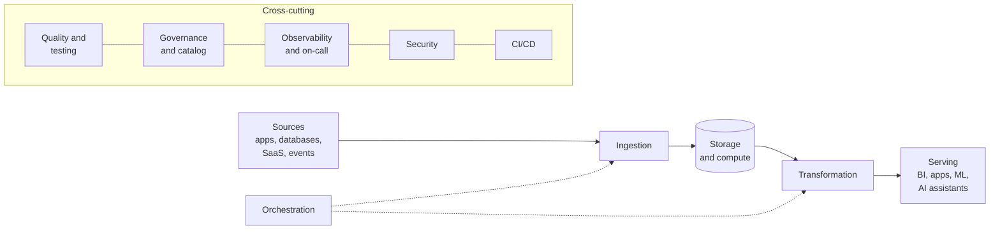
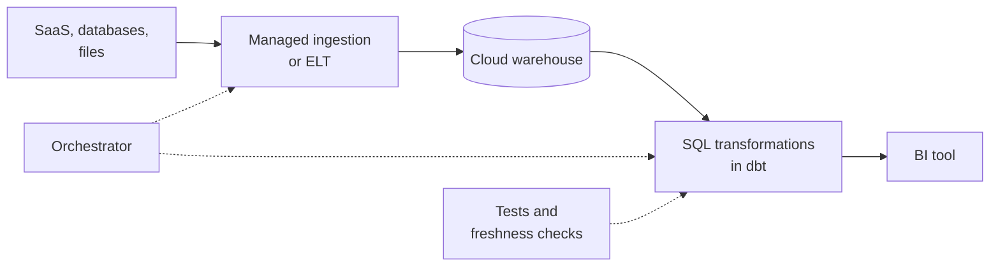
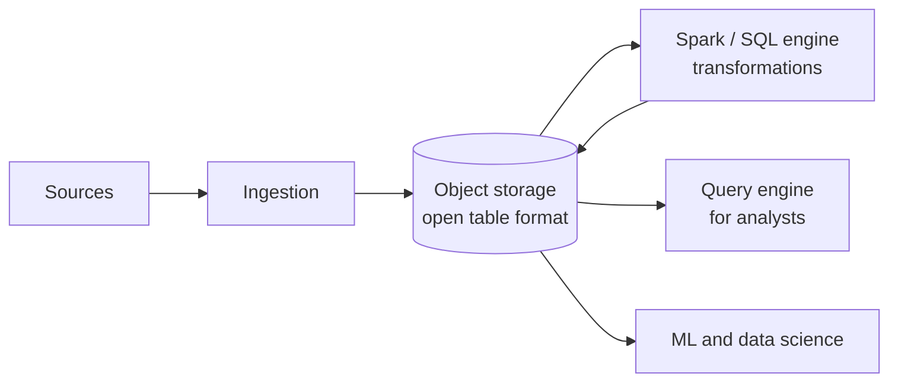
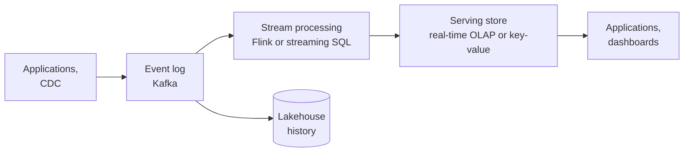
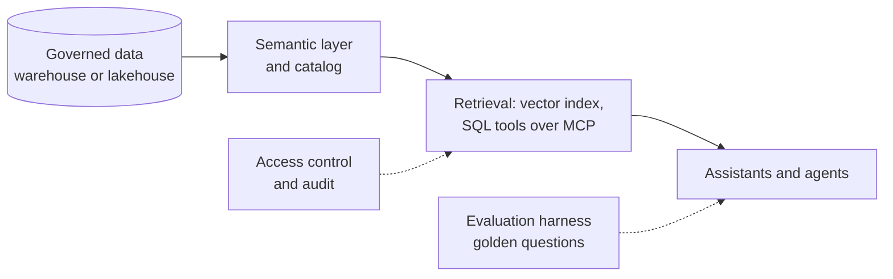

# Choosing a Data Stack
> How to pick tools for a data platform from your requirements, start with the simplest stack that meets them, and record and check the decisions so they can be changed later.

**Prerequisites:** [DE Concepts](../00-foundations/de-concepts.md) · [System Design](system-design.md) · [Cost Optimization](cost-optimization.md)

**Related:** [Data Modeling](../01-storage/data-modeling.md) · [Data Catalogs in Practice](../05-quality-governance/data-catalogs.md) · [Testing and CI/CD](../06-infrastructure/testing-cicd.md) · [DataOps](../05-quality-governance/dataops-operations.md) · [Interview Roadmap](../09-interviews/interview-roadmap.md) · [Glossary](../99-reference/glossary.md)

---

## Overview

**Challenge:** There are more good data tools than any team can run. Each conference talk, vendor page and job posting suggests another one, and each looks reasonable alone. Together they produce a platform with a streaming layer nobody needs, three tools for the same job, no owner for half of them, and a team too small to operate any of it. The opposite mistake is also common: a stack chosen years ago for a workload that has since changed, now blocking the work it was meant to enable.

**Solution:** Choose from **requirements**, not from fashion. Write down what the platform must do (how fresh, how big, how many users, which regulations, which skills), pick the simplest stack that meets those requirements, and add a component only when a specific signal says you need it. Then make the reasoning durable: record each decision and its trade-offs, and turn your architecture principles into **checks that run**, so a change that breaks them is caught in review and not in production.

This guide does not name a winner, because the right answer depends on your constraints. It gives you the questions, four reference architectures, the signals that tell you when to grow, and a small tested tool for reviewing a proposed stack.



**Relevance to data engineering:** Choosing and defending a stack is a core senior task, and a common interview and design-review topic. The skill is less about knowing tools than about reasoning from requirements, cost and risk. See [System Design](system-design.md) for worked designs and [Cost Optimization](cost-optimization.md) for the money side.

---

**On this page**

**Basic**
- [The Layers](#the-layers)
- [Start with Requirements](#start-with-requirements)
- [Principles](#principles)

**Intermediate**
- [Four Reference Architectures](#four-reference-architectures)
- [Signals That Say It Is Time to Grow](#signals-that-say-it-is-time-to-grow)
- [Buy, Run or Build](#buy-run-or-build)

**Advanced**
- [Turning Principles into Checks](#turning-principles-into-checks)
- [Evaluating a Tool](#evaluating-a-tool)
- [Recording Decisions](#recording-decisions)
- [Lock-In and Exit Plans](#lock-in-and-exit-plans)
- [Anti-Patterns](#anti-patterns)

**Reference**
- [Common Pitfalls](#common-pitfalls)
- [Cheat Sheet](#cheat-sheet)
- [Interview Questions](#interview-questions)
- [Further Reading](#further-reading)

---

## The Layers

Every data platform needs an answer for each of these. The handbook has a guide for the common choices in each.

| Layer | The question | Where to look in this handbook |
|-------|--------------|-------------------------------|
| **Ingestion** | How does data get in, and how often? | [Ingestion & CDC](../02-processing/ingestion-cdc.md), [Kafka](../04-streaming/kafka-reference.md), [NoSQL and Operational Stores](../01-storage/nosql-operational-stores.md) |
| **Storage** | Where does it live, in what format? | [Cloud Storage](../01-storage/cloud-storage.md), [Delta Lake](../01-storage/delta-lake.md), [Iceberg](../01-storage/apache-iceberg.md), [Hudi](../01-storage/apache-hudi.md) |
| **Compute and warehouse** | What runs the queries and jobs? | [Snowflake](../01-storage/snowflake-reference.md), [BigQuery](../01-storage/bigquery-reference.md), [Redshift](../01-storage/redshift-reference.md), [Azure and Fabric](../01-storage/azure-fabric.md), [Databricks](../02-processing/databricks-reference.md), [PySpark](../02-processing/pyspark-reference.md), [DuckDB & Polars](../02-processing/duckdb-polars.md), [Trino](../02-processing/trino-federation.md) |
| **Streaming** | Is there a need for results in seconds? | [Flink](../04-streaming/flink-reference.md), [Beam and Dataflow](../04-streaming/beam-dataflow.md), [Streaming SQL](../04-streaming/streaming-sql.md), [Real-Time Analytics Databases](../01-storage/realtime-olap.md) |
| **Transformation** | Where does business logic live? | [dbt](../02-processing/dbt-reference.md), [Semantic Layer & Metrics](../02-processing/semantic-layer-metrics.md), [Data Modeling](../01-storage/data-modeling.md) |
| **Orchestration** | What runs what, and when? | [Airflow](../03-orchestration/airflow-reference.md), [Dagster](../03-orchestration/dagster-reference.md), [Prefect](../03-orchestration/prefect-reference.md) |
| **Serving** | Who consumes the data, and how? | [BI Tools](../02-processing/bi-tools.md), [Vector Databases](../07-ai/vector-databases.md), [RAG](../07-ai/rag.md), [MCP and Text-to-SQL](../07-ai/mcp-text-to-sql.md) |
| **Quality and testing** | How do we know it is right? | [Data Quality](../05-quality-governance/data-quality.md), [Testing and CI/CD](../06-infrastructure/testing-cicd.md) |
| **Governance and catalog** | What exists, who owns it, who may see it? | [Governance & Lineage](../05-quality-governance/governance-lineage.md), [Data Catalogs in Practice](../05-quality-governance/data-catalogs.md), [Data Security & Privacy](../05-quality-governance/data-security-privacy.md) |
| **Observability and operations** | How do we notice and respond? | [Pipeline Observability](../05-quality-governance/pipeline-observability.md), [DataOps](../05-quality-governance/dataops-operations.md) |
| **Infrastructure** | How is it all deployed? | [Docker](../06-infrastructure/docker-reference.md), [Kubernetes](../06-infrastructure/kubernetes-for-de.md), [Terraform](../06-infrastructure/terraform-for-de.md) |

A layer can be filled by a feature of another tool. A warehouse often covers storage and compute, and some orchestrators cover part of observability. Fewer tools is usually better, provided each layer has an answer and an owner.

---

## Start with Requirements

Write the requirements before comparing products. Answering these turns most decisions from taste into arithmetic.

| Question | Why it matters |
|----------|----------------|
| **How fresh must the data be?** Seconds, minutes, hourly, daily | The single biggest driver of complexity. Batch is far simpler than streaming, and much reporting needs no more than hourly |
| **How much data, and how fast does it grow?** | Decides whether one machine, a warehouse or a distributed engine is needed |
| **Who reads it, and how many at once?** | Analysts running large queries, or thousands of users on a product screen, need different systems |
| **What is the team?** Size, skills, on-call ability | The most overlooked constraint. A tool you cannot operate is a liability |
| **What regulation and sensitivity apply?** | Personal data brings classification, access control, deletion and audit requirements |
| **What is already in place?** Cloud, contracts, skills | Fit with what exists is worth more than a marginal technical edge |
| **What does it cost, and who pays?** | Total cost includes people's time, not only licences and compute |
| **How much may it change?** | A stable reporting workload and a fast-moving product have different needs |
| **Does it involve ML or AI?** | Adds vector search, evaluation, feature serving and new security questions |

Write the answers as numbers where you can ("dashboards refreshed within 4 hours, about 200 GB, 12 analysts, team of 4") and keep the list, since it is the input to the review tool below and the reason for every later decision.

---

## Principles

Principles that hold up across most organisations, and the reason for each:

1. **Start with the simplest stack that meets the requirements.** Complexity is a recurring cost. A batch warehouse with SQL transformations serves a great deal of real work.
2. **Add a component only when a specific signal demands it.** "We might need streaming later" is not a signal. A freshness target you cannot meet is.
3. **Prefer boring, widely used technology** for core layers, where hiring, documentation and answers on the internet matter more than novelty. Spend your novelty budget where it earns its keep.
4. **Buy or use managed services for undifferentiated work.** Running infrastructure is rarely what makes your data valuable.
5. **Use open formats and standard interfaces at the boundaries** (SQL, Parquet, open table formats, OpenLineage), so moving one layer does not mean rewriting everything.
6. **One tool per job, until proven otherwise.** Two tools in a layer double the cost to operate, learn and secure.
7. **Every component has an owner and a runbook.** An unowned tool is a future incident.
8. **Design for the team you have.** A stack a team of four cannot run is the wrong stack.
9. **Make decisions reversible where it is cheap,** and note where it is not.
10. **Measure the outcome.** The point is trusted data delivered on time, not the architecture diagram.

---

## Four Reference Architectures

These are starting points, not products to install. Each fits a common situation, and lists what to defer.

### 1. Warehouse-first analytics

For a small or medium team whose main work is reporting and analysis, with data from applications and SaaS tools, and freshness of hours.



| | |
|-|-|
| **Fits when** | Batch is enough, data is mostly structured, the team knows SQL, and there is a small team |
| **Core choices** | A cloud warehouse, SQL transformations, an orchestrator, a BI tool |
| **Defer** | Streaming, a lakehouse, a catalog beyond what the warehouse provides, custom platforms |
| **Watch for** | Warehouse cost from unfiltered queries, and business logic that leaks into the BI tool |
| **Guides** | [Snowflake](../01-storage/snowflake-reference.md) or [BigQuery](../01-storage/bigquery-reference.md), [dbt](../02-processing/dbt-reference.md), [Airflow](../03-orchestration/airflow-reference.md), [BI Tools](../02-processing/bi-tools.md) |

### 2. Lakehouse

For organisations with large volumes, varied data (files, events, semi-structured), data science alongside analytics, or a need for several engines to read the same tables.



| | |
|-|-|
| **Fits when** | Data volume or variety outgrows a warehouse, several engines need the same data, or cost of raw storage in a warehouse dominates |
| **Core choices** | Object storage, an open table format (Iceberg, Delta Lake or Hudi), one or two engines, a catalog |
| **Defer** | Streaming until a requirement asks for it |
| **Watch for** | Small files, table maintenance, and the operating load of running engines yourself |
| **Guides** | [Cloud Storage](../01-storage/cloud-storage.md), [Iceberg](../01-storage/apache-iceberg.md), [Delta Lake](../01-storage/delta-lake.md), [PySpark](../02-processing/pyspark-reference.md), [Trino](../02-processing/trino-federation.md), [Databricks](../02-processing/databricks-reference.md) |

### 3. Streaming-first

For products and operations that need results in seconds: fraud detection, live dashboards, alerting, personalisation.



| | |
|-|-|
| **Fits when** | A real requirement demands freshness of seconds to minutes, and there is someone to operate it |
| **Core choices** | An event log, a stream processor or streaming database, a serving store, a lakehouse for history |
| **Defer** | Streaming for anything that does not need it |
| **Watch for** | Late and out-of-order data, state size, exactly-once assumptions, and operating cost |
| **Guides** | [Kafka](../04-streaming/kafka-reference.md), [Flink](../04-streaming/flink-reference.md), [Streaming SQL](../04-streaming/streaming-sql.md), [Real-Time Analytics Databases](../01-storage/realtime-olap.md), [Beam and Dataflow](../04-streaming/beam-dataflow.md) |

### 4. AI-enabled platform

For organisations adding retrieval, assistants or agents on top of their data.



| | |
|-|-|
| **Fits when** | The underlying data is already trustworthy and governed. AI on top of bad data makes bad answers faster |
| **Core choices** | Curated tables or a semantic layer, a catalog for descriptions, a vector store where retrieval needs it, guarded tools, an evaluation set |
| **Defer** | Fine-tuning and custom models until retrieval and prompting are exhausted |
| **Watch for** | Access control per user, prompt injection through data, cost, and unmeasured accuracy |
| **Guides** | [MCP and Text-to-SQL](../07-ai/mcp-text-to-sql.md), [RAG](../07-ai/rag.md), [Vector Databases](../07-ai/vector-databases.md), [Eval & Evals](../07-ai/eval-and-evals.md), [Data Catalogs in Practice](../05-quality-governance/data-catalogs.md) |

Real platforms combine these, but usually as an evolution: warehouse-first, then a lakehouse for the data that outgrows it, streaming for the one use case that needs it, and AI on the governed data that results.

---

## Signals That Say It Is Time to Grow

Add capability in response to evidence. This table pairs a signal with the response and where to read about it.

| Signal | Likely response | Guide |
|--------|-----------------|-------|
| A freshness requirement that batch cannot meet (minutes or seconds) | A streaming layer for that flow only | [Kafka](../04-streaming/kafka-reference.md), [Flink](../04-streaming/flink-reference.md) |
| Analysts and pipelines slow each other down | Separate compute for separate workloads | [Snowflake](../01-storage/snowflake-reference.md), [Cost Optimization](cost-optimization.md) |
| Several engines or tools need the same tables | An open table format | [Iceberg](../01-storage/apache-iceberg.md), [Delta Lake](../01-storage/delta-lake.md) |
| Raw or semi-structured data dominates warehouse cost | Move the raw layer to object storage | [Cloud Storage](../01-storage/cloud-storage.md) |
| Product screens need sub-second aggregates for many users | A real-time analytics database for that path | [Real-Time Analytics Databases](../01-storage/realtime-olap.md) |
| Consumers find data problems before the team does | Better monitoring and on-call | [Pipeline Observability](../05-quality-governance/pipeline-observability.md), [DataOps](../05-quality-governance/dataops-operations.md) |
| Nobody can say what a change will break | Lineage and a catalog | [Data Catalogs in Practice](../05-quality-governance/data-catalogs.md) |
| The same metric has several values | A semantic layer, or logic moved into the warehouse | [Semantic Layer & Metrics](../02-processing/semantic-layer-metrics.md) |
| Personal data is spreading | Classification, masking and access control | [Data Security & Privacy](../05-quality-governance/data-security-privacy.md) |
| Releases cause incidents | Tests and CI/CD for pipelines | [Testing and CI/CD](../06-infrastructure/testing-cicd.md) |
| Batch jobs need burst capacity and isolation | A container platform | [Kubernetes](../06-infrastructure/kubernetes-for-de.md) |
| The team is spending its time running tools | A managed service | See [Buy, Run or Build](#buy-run-or-build) |

If you cannot point to a signal, the answer to "should we add it?" is usually "not yet".

---

## Buy, Run or Build

For each component there are three ways to have it, and the cost of each is mostly people.

| | Buy (managed service) | Run (open source or self-hosted) | Build |
|-|-----------------------|----------------------------------|-------|
| **Money** | Subscription or usage, often the largest visible line | Infrastructure, usually less than a service | Engineering time |
| **People** | Little operation. Some tuning | Upgrades, security, scaling, on-call | The most, forever |
| **Control** | Limited to what the service exposes | High | Total |
| **Speed to start** | Fastest | Medium | Slowest |
| **Lock-in** | Depends on formats and interfaces (see below) | Lower | None, but you own the maintenance |
| **Best when** | The layer is not what differentiates you | You have the skills and a reason, such as cost at scale or control | Nothing on the market fits, and it is central to your product |

The recurring mistake is comparing the licence cost of a service with the infrastructure cost of the open-source alternative and ignoring the engineer-months of operation. Compare the **total cost of ownership**, including the people, on-call and upgrades. See [Cost Optimization](cost-optimization.md) for unit economics.

A useful test for building: "if we did not build this, would we be worse at our actual business?" For most data platform components, the answer is no.

---

## Turning Principles into Checks

Principles in a wiki are forgotten. Principles as code are enforced. In architecture, a check that verifies a desired property of the system automatically is called a **fitness function**. Here the principles from above are written as small rules over a description of the requirements and the proposed stack. The rules are examples, and the thresholds are yours to change: the value is in stating your principles precisely enough to test them.

```python
# stack_review.py
"""Check a proposed data stack against the requirements it has to meet.

The rules are examples of architecture principles written as code. Change the thresholds
to match your organisation, and add the rules your own past mistakes suggest.
"""
from dataclasses import dataclass

REQUIRED_LAYERS = ["ingestion", "storage", "transformation", "orchestration", "serving"]
OPEN_TABLE_FORMATS = {"iceberg", "delta lake", "hudi"}
MAX_TOOLS_PER_LAYER = 2
TOOLS_PER_PERSON_LIMIT = 2            # a team should not run more than about two tools per engineer
STREAMING_FRESHNESS_MINUTES = 15      # below this, batch schedules struggle to keep up
BATCH_IS_ENOUGH_MINUTES = 60          # at or above this, a streaming layer is probably unnecessary


@dataclass
class Finding:
    severity: str                     # "error" (the stack cannot meet the requirement) or "warning" (a risk to weigh)
    rule: str
    message: str


def review(requirements: dict, stack: dict[str, list[str]]) -> list[Finding]:
    findings: list[Finding] = []
    lowered = {layer: [tool.lower() for tool in tools] for layer, tools in stack.items()}
    tool_count = sum(len(tools) for tools in stack.values())

    for layer in REQUIRED_LAYERS:
        if not lowered.get(layer):
            findings.append(Finding("error", "missing-layer", f"no tool chosen for '{layer}'"))

    freshness = requirements["freshness_target_minutes"]
    has_streaming = bool(lowered.get("streaming"))
    if freshness < STREAMING_FRESHNESS_MINUTES and not has_streaming:
        findings.append(Finding("error", "freshness-needs-streaming",
                                f"a {freshness}-minute freshness target needs a streaming layer, and this stack is batch only"))
    if freshness >= BATCH_IS_ENOUGH_MINUTES and has_streaming:
        findings.append(Finding("warning", "streaming-not-needed",
                                f"a {freshness}-minute freshness target can usually be met in batch, so the streaming layer adds cost without a requirement"))

    team = requirements["team_size"]
    if tool_count > team * TOOLS_PER_PERSON_LIMIT:
        findings.append(Finding("warning", "too-many-tools",
                                f"{tool_count} tools for a team of {team}: each tool needs an owner, upgrades and on-call"))

    for layer, tools in lowered.items():
        if len(tools) > MAX_TOOLS_PER_LAYER:
            findings.append(Finding("warning", "overlapping-tools", f"{len(tools)} tools in '{layer}': check for overlap"))

    if requirements.get("contains_pii") and not (lowered.get("catalog") or lowered.get("access-control")):
        findings.append(Finding("error", "pii-without-governance",
                                "personal data needs a catalog for classification or an access-control layer, and neither is chosen"))

    if requirements.get("multiple_engines"):
        formats = set(lowered.get("table-format", []))
        if not formats & OPEN_TABLE_FORMATS:
            findings.append(Finding("error", "multi-engine-needs-open-format",
                                    "several engines must read the same tables, which needs an open table format (Iceberg, Delta Lake or Hudi)"))

    missing_owners = sorted(set(stack) - set(requirements.get("owners", {})))
    if missing_owners:
        findings.append(Finding("warning", "unowned-layer", f"no owning team for: {', '.join(missing_owners)}"))

    return findings


def has_blocking_errors(findings: list[Finding]) -> bool:
    return any(finding.severity == "error" for finding in findings)
```

Each rule reports either an **error** (the stack cannot meet a requirement) or a **warning** (a risk to weigh). The rules cover missing layers, a freshness target that a batch-only stack cannot meet, a streaming layer that the freshness target does not justify, too many tools for the team size, overlapping tools in one layer, personal data with no governance, several engines with no open table format, and layers with no owner.

Run it on a proposal. This example is deliberately over-engineered for a team of three with a four-hour freshness target and personal data:

```python
# demo_review.py
from stack_review import has_blocking_errors, review

requirements = {
    "team_size": 3,
    "freshness_target_minutes": 240,        # a morning report is enough
    "contains_pii": True,
    "multiple_engines": False,
    "owners": {"storage": "data-team", "transformation": "data-team"},
}

stack = {
    "ingestion": ["Airbyte", "Fivetran", "custom scripts"],
    "streaming": ["Kafka", "Flink"],
    "storage": ["Snowflake", "S3 lake"],
    "transformation": ["dbt", "Spark"],
    "orchestration": ["Airflow"],
    "serving": ["Looker"],
}

findings = review(requirements, stack)
for f in findings:
    print(f"{f.severity.upper():7} {f.rule}: {f.message}")
print("blocked:", has_blocking_errors(findings))
```

```text
WARNING streaming-not-needed: a 240-minute freshness target can usually be met in batch, so the streaming layer adds cost without a requirement
WARNING too-many-tools: 11 tools for a team of 3: each tool needs an owner, upgrades and on-call
WARNING overlapping-tools: 3 tools in 'ingestion': check for overlap
ERROR   pii-without-governance: personal data needs a catalog for classification or an access-control layer, and neither is chosen
WARNING unowned-layer: no owning team for: ingestion, orchestration, serving, streaming
blocked: True
```

It found one blocking problem (personal data with no governance) and four warnings that describe over-engineering. None of these needed a debate about products. Now the tests, which are the specification of each rule:

```python
# test_stack_review.py
import copy

import pytest

from stack_review import has_blocking_errors, review

REQUIREMENTS = {
    "team_size": 6,
    "freshness_target_minutes": 240,
    "contains_pii": False,
    "multiple_engines": False,
    "owners": {"ingestion": "platform", "storage": "platform", "transformation": "analytics",
               "orchestration": "platform", "serving": "analytics"},
}

STACK = {
    "ingestion": ["Fivetran"],
    "storage": ["Snowflake"],
    "transformation": ["dbt"],
    "orchestration": ["Airflow"],
    "serving": ["Metabase"],
}


def rules(requirements=None, stack=None):
    return {finding.rule for finding in review(requirements or REQUIREMENTS, stack or STACK)}


def changed(base, **changes):
    result = copy.deepcopy(base)
    result.update(changes)
    return result


def test_a_simple_batch_stack_for_a_modest_requirement_has_no_findings():
    assert review(REQUIREMENTS, STACK) == []


def test_every_required_layer_must_have_a_tool():
    stack = {layer: tools for layer, tools in STACK.items() if layer != "orchestration"}
    findings = review(REQUIREMENTS, stack)
    assert [(f.rule, f.severity) for f in findings if f.rule == "missing-layer"] == [("missing-layer", "error")]


def test_a_tight_freshness_target_needs_streaming():
    assert "freshness-needs-streaming" in rules(changed(REQUIREMENTS, freshness_target_minutes=5))


def test_a_tight_target_is_met_once_a_streaming_layer_exists():
    stack = changed(STACK, streaming=["Kafka", "Flink"])
    assert "freshness-needs-streaming" not in rules(changed(REQUIREMENTS, freshness_target_minutes=5), stack)


def test_streaming_for_a_relaxed_target_is_flagged_as_unneeded_cost():
    assert "streaming-not-needed" in rules(stack=changed(STACK, streaming=["Kafka"]))


def test_too_many_tools_for_a_small_team():
    stack = changed(STACK, catalog=["DataHub"], quality=["Great Expectations"], bi2=["Superset"], streaming=["Kafka"], extra=["X", "Y"])
    assert "too-many-tools" in rules(changed(REQUIREMENTS, team_size=3, freshness_target_minutes=5), stack)


def test_overlapping_tools_in_one_layer_are_flagged():
    assert "overlapping-tools" in rules(stack=changed(STACK, serving=["Metabase", "Superset", "Looker"]))


def test_personal_data_needs_governance():
    assert "pii-without-governance" in rules(changed(REQUIREMENTS, contains_pii=True))


def test_personal_data_is_fine_with_a_catalog():
    assert "pii-without-governance" not in rules(changed(REQUIREMENTS, contains_pii=True), changed(STACK, catalog=["OpenMetadata"]))


def test_several_engines_need_an_open_table_format():
    assert "multi-engine-needs-open-format" in rules(changed(REQUIREMENTS, multiple_engines=True))


def test_an_open_table_format_satisfies_the_multi_engine_need():
    stack = changed(STACK, **{"table-format": ["Apache Iceberg"]})
    assert "multi-engine-needs-open-format" in rules(changed(REQUIREMENTS, multiple_engines=True), changed(STACK, **{"table-format": ["Parquet only"]}))
    assert "multi-engine-needs-open-format" not in rules(changed(REQUIREMENTS, multiple_engines=True), changed(stack, **{"table-format": ["iceberg"]}))


def test_every_layer_needs_an_owner():
    requirements = changed(REQUIREMENTS, owners={"storage": "platform"})
    assert "unowned-layer" in rules(requirements)


def test_an_irrelevant_owner_entry_does_not_hide_an_unowned_layer():
    owners = {"storage": "platform", "ingestion": "platform", "transformation": "analytics", "orchestration": "platform",
              "streaming": "platform"}                                  # nobody owns 'serving'; 'streaming' is not in the stack
    findings = review(changed(REQUIREMENTS, owners=owners), STACK)
    assert [f.message for f in findings if f.rule == "unowned-layer"] == ["no owning team for: serving"]


def test_errors_block_and_warnings_do_not():
    assert has_blocking_errors(review(changed(REQUIREMENTS, freshness_target_minutes=5), STACK)) is True
    assert has_blocking_errors(review(REQUIREMENTS, changed(STACK, streaming=["Kafka"]))) is False


@pytest.mark.parametrize("minutes, expected", [(14, True), (15, False)])
def test_the_freshness_threshold_is_exact(minutes, expected):
    assert ("freshness-needs-streaming" in rules(changed(REQUIREMENTS, freshness_target_minutes=minutes))) is expected
```

Run the review in the pull request that changes the stack description, and let errors block the merge. When an incident or a painful migration teaches you a lesson, add a rule for it, so the lesson survives staff turnover. See [Testing and CI/CD](../06-infrastructure/testing-cicd.md) for wiring checks into CI.

Two cautions. The rules encode judgement, so they will sometimes be wrong for a particular case: allow an explicit, recorded exception instead of deleting the rule. And a check confirms that a proposal is consistent with your principles, not that it is a good design, so it complements a review and does not replace one.

---

## Evaluating a Tool

When you have narrowed the choice to two or three candidates, test them on **your** work, not on a vendor's demo.

1. **Write the requirements and weights first,** so the scoring reflects what matters and is not reverse-engineered to the favourite.
2. **Use real data and your real queries.** Take ten of your most important and your most difficult workloads.
3. **Measure what you care about:** correctness, latency, concurrency, cost at your volume, and how much of the metadata, lineage and quality tooling you get.
4. **Test failure, not only success.** Kill a component, send bad data, change a schema, and watch recovery. Try an upgrade.
5. **Test the exit.** Export your data and definitions in an open format and load them elsewhere. If that is hard now, it will be harder later.
6. **Count the operating work.** Who is on call, how often is it paged, how long do upgrades take?
7. **Check the people side:** documentation, community, hiring, and the vendor's track record on support and roadmap.
8. **Time-box it,** with a written decision at the end, so a proof of concept does not turn into an unofficial production system.

Record the results, including the runner-up, and why you did not pick it.

---

## Recording Decisions

An **architecture decision record** (ADR) is a short document that captures one significant decision: the context, the options considered, the choice and its consequences. It is written when the decision is made, when the reasons are fresh, and kept in the repository beside the code. Future engineers, including you, can then see why the platform is the way it is, and whether the reasons still hold.

```markdown
# ADR 007: Use a batch warehouse pipeline for the orders reporting

Status: accepted (2026-09-28)

## Context
Finance needs the orders report by 08:00. Data is about 200 GB and grows 10% a year.
The team is four people. Personal data is present and needs classification.

## Options considered
1. Warehouse + dbt + orchestrator (batch, 4-hour freshness)
2. Streaming pipeline with a real-time serving store
3. Lakehouse with a self-managed engine

## Decision
Option 1.

## Consequences
- Simple to run and on-call for a team of four
- Freshness is hours, not seconds. Revisit if a real-time requirement appears
- Warehouse cost must be watched (see the cost dashboard)
- A catalog is required before personal data is added (see ADR 008)

## Revisit when
Freshness under 15 minutes is required, data passes 5 TB, or a second engine needs the same tables.
```

The last section is the useful one: it states in advance which signals will reopen the decision. Decisions are then revisited on evidence and not on mood.

---

## Lock-In and Exit Plans

All choices lock you in somewhat. The goal is to know how much, and to keep the cost of leaving proportionate to the risk.

| Source of lock-in | How to limit it |
|-------------------|-----------------|
| **Proprietary storage format** | Keep raw and important data in open formats (Parquet and an open table format), even if a warehouse serves queries |
| **Proprietary SQL and features** | Keep most logic in standard SQL and in tools that support several engines. Isolate vendor-specific code so it can be found |
| **Business logic in a BI tool** | Keep it in the warehouse or a semantic layer, as in [BI Tools](../02-processing/bi-tools.md) |
| **Orchestration definitions** | Prefer plain code and containers over a proprietary designer |
| **Metadata and lineage** | Use open standards such as OpenLineage, and keep descriptions and ownership in Git ([Data Catalogs in Practice](../05-quality-governance/data-catalogs.md)) |
| **Skills** | Prefer tools with a large community |
| **Contracts** | Watch minimum commitments and egress charges |

Some lock-in is a fair price for a great service. The discipline is to **decide it deliberately, write it in the ADR and test the exit before you need it**.

---

## Anti-Patterns

| Anti-pattern | What happens |
|--------------|--------------|
| **Résumé-driven design** | Tools chosen because they are interesting or look good on a CV. The team then has to run them |
| **Streaming by default** | A streaming stack for a daily report, at several times the operating cost |
| **Tool sprawl** | Many overlapping tools, nobody knowing all of them, and every upgrade a project |
| **A platform for three pipelines** | Building a self-service internal platform before there are users for it |
| **Copying another company's stack** | Their scale, team and constraints are not yours |
| **Migrating for fashion** | A costly move with no measurable gain, while real problems wait |
| **Big-bang rewrites** | Years of parallel running with no value until the end. Migrate incrementally, by workload |
| **No owner** | Tools that nobody upgrades, patches or understands |
| **Optimising the wrong layer** | Tuning the warehouse when the problem is an unbounded dashboard query |
| **Ignoring people cost** | Choosing the cheaper licence and paying with engineer-months |

---

## Common Pitfalls

| Pitfall | Symptom | Fix |
|---------|---------|-----|
| Choosing before writing requirements | Debates about products that never end | Write the numbers first, then compare |
| Freshness assumed, not asked | A streaming stack for a report read once a day | Ask consumers what freshness they act on |
| Adding a layer "for later" | Cost and complexity with no benefit | Add on a signal, and write the signal in the ADR |
| Two tools per layer | Double the operating cost and confusion | One tool per job unless there is a documented reason |
| A stack larger than the team | Missed upgrades, no on-call, incidents | Match the number of tools to the number of people |
| Comparing licence to infrastructure only | Surprise operating cost | Compare total cost, including people |
| A demo-driven evaluation | Great demo, poor fit | Test on your data, your queries and your failure cases |
| No exit test | Migration is impossible when needed | Export and reload in an open format during the evaluation |
| Governance added after data spreads | Personal data everywhere, no classification | Catalog and classification before the first sensitive dataset |
| Decisions in chat, not writing | Nobody remembers why | ADRs in the repository, with revisit triggers |
| Principles nobody enforces | The stack drifts from the plan | Encode them as checks, run in CI |
| Big-bang migrations | No value for years, and high risk | Move workload by workload, with parallel verification |
| Optimising tools before the workload | Faster tools, same slow query | Measure first: which queries and pipelines cost the most |
| Ignoring the people | A stack the team cannot run | Choose for the skills you have, or budget for the skills you need |

---

## Cheat Sheet

| Step | Do this |
|------|---------|
| 1 | Write requirements as numbers: freshness, volume, users, team, regulation, budget |
| 2 | Start from the simplest reference architecture that meets them |
| 3 | Choose one tool per layer, each with an owner |
| 4 | Prefer managed services and open formats for undifferentiated work |
| 5 | Add components only on a named signal |
| 6 | Run the stack review, and let errors block |
| 7 | Evaluate finalists on real data, real queries, failure cases and exit |
| 8 | Record the decision in an ADR, with revisit triggers |
| 9 | Test the exit before you need it |
| 10 | Review the stack against evidence every quarter or two |

| Question | Rule of thumb |
|----------|---------------|
| Is freshness under 15 minutes needed? | Only then consider streaming |
| Several engines on the same tables? | An open table format |
| Small team, reporting workload? | Warehouse, SQL transformations, orchestrator, BI |
| Personal data present? | Classification and access control before scale |
| Nothing on the market fits and it is central to the business? | Then, and only then, build |

---

## Interview Questions

**Q: How would you choose a data stack for a new company?**
A: Start with requirements, written as numbers: how fresh the data must be, how much there is, who reads it and how many at once, the team's size and skills, regulation, and budget. Then pick the simplest stack that meets them, which for most reporting workloads is a cloud warehouse, SQL transformations, an orchestrator and a BI tool, and add capability only when a specific signal asks for it, such as a freshness target batch cannot meet. I prefer managed services and open formats for undifferentiated work, give every layer one tool and one owner, and record the decision with the conditions that would reopen it.

**Q: When is streaming worth the added complexity?**
A: When there is a genuine requirement that batch cannot meet, typically freshness of seconds to a few minutes for something the business acts on, such as fraud checks, alerting or a live product feature. Streaming adds state, late and out-of-order data, exactly-once concerns and a much larger operating burden, so for reporting that people read a few times a day it is cost with no benefit. I would confirm what freshness consumers actually act on before deciding.

**Q: How do you avoid vendor lock-in?**
A: By deciding it deliberately, not by avoiding all of it. Keep important data in open formats and, where several engines are involved, an open table format. Keep logic in standard SQL and in the warehouse or a semantic layer, not in a proprietary tool. Use open standards for lineage and keep metadata in Git. Then test the exit by exporting and reloading before committing, and record the accepted lock-in in the decision record.

**Q: How do you compare buying a managed service with running open source?**
A: On total cost of ownership, not licence against infrastructure. Running open source adds engineer time for upgrades, security, scaling and on-call, which is often the largest cost and the one people leave out. A managed service costs more visibly and less in people. I buy for layers that do not differentiate the business, run it myself where I have the skills and a reason such as scale or control, and build only when nothing fits and it is central to the product.

**Q: How would you evaluate two candidate tools?**
A: Write the requirements and weights before looking at products. Run both on real data with the team's real queries, including the hardest ones, and measure correctness, latency, concurrency and cost. Test failure and recovery, an upgrade, and the exit by exporting data in an open format. Count the operating work and check support and community. Time-box it, and write down the result, including why the runner-up lost.

**Q: How do you keep an architecture from drifting away from its principles?**
A: Record decisions in ADRs with the signals that would reopen them, and turn the principles into automated checks, sometimes called fitness functions, that run in CI on the stack description: for example flagging a streaming layer without a freshness requirement, too many tools for the team size, personal data with no governance, or a layer with no owner. Errors block the change, warnings prompt a discussion, and each incident adds a rule, so the lessons outlast the people who learned them.

---

## Further Reading

- [System Design](system-design.md), [Cost Optimization](cost-optimization.md) and [System Design Case Studies](../09-interviews/system-design-case-studies.md) in this handbook
- [Architecture decision records](https://adr.github.io/) and the original post, [Documenting Architecture Decisions](https://www.cognitect.com/blog/2011/11/15/documenting-architecture-decisions)
- [A collection of ADR templates and examples](https://github.com/joelparkerhenderson/architecture-decision-record)

---

**Previous:** [System Design](system-design.md) · **Next:** [Cost Optimization](cost-optimization.md) · **Back to:** [Index](../README.md)
