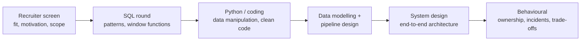

# Interview Roadmap
> What a data engineering interview loop tests, which handbook guides cover each part, and a four-week plan to prepare.

**Related:** [SQL Interview Patterns](sql-interview-patterns.md) · [System Design Case Studies](system-design-case-studies.md) · [System Design](../08-architecture/system-design.md) · [Glossary](../99-reference/glossary.md)

---

## Overview

**Challenge:** Data engineering interviews cover a wide range: SQL, Python, data modelling, pipelines, distributed systems, cloud, and increasingly LLM tooling. Preparing "everything" is impossible, and reading without practising does not transfer to a live round.

**Solution:** Know the format of the loop, map each round to the topics that actually get asked, and practise the *skill* each round tests. Every guide in this handbook ends with Interview Questions, so this page tells you which ones to prioritise and in what order.

Loops differ by company: some skip a round, add a take-home or a live debugging session, or add an AI/LLM round. Ask the recruiter for the format and the interview length.

---

**On this page**

**Basic**
- [The Rounds](#the-rounds)
- [Topic Map](#topic-map)

**Intermediate**
- [A Four-Week Plan](#a-four-week-plan)
- [How to Answer](#how-to-answer)

**Advanced**
- [Behavioural Round](#behavioural-round)
- [Take-Homes and Live Debugging](#take-homes-and-live-debugging)
- [Questions to Ask Them](#questions-to-ask-them)

**Reference**
- [Common Pitfalls](#common-pitfalls)
- [Cheat Sheet](#cheat-sheet)
- [Interview Questions](#interview-questions)
- [Further Reading](#further-reading)

---

## The Rounds

| Round | What it tests | Typical content | Prepare with |
|-------|---------------|-----------------|--------------|
| **Recruiter / hiring manager** | Fit, level, communication | Your projects, why this role, scale you have handled | A two-minute story for each project |
| **SQL** | Fluency and pattern recognition | Window functions, joins, dedup, cohorts, sessionisation | [SQL Interview Patterns](sql-interview-patterns.md), [Lab 01](https://github.com/sarangambekar1997/data-engineering-handbook/tree/main/labs/01-sql-analytics) |
| **Python / coding** | Data wrangling and clean code | Parse and aggregate records, dictionaries and sets, generators, sometimes a small algorithm | [Python for DE](../00-foundations/python-reference.md) |
| **Data modelling** | Turning a business into tables | Star schema, slowly changing dimensions, grain, keys | [Data Modeling](../01-storage/data-modeling.md) |
| **Pipeline design** | Reliable ETL | Idempotency, incremental loads, backfills, late data, quality checks | [DE Concepts](../00-foundations/de-concepts.md), [Ingestion & CDC](../02-processing/ingestion-cdc.md), [Airflow](../03-orchestration/airflow-reference.md) |
| **System design** | Architecture and trade-offs | Batch vs streaming, storage choices, scale, cost | [System Design](../08-architecture/system-design.md), [Case Studies](system-design-case-studies.md) |
| **Tool depth** | Real experience with the stack on your CV | Spark tuning, dbt, Kafka semantics, warehouse internals | The guide for each tool |
| **Behavioural** | Ownership and judgement | An incident you handled, a disagreement, a mistake | [Behavioural Round](#behavioural-round) |

---

## Topic Map

Where the questions come from, ordered by how often they appear in practice.

| Priority | Topic | Guides |
|----------|-------|--------|
| **Almost always** | SQL and window functions | [SQL](../00-foundations/sql-reference.md), [SQL Interview Patterns](sql-interview-patterns.md) |
| | Data modelling (star schema, SCD) | [Data Modeling](../01-storage/data-modeling.md) |
| | ETL vs ELT, batch vs streaming, idempotency | [DE Concepts](../00-foundations/de-concepts.md) |
| | Python data handling | [Python for DE](../00-foundations/python-reference.md) |
| **Very often** | Spark internals: shuffles, skew, partitioning | [PySpark](../02-processing/pyspark-reference.md) |
| | Orchestration and backfills | [Airflow](../03-orchestration/airflow-reference.md), [Dagster](../03-orchestration/dagster-reference.md) |
| | Warehouse and lakehouse choices | [Snowflake](../01-storage/snowflake-reference.md), [BigQuery](../01-storage/bigquery-reference.md), [Delta Lake](../01-storage/delta-lake.md), [Iceberg](../01-storage/apache-iceberg.md) |
| | Data quality and observability | [Data Quality](../05-quality-governance/data-quality.md), [Pipeline Observability](../05-quality-governance/pipeline-observability.md) |
| **Often** | Kafka and streaming semantics | [Kafka](../04-streaming/kafka-reference.md), [Flink](../04-streaming/flink-reference.md) |
| | dbt | [dbt](../02-processing/dbt-reference.md) |
| | Cost and performance | [Cost Optimization](../08-architecture/cost-optimization.md) |
| | Security and privacy | [Data Security & Privacy](../05-quality-governance/data-security-privacy.md) |
| **Growing** | LLMs, RAG, evals | [LLM APIs](../07-ai/llm-apis.md), [RAG](../07-ai/rag.md), [Evals](../07-ai/eval-and-evals.md) |
| **Situational** | Terraform, Docker, CDC, lineage | [Terraform](../06-infrastructure/terraform-for-de.md), [Docker](../06-infrastructure/docker-reference.md), [Governance](../05-quality-governance/governance-lineage.md) |

Go deep on the tools listed on your CV first. Interviewers ask about what you claim.

---

## A Four-Week Plan

About 6–8 hours a week. Adjust the pace to your interview date.

| Week | Focus | Do |
|------|-------|----|
| **1: Core skills** | SQL and Python | Type out all 15 [SQL patterns](sql-interview-patterns.md) from memory. Solve five problems a day for a week. Do [Lab 01](https://github.com/sarangambekar1997/data-engineering-handbook/tree/main/labs/01-sql-analytics). Refresh Python dictionaries, comprehensions, generators and `collections` |
| **2: Modelling and pipelines** | Data modelling, ETL design | Model an e-commerce and a ride-sharing business on paper, with grain, facts and dimensions. Explain idempotent loads, backfills and late-arriving data out loud. Do [Lab 02](https://github.com/sarangambekar1997/data-engineering-handbook/tree/main/labs/02-dbt-transformations) and [Lab 05](https://github.com/sarangambekar1997/data-engineering-handbook/tree/main/labs/05-airflow-orchestration) |
| **3: Distributed systems** | Spark, streaming, storage | Read the Spark shuffle, skew and join sections and explain them without notes. Kafka delivery guarantees and consumer groups. Lakehouse table formats. Do [Lab 03](https://github.com/sarangambekar1997/data-engineering-handbook/tree/main/labs/03-spark-lakehouse) and [Lab 04](https://github.com/sarangambekar1997/data-engineering-handbook/tree/main/labs/04-kafka-streaming) |
| **4: Design and stories** | System design, behavioural | Work through each [case study](system-design-case-studies.md) aloud, timed at 45 minutes. Write five STAR stories. Do two full mock interviews with a friend or recorded |

The most valuable habit: **speak your reasoning out loud** while you practise. Silent practice does not train the skill that the interview measures.

---

## How to Answer

A repeatable structure works for almost any technical question:

1. **Clarify.** Ask about data volume, freshness, correctness needs, `NULL`s and duplicates, and who consumes the result.
2. **State assumptions.** "I'll assume orders are unique by `order_id` and time is UTC."
3. **Outline the approach** in one or two sentences before you write anything.
4. **Solve simply first**, then refine. A correct simple answer beats an unfinished clever one.
5. **Test with a tiny example**, including edge cases: empty input, ties, `NULL`s, one row.
6. **Discuss trade-offs and scale:** what changes with 1000× the data? What would you monitor?

For system design, use the sequence in [System Design](../08-architecture/system-design.md): requirements, capacity, architecture, deep dive on the risky parts, failure modes, cost. Draw as you talk.

If you get stuck, say what you are thinking. Interviewers give hints to candidates who communicate, and rarely to those who go silent.

---

## Behavioural Round

Prepare **five stories** you can adapt to most questions. For each, use STAR: **S**ituation, **T**ask, **A**ction, **R**esult. Spend most of the time on *your* actions and a measurable result.

| Story | Typical question it answers |
|-------|------------------------------|
| A pipeline failure or data incident you handled | "Tell me about a time something broke in production" |
| A pipeline or query you made much faster or cheaper | "Tell me about an optimisation" |
| A disagreement about a technical decision | "How do you handle conflict?" |
| A project with unclear requirements | "How do you work with stakeholders?" |
| A mistake you made and what you changed after | "Tell me about a failure" |

Good signals: you took ownership, you communicated early, you fixed the root cause and added a monitor or test, and you can name a number (hours saved, cost reduced, latency cut). Read [Pipeline Observability](../05-quality-governance/pipeline-observability.md) for the incident vocabulary.

---

## Take-Homes and Live Debugging

**Take-homes** are judged on engineering habits more than cleverness:
- Make it runnable in one command, with a README that states assumptions and how to run it.
- Idempotent loads, sensible schema, tests for the tricky logic, and data quality checks.
- Keep it small and finished. Mention what you would do with more time (monitoring, incremental loads, scaling).

**Live debugging** gives you a broken query or pipeline. Read the error, form a hypothesis, check the smallest thing that confirms it, and narrate as you go. Common causes: fan-out joins, `NULL` handling, wrong grain, a timezone shift, a schema change, duplicates from a retry.

---

## Questions to Ask Them

Good questions show judgement and help you decide whether to join.

- What does the data stack look like, and what is painful about it today?
- How do you find out when a pipeline is wrong, and how long does it take?
- What is the on-call arrangement for data incidents?
- How are schema changes in source systems communicated to the data team?
- How do data engineers work with analysts, scientists and product?
- What would success look like for this role in six months?

---

## Common Pitfalls

| Pitfall | Symptom | Fix |
|---------|---------|-----|
| Memorising tool trivia | You can recite settings but not explain *why* | Learn the problem each tool solves and its trade-offs |
| Starting to code immediately | Solving the wrong problem | Clarify and state assumptions first |
| Ignoring `NULL`s, duplicates, ties and time zones | Correct on the happy path only | Ask about them, then handle them |
| Silent thinking | Interviewer cannot help or assess you | Narrate your reasoning |
| One-tool answers to design questions | "Just use Spark" for everything | Compare at least two options with trade-offs |
| No numbers in stories | Impact sounds vague | Quantify: rows, hours, dollars, latency |
| Claiming tools you have only read about | An easy follow-up exposes it | List what you have used, and be honest about depth |

---

## Cheat Sheet

| Situation | Do this |
|-----------|---------|
| Question is vague | Ask about scale, freshness, consumers, correctness |
| SQL problem | Name the pattern, write the simple version, test on a tiny table |
| Pipeline design | Sources → ingest → store → transform → serve, then idempotency, backfill, quality, monitoring |
| "How would it scale?" | Where is the bottleneck: shuffle, skew, single writer, hot partition? |
| "What could go wrong?" | Late data, duplicates, schema change, retries, source outage |
| Out of time | Summarise the design and list what you would do next |
| Stuck | Say what you tried, and ask a clarifying question |

---

## Interview Questions

**Q: Walk me through a pipeline you built end to end.**
A: Give the context and scale, then follow the data: source, ingestion (batch or CDC), storage layers, transformations, orchestration, quality checks, monitoring, consumers. Highlight one hard problem you solved (late data, a slow join, cost) with a number for the result, and say what you would change now.

**Q: How do you make a pipeline idempotent?**
A: Design each run so that running it twice for the same input gives the same result: overwrite a partition or `MERGE` on a business key instead of appending blindly, avoid side effects that cannot be repeated, and use deterministic keys. This makes retries and backfills safe.

**Q: What would you check first when a dashboard number looks wrong?**
A: Whether the data is fresh and complete (freshness and row counts by layer), then whether the logic changed (recent deploys, schema changes), then grain and join issues such as fan-out or duplicates. Lineage tells me where to start, and I compare against a trusted source to confirm the fix.

**Q: How do you decide between batch and streaming?**
A: By the freshness the business needs and the cost of being wrong or late. If hourly or daily is enough, batch is simpler and cheaper. Streaming is worth it for use cases with minutes or seconds of tolerance, such as fraud detection or operational alerts, and it adds state, ordering and exactly-once questions.

---

## Further Reading

- [System Design](../08-architecture/system-design.md)
- *Designing Data-Intensive Applications* — Martin Kleppmann (O'Reilly)
- *Fundamentals of Data Engineering* — Joe Reis & Matt Housley (O'Reilly)
- *The Data Warehouse Toolkit* — Ralph Kimball & Margy Ross (Wiley)
- [Data Engineering Zoomcamp](https://github.com/DataTalksClub/data-engineering-zoomcamp): free, project-based course

---

**Previous:** [Cost Optimization](../08-architecture/cost-optimization.md) · **Next:** [SQL Interview Patterns](sql-interview-patterns.md) · **Back to:** [Index](../README.md)
