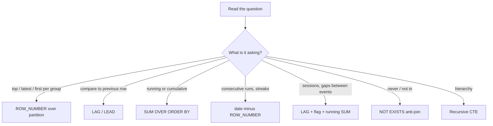

# SQL Interview Patterns
> Fifteen query patterns that cover most data engineering SQL interviews, each tested on a small dataset you can paste into DuckDB.

**Prerequisites:** [SQL Reference](../00-foundations/sql-reference.md)

**Related:** [Interview Roadmap](interview-roadmap.md) · [DuckDB & Polars](../02-processing/duckdb-polars.md) · [Lab 01 — SQL Analytics](https://github.com/sarangambekar1997/data-engineering-handbook/tree/main/labs/01-sql-analytics) · [Glossary](../99-reference/glossary.md)

---

## Overview

**Challenge:** SQL rounds test whether you recognise a *pattern* (top-N per group, gaps and islands, sessionisation) faster than you can derive it. Reading solutions is not enough: you have to have typed each pattern out and seen the result.

**Solution:** This page lists the recurring patterns with a one-line "when you see this, think that" cue, a tested query, and the trap most candidates fall into. All queries run as written in [DuckDB](https://duckdb.org/) (`pip install duckdb`). Dialect notes at the end show what changes in Snowflake, BigQuery, Postgres and Spark SQL.



---

**On this page**

**Setup**
- [Sample Data](#sample-data)

**Patterns**
- [1. Top N per Group](#1-top-n-per-group)
- [2. Remove Duplicates](#2-remove-duplicates)
- [3. Nth Highest Value](#3-nth-highest-value)
- [4. Running Total](#4-running-total)
- [5. Period-over-Period Change](#5-period-over-period-change)
- [6. Gaps and Islands (Streaks)](#6-gaps-and-islands-streaks)
- [7. Sessionisation](#7-sessionisation)
- [8. Cohort Retention](#8-cohort-retention)
- [9. Conditional Aggregation (Pivot)](#9-conditional-aggregation-pivot)
- [10. Median and Percentiles](#10-median-and-percentiles)
- [11. Anti-Join: Who Never Did X](#11-anti-join-who-never-did-x)
- [12. Self-Join and Hierarchies](#12-self-join-and-hierarchies)
- [13. HAVING: Filter on Aggregates](#13-having-filter-on-aggregates)
- [14. Time Between Events](#14-time-between-events)
- [15. Share of Total](#15-share-of-total)

**Reference**
- [Dialect Notes](#dialect-notes)
- [Common Pitfalls](#common-pitfalls)
- [Cheat Sheet](#cheat-sheet)
- [Interview Questions](#interview-questions)
- [Further Reading](#further-reading)

---

## Sample Data

```python
import duckdb

con = duckdb.connect()

con.sql("""
CREATE TABLE orders AS SELECT * FROM (VALUES
  (1, 101, DATE '2024-03-01', 50.0, 'completed'),
  (2, 101, DATE '2024-03-05', 30.0, 'completed'),
  (3, 102, DATE '2024-03-02', 80.0, 'completed'),
  (4, 102, DATE '2024-03-02', 80.0, 'completed'),   -- a duplicate of order 3
  (5, 103, DATE '2024-03-10', 20.0, 'cancelled'),
  (6, 101, DATE '2024-03-20', 70.0, 'completed'),
  (7, 104, DATE '2024-03-21', 45.0, 'completed'),
  (8, 102, DATE '2024-04-02', 60.0, 'completed')
) t(order_id, customer_id, order_date, amount, status)
""")

con.sql("""
CREATE TABLE logins AS SELECT * FROM (VALUES
  (1, DATE '2024-03-01'), (1, DATE '2024-03-02'), (1, DATE '2024-03-03'),
  (1, DATE '2024-03-07'), (1, DATE '2024-03-08'), (2, DATE '2024-03-05')
) t(user_id, day)
""")

con.sql("""
CREATE TABLE events AS SELECT * FROM (VALUES
  (1, TIMESTAMP '2024-03-01 10:00:00'), (1, TIMESTAMP '2024-03-01 10:10:00'),
  (1, TIMESTAMP '2024-03-01 12:00:00'), (2, TIMESTAMP '2024-03-01 09:00:00')
) t(user_id, ts)
""")

con.sql("""
CREATE TABLE employees AS SELECT * FROM (VALUES
  (1, 'Ana', NULL, 'eng', 150), (2, 'Bo', 1, 'eng', 120), (3, 'Cy', 1, 'eng', 130),
  (4, 'Di', 2, 'ops', 90),      (5, 'Ed', 2, 'ops', 95)
) t(id, name, manager_id, dept, salary)
""")
```

Run any query below with `con.sql("...").show()`.

---

## 1. Top N per Group

**Cue:** "largest order per customer", "latest record per key", "top 3 products per category".

```sql
SELECT customer_id, order_id, amount
FROM (
  SELECT *, ROW_NUMBER() OVER (PARTITION BY customer_id ORDER BY amount DESC, order_id) AS rn
  FROM orders
)
WHERE rn = 1
ORDER BY customer_id;
-- 101 | 6 | 70.0     102 | 3 | 80.0     103 | 5 | 20.0     104 | 7 | 45.0
```

Snowflake, BigQuery and DuckDB let you skip the subquery with `QUALIFY ROW_NUMBER() OVER (...) = 1`.

**Trap:** `ROW_NUMBER` breaks ties arbitrarily. Add a tiebreaker to `ORDER BY` so the result is deterministic. Use `RANK` or `DENSE_RANK` when tied rows should all be kept.

---

## 2. Remove Duplicates

**Cue:** "keep one row per business key", "deduplicate an event feed".

```sql
SELECT * EXCLUDE (rn)
FROM (
  SELECT *, ROW_NUMBER() OVER (PARTITION BY customer_id, order_date, amount ORDER BY order_id) AS rn
  FROM orders
)
WHERE rn = 1
ORDER BY order_id;
-- order 4 is gone: same customer, date and amount as order 3
```

Choose the `ORDER BY` deliberately: `ORDER BY updated_at DESC` keeps the newest version of a changing row, and `ORDER BY order_id` keeps the first. `SELECT * EXCLUDE` is DuckDB and Snowflake syntax (BigQuery uses `SELECT * EXCEPT`).

---

## 3. Nth Highest Value

**Cue:** "second highest salary per department".

```sql
SELECT dept, salary
FROM (
  SELECT dept, salary, DENSE_RANK() OVER (PARTITION BY dept ORDER BY salary DESC) AS r
  FROM employees
)
WHERE r = 2;
-- ops | 90     eng | 130
```

**Trap:** `RANK` skips numbers after ties (1, 1, 3), so "2nd highest" may not exist. `DENSE_RANK` gives 1, 1, 2. Decide what "second highest" means when two people tie for first, and say so.

---

## 4. Running Total

**Cue:** "cumulative revenue", "balance over time".

```sql
SELECT order_date,
       SUM(amount) OVER (ORDER BY order_date, order_id) AS running_revenue
FROM orders
WHERE status = 'completed'
ORDER BY order_date, order_id;
-- 03-01 50 · 03-02 130 · 03-02 210 · 03-05 240 · 03-20 310 · 03-21 355 · 04-02 415
```

**Trap:** with `ORDER BY order_date` alone, the default frame treats rows with the same date as peers and gives them the **same** total. Add a unique tiebreaker, or state `ROWS BETWEEN UNBOUNDED PRECEDING AND CURRENT ROW`.

---

## 5. Period-over-Period Change

**Cue:** "month-over-month growth", "difference from the previous day".

```sql
WITH monthly AS (
  SELECT date_trunc('month', order_date) AS month, SUM(amount) AS revenue
  FROM orders
  WHERE status = 'completed'
  GROUP BY 1
)
SELECT month, revenue,
       ROUND(100.0 * (revenue - LAG(revenue) OVER (ORDER BY month)) / LAG(revenue) OVER (ORDER BY month), 1) AS pct_change
FROM monthly
ORDER BY month;
-- 2024-03 | 355 | NULL      2024-04 | 60 | -83.1
```

The first period has no previous row, so the change is `NULL`. **Trap:** months with no data are missing from `GROUP BY`, so `LAG` compares with the wrong month. Join to a calendar table to fill the gaps.

---

## 6. Gaps and Islands (Streaks)

**Cue:** "longest streak of consecutive days", "consecutive logins", "find continuous ranges".

```sql
SELECT user_id, MIN(day) AS start_day, MAX(day) AS end_day, COUNT(*) AS streak_days
FROM (
  SELECT *, day - (ROW_NUMBER() OVER (PARTITION BY user_id ORDER BY day))::INT AS grp
  FROM logins
)
GROUP BY user_id, grp
ORDER BY user_id, start_day;
-- 1 | 03-01 | 03-03 | 3      1 | 03-07 | 03-08 | 2      2 | 03-05 | 03-05 | 1
```

**Why it works:** in a run of consecutive days, the date and the row number both go up by one, so their difference is constant. A gap changes the difference, which starts a new group. Deduplicate first if a user can log in twice a day. The date minus integer arithmetic is written differently per dialect (see [Dialect Notes](#dialect-notes)).

---

## 7. Sessionisation

**Cue:** "group events into sessions with a 30 minute timeout".

```sql
WITH flagged AS (
  SELECT *,
         CASE WHEN LAG(ts) OVER (PARTITION BY user_id ORDER BY ts) IS NULL
                OR ts - LAG(ts) OVER (PARTITION BY user_id ORDER BY ts) > INTERVAL 30 MINUTE
              THEN 1 ELSE 0 END AS new_session
  FROM events
)
SELECT user_id, ts,
       SUM(new_session) OVER (PARTITION BY user_id ORDER BY ts) AS session_no
FROM flagged
ORDER BY user_id, ts;
-- user 1: 10:00 → 1, 10:10 → 1, 12:00 → 2      user 2: 09:00 → 1
```

Three steps: compare each event with the previous one, flag those that start a new session, then a running `SUM` of the flags numbers the sessions. This is the same technique as gaps and islands.

---

## 8. Cohort Retention

**Cue:** "of customers who first bought in March, how many bought again in later months".

```sql
WITH first_order AS (
  SELECT customer_id, date_trunc('month', MIN(order_date)) AS cohort
  FROM orders WHERE status = 'completed' GROUP BY 1
),
activity AS (
  SELECT DISTINCT customer_id, date_trunc('month', order_date) AS month
  FROM orders WHERE status = 'completed'
)
SELECT cohort,
       date_diff('month', cohort, month) AS months_since_first,
       COUNT(DISTINCT customer_id)       AS active_customers
FROM first_order JOIN activity USING (customer_id)
GROUP BY 1, 2
ORDER BY 1, 2;
-- 2024-03 | 0 | 3      2024-03 | 1 | 1
```

Divide `active_customers` by the size of month 0 to get the retention rate. **Trap:** count distinct customers, not orders, or a customer with three orders in a month counts three times.

---

## 9. Conditional Aggregation (Pivot)

**Cue:** "one row per customer, one column per month", "count of X and count of Y in one query".

```sql
SELECT customer_id,
       SUM(amount) FILTER (WHERE date_trunc('month', order_date) = DATE '2024-03-01') AS mar,
       SUM(amount) FILTER (WHERE date_trunc('month', order_date) = DATE '2024-04-01') AS apr
FROM orders
GROUP BY customer_id
ORDER BY customer_id;
-- 101 | 150 | NULL     102 | 160 | 60     103 | 20 | NULL     104 | 45 | NULL
```

`FILTER (WHERE ...)` is standard SQL supported by Postgres, DuckDB and Snowflake. Portable alternative: `SUM(CASE WHEN ... THEN amount END)`. Wrap in `COALESCE(..., 0)` if `NULL` is not wanted.

---

## 10. Median and Percentiles

**Cue:** "median order value", "p95 latency".

```sql
SELECT median(amount) AS median_amount,
       quantile_cont(amount, 0.95) AS p95
FROM orders;
```

`AVG` is skewed by outliers, which is why medians are used for money and latency. Names differ: `PERCENTILE_CONT(0.5) WITHIN GROUP (ORDER BY amount)` in Postgres, Snowflake and BigQuery (as a window function), `percentile_approx` in Spark.

---

## 11. Anti-Join: Who Never Did X

**Cue:** "customers with no orders", "products never sold".

```sql
SELECT e.id
FROM employees e
WHERE NOT EXISTS (SELECT 1 FROM orders o WHERE o.customer_id = e.id);
```

**Trap:** `NOT IN (subquery)` returns **no rows** if the subquery contains a single `NULL`. `NOT EXISTS` and `LEFT JOIN ... WHERE right.key IS NULL` are safe.

---

## 12. Self-Join and Hierarchies

**Cue:** "employee and their manager", "all reports under a manager", "category tree".

```sql
-- One level: a self-join
SELECT e.name, m.name AS manager
FROM employees e
LEFT JOIN employees m ON e.manager_id = m.id
ORDER BY e.id;

-- Any depth: a recursive CTE
WITH RECURSIVE chain AS (
  SELECT id, name, 0 AS lvl FROM employees WHERE manager_id IS NULL
  UNION ALL
  SELECT e.id, e.name, c.lvl + 1
  FROM employees e JOIN chain c ON e.manager_id = c.id
)
SELECT * FROM chain ORDER BY lvl, id;
-- Ana 0 · Bo 1 · Cy 1 · Di 2 · Ed 2
```

Use `LEFT JOIN` so the top of the hierarchy (no manager) is kept. Guard against cycles with a depth limit if the data can loop.

---

## 13. HAVING: Filter on Aggregates

**Cue:** "customers with at least two orders over 50".

```sql
SELECT customer_id
FROM orders
WHERE amount > 50            -- filters rows before grouping
GROUP BY customer_id
HAVING COUNT(*) >= 2;        -- filters groups after aggregating
-- 102
```

`WHERE` runs before `GROUP BY` and cannot see aggregates. `HAVING` runs after. Interviewers ask this order of evaluation often: `FROM → WHERE → GROUP BY → HAVING → SELECT → ORDER BY → LIMIT`.

---

## 14. Time Between Events

**Cue:** "days between a customer's consecutive orders", "time to first purchase".

```sql
SELECT customer_id, order_date,
       order_date - LAG(order_date) OVER (PARTITION BY customer_id ORDER BY order_date) AS days_since_previous
FROM orders
ORDER BY customer_id, order_date;
-- 101: NULL, 4, 15     102: NULL, 0, 31     103: NULL     104: NULL
```

Date subtraction returns days in DuckDB and Postgres. Use `DATEDIFF('day', a, b)` in Snowflake, `DATE_DIFF(b, a, DAY)` in BigQuery.

---

## 15. Share of Total

**Cue:** "each customer's percentage of total revenue".

```sql
SELECT customer_id,
       SUM(amount) AS revenue,
       ROUND(100.0 * SUM(amount) / SUM(SUM(amount)) OVER (), 1) AS pct_of_total
FROM orders
WHERE status = 'completed'
GROUP BY customer_id
ORDER BY customer_id;
-- 101 | 150 | 36.1     102 | 220 | 53.0     104 | 45 | 10.8
```

`SUM(SUM(amount)) OVER ()` first aggregates per customer, then sums those results across all rows. Multiply by `100.0` (not `100`) to avoid integer division in databases that truncate.

---

## Dialect Notes

| Task | DuckDB | Snowflake | BigQuery | Postgres | Spark SQL |
|------|--------|-----------|----------|----------|-----------|
| Filter window results | `QUALIFY` | `QUALIFY` | `QUALIFY` | subquery | `QUALIFY` on Databricks, subquery in open-source Spark |
| Date minus integer | `day - n` | `DATEADD('day', -n, day)` | `DATE_SUB(day, INTERVAL n DAY)` | `day - n` | `date_sub(day, n)` |
| Days between | `a - b` | `DATEDIFF('day', b, a)` | `DATE_DIFF(a, b, DAY)` | `a - b` | `datediff(a, b)` |
| Truncate to month | `date_trunc('month', d)` | `DATE_TRUNC('month', d)` | `DATE_TRUNC(d, MONTH)` | `date_trunc('month', d)` | `date_trunc('month', d)` |
| Exclude a column | `* EXCLUDE (c)` | `* EXCLUDE (c)` | `* EXCEPT (c)` | not available | `* EXCEPT (c)` on Databricks, not in open-source Spark |
| Median | `median(x)` | `MEDIAN(x)` | `PERCENTILE_CONT(x, 0.5) OVER ()` | `PERCENTILE_CONT(0.5) WITHIN GROUP (ORDER BY x)` | `percentile_approx(x, 0.5)` |

---

## Common Pitfalls

| Pitfall | Symptom | Fix |
|---------|---------|-----|
| No tiebreaker in `ORDER BY` inside a window | Different rows returned on each run | Add a unique column last in the `ORDER BY` |
| Default window frame with ties | Running total repeats for equal dates | Order by a unique key, or use `ROWS` |
| `NOT IN` with a nullable subquery | Empty result | Use `NOT EXISTS` |
| Join before aggregating | Sums multiplied by the number of matches (fan-out) | Aggregate each side to the join grain first |
| Filtering a window result in `WHERE` | Error: window functions not allowed in `WHERE` | Wrap in a subquery or CTE, or use `QUALIFY` |
| `COUNT(col)` vs `COUNT(*)` | `NULL`s silently excluded | Choose deliberately, and say which you mean |
| Integer division | `1 / 2 = 0` | Cast, or multiply by `1.0` |
| Not asking about `NULL`s, duplicates and time zones | The query is right for clean data only | State assumptions out loud before you write |

---

## Cheat Sheet

| If you see... | Reach for... |
|---------------|--------------|
| top / latest / first per group | `ROW_NUMBER() OVER (PARTITION BY g ORDER BY x DESC)` |
| Nth highest with ties | `DENSE_RANK()` |
| previous or next value | `LAG` / `LEAD` |
| cumulative | `SUM() OVER (ORDER BY ...)` |
| consecutive runs | `value - ROW_NUMBER()` as the group key |
| sessions | `LAG` + gap flag + running `SUM` |
| never / no matching row | `NOT EXISTS` |
| rows to columns | `SUM(...) FILTER (WHERE ...)` or `CASE` |
| tree of any depth | `WITH RECURSIVE` |
| percent of total | `SUM(x) / SUM(SUM(x)) OVER ()` |

---

## Interview Questions

**Q: What is the difference between `ROW_NUMBER`, `RANK` and `DENSE_RANK`?**
A: All number rows within an ordered partition. `ROW_NUMBER` gives unique numbers and breaks ties arbitrarily. `RANK` gives tied rows the same number and then skips (1, 1, 3). `DENSE_RANK` gives tied rows the same number without skipping (1, 1, 2). Pick by what should happen with ties.

**Q: How do you find the longest streak of consecutive days per user?**
A: Deduplicate to one row per user per day, subtract each row's `ROW_NUMBER` from its date, and group by that difference. Consecutive dates give the same value, and a gap starts a new group. Then take `COUNT(*)` per group and the maximum per user.

**Q: Why can `NOT IN` return nothing when there are rows that should match?**
A: If the subquery returns any `NULL`, `x NOT IN (...)` evaluates to unknown for every row, so none pass. Use `NOT EXISTS`, or filter `NULL`s out of the subquery.

**Q: A query joins orders to order items and sums `order.amount`. The total is too high. Why?**
A: Each order appears once per item after the join, so its amount is added once per item (fan-out). Aggregate items to one row per order first, or sum a column that lives at the item grain.

**Q: How would you speed up a slow window-function query on a large table?**
A: Filter and project early so less data is windowed, make sure the partition key is what the data is clustered or distributed by (avoids a large shuffle), avoid several windows with different partitions, and pre-aggregate if the answer does not need row-level detail.

---

## Further Reading

- [DuckDB SQL reference: window functions](https://duckdb.org/docs/stable/sql/functions/window_functions)
- [Mode: SQL window functions tutorial](https://mode.com/sql-tutorial/sql-window-functions)
- [Use The Index, Luke](https://use-the-index-luke.com/): how indexes and query plans work
- *SQL Antipatterns* — Bill Karwin (Pragmatic Bookshelf)

---

**Previous:** [Interview Roadmap](interview-roadmap.md) · **Next:** [System Design Case Studies](system-design-case-studies.md) · **Back to:** [Index](../README.md)
