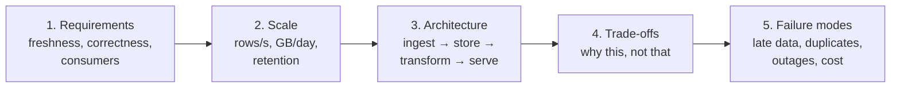
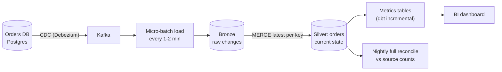
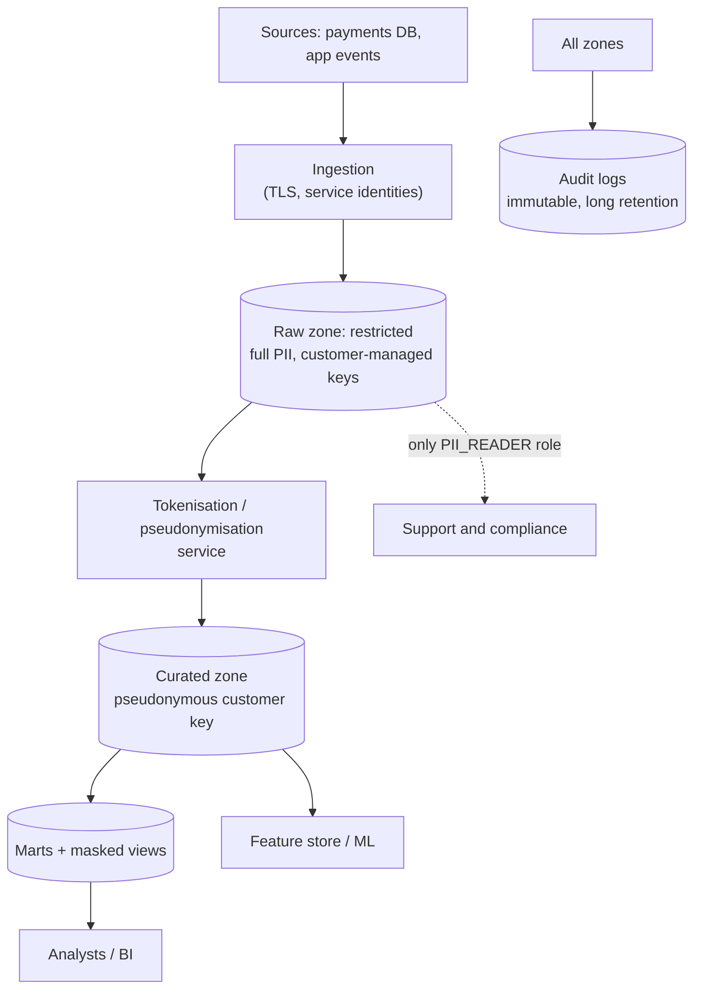
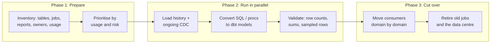
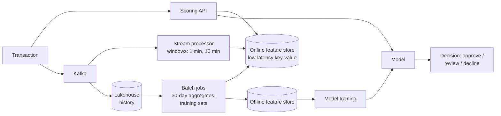
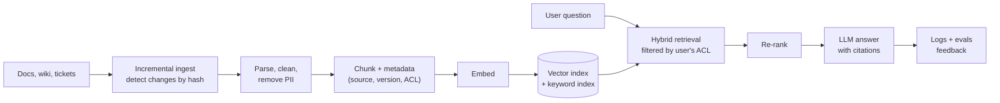

# System Design Case Studies
> Five worked data engineering design problems, each with requirements, an architecture, the key trade-offs, failure modes and follow-up questions.

**Prerequisites:** [System Design](../08-architecture/system-design.md) · [DE Concepts](../00-foundations/de-concepts.md)

**Related:** [Interview Roadmap](interview-roadmap.md) · [Kafka](../04-streaming/kafka-reference.md) · [Delta Lake](../01-storage/delta-lake.md) · [Glossary](../99-reference/glossary.md)

---

## Overview

**Challenge:** A design interview gives you a vague one-line problem and 45 minutes. Strong answers are not the ones with the most tools, but the ones that clarify requirements, choose a sensible architecture, and explain what breaks and what it costs.

**Solution:** Each case study below follows the same steps: **requirements → scale → architecture → decisions and trade-offs → failure modes → follow-ups**. Read the problem, sketch your own answer for ten minutes, then compare. The answers are one reasonable design, not the only one. What matters is the reasoning.

---

**On this page**

**Case Studies**
- [1. Near-Real-Time Business Dashboard](#1-near-real-time-business-dashboard)
- [2. Fintech Data Platform with PII and Audit](#2-fintech-data-platform-with-pii-and-audit)
- [3. Migrating an On-Premises Warehouse to the Cloud](#3-migrating-an-on-premises-warehouse-to-the-cloud)
- [4. Fraud Detection: Real-Time Features and Batch Training](#4-fraud-detection-real-time-features-and-batch-training)
- [5. Data Pipeline for a RAG Support Assistant](#5-data-pipeline-for-a-rag-support-assistant)

**Reference**
- [Common Pitfalls](#common-pitfalls)
- [Cheat Sheet](#cheat-sheet)
- [Interview Questions](#interview-questions)
- [Further Reading](#further-reading)

---

## 1. Near-Real-Time Business Dashboard

**Problem:** An e-commerce company wants a sales dashboard with data no more than five minutes old, plus correct historical reports. Orders come from a Postgres database.

**Clarify:** Freshness 5 minutes, but does *correct* matter more than *fast*? (Yes: finance uses the same numbers.) Updates and cancellations after the order is placed? (Yes.) About 200 orders per second at peak, roughly 50 GB a month.

**Decisions**
- **CDC, not periodic full extracts.** Log-based change data capture sees updates and deletes, adds almost no load to the source, and gives sub-minute latency. See [Ingestion & CDC](../02-processing/ingestion-cdc.md).
- **Micro-batch, not true streaming.** A five-minute target is comfortably met by loading every minute or two into a table format (Delta, Iceberg). It is simpler and cheaper than a stateful streaming job.
- **Bronze keeps every change event; silver keeps the current state** via `MERGE` on `order_id`, choosing the latest by log sequence number. Rebuilds and audits use bronze.
- **Metrics computed incrementally** for the recent window, with a nightly recompute for the past few days to absorb late changes.
- **Reconciliation:** a nightly job compares row counts and sums with the source. This is how you catch silent loss.

**Failure modes**
- *Duplicate or out-of-order events:* `MERGE` by key with the sequence number makes replays harmless.
- *Consumer falls behind:* alert on Kafka consumer lag and on table freshness, not only on job failure.
- *Schema change in the source:* schema registry with compatibility rules, and a quarantine path for incompatible messages.
- *Source database failover:* the CDC connector must resume from the log position. Test it.

**Follow-ups:** How would you handle 100× the volume? (Partition topics by key, scale consumers, compact small files.) What if finance needs an exact daily close? (A batch-certified daily table separate from the live one.)

---

## 2. Fintech Data Platform with PII and Audit

**Problem:** Design a data platform for a payments company. Analysts need transaction analytics, data scientists need features, and regulators require an audit trail and erasure on request. Data includes card references, names and emails.

**Clarify:** Which regulations (GDPR, PCI DSS)? Who may see raw PII? How long is data retained? Are there residency rules (data must stay in a region)?

**Decisions**
- **Separate the zones by sensitivity.** The raw zone has few readers and dedicated encryption keys. Everyone else works in the curated layer, where identifiers are replaced by a keyed pseudonym (HMAC), so joins still work.
- **Least privilege by role and layer,** defined in Terraform and reviewed like code. Column masking for emails, row-level policies for regional data. See [Data Security & Privacy](../05-quality-governance/data-security-privacy.md).
- **Card numbers are tokenised at the edge** so that the analytics platform never holds them, which greatly shrinks the PCI scope.
- **Erasure:** a central deletion-request table drives `DELETE` in every table, followed by snapshot expiry and `VACUUM`. Lineage lists every copy. Backups age out within the documented window.
- **Audit:** warehouse query history and cloud audit logs go to an append-only store with longer retention than the data, with alerts on bulk PII exports.
- **Residency:** deploy per region, replicate only aggregated or pseudonymised data across regions.

**Failure modes**
- *PII leaking into free-text fields and logs:* scanning and redaction at ingestion.
- *Analysts joining back to identity through quasi-identifiers:* generalise dates and locations, and use k-anonymity thresholds on published results.
- *Deletion missing a copy in a feature store, a topic or a vector index:* keep a data-map of every store and test erasure end to end.

**Follow-ups:** How do you support a support agent looking up one customer? (A narrow, audited service with just-in-time access, not broad table access.) How would you prove to an auditor who saw what? (Query and access logs, tied to identities.)

---

## 3. Migrating an On-Premises Warehouse to the Cloud

**Problem:** A company runs a 20 TB on-prem warehouse with 2,000 stored procedures and 300 reports. Move it to a cloud warehouse in 12 months without stopping the business.

**Clarify:** What must not change (report numbers)? Is the source system moving too? How many teams depend on it? What is the downtime tolerance?

**Decisions**
- **Inventory and usage first.** Query logs show that a large share of tables and reports are unused. Do not migrate what nobody reads.
- **Migrate by data domain, not by layer,** so each business area moves whole and its reports switch in one step.
- **Run old and new in parallel** with automated **reconciliation**: row counts, column sums and hash comparisons per table and per day, and report-level diffs, until numbers match for an agreed period.
- **Rewrite stored procedures as dbt models** (tested, in Git), instead of copying procedural code line by line. Use conversion tools for the mechanical parts, and expect manual work on the dialect differences.
- **Initial load by bulk export to object storage, then incremental sync** through CDC or watermark queries, so the final cut-over only needs to move the last delta.
- **Plan cost and governance up front:** warehouse sizing, resource monitors, role model and lineage from the start.

**Failure modes**
- *Silent differences* in rounding, time zones, null and collation behaviour: reconciliation must include these edge cases.
- *Scope creep:* freeze new features on the old system, or every change has to be built twice.
- *Big-bang cutover:* prefer domain-by-domain, with a rollback plan for each.
- *Hidden consumers* (spreadsheets, scripts): use query logs and communicate the timeline.

**Follow-ups:** How do you prove the new system is right? (Reconciliation reports signed off by the data owners.) How do you handle a table too large to reload in the cutover window? (Bulk-load early, then keep in sync with CDC.)

---

## 4. Fraud Detection: Real-Time Features and Batch Training

**Problem:** Score each card transaction for fraud within 100 ms. A model needs features such as "number of transactions on this card in the last 10 minutes" and "average amount over 30 days".

**Clarify:** Latency budget for the whole path? Cost of a false positive vs a missed fraud? Volume (say 5,000 transactions per second peak)?

**Decisions**
- **Two feature paths:** streaming for short windows (counts in the last minutes) and batch for long windows (30-day averages), both written to a low-latency **online store** that the API reads in a few milliseconds.
- **One feature definition, two implementations, is dangerous.** Training-serving skew happens when the offline (training) feature differs from the online one. Use a feature store or shared code, and **point-in-time correct** joins for training so a feature never contains data from after the transaction.
- **Kafka as the backbone:** a durable log for the stream processor, and a source for the lakehouse.
- **Stateful stream processing** (Flink or Spark Structured Streaming) with event-time windows and watermarks. See [Flink](../04-streaming/flink-reference.md).
- **Fail safe:** if features or the model are unavailable, fall back to simple rules, and never block payments on the ML path alone.
- **Monitor** feature freshness, feature distribution drift, latency percentiles and outcome metrics.

**Failure modes**
- *Late or out-of-order events:* watermarks with allowed lateness, and idempotent updates to the online store.
- *Label delay:* a fraud label may arrive weeks later. Train on mature data and track the delay.
- *Hot keys* (one merchant with huge volume): salting or pre-aggregation.
- *Skew between training and serving:* compare online and offline feature values on a sample.

**Follow-ups:** How would you backfill a new feature? (Compute it in batch over history for training, then start the streaming path and switch when they agree.) How to keep latency under 100 ms? (Precomputed features, co-located store, a small model, timeouts.)

---

## 5. Data Pipeline for a RAG Support Assistant

**Problem:** Build an assistant that answers customer-support questions from 50,000 help articles, product docs and past tickets. Content changes daily, and answers must respect who is allowed to see what.

**Clarify:** Sources and formats? Freshness needed for a doc change to appear (say one hour)? Access rules (internal-only articles)? How will quality be measured?

**Decisions**
- **Incremental ingestion:** store a content hash per document, re-embed only what changed, and delete vectors for removed documents. Re-embedding everything daily is wasteful.
- **Chunking** by document structure (headings), with overlap, and metadata on each chunk: source URL, version, last updated, and **access-control labels**.
- **Hybrid retrieval** (vector + keyword) followed by a re-ranker, since exact product names and error codes matter. See [RAG](../07-ai/rag.md) and [Vector Databases](../07-ai/vector-databases.md).
- **Enforce access control in retrieval** with metadata filters based on the caller's permissions. Never rely on the prompt to hide content.
- **Answers cite sources** and say "I don't know" when retrieval is weak.
- **Evaluate before launch and continuously:** a fixed question set with expected sources, retrieval hit-rate, and answer faithfulness checks. See [Evals](../07-ai/eval-and-evals.md) and [AI Observability](../07-ai/ai-observability.md).
- **Version the embedding model and the index:** changing the model requires re-embedding everything into a new index, then switching.

**Failure modes**
- *Stale answers after a doc change:* freshness monitor on the index, and delete-on-remove.
- *Prompt injection in retrieved content:* treat documents as data, restrict what the model can do. See [Data Security & Privacy](../05-quality-governance/data-security-privacy.md).
- *PII from tickets in the index:* redact at ingestion, and honour deletion requests by removing chunks by source ID.
- *Poor chunking:* the right answer exists but is split across chunks. Tune with the eval set.
- *Cost creep:* cache frequent questions, and use a smaller model for easy ones.

**Follow-ups:** How do you know it works? (Retrieval and answer evals on a labelled set, plus user feedback.) What changes for 50 million documents? (Approximate indexes with sharding, a metadata store for filters, batch embedding pipelines.)

---

## Common Pitfalls

| Pitfall | Symptom | Fix |
|---------|---------|-----|
| Jumping to a tool | "Kafka and Spark" before requirements | Clarify freshness, scale and correctness first |
| Ignoring failure modes | Design only works when nothing breaks | Cover duplicates, late data, retries, outages, schema changes |
| No numbers | Cannot justify partitions, cluster size or cost | Estimate rows per second, GB per day, and retention |
| Streaming when batch is enough | Complex, costly design | Match the technology to the freshness requirement |
| Forgetting data quality and monitoring | "How do you know it's right?" has no answer | Add checks, reconciliation and freshness monitors to the diagram |
| Treating security as an afterthought | PII everywhere | Zones, masking, access control and deletion in the first sketch |
| One giant diagram with no narrative | Interviewer cannot follow | Build in layers, and say the data flow out loud |

---

## Cheat Sheet

| Step | Questions to ask or answer |
|------|-----------------------------|
| Requirements | Freshness? Correctness? Consumers? Retention? Compliance? |
| Scale | Events per second, GB per day, peak factor, growth |
| Ingest | Batch, CDC, streaming, or API pull? Ordering and duplicates? |
| Store | Raw (immutable), cleaned, curated. Table format. Partitioning |
| Process | Batch or stream. Stateful? Windows? Late data? |
| Serve | Warehouse, cache, API, feature store, vector index |
| Reliability | Idempotency, retries, backfills, exactly-once vs at-least-once + dedup |
| Governance | Quality checks, lineage, access control, PII, audit |
| Operate | Monitoring, alerting, SLOs, runbook, cost controls |

---

## Interview Questions

**Q: You have a design with Kafka, Spark and a warehouse. How do you make it cheaper?**
A: First find where the cost is: compute, storage, or data scanned. Then reduce work at the source: partition pruning, incremental processing instead of full recomputes, compaction of small files, right-sized and auto-suspending compute, shorter retention on raw data, and cheaper storage tiers. Measure before and after. See [Cost Optimization](../08-architecture/cost-optimization.md).

**Q: How do you guarantee no data loss end to end?**
A: Use durable, replicated stages with acknowledgements, make writes idempotent so retries are safe, and keep the raw data immutable so any stage can be replayed. Then verify: reconcile counts and sums between source and destination, and alert on freshness and volume. Exactly-once delivery is rarely needed if at-least-once plus idempotent writes achieves the same result.

**Q: When would you choose a lakehouse over a warehouse?**
A: When the data is very large or varied (semi-structured, files, ML), when several engines need the same data, or when you want open formats to avoid lock-in. A managed warehouse is simpler for SQL-centred analytics with a smaller team. Many platforms use both, with open table formats making the boundary thin.

**Q: How do you handle late-arriving data in a streaming pipeline?**
A: Use event time, not processing time, with watermarks that say how long to wait. Allow a bounded lateness, route later events to a side output for correction, and make downstream tables updatable (`MERGE`) so a correction can be applied. For strict correctness, a batch recompute of recent windows settles the final numbers.

---

## Further Reading

- [System Design](../08-architecture/system-design.md): the general method, plus three more worked designs
- *Designing Data-Intensive Applications* — Martin Kleppmann (O'Reilly)

---

**Previous:** [SQL Interview Patterns](sql-interview-patterns.md) · **Next:** [Glossary](../99-reference/glossary.md) · **Back to:** [Index](../README.md)
