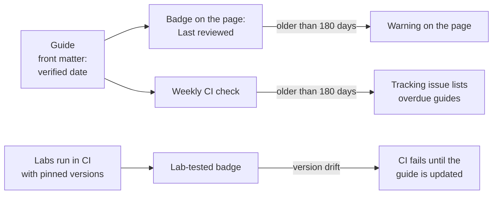

# How the handbook is maintained

> What the review dates mean, how out-of-date content is detected, and how to help keep the guides accurate.

## Overview

Data engineering tools release quickly, and a guide that was correct last year can now recommend a removed flag or a retired model. This page describes the mechanisms that keep the handbook accurate and the signals you can use to judge how much to trust a given page.



## What the labels on a guide mean

Every guide shows a line under its summary.

| Label | Meaning |
|-------|---------|
| **Last reviewed** | The date a maintainer last checked the guide's commands, versions, defaults and links against the vendor documentation. It is not the date of the last edit; a typo fix does not refresh it. |
| **Lab-tested with** | A hands-on lab exercises this tool at exactly that version, and the lab runs in CI. The version comes from the lab's pinned dependency or container image. |
| **Review overdue** | The guide was last reviewed more than six months ago. It is probably still mostly right, but verify anything version-sensitive. |

The site footer also shows a separate *last updated* date, taken from the Git history. That date changes on any edit.

## How out-of-date content is detected

| Check | When it runs | What it catches |
|-------|--------------|-----------------|
| Freshness check (`tools/check_freshness.py`) | Every pull request, and weekly | A missing or malformed review date, and a *Lab-tested with* version that no longer matches the lab's pin |
| Overdue report | Weekly | Guides not reviewed within 180 days. They are listed in a single tracking issue |
| Code block parsing | Every pull request | Python, JSON and YAML examples that no longer parse |
| Lab runs | Every pull request that touches labs or docs, and weekly | Examples that stop working when a dependency releases a new version |
| Retired model IDs | Every pull request, and weekly | References to model IDs listed in `tools/deprecated_models.txt` |
| External link check | Weekly | Dead links to vendor documentation |
| Strict site build | Every pull request | Broken internal links and anchors |
| Search metadata check (`tools/check_seo.py`) | Every pull request | A page without its own description, canonical URL or structured data, or missing from the sitemap |
| Dependabot | Monthly | New versions of the packages and images the labs pin, tested by the Labs workflow |

## Monthly routine

Two workflows keep the project moving without relying on memory.

| Workflow | When | What it does |
|----------|------|--------------|
| **Monthly maintenance** | The 1st of each month | Opens a *Monthly maintenance* issue with a checklist and the month's numbers, and makes sure at least five *Review the ... guide* issues are open. It picks guides that no lab covers first, then the oldest review date, and skips any reviewed in the last 30 days |
| **Metrics** | Every Monday | Saves repository traffic and star history to the `metrics` branch |

The checklist covers triage, dependency updates, the state of the scheduled Docs and Labs runs, overdue guides, the review queue, the changelog and a release, and thanking contributors. To see what the monthly workflow would create without creating it, run it from the *Actions* tab with *dry run* checked.

## Dependency updates

Dependabot opens one grouped pull request a month per area: the site's Python packages, GitHub Actions, and each lab's pinned packages and container images (`.github/dependabot.yml`). A version bump is never merged on its own. The Labs workflow runs the lab against the new version, and the freshness check fails until the guide's *Lab-tested with* line matches the new pin. Lab 09's Spark version is excluded from automatic updates, because Iceberg publishes its Spark runtime only for some Spark versions; move it by hand together with the runtime in `lake.py`.

## Metrics

GitHub keeps only 14 days of repository traffic, so the *Metrics* workflow saves it every week to CSV files on the `metrics` branch (`traffic/views.csv`, `clones.csv`, `referrers.csv`, `paths.csv`, and `repo.csv` for stars and forks). The site itself has no tracker and sets no cookies, so the numbers describe repository views, clones and where visitors came from, not which guide was read.

Reading the traffic needs push access, which the built-in workflow token does not have. To turn it on, create a repository secret named `TRAFFIC_TOKEN`:

1. In GitHub, open *Settings → Developer settings → Personal access tokens → Fine-grained tokens* and generate a token. Set the repository access to only this repository, and an expiry of one year (note the date; the workflow then warns and the monthly issue shows no new numbers).
2. Grant the repository permission **Administration: Read-only**. GitHub's documentation says only that the traffic endpoints need write access to the repository and does not name the fine-grained permission. If the workflow log shows a 403 warning, grant **Contents: Read and write** as well.
3. In the repository, open *Settings → Secrets and variables → Actions* and add the token as `TRAFFIC_TOKEN`.

Without the secret the workflow still records stars, forks and open issues, and warns in its log that traffic was skipped.

## PDFs and printing

Every guide prints cleanly: the print stylesheet in `docs/stylesheets/extra.css` drops the navigation, wraps code, fits tables to the page and shows the address of external links. The **Cheat Sheet** section of a guide has a *Print this cheat sheet* button that prints only the title and that section.

The deployed site also serves a PDF of each guide (linked from the guide, under `pdf/`) and one PDF of the whole handbook, with bookmarks. `tools/build_pdfs.py` renders them from the built site with headless Chromium, so a PDF looks like the printed page, and rewrites links to other guides to the public site. To try it locally:

```bash
pip install -r requirements-pdf.txt && playwright install chromium
mkdocs build && python tools/build_pdfs.py --sample 3
```

The *Download PDF* link on a guide returns a 404 in a local preview until you build the PDFs.

## Sources and policy

- **Vendor documentation is the source of truth.** Guides link to it in *Further Reading*, and a claim that is version-specific names the version.
- **Prices and model names are not hardcoded.** They change too often. Guides link to the vendor page or load values from configuration.
- **Opinions are labelled.** Where a guide recommends one approach over another, it states the trade-off rather than presenting a single answer as universal.
- **Corrections take priority over new content.** A verified error is fixed and its review date refreshed before new guides are added.

## Reviewing a guide

Anyone can review a guide and update its date. To do so:

1. Run the commands and code samples against the current release, or confirm them against the vendor documentation.
2. Check that version numbers, default values and configuration keys in the text are still correct.
3. Open the *Further Reading* links.
4. Fix what is wrong, then set `verified:` in the front matter to today's date (`YYYY-MM-DD`).
5. If the guide has a `lab_tested` field, confirm it matches the lab's pinned version. CI checks this too.

A pull request that changes `verified:` should say in its description what was checked. A date without a review behind it defeats the purpose of the label.

## Reporting a problem

- Open a [correction issue](https://github.com/sarangambekar1997/data-engineering-handbook/issues/new?template=correction.yml) with the guide, the section and a link to the vendor documentation that shows the correct behaviour.
- To propose a topic, use the [topic request](https://github.com/sarangambekar1997/data-engineering-handbook/issues/new?template=topic-request.yml) template.
- See [Contributing](https://github.com/sarangambekar1997/data-engineering-handbook/blob/main/CONTRIBUTING.md) for how to submit a change.
