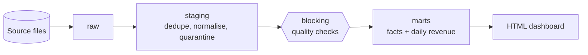
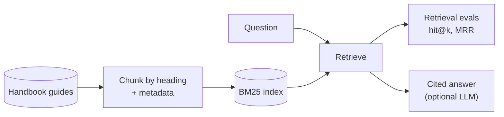

# Capstone Projects
> Two end-to-end projects that put the guides together: a data pipeline from raw files to a dashboard, and a RAG system over the handbook itself.

**Related:** [Labs](https://github.com/sarangambekar1997/data-engineering-handbook/tree/main/labs) · [System Design Case Studies](../09-interviews/system-design-case-studies.md) · [Glossary](../99-reference/glossary.md)

---

## Why capstones

The [labs](https://github.com/sarangambekar1997/data-engineering-handbook/tree/main/labs) each teach one tool. Real work connects them: data has to be ingested, cleaned, checked, modelled, published and monitored, and each step must survive reruns and bad input. These two projects are small enough to finish in an evening and complete enough to show how the pieces fit, and both run on a laptop with no cloud account. Both are tested in CI.

## Project 1: An end-to-end analytics pipeline

**[Capstone 06: Dagster pipeline](https://github.com/sarangambekar1997/data-engineering-handbook/tree/main/labs/06-capstone-ecommerce)** (90–120 minutes)

You run a pipeline of Dagster assets on DuckDB: raw, staging and marts layers, five asset checks (three of them blocking), quarantine tables that record why each bad row was rejected, and a generated dashboard. Then you:

- rerun it and prove the result is identical (idempotency),
- apply a day of source changes and watch the new day, a late cancellation and moved customers flow through,
- corrupt the source on purpose and watch a blocking check stop the marts from being rebuilt.

**Guides used:** [Dagster](../03-orchestration/dagster-reference.md), [Data Quality](../05-quality-governance/data-quality.md), [Data Modeling](../01-storage/data-modeling.md), [Pipeline Observability](../05-quality-governance/pipeline-observability.md).

## Project 2: RAG over the handbook, with evals

**[Capstone 07: Docs RAG](https://github.com/sarangambekar1997/data-engineering-handbook/tree/main/labs/07-docs-rag)** (60–90 minutes)

You chunk the handbook's own guides, build a keyword index from scratch, and measure retrieval quality against 39 labelled questions, so a change to chunking or ranking is judged by numbers, not by trying a few queries. Baseline: hit@5 of 97% and MRR of 0.92. An optional last step asks Claude for an answer that cites its sources. The exercises take you from this baseline to a hybrid retriever, incremental ingestion and access control.

**Guides used:** [RAG](../07-ai/rag.md), [Embeddings](../07-ai/embeddings.md), [Vector Databases](../07-ai/vector-databases.md), [Evals](../07-ai/eval-and-evals.md), [Data Security & Privacy](../05-quality-governance/data-security-privacy.md).

## How to present a capstone

Whether for a portfolio or an interview, the strongest way to talk about a project is:

1. **The problem** in one sentence, and the data you used.
2. **The architecture**, one diagram, and why each layer exists.
3. **A failure you handled**: a bad row, a rerun, a schema change, a check that stopped a bad publish.
4. **A number**: rows processed, hit@5 before and after a change, runtime, cost.
5. **What you would do next** with more time: partitions, an SCD dimension, hybrid retrieval, monitoring.

See the [Interview Roadmap](../09-interviews/interview-roadmap.md) for how projects fit into the loop.
