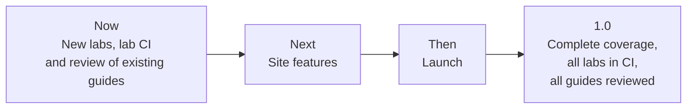

# Roadmap

> What is planned for the handbook, in what order, and how to influence it.

## Overview

The handbook already covers the core of a modern data platform: foundations, storage, processing, orchestration, streaming, quality, infrastructure, architecture and AI engineering, with seven hands-on labs. The roadmap focuses on three things: filling the remaining coverage gaps, keeping existing guides accurate, and making it easy for others to contribute.

This page states intent, not commitments. Items move as priorities change, and any item marked *help wanted* is open for contribution.

## Now

| Item | Status |
|------|--------|
| Review dates and lab-tested versions on every guide | Done ([how it works](maintenance.md)) |
| Contributor path: first-contribution guide, code owners, changelog, citation file | Done |
| Coverage round A: five new guides (see below) | Done |
| Coverage round B: four new guides (see below) | Done |
| Coverage round C: four new guides (see below) | Done |
| Review each existing guide against current vendor documentation, so the review dates reflect real checks | Open, *help wanted* |

## Coverage

New guides follow the same template as the existing ones: Basic to Advanced, pitfalls, cheat sheet, interview questions and a Mermaid diagram.

### Round A (published)

| Guide | Scope |
|-------|-------|
| [Testing and CI/CD for Data Pipelines](06-infrastructure/testing-cicd.md) | Unit and property tests, idempotency and backfills, CI design, data diff, write-audit-publish, promotion |
| [Trino and Query Federation](02-processing/trino-federation.md) | Distributed SQL over lakes and databases, connectors, pushdown, Iceberg, fault-tolerant execution |
| [Real-Time Analytics Databases](01-storage/realtime-olap.md) | ClickHouse, Apache Druid and Apache Pinot: when to use each, ingestion and modelling |
| [Kubernetes for Data Workloads](06-infrastructure/kubernetes-for-de.md) | Jobs, resources, node pools and spot capacity, Spark, Airflow and Flink on Kubernetes |
| [Azure and Microsoft Fabric](01-storage/azure-fabric.md) | OneLake, capacity, lakehouse and warehouse, shortcuts and mirroring, Event Hubs, CI/CD |

### Round B (published)

| Guide | Scope |
|-------|-------|
| [Apache Beam and Dataflow](04-streaming/beam-dataflow.md) | The unified batch and streaming model, windows and triggers, testing, runners, Dataflow |
| [Streaming SQL](04-streaming/streaming-sql.md) | Materialize and RisingWave: incremental views over streams |
| [BI Tools](02-processing/bi-tools.md) | Apache Superset and Metabase: modelling, performance, row-level security, embedding, operations |
| [NoSQL and Operational Stores](01-storage/nosql-operational-stores.md) | DynamoDB, MongoDB, Valkey and Redis, and Cassandra: modelling, CDC and exports, serving data back |

### Round C (published)

| Guide | Scope |
|-------|-------|
| [DataOps](05-quality-governance/dataops-operations.md) | Severity levels, on-call, runbooks, incident response, blameless postmortems, operating metrics |
| [MCP and Text-to-SQL](07-ai/mcp-text-to-sql.md) | A tested read-only SQL server for assistants, SQL validation, evaluation of generated SQL |
| [Data Catalogs in Practice](05-quality-governance/data-catalogs.md) | DataHub and OpenMetadata: ingestion, metadata model, catalog as code |
| [Choosing a Stack](08-architecture/choosing-a-stack.md) | Requirements first, reference architectures, stack review checks, decision records |

## Labs

| Item | Status |
|------|--------|
| Run Labs 04 and 05 (Kafka, Airflow) in CI, not only validate their Compose files | Done |
| A dev container so every lab starts in one click | Done |
| Data quality lab with Great Expectations or Soda | Done ([Lab 08](https://github.com/sarangambekar1997/data-engineering-handbook/tree/main/labs/08-data-quality)) |
| Apache Iceberg lab | Done ([Lab 09](https://github.com/sarangambekar1997/data-engineering-handbook/tree/main/labs/09-iceberg-lakehouse)) |
| Change data capture lab with Debezium | Planned |

## Site

| Item | Status |
|------|--------|
| PDF and EPUB export | Planned |
| Print-friendly cheat sheets | Planned, *help wanted* |
| Role-based learning paths (analytics engineer, platform engineer, AI engineer) | Planned |

## How to influence the roadmap

- **Ask for a topic** with the [topic request](https://github.com/sarangambekar1997/data-engineering-handbook/issues/new?template=topic-request.yml) form. Add a 👍 to an existing request to show demand; requests with more support move up.
- **Pick up an item.** Filter the issues by [help wanted](https://github.com/sarangambekar1997/data-engineering-handbook/issues?q=is%3Aopen+label%3A%22help+wanted%22) or [good first issue](https://github.com/sarangambekar1997/data-engineering-handbook/issues?q=is%3Aopen+label%3A%22good+first+issue%22), and comment to claim one so work is not duplicated.
- **Discuss** direction in [Discussions](https://github.com/sarangambekar1997/data-engineering-handbook/discussions).

Completed work is recorded in the [changelog](https://github.com/sarangambekar1997/data-engineering-handbook/blob/main/CHANGELOG.md).
