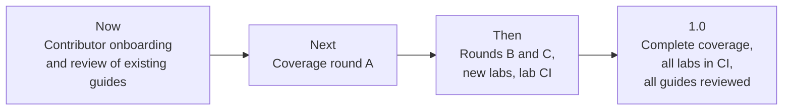

# Roadmap

> What is planned for the handbook, in what order, and how to influence it.

## Overview

The handbook already covers the core of a modern data platform: foundations, storage, processing, orchestration, streaming, quality, infrastructure, architecture and AI engineering, with seven hands-on labs. The roadmap focuses on three things: filling the remaining coverage gaps, keeping existing guides accurate, and making it easy for others to contribute.

This page states intent, not commitments. Items move as priorities change, and any item marked *help wanted* is open for contribution.

## Now

| Item | Status |
|------|--------|
| Review dates and lab-tested versions on every guide | Done ([how it works](maintenance.md)) |
| Contributor path: first-contribution guide, code owners, changelog, citation file | Done |
| Review each existing guide against current vendor documentation, so the review dates reflect real checks | Open, *help wanted* |

## Coverage

New guides follow the same template as the existing ones: Basic to Advanced, pitfalls, cheat sheet, interview questions and a Mermaid diagram.

### Round A

| Guide | Scope |
|-------|-------|
| Testing and CI/CD for data pipelines | Unit and data tests, contract checks, environments, deployment pipelines |
| Trino and query federation | Distributed SQL over lakes and databases, connectors, performance |
| Real-time analytics databases | ClickHouse, Apache Druid and Apache Pinot: when to use each, ingestion and modelling |
| Kubernetes for data workloads | Running Spark, Airflow and streaming jobs on Kubernetes, resources and scheduling |
| Azure and Microsoft Fabric | The Azure data services and Fabric's lakehouse, warehouse and pipelines |

### Round B

| Guide | Scope |
|-------|-------|
| Apache Beam and Dataflow | The unified batch and streaming model, runners, windowing |
| Streaming SQL | Materialize and RisingWave: incremental views over streams |
| Business intelligence tools | Apache Superset and Metabase: modelling, caching, embedding |
| NoSQL and operational stores | Document, wide-column and key-value stores in a data platform |

### Round C

| Guide | Scope |
|-------|-------|
| DataOps and incident response | SLAs and SLOs, on-call, runbooks, post-incident reviews |
| MCP and text-to-SQL | Exposing data to LLM agents safely, evaluation of generated SQL |
| Data catalogs | DataHub and OpenMetadata: metadata ingestion, lineage, ownership |
| Choosing a stack | A decision guide across the tools in the handbook |

## Labs

| Item | Status |
|------|--------|
| Run Labs 04 and 05 (Kafka, Airflow) in CI, not only validate their Compose files | Planned, *help wanted* |
| A dev container so every lab starts in one click | Planned, *help wanted* |
| Data quality lab with Great Expectations or Soda | Planned |
| Apache Iceberg lab | Planned |
| Change data capture lab with Debezium | Planned |

## Site

| Item | Status |
|------|--------|
| PDF and EPUB export | Planned |
| Print-friendly cheat sheets | Planned, *help wanted* |
| Role-based learning paths (analytics engineer, platform engineer, AI engineer) | Planned |

## How to influence the roadmap

- **Ask for a topic** with the [topic request](https://github.com/sarangambekar1997/data-engineering-handbook/issues/new?template=topic-request.yml) form. Add a 👍 to an existing request to show demand; requests with more support move up.
- **Pick up an item.** Filter the issues by [help wanted](https://github.com/sarangambekar1997/data-engineering-handbook/issues?q=is%3Aopen+label%3A%22help+wanted%22) or [good first issue](https://github.com/sarangambekar1997/data-engineering-handbook/issues?q=is%3Aopen+label%3A%22good+first+issue%22), and comment to claim one so work is not duplicated.
- **Discuss** direction in [Discussions](https://github.com/sarangambekar1997/data-engineering-handbook/discussions).

Completed work is recorded in the [changelog](https://github.com/sarangambekar1997/data-engineering-handbook/blob/main/CHANGELOG.md).
