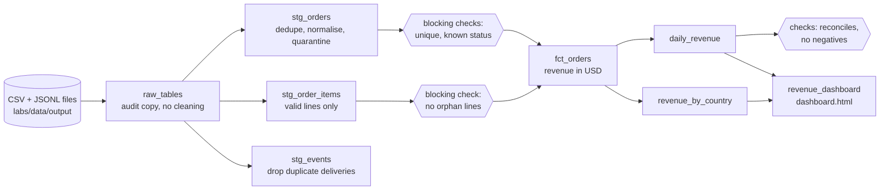

# Capstone 06: An End-to-End Pipeline with Dagster

Build and run a complete analytics pipeline, from raw files to a published dashboard, and see how the pieces from the guides fit together: ingestion, cleaning, modelling, data quality gates, orchestration and idempotent reruns.

| | |
|--|--|
| **You build / run** | Raw → staging → marts as Dagster assets on DuckDB, blocking quality checks, and a static HTML dashboard |
| **Runs on** | Python 3.10+ (no Docker, no cloud account) |
| **Time** | 90–120 minutes |
| **Guides** | [Dagster](../../docs/03-orchestration/dagster-reference.md), [Data Quality](../../docs/05-quality-governance/data-quality.md), [Data Modeling](../../docs/01-storage/data-modeling.md), [Pipeline Observability](../../docs/05-quality-governance/pipeline-observability.md) |

## The pipeline



What to notice in the code (`pipeline/assets.py`):

- **Raw is untouched.** Every cleaning decision happens in staging, so you can always go back to what arrived.
- **Bad rows are quarantined, not dropped.** `staging.rejected_orders` and `staging.rejected_order_items` say *why* each row was rejected.
- **Checks are blocking.** If `orders_are_unique` fails, `fct_orders` and everything after it are not rebuilt, so the last good marts stay in place.
- **Every asset is idempotent** (`CREATE OR REPLACE TABLE ...`), so the same input always gives the same output, however many times it runs.
- **The warehouse is one resource** (`DuckDBWarehouse`). Swapping DuckDB for another engine means changing that class.
- **Currencies are converted with a fixed table** (`FX_TO_USD`). This is an assumption for the exercise. A real pipeline joins a dated rates table.

## Setup

```bash
cd labs/06-capstone-ecommerce
python -m venv .venv && source .venv/bin/activate        # Windows: .venv\Scripts\activate
pip install -r requirements.txt

python ../data/generate.py          # writes ../data/output/*.csv and events.jsonl
python run.py                       # builds every asset, prints the check results
```

You should see five checks pass and `run succeeded; 0 check(s) failed`. Open `dashboard.html` in a browser. It has about 30 days, a total of about $3.57M in revenue, and US as the top country.

Explore the result:

```bash
python -c "import duckdb; duckdb.connect('shop.duckdb', read_only=True).sql('select * from marts.daily_revenue order by 1 desc limit 5').show()"
python -c "import duckdb; duckdb.connect('shop.duckdb', read_only=True).sql('select reason, count(*) from staging.rejected_orders group by 1').show()"
```

Use the UI to see the asset graph, lineage, check results and run history:

```bash
dagster dev -m pipeline.definitions        # http://localhost:3000, then Materialize all
```

## Exercises

**1. Prove idempotency.** Run `python run.py` twice. Confirm that the row counts and `SUM(revenue_usd)` in `marts.daily_revenue` are identical. Then explain why they must be, and what would break if `raw_tables` used `INSERT` instead of `CREATE OR REPLACE`.

**2. Absorb changed data.** Run `python ../data/simulate_changes.py`, then `python run.py`. A new day appears (31 days now), one already-loaded order becomes cancelled, and three customers move country. Which assets changed? Look at `marts.fct_orders` for customer 7: their old orders now show the *new* country, because `fct_orders` joins the current customer row. Is that what finance wants? Write down what you would change (hint: a slowly changing dimension, see [Lab 02](../02-dbt-transformations/README.md)).

**3. Make a check fail.** Change one order's status in `../data/output/orders.csv` to `teleported`, and run `python run.py`. `order_status_is_known` fails, the run stops before the marts, and `dashboard.html` keeps the last good numbers. Then restore the file. Why is it better that the marts are *not* rebuilt?

**4. Add a check.** Write an asset check on `stg_events` that fails when more than 1% of events have `received_ts` earlier than `event_ts`. Decide whether it should be blocking, and defend the choice.

**5. Add a mart.** Build `marts.customer_ltv` (lifetime value per customer, excluding cancelled orders) and add a reconciliation check that its total equals total revenue from `fct_orders`. Add the top ten customers to the dashboard.

**6. Partition it.** Turn `daily_revenue` into a daily-partitioned asset (`dg.DailyPartitionsDefinition(start_date="2024-03-01")`) that rebuilds only the requested day. Which upstream tables can stay full-refresh? See [Dagster: Partitions](../../docs/03-orchestration/dagster-reference.md#partitions).

**7. Replace the last mile.** Instead of the HTML file, publish `daily_revenue` as a Parquet file (`COPY ... TO 'daily_revenue.parquet'`), then read it with DuckDB or Polars in a notebook. What contract (columns, types, freshness) would you promise to consumers of that file?

## Cleaning up

```bash
rm shop.duckdb dashboard.html        # then run.py rebuilds everything
```
