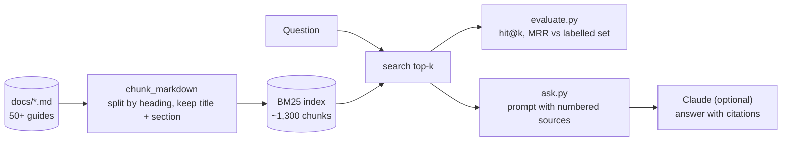

# Capstone 07: A RAG Pipeline over the Handbook, with Evals

Build the data side of a retrieval-augmented generation (RAG) system on real content, the handbook's own guides, and measure whether retrieval works. The pipeline runs with only the Python standard library, so you can do everything except the last LLM step without an API key.

| | |
|--|--|
| **You build / run** | A chunker, a BM25 keyword index, a retrieval evaluation with hit@k and MRR, and an optional cited answer from Claude |
| **Runs on** | Python 3.10+ (no Docker, no cloud, no API key needed for retrieval) |
| **Time** | 60–90 minutes |
| **Guides** | [RAG](../../docs/07-ai/rag.md), [Embeddings](../../docs/07-ai/embeddings.md), [Vector Databases](../../docs/07-ai/vector-databases.md), [Evals](../../docs/07-ai/eval-and-evals.md), [System Design case study 5](../../docs/09-interviews/system-design-case-studies.md#5-data-pipeline-for-a-rag-support-assistant) |

## The pipeline



| File | What it teaches |
|------|-----------------|
| `rag.py` | Heading-aware chunking with metadata, BM25 ranking, retrieval. About 130 lines |
| `eval_set.jsonl` | 39 questions, each labelled with the guide(s) that answer it |
| `evaluate.py` | Retrieval metrics you can put behind a CI gate |
| `ask.py` | Building a grounded, citing prompt. Calls Claude only if `ANTHROPIC_API_KEY` is set |

## Run it

```bash
cd labs/07-docs-rag
python evaluate.py                                   # ~1,300 chunks, hit@1 87%, hit@5 97%, MRR 0.92
python ask.py "How do I roll back a Delta table?"     # shows the sources retrieved
python ask.py "What is a consumer group in Kafka?" --show-prompt

pip install anthropic                                # optional: generate answers
export ANTHROPIC_API_KEY=...                         # never commit a key
python ask.py "How do I roll back a Delta table?"
```

The numbers depend on the guides' current text, so expect small differences as the handbook grows. CI runs `python evaluate.py --min-hit-at-5 0.85`, so a change that makes retrieval clearly worse fails the build.

## What the metrics mean

- **hit@k**: the share of questions where an expected guide appears among the top *k* results. Retrieval must find the right material before generation can use it.
- **MRR**: the average of 1 / (rank of the first correct result). It rewards putting the right guide first.

Read the "Not in the top 3" list after each run. It shows which questions fail and what was retrieved instead, which is where improvement ideas come from.

## Exercises

**1. Vary the chunk size.** Change `max_chars` in `chunk_markdown` (try 200, 400, 900, 1800, 6000) and record the number of chunks and hit@1, hit@5 and MRR. On the baseline data the *guide-level* scores barely move (hit@5 stays between 97% and 100%), even though the index grows from about 1,100 to about 4,900 chunks. Why? The eval only asks whether the right *guide* was found. Now add an `expected_heading` to ten questions and score at the *chunk* level instead: does the top chunk contain the answer? Small chunks then find the exact passage but can miss context, and large chunks carry context but dilute the ranking and cost more prompt tokens. Pick a size and defend it with numbers.

**2. Fix a miss.** The baseline misses *"What is the medallion architecture?"* because `docs/README.md`, an index page, ranks first. Exclude navigation pages from the index and re-measure. This is the same idea as filtering low-value sources in a production RAG pipeline.

**3. Tune the ranker.** Change `heading_boost` (0, 1, 3, 6) and `k1`/`b` in `BM25Index`, and record hit@1 and MRR. Do the headings help? Why can boosting them too much hurt?

**4. Write harder questions.** Add ten questions to `eval_set.jsonl` that use *different words* than the guides do (for example "undo a bad load" for "restore"). BM25 will struggle with these. That gap is what embeddings fix.

**5. Add a semantic retriever.** Install `sentence-transformers`, embed every chunk with a small model, and add a `DenseIndex` with the same `search` interface. Combine both rankings with reciprocal rank fusion (`score = Σ 1 / (60 + rank)`). Does hybrid beat either alone on your ten hard questions? See [RAG: hybrid search](../../docs/07-ai/rag.md).

**6. Make ingestion incremental.** Store a content hash per chunk in a small SQLite file, and on each run report which chunks were added, changed or removed. That is what lets a real pipeline re-embed only what changed. Which chunks change when you edit one guide?

**7. Add access control.** Tag some guides as `internal` in a metadata map and make `search` take a `allowed_labels` argument that filters *before* ranking. Add an eval question that must not return an internal guide for an outside user. Why must this filter live in retrieval and not in the prompt?

**8. Evaluate the answers.** With an API key, write a second eval that checks the answer text: does it cite a source, and does it say "I don't know" for a question the handbook cannot answer ("How do I configure Oracle GoldenGate?")? Score with rules first, then an LLM judge. See [Evals](../../docs/07-ai/eval-and-evals.md).
