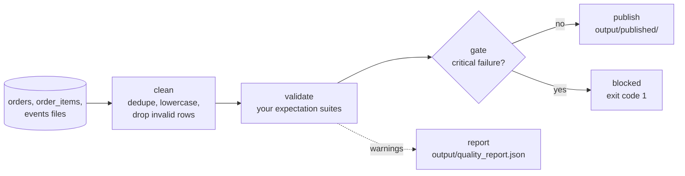

# Lab 08 — Data Quality Gates with Great Expectations

Write expectation suites for the e-commerce dataset, decide which failures block a pipeline and which only warn, and watch a gate stop bad data, stale data and a schema change from reaching consumers.

| | |
|-|-|
| **Time** | 60–90 minutes |
| **Runs on** | Python 3.10+ and [Great Expectations](https://greatexpectations.io/) (GX Core 1.x). No Docker, no server, no cloud account. |
| **Guides** | [Data Quality](../../docs/05-quality-governance/data-quality.md) · [Pipeline Observability](../../docs/05-quality-governance/pipeline-observability.md) · [Testing and CI/CD](../../docs/06-infrastructure/testing-cicd.md) |

## Setup

```bash
cd labs/08-data-quality
python -m venv .venv && source .venv/bin/activate        # Windows: .venv\Scripts\activate
pip install -r requirements.txt

python ../data/generate.py          # writes ../data/output/*.csv and events.jsonl
python exercises.py --stage raw     # runs before you change anything
```

GX prints progress bars while it calculates metrics. They are harmless.

## The pipeline



| File | Purpose |
|------|---------|
| [`framework.py`](framework.py) | Given. Loads the data, cleans it (the staging rules from [Lab 06](../06-capstone-ecommerce/README.md)), runs a suite through GX, prints a report, applies your gate and publishes or blocks. |
| [`exercises.py`](exercises.py) | **The exercise.** Three suites and a gate, with TODOs. |
| [`solutions.py`](solutions.py) | Reference answers. |
| [`ci_smoke.py`](ci_smoke.py) | Runs the reference solution against every situation below and asserts the results. CI uses it. |

`--stage raw` validates the files exactly as they arrived and publishes nothing. `--stage clean` (the default) cleans first, validates, applies the gate and publishes only if nothing blocks. Running the same suites at both stages shows what cleaning fixes and what it does not.

`framework.py` performs the GX steps you will meet in the [Great Expectations section of the guide](../../docs/05-quality-governance/data-quality.md#great-expectations): a data source and asset for the DataFrame, a batch definition, a suite of expectations, and a validation definition that runs them. The Python objects in your suites are expectation classes, for example `gxe.ExpectColumnValuesToBeUnique(column="order_id")`.

## Exercises

### 1. Keys

In `orders_expectations`, expect `order_id` to be never null and unique. Run:

```bash
python exercises.py --stage raw
```

`order_id` is unique in the source system, but 311 orders arrived twice (a later version with a new status). The check reports **622** unexpected values, because both rows of each duplicated pair count.

1. Why 622 and not 311? Which value is `unexpected` when GX evaluates uniqueness?
2. The check passes on the cleaned data (`python exercises.py`). Which cleaning rule made it pass?

### 2. Domains

Expect `status` to be one of `placed`, `paid`, `shipped`, `delivered`, `cancelled`, and `currency` to be one of `USD`, `EUR`, `GBP`. Status fails on **202** raw rows because some are upper-case (`SHIPPED`). Currency passes.

1. Why is a value set a better check for `status` than a regular expression?
2. A new payment provider starts sending `refunded`. What does the check do, and who should hear about it?

### 3. Order lines and referential integrity

In `items_expectations`, add these checks: `(order_id, line_no)` is unique (`ExpectCompoundColumnsToBeUnique`), `quantity` is between 1 and 1,000, `unit_price` is between 0.01 and 10,000, every `product_id` is in `ref.product_ids` and every `order_id` is in `ref.order_ids`.

Two of them fail on the raw data: **63** lines with a non-positive quantity and **83** lines with an unknown product. The other three pass.

1. `ref.order_ids` comes from the orders table of the same stage. Why is that safer than a hard-coded list?
2. What would you have to change for these checks to scale to 500 million order lines? (`ExpectColumnValuesToBeInSet` receives the whole list of product IDs.)

### 4. Events

In `events_expectations`, expect `event_id` to be unique, `event_type` to be `page_view`, `page` to be one of `/`, `/search`, `/product`, `/cart`, `/checkout`, and `received_ts` to never be earlier than `event_ts` (`ExpectColumnPairValuesAToBeGreaterThanB` with `or_equal=True`).

`event_id` fails on **642** raw rows (321 events delivered twice). The other checks pass.

1. The stream guarantees at-least-once delivery. Is a duplicate event a data quality *failure*, or expected behaviour? Where does your answer belong: in a check on raw data, or in the cleaning step?

### 5. Thresholds and severity

Add two expectations for `customer_id` in `orders_expectations`:

- Block when more than **5%** of values are missing: `ExpectColumnValuesToNotBeNull(column="customer_id", mostly=0.95)`.
- Warn when more than **0.5%** are missing: the same expectation with `mostly=0.995` and `severity="warning"`.

About 1.06% of raw orders have no `customer_id` (**67** rows). The 5% check passes even though it lists 67 unexpected values, because `mostly` allows up to 5%. The 0.5% check fails as a warning. Two thresholds on one column give an early signal well before the pipeline has to stop.

1. What happens if the warning threshold is *looser* than the blocking one?
2. Who receives a warning in your organisation, and what would make them act on it? A warning nobody reads is a check that does nothing.

### 6. The gate

Until you implement `gate`, nothing blocks. Implement it to return the failed outcomes whose severity is `critical`, then run both stages:

```bash
python exercises.py --stage raw     # BLOCKED: 5 critical failures, exit code 1
python exercises.py                 # PUBLISHED 3 tables, one warning, exit code 0
```

With all five critical failures found, the raw run ends with `BLOCKED` and exit code 1, which is what a scheduler or CI job looks at. The clean run publishes the tables to `output/published/`, and the report in `output/quality_report.json` lists every outcome.

| Failing critical check on raw data | Unexpected rows |
|-----------------------------------|----------------:|
| `orders`: `order_id` unique | 622 |
| `orders`: `status` in set | 202 |
| `order_items`: `quantity` between | 63 |
| `order_items`: `product_id` in set | 83 |
| `events`: `event_id` unique | 642 |

1. When the gate blocks, the previously published tables stay in place. Why is that better than publishing the good tables and skipping the bad one?
2. `framework.py` validates *after* cleaning. When would you also gate the raw data, and what would you do with a raw failure that cleaning is designed to fix?

### 7. Schema, volume and freshness

Checks on the data's shape catch failures that no value check sees. In `orders_expectations`, add:

- The columns are exactly `order_id`, `customer_id`, `order_ts`, `status`, `currency`, `updated_at` (`ExpectTableColumnsToMatchSet`).
- The row count is between 1,000 and 50,000 (`ExpectTableRowCountToBeBetween`).
- The newest `order_ts` is between `FRESH_FROM` and `FRESH_TO` (`ExpectColumnMaxToBeBetween`, a freshness check).

Add a row-count check to the other two suites as well.

1. `FRESH_FROM` and `FRESH_TO` are fixed dates because the dataset is fixed. What would a production version compare against?
2. Row-count bounds of 1,000 to 50,000 accept a 90% drop in volume from 45,000 rows. How would you make the bound adapt to normal volume?

## Experiments

Each experiment uses the reference solution (`solutions.py`) or your finished `exercises.py`. Copy the dataset first so the experiments do not change it:

```bash
python ../data/generate.py --out /tmp/lab08-full
```

### A. A new day of data

```bash
python ../data/simulate_changes.py --out /tmp/lab08-full
LAB_DATA_DIR=/tmp/lab08-full python solutions.py
```

It adds a day of orders and a late cancellation. The cleaned data still passes and is published: 6,200 orders instead of 6,000. Which of your bounds would have failed if the new day had been ten times larger?

### B. A stale extract

```bash
python ../data/generate.py --days 10 --out /tmp/lab08-short
LAB_DATA_DIR=/tmp/lab08-short python solutions.py
```

Every value check passes, because 10 days of clean data is clean. The freshness check fails: the newest order is from 2024-03-10, so the run is **BLOCKED**. Run the starting `exercises.py` on the same folder (`LAB_DATA_DIR=/tmp/lab08-short python exercises.py`), which has no freshness check and no gate, and the stale data is published without anyone noticing.

### C. A schema change

```bash
cp -r /tmp/lab08-full /tmp/lab08-drift
sed -i '1s/,status,/,order_status,/' /tmp/lab08-drift/orders.csv     # macOS: sed -i '' ...
LAB_DATA_DIR=/tmp/lab08-drift python solutions.py --stage raw
```

An upstream team renames `status`. The schema check fails and shows the columns it found, and the `status` check fails too, without detail, because the column it looks for no longer exists. In GX a check that cannot run counts as failed, so the gate blocks. Why is that the safe default?

## Going further

- Add a [Data Docs](../../docs/05-quality-governance/data-quality.md#great-expectations) site: create a file-based context with `gx.get_context(mode="file")`, add an `UpdateDataDocsAction` to a checkpoint, and open the HTML report.
- Quarantine instead of drop: write the rows that `clean()` removes to `output/quarantine/` with the reason, and add a check that the quarantine rate stays below 2% of the input.
- Move the checks into the pipeline of [Lab 06](../06-capstone-ecommerce/README.md) or the [Airflow DAG of Lab 05](../05-airflow-orchestration/README.md), where a failed check stops the downstream tasks.
- Express the same contract in [dbt tests](../../docs/05-quality-governance/data-quality.md#dbt-tests) (Lab 02) or with Soda, and compare what each tool makes easy: authoring, severity, results as data, and running next to the warehouse.
- Track the failure counts over time with the `quality_report.json` files. Which check would you plot first, and what would an anomaly look like?

## Clean up

```bash
rm -rf output /tmp/lab08-full /tmp/lab08-short /tmp/lab08-drift
```
