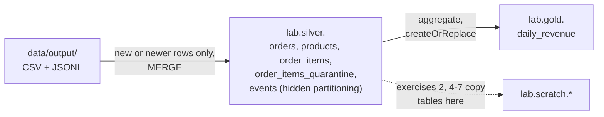

# Lab 09 — Lakehouse Tables with Apache Iceberg

Build the silver and gold tables of [Lab 03](../03-spark-lakehouse/README.md) as Apache Iceberg tables, then use what the format adds to a folder of Parquet files: snapshots and time travel, `MERGE`, schema and partition evolution that do not rewrite data, maintenance, and branches for write-audit-publish. The two labs use the same data and give the same row counts, so the table formats can be compared directly.

| | |
|-|-|
| **Time** | 90–120 minutes |
| **Runs on** | Python + PySpark 4.1 + Iceberg 1.11 in local mode, with a folder-based catalog. No Docker, no cluster, no cloud account. |
| **Needs** | Java 17 or 21 (`java -version`). On Windows, use WSL2. |
| **Guides** | [Apache Iceberg](../../docs/01-storage/apache-iceberg.md) · [PySpark](../../docs/02-processing/pyspark-reference.md) · [Delta Lake](../../docs/01-storage/delta-lake.md) · [Testing and CI/CD](../../docs/06-infrastructure/testing-cicd.md) |

## Setup

```bash
cd labs/09-iceberg-lakehouse
python -m venv .venv && source .venv/bin/activate
pip install -r requirements.txt

python ../data/generate.py          # writes ../data/output/
python pipeline.py                  # first run downloads the Iceberg runtime JAR (about 47 MB)
```

Use a separate virtual environment from Lab 03. Lab 03 runs on Spark 4.2 because Delta Lake supports it, while Iceberg publishes a runtime for Spark up to 4.1 (`iceberg-spark-runtime-4.1_2.13`).

Expected output:

```text
silver  done
gold    done

  silver.orders                     6,000 rows
  silver.order_items               14,769 rows
  silver.order_items_quarantine       146 rows
  silver.events                    30,000 rows
  gold.daily_revenue                 30 rows
```

## Pipeline



| Table | Written with | Design choice |
|-------|--------------|---------------|
| `silver.orders` | `MERGE` | Upsert on `order_id`; a row is replaced only by a **newer** `updated_at` |
| `silver.order_items`, `order_items_quarantine` | `MERGE` (insert only) | Invalid lines go to a quarantine table with a `reject_reason` |
| `silver.events` | `MERGE` (insert only), `PARTITIONED BY (days(event_ts))` | Duplicate deliveries removed by `event_id`. The partition is derived from the timestamp, so there is no separate date column. |
| `gold.daily_revenue` | `createOrReplace` | A small aggregate that is cheaper to rebuild than to update |

The tables live in `lakehouse/`, in a catalog named `lab` (see [`lake.py`](lake.py)). This catalog is a folder, which needs no server. A production catalog (REST, Glue, Nessie and others) also coordinates concurrent writers.

Before it merges, [`pipeline.py`](pipeline.py) removes the rows that are already in the table. A `MERGE` rewrites every data file that contains a matched row, even if the row does not change, so sending the whole source on every run would rewrite the whole table each time. Exercise 2 shows what a merge costs.

## Exercises

Write your answers in [`exercises.py`](exercises.py) and run one at a time with `python exercises.py <n>`. Every exercise runs before you change it and prints a starting point. Reference answers are in [`solutions.py`](solutions.py) (`python solutions.py <n>`).

Before exercises 2 and 3, process a day of changes: a new day of orders, one late cancellation, and three customers moving country.

```bash
python ../data/simulate_changes.py
python pipeline.py
```

Exercises 2 and 4–7 work on scratch copies in `lab.scratch`, so the silver and gold tables stay as the pipeline built them.

Spark 4.1 prints one very long JSON line to the console for every error it reports, including the two errors that exercises 4 and 6 cause on purpose. The exception still reaches your Python code normally, so you can ignore the log line.

| # | Task | Concepts | Hint |
|---|------|----------|------|
| 1 | Look inside a table on disk | Metadata files, manifests, snapshots, metadata tables | `SELECT * FROM lab.silver.orders.snapshots`, and `.files`, `.manifests` |
| 2 | Read the `MERGE` metrics, and compare copy-on-write with merge-on-read | Snapshot summary, row-level modes | Expect 200 orders inserted and 1 updated, yet 6,000 records rewritten |
| 3 | Find the days that changed | `VERSION AS OF`, `TIMESTAMP AS OF` | A full outer join on `order_date`, compared with `<=>` |
| 4 | Evolve a schema | Column IDs, metadata-only changes | Compare `SELECT file_path FROM <table>.files` before and after |
| 5 | Evolve a partition spec | Hidden partitioning, partition specs | `REPLACE PARTITION FIELD days(event_ts) WITH hours(event_ts)` |
| 6 | Compact small files and expire snapshots | `rewrite_data_files`, `expire_snapshots` | Compare the files in `.files` with the files on disk |
| 7 | Write-audit-publish with a branch | Branches, `fast_forward` | Write to `<table>.branch_audit`, audit, then publish |

### 1. Look inside a table

An Iceberg table is a folder with two subfolders: `data/` holds Parquet files, and `metadata/` holds the files that say which data files belong to which version of the table. Count them, then query the same information through SQL metadata tables.

After the day of changes, `silver.orders` has 3 `*.metadata.json` files, 2 manifest lists and 3 manifests, and 2 Parquet files on disk, but only **1** current data file in `.files`.

1. Follow the chain from the newest `metadata.json` to a manifest list, a manifest and a data file. Where does the table's schema live? Where do the per-file column statistics live?
2. Why is the old Parquet file still on disk? What would remove it? (Exercise 6.)

### 2. Row-level changes

Read the summary of the latest snapshot of `silver.orders`: the `MERGE` inserted **200** orders and updated **1**, but it removed **6,000** records and added **6,200**. Iceberg's default is copy-on-write: any data file with a matched row is rewritten in full.

Then compare the two row-level modes on scratch copies. An `UPDATE` of 2 orders:

| Mode | Records written | Records removed | Delete files |
|------|----------------:|----------------:|-------------:|
| `copy-on-write` | 6,200 | 6,200 | 0 |
| `merge-on-read` | 2 | 0 | 1 |

1. Merge-on-read writes a small file with the 2 new rows and a *delete file* that marks the old rows. What does a reader do with them, and what does it cost on every read until they are compacted?
2. Which mode would you choose for a table with a nightly `MERGE` of 0.1% of rows, and which for a table that is rewritten only once a month? What does Lab 03's `MERGE` on Delta cost in the same situation?

### 3. Time travel

Each write creates a snapshot. Read the first snapshot of `gold.daily_revenue` by snapshot ID, by timestamp, and with the DataFrame reader option `versionAsOf`, and check that the three agree. Then compare it with the current table:

| order_date | orders then | orders now | revenue then | revenue now |
|------------|------------:|-----------:|-------------:|------------:|
| 2024-03-29 | 191 | 190 | 113,136.54 | 112,151.15 |
| 2024-03-31 | *(none)* | 192 | *(none)* | 122,860.60 |

A late cancellation changed 2024-03-29, and the new day is 2024-03-31.

1. The guide's older examples read a snapshot with `.option("snapshot-id", ...)`. Try it: with Spark 4.1 and Iceberg 1.11 it raises an error that points to `versionAsOf`. What does that tell you about pinning versions of the engine and the table format together?
2. `gold` is rebuilt with `createOrReplace` on every run, so its snapshots accumulate. How would you keep only the last week?

### 4. Schema evolution

On a scratch copy of `silver.orders`: add `channel`, rename `currency` to `currency_code`, widen `customer_id` to `BIGINT`, and drop `updated_at`. After every change the list of data files is **identical**: Iceberg tracks columns by ID, so these are metadata-only. Narrowing `order_id` from `BIGINT` to `INT` is rejected (`NOT_SUPPORTED_CHANGE_COLUMN`). Reading the table `VERSION AS OF` its first snapshot returns the *old* column names, `currency` and `updated_at`.

1. A dashboard selects `currency`. What happens to it after the rename, and to a query pinned to a snapshot from before the rename?
2. Delta needs column mapping enabled to rename or drop a column without rewriting files. What is Iceberg doing differently?

### 5. Partition evolution

`silver.events` is partitioned by `days(event_ts)`: Iceberg derives the partition from the timestamp, so nobody writes a `WHERE event_date = ...` filter and a filter on `event_ts` prunes partitions. On a scratch copy, change the spec to `hours(event_ts)` and insert more rows.

The 32 existing files keep the old (day) spec. The 49 new files use the new (hour) spec, and the count of events on 2024-03-10 (**996**) is the same before and after, with the same query.

1. What would changing a table's partitioning cost in a system where the partition columns are part of the table's layout? What does this table cost?
2. Query planning now sees two specs. Where does Iceberg keep the information that tells it which spec each file uses? (Look at `spec_id` in `.files`.)

### 6. Maintenance

Twelve small commits, as from a micro-batch job, leave **108** small files (about 3 KB each) for 31,000 rows. Compact them with `rewrite_data_files`: 1 file remains in the table, but **109** Parquet files are on disk, because the earlier snapshots still reference the small ones, and you can still read the first snapshot. Then `expire_snapshots` with `retain_last => 1` deletes 108 data files, leaves 1 on disk, and the first snapshot can no longer be read.

1. `remove_orphan_files` finds files that no snapshot references, for example from a failed write. It refuses to run with an `older_than` interval under 24 hours. Try it and read the error. Why is that safeguard needed?
2. How long should you keep snapshots? Consider the longest time-travel query you promise, audits, and storage cost. Compare this with `VACUUM` in Lab 03.

### 7. Branches and write-audit-publish

Create a branch named `audit` on a scratch table, write new rows **only to the branch** (`INSERT INTO <table>.branch_audit ...`), and compare: `main` still has **999** rows and the branch has **1,008**. Run an audit query on the branch. If it passes, publish with `CALL lab.system.fast_forward('scratch.orders_wap', 'main', 'audit')` and `main` has 1,008 rows. Readers of `main` never saw the unaudited rows.

1. This is the write-audit-publish pattern from the [Testing and CI/CD guide](../../docs/06-infrastructure/testing-cicd.md). What does a reader of `main` see if the audit fails and the job stops?
2. Create a **tag** on `main` before publishing (`ALTER TABLE ... CREATE TAG before_publish`). How is a tag different from a branch, and when would you use one?

## Iceberg and Delta side by side

Both labs give the same row counts (6,000 orders, 14,769 order lines, 146 quarantined lines, 30,000 events, 30 days of revenue), so the differences are in how each format works.

| | Delta Lake (Lab 03) | Iceberg (this lab) |
|-|---------------------|--------------------|
| Table state | `_delta_log/` JSON commits | `metadata/`: a metadata file, manifest lists and manifests |
| History | `DESCRIBE HISTORY` | Metadata tables: `.snapshots`, `.history`, `.files`, `.manifests` |
| Time travel | `versionAsOf` (a version number) | A snapshot ID or a timestamp; also branches and tags |
| Partitioning | Partition columns, such as `event_date` | Hidden partitioning by transform, such as `days(event_ts)`, which can be evolved |
| Schema changes | `mergeSchema`; renames and drops need column mapping | Column IDs: add, rename, drop and widen are metadata-only |
| Compaction | `OPTIMIZE` | `rewrite_data_files` |
| Cleanup | `VACUUM` | `expire_snapshots`, `remove_orphan_files` |
| Catalog | The table path | A catalog resolves the name and coordinates commits |

This table describes the concepts. What each row costs depends on the engine and settings, so measure with your own data.

## Questions to answer

- Run `python pipeline.py` again without changing the data. Why do the silver tables get no new snapshot, while `gold.daily_revenue` does?
- Remove the filter in `upsert()` so that the whole source is merged every time. What happens to `silver.order_items` on a rerun, and why?
- The folder catalog needs no server. What can go wrong when two jobs write the same table at the same time, and what does a REST or Glue catalog do about it?
- Events are partitioned by `days(event_ts)`. Why not by `customer_id`? Would `bucket(16, customer_id)` help a query by customer?

## Going further

- Add `rewrite_manifests` to the maintenance in exercise 6 and compare planning on a table with thousands of manifests.
- Rebuild `gold.daily_revenue` incrementally with `MERGE`, keyed on `order_date`, and compare the snapshot summaries with `createOrReplace`.
- Run `python ../data/generate.py --days 365 --orders-per-day 5000` and watch the Spark UI at http://localhost:4040 while the pipeline runs. How do the file counts in `.files` grow?
- Put a check between the audit and the publish step of exercise 7 using the gate from [Lab 08](../08-data-quality/README.md).

## Clean up

```bash
rm -rf lakehouse spark-warehouse
```
