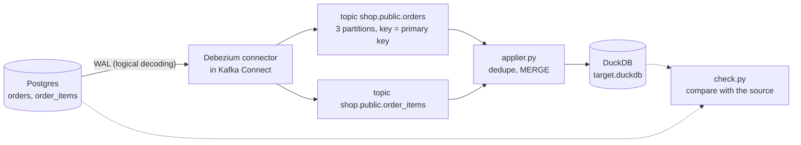

# Lab 10 — Change Data Capture with Debezium

Capture every insert, update and delete from a Postgres database with Debezium, read the change events from Kafka, and apply them to a target table so that it mirrors the source, even when events are duplicated, delayed or reordered. Then pause and restart the connector, take a new snapshot, and change the source schema.

| | |
|-|-|
| **Time** | 90–120 minutes |
| **Runs on** | Docker Compose (Kafka, Postgres, Kafka Connect with Debezium 3.6) and Python. No cloud account. |
| **Needs** | Docker with Compose v2, and about 2 GB of free memory. On Windows, use WSL2. |
| **Guides** | [Ingestion & CDC](../../docs/02-processing/ingestion-cdc.md) · [Kafka](../../docs/04-streaming/kafka-reference.md) · [Docker](../../docs/06-infrastructure/docker-reference.md) · [Data Quality](../../docs/05-quality-governance/data-quality.md) |

## Setup

```bash
cd labs/10-cdc-debezium
python -m venv .venv && source .venv/bin/activate
pip install -r requirements.txt

python ../data/generate.py            # writes ../data/output/
docker compose up -d --wait           # Kafka, Postgres with wal_level=logical, Kafka Connect
python load_source.py                 # 6,000 orders and 14,769 order lines into Postgres
python register_connector.py register # starts Debezium; waits until it is running
```

`docker compose up` returns before Kafka Connect has finished starting. `register_connector.py` waits for it.

## What runs



On the first start the connector takes a **snapshot** of the existing rows (`op = r`), then reads the write-ahead log from the position where the snapshot was taken. Each captured table becomes a topic; the message key is the row's primary key, so all changes to one row go to one partition and stay in order.

| File | Purpose |
|------|---------|
| [`docker-compose.yml`](docker-compose.yml) | Kafka (KRaft), Postgres 18 with logical decoding, and Kafka Connect with the Debezium Postgres connector. |
| [`connector.json`](connector.json) | The connector configuration. |
| [`load_source.py`](load_source.py), [`change_source.py`](change_source.py) | Load the source database, and simulate bursts of application activity. |
| [`register_connector.py`](register_connector.py) | Register, pause, resume, restart or delete a connector through the Kafka Connect REST API. |
| [`show_events.py`](show_events.py), [`sql.py`](sql.py) | Look at the change events, and run SQL against the source. |
| [`applier.py`](applier.py) | **The exercise.** Reduces a batch of events and merges it into the target. |
| [`framework.py`](framework.py) | Given. Reads Kafka in batches, stages a batch, and commits offsets after the batch is applied. |
| [`check.py`](check.py) | Compares the target with the source, row by row. |
| [`solutions/applier.py`](solutions/applier.py) | Reference answer. |
| [`ci_smoke.py`](ci_smoke.py) | Runs every scenario below against a fresh stack and asserts the results. CI uses it. |

## Exercises

### 1. The snapshot

```bash
python show_events.py orders
```

You should see 6,000 events with `op` `r` (a snapshot read), spread over the topic's three partitions, and one example event. Read its parts: `before` and `after` (the row), `source` (the table, the transaction ID `txId` and the log position `lsn`), `op`, and `ts_ms`. The `snapshot` field in `source` says the row came from the snapshot.

```bash
python show_events.py order_items
```

1. The key of each message is the primary key. Why does that matter for ordering across partitions?
2. `order_items` has a composite primary key. What is the key of an event for it?

### 2. Live changes

Simulate application activity: 50 new orders with two lines each, 100 status changes (one order changes three times), and 10 deleted orders whose lines are deleted by a cascade.

```bash
python change_source.py
python show_events.py orders --op u
python show_events.py orders --op d
python show_events.py order_items --op d --limit 2
```

| Topic | `c` | `u` | `d` | Tombstones |
|-------|----:|----:|----:|-----------:|
| `orders` | 50 | 102 | 10 | 10 |
| `order_items` | 100 | 0 | 25 | 25 |

Look closely at two things:

- **`before` of an update is `null`.** Postgres writes only the key of the old row to the log by default (`REPLICA IDENTITY DEFAULT`). Run `python sql.py "ALTER TABLE orders REPLICA IDENTITY FULL"`, update one order with `sql.py`, and look at the new event: `before` now holds the old row. Set it back with `REPLICA IDENTITY DEFAULT`.
- **`before` of a delete holds the key, and placeholder values elsewhere** (empty strings and `1970-01-01` timestamps). The other columns are not in the log, and Debezium fills in defaults for columns that are `NOT NULL`. Never read a non-key column from a delete's `before`.

1. Each delete is followed by a message with a key and no value, a *tombstone*. What is it for? (See log compaction in the [Kafka guide](../../docs/04-streaming/kafka-reference.md).)
2. The 25 deleted order lines were deleted by `ON DELETE CASCADE`, in the same transaction as the orders. What does that tell you about capturing child tables?

### 3. Apply the changes

The target is a set of DuckDB tables with the source's columns plus `_lsn` (the log position of the change that last wrote the row) and `_deleted`. Implement the two functions in [`applier.py`](applier.py):

- `latest_per_key`: reduce a batch to one change per key, the one with the highest `lsn`.
- `merge`: one `MERGE INTO` that updates a matched row **only if the incoming change has a higher `_lsn`**, inserts new rows, and **marks** a deleted row (`_deleted = true`) instead of removing it.

Then apply and compare:

```bash
python applier.py
python check.py
```

`check.py` prints one line per table and exits with code 1 if anything differs. With the shipped `applier.py` the result depends on where the batch boundaries fall: when an order changes several times inside one batch, a staged `INSERT OR REPLACE` with repeated keys keeps an arbitrary one. After your implementation both tables print `OK`.

1. Why `latest_per_key` *and* the `_lsn` comparison? Which situation does each one cover?
2. Offsets are committed after the batch is applied. What happens if the applier crashes between the two, and why is the result still correct?

### 4. Duplicates and ordering

Kafka gives at-least-once delivery, and consumers rebalance, retry and replay. Break the delivery on purpose (each run starts from an empty target and a new consumer group, so it reads every event again):

```bash
rm -f target.duckdb
python applier.py --chaos duplicate --group dup-1    # every batch applied twice
python check.py
rm -f target.duckdb
python applier.py --chaos shuffle --group shuf-1     # random order within a batch
python check.py
rm -f target.duckdb
python applier.py --chaos reverse --group rev-1      # the batches newest first
python check.py
```

With the reference applier all three runs end with `OK`. With the shipped `applier.py`, the `reverse` run leaves **10 orders and 25 order lines** in the target that were deleted in the source, because the old inserts arrive after the deletes, and **100 orders** with an old status, because older updates overwrite newer ones.

1. What does the `_lsn` comparison give you that timestamps such as `updated_at` do not?
2. Change `merge` to delete the row on a delete event, and run `reverse` again. What comes back, and why does keeping a marked row prevent it?

### 5. Deletes

Compare three ways to handle a delete downstream, and decide which fits which requirement:

| Approach | Downstream result | Cost |
|----------|-------------------|------|
| Hard delete | The row disappears | A replayed older event can bring it back, and the history is gone |
| Mark deleted (this lab) | A row with `_deleted = true` and the log position of the delete | Readers must filter on `_deleted` |
| Append-only history | Every event kept, the current state derived | More storage and a view to maintain |

1. A user asks to be forgotten (a privacy request). Which approach is acceptable, and what would you do to the marked rows?
2. How would you expose the marked-deleted rows to analysts as a view that looks like the source table?

### 6. Pause, restart, and a new snapshot

Pause the connector, change the source, and look at the replication slot, the place in the log that the connector has confirmed reading:

```bash
python register_connector.py pause
python change_source.py --batch 2
python sql.py "SELECT slot_name, active, pg_wal_lsn_diff(pg_current_wal_lsn(), confirmed_flush_lsn) AS lag_bytes FROM pg_replication_slots"
python show_events.py orders          # no new events
```

Batch 2 adds 30 orders, updates 52 and deletes 5 (11 order lines). While the connector is paused nothing is read, so **Postgres must keep the log** and the lag grows. Resume and look again:

```bash
python register_connector.py resume
python show_events.py orders          # c 80, u 154, d 15: every change arrived, none twice
python sql.py "SELECT slot_name, pg_wal_lsn_diff(pg_current_wal_lsn(), confirmed_flush_lsn) AS lag_bytes FROM pg_replication_slots"
```

Now the restarts. Stopping the connector does not lose changes, because the slot and the connector's offsets (stored in Kafka) survive:

```bash
python register_connector.py restart
python register_connector.py delete
python sql.py "UPDATE orders SET status = 'delivered', updated_at = now() WHERE order_id BETWEEN 600301 AND 600310"
python register_connector.py register
python show_events.py orders          # u 164: the 10 updates made while the connector was gone; still r 6000
```

To take a new snapshot instead, remove the slot too, and register a connector with a new name (offsets belong to the connector name) and a new slot. Delete the old connector first: two connectors on the same topics would each write every change.

```bash
python register_connector.py delete
python sql.py "SELECT pg_drop_replication_slot('shop_cdc')"      # if it says the slot is active, wait a few seconds and repeat
python register_connector.py register --name shop-cdc-v2 --slot shop_cdc_v2
python show_events.py orders          # r 12065: all the current rows again
python applier.py --group again-1     # applies them; check.py still says OK
python check.py
```

1. An unused replication slot makes Postgres keep WAL forever. What would you monitor, and which Postgres setting caps the WAL a slot may hold? (See `max_slot_wal_keep_size` in the Postgres documentation.)
2. After the new snapshot the topics contain the old history *and* the snapshot. Which property of your applier makes that safe? What would a consumer that keeps no `_lsn` do?

### 7. A new column

An application release adds a column:

```bash
python sql.py "ALTER TABLE orders ADD COLUMN channel TEXT" "UPDATE orders SET channel = 'web', updated_at = now() WHERE order_id BETWEEN 600401 AND 600420"
python show_events.py orders --op u --key 600401
```

Debezium notices the new column and includes `channel` in the events that follow. Apply them with the shipped `applier.py` (`rm -f target.duckdb`, then `python applier.py --group schema-0`) and run `check.py`: it reports `columns the target lacks: ['channel']`, because `stage_batch()` silently drops fields the target does not know. Implement `add_new_columns` so the target gains the column, then start again from an empty target: `rm -f target.duckdb`, `python applier.py --group schema-1`, `python check.py`.

1. The guide's schema evolution table lists safe and unsafe source changes. Which of them could `add_new_columns` handle automatically, and which should stop the pipeline and page someone?
2. A column is renamed in the source. What do the events look like, and what does your applier do?

## Questions to answer

- Snapshot events all describe the table as of one position in the log. Why does the connector read the log from *that* position afterwards, rather than from "now"?
- The connector stores its offsets in Kafka, and Postgres stores the slot position. What can you conclude if the two disagree after a restore from backup?
- The applier merges into DuckDB one batch at a time. What would change if the target were Iceberg (see [Lab 09](../09-iceberg-lakehouse/README.md)) or Snowflake?

## Going further

- Add a **heartbeat** (`heartbeat.interval.ms`) to the connector and watch what it does to the slot's lag when a captured table is idle.
- Use Avro or Protobuf with a schema registry instead of JSON, and register the schema for `shop.public.orders`.
- Add a third table, `customers`, to the publication and `table.include.list`, and extend the applier.
- Write the change events to an append-only table (one row per event) next to the mirror, and rebuild the mirror from it.

## Clean up

```bash
docker compose down -v      # stops the stack and deletes the topics and the database
rm -f target.duckdb
```
